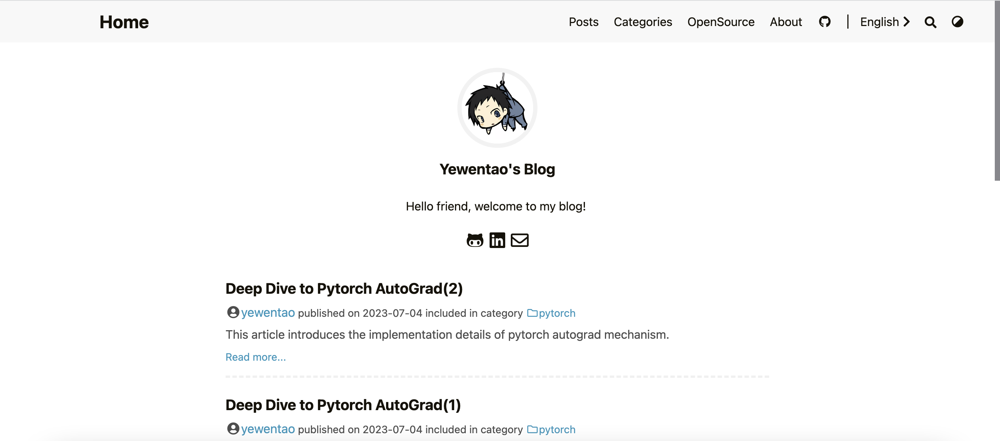

# yewentao256的个人博客

[English](README.md) | 简体中文

## 效果预览



我的个人博客（网站样例）：[https://wentao.site/]，欢迎fork和star

## fork指南

文件目录结构介绍

```bash
yewentao256.github.io
├── archetypes      # 新文章默认模板
├── config.toml     # Hugo配置文档
├── content         # 存放所有Markdown格式的文章
├── static          # 存放图像、CNAME、css、js等资源
└── themes          # 主题
```

1. 设置gitpage需求的项目名称和分支
需要为`username.github.io`的main分支或master分支

2. 修改配置
在`config.toml`下更新配置，将个人信息改为你自己的。

3. 删除旧文章与图片
将我的文章与图片删除。

4. 设置域名（可选）
在github `settings-Pages` 页面下设置你的域名。

5. 开始书写你的博客
`hugo new posts/directory/title/index.en.md`
该命令以`archetypes/default.md`为模板创建新文章，位于`content/posts`目录下，书写好后删除`draft: true`即可

6. 本地启动服务预览
`hugo server -e production`

## 常见问题

- 静态文件有两种索引形式，一种是放在post文件夹下，例如：

    ```bash
    # content/posts/pytorch/deep_dive_to_autograd_2

    ❯ ls
    index.en.md     index.zh-cn.md  resources
    ```

    然后在markdown里相对路径索引即可，如：``

    另一种形式是放在**static**文件夹下，例如：

    ```bash
    # static/csapp/resources
    ❯ ls
    ROP-attack.png                                  io-redirection.png
    ```

    然后在任意文档中``

- 如果是在mac上启动loveit主题可能会遇到文件数量限制导致fatal error的问题，`sudo launchctl limit maxfiles 100000 500000`修复

- `hugo`后没有css样式？f12查看前端去哪里找css了，根据相关信息修复`baseUrl`
  - 例如：本地可能用绝对路径来找，`/Users/yewentao/Desktop/myblog/docs`
  - 部署到gitpage后用pageurl来找，如`https://yewentao256.github.io/blog`

## 致谢

- 感谢**hugo**，一个高效好用的静态页面生成工具：[https://github.com/gohugoio/hugo]
- 感谢**LoveIt**，一个整洁优雅的hugo主题：[https://github.com/dillonzq/LoveIt]
- 感谢**Doit**，在LoveIt项目停止维护后继续维护了这个hugo主题：[https://github.com/HEIGE-PCloud/DoIt]