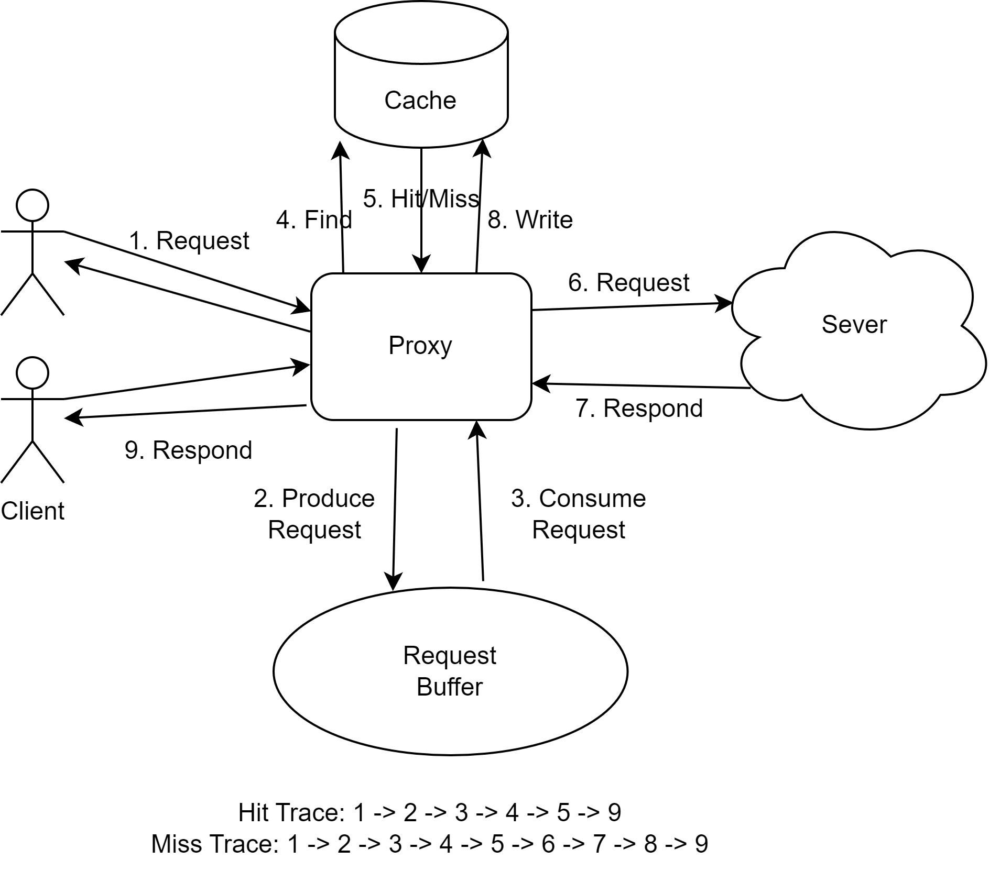

## Summary

This document presents a structured approach for constructing a web proxy, supports multi-threading for concurrent request handling, and implements an in-memory cache utilizing a Least Recently Used (LRU) eviction policy. Source: [Github-Link-Here](https://github.com/yewentao256/CSAPP_15213/tree/main/proxylab)

## Introduction

In this lab, there are primarily three parts:

1. Set up the proxy to accept incoming connections, read and parse requests, forward these requests to web servers, read the servers' responses, and then forward those responses back to the corresponding clients.
2. Upgrade our proxy to handle multiple concurrent connections.
3. Add caching to our proxy using a simple main memory cache for recently accessed web content.

## Download the Lab

Source: [proxylab.pdf](https://csapp.cs.cmu.edu/3e/proxylab.pdf)

Source: [proxylab-handout](http://csapp.cs.cmu.edu/3e/labs.html)

## How to validate

Use `driver.sh` to validate our development process.

First, compile the code with `make`, and then execute `sh driver.sh`. We will see output resembling:

```bash
*** Basic ***
Starting tiny on 25789
Starting proxy on 25790
Timeout waiting for the server to grab the port reserved for it
Terminated
```

Good Luck!

## Part I: Sequential Web Proxy

In Part I, we will implement a sequential web proxy that handles HTTP/1.0 GET requests.

For example, a request from a client like:

```bash
GET http://www.cmu.edu/hub/index.html HTTP/1.1
```

Should be transformed to:

```bash
GET /hub/index.html HTTP/1.1
Host: http://www.cmu.edu
User-Agent: Mozilla/5.0 (X11; Linux x86_64; rv:10.0.3)Gecko/20120305 Firefox/10.0.3
Connection: close
Proxy-Connection: close
```

And then passed to the server.

The full answer:

```c
#include <strings.h>

#include "csapp.h"

/* Recommended max cache and object sizes */
#define MAX_CACHE_SIZE 1049000
#define MAX_OBJECT_SIZE 102400

static const char* user_agent_hdr =
    "User-Agent: Mozilla/5.0 (X11; Linux x86_64; rv:10.0.3) Gecko/20120305 "
    "Firefox/10.0.3\r\n";

typedef struct URLStorage {
  char hostname[MAXLINE];
  char port[MAXLINE];
  char filename[MAXLINE];
} URLStorage;

void doit(int clientfd);
void sigpipe_handler(int sig) { return; }  // Do nothing

void parse_url(char* url, URLStorage* url_storage) {
  char* ptr = strstr(url, "//");
  if (ptr == NULL) {
    // When no // in url, eg: GET /index.html HTTP/1.1 or GET / HTTP/1.1
    char* idx = index(url, '/');
    strcat(url_storage->filename, idx);
    strcpy(url_storage->port, "80");
    return;
  } else {
    // eg1: GET http://www.cmu.edu/hub/index.html HTTP/1.1
    // eg2: GET http://www.cmu.edu:80/hub/index.html HTTP/1.1
    char* idx = index(ptr + 2, '/');
    char* port = index(ptr + 2, ':');
    if (port) {
      int portNum;
      sscanf(port + 1, "%d%s", &portNum, url_storage->filename);
      sprintf(url_storage->port, "%d", portNum);
      *port = '\0';
    } else {
      sscanf(idx, "%s", url_storage->filename);
      strcpy(url_storage->port, "80");  // default 80 port
      *idx = '\0';
    }
    // by setting '\0' above, the hostname is easy to get
    strcpy(url_storage->hostname, ptr + 2);
  }
}

void raise_error(int clientfd, char* cause, char* errnum, char* shortmsg,
                 char* longmsg) {
  char header_buf[MAXLINE], body_buf[MAXBUF];

  // construct body_buf
  sprintf(body_buf, "<html><title>Tiny Error</title>");
  sprintf(body_buf, "%s<body_buf bgcolor=\"ffffff\">\r\n", body_buf);
  sprintf(body_buf, "%s%s: %s\r\n", body_buf, errnum, shortmsg);
  sprintf(body_buf, "%s<p>%s: %s\r\n", body_buf, longmsg, cause);
  sprintf(body_buf, "%s<hr><em>The Tiny Web server</em>\r\n</body_buf></html>",
          body_buf);

  // construct
  sprintf(header_buf, "HTTP/1.0 %s %s\r\n", errnum, shortmsg);
  sprintf(header_buf, "%sContent-type: text/html\r\n", header_buf);
  sprintf(header_buf, "%sContent-length: %zu\r\n\r\n", header_buf,
          strlen(body_buf));

  Rio_writen(clientfd, header_buf, strlen(header_buf));
  Rio_writen(clientfd, body_buf, strlen(body_buf));
}

void construct_message(char* message, URLStorage* url_storage, rio_t* rp) {
  char tmp[MAXLINE];
  int count;

  // construct the header, `MAXLINE - count` ensures no overflow
  count =
      snprintf(message, MAXLINE, "GET %s HTTP/1.0\r\n", url_storage->filename);
  count += snprintf(message + count, MAXLINE - count, "Host: %s\r\n",
                    url_storage->hostname);
  count += snprintf(message + count, MAXLINE - count, "User-Agent: %s",
                    user_agent_hdr);
  count += snprintf(message + count, MAXLINE - count, "Connection: close\r\n");
  count +=
      snprintf(message + count, MAXLINE - count, "Proxy-Connection: close\r\n");

  // copy the rest of client message
  while (Rio_readlineb(rp, tmp, MAXLINE) > 0 && strcmp(tmp, "\r\n")) {
    if (!strncasecmp(tmp, "Host", strlen("Host")) ||
        !strncasecmp(tmp, "User-Agent", strlen("User-Agent")) ||
        !strncasecmp(tmp, "Connection", strlen("Connection")) ||
        !strncasecmp(tmp, "Proxy-Connection", strlen("Proxy-Connection"))) {
      continue;
    }
    count += snprintf(message + count, MAXLINE - count, "%s", tmp);
  }
  // finally, adding an end to the message
  snprintf(message + count, MAXLINE - count, "\r\n");
}

int main(int argc, char* argv[]) {
  if (argc != 2) {
    fprintf(stderr, "usage: %s <port>\n", argv[0]);
    exit(1);
  }
  int listenfd, connfd;
  socklen_t sock_length;
  struct sockaddr_storage client_address;
  char hostname[MAXLINE], port[MAXLINE];
  Signal(SIGPIPE, sigpipe_handler);

  listenfd = Open_listenfd(argv[1]);  // get a socket by port

  while (1) {
    sock_length = sizeof(client_address);
    connfd = Accept(listenfd, (SA*)&client_address, &sock_length);
    Getnameinfo((SA*)&client_address, sock_length, hostname, MAXLINE, port,
                MAXLINE, 0);
    printf("Accept Connection from (%s, %s)\n", hostname, port);
    doit(connfd);
    Close(connfd);
  }
  return 0;
}

void doit(int clientfd) {
  char buf[MAXLINE], method[MAXLINE], url[MAXLINE], version[MAXLINE];
  char message[MAXLINE];
  URLStorage url_storage;
  int serverfd;
  rio_t client_rio, server_rio;

  // init robust io struct
  Rio_readinitb(&client_rio, clientfd);
  // read one line from client
  Rio_readlineb(&client_rio, buf, MAXLINE);

  sscanf(buf, "%s %s %s", method, url, version);
  if (strcasecmp(method, "GET")) {
    // if not get, raise 501 error
    raise_error(clientfd, method, "501", "Not implemented",
                "Proxy dose not implement this method\n");
    fprintf(stderr, "%s: Proxy dose not implement this method\n", method);
    return;
  }

  // parse url and save the result in url_storage
  parse_url(url, &url_storage);
  // construct the message
  construct_message(message, &url_storage, &client_rio);

  // connect to server, init rio struct
  serverfd = Open_clientfd(url_storage.hostname, url_storage.port);
  Rio_readinitb(&server_rio, serverfd);

  // send message to the server
  Rio_writen(serverfd, message, strlen(message));

  // read all of the message from server, passing back to client
  size_t n;
  while ((n = Rio_readlineb(&server_rio, message, MAXLINE)) != 0) {
    fprintf(stdout, "proxy recived %ld bytes\n", n);
    Rio_writen(clientfd, message, n);
  }

  Close(serverfd);
}
```

## Part II: Dealing with Multiple Concurrent Requests

In this part, we aim to handle multiple requests simultaneously.

First, create a buffer to store all connections:

```c
#define BUFFER_SIZE 300
#define NTHREAD 10

typedef struct {
  int* data; /* Buffer array */
  int front; /* (front + 1) % n is the position to fetch */
  int tail;  /* (tail % n) is the position to put */
  sem_t mutex;
  sem_t slots; /* num of available slots */
  sem_t items; /* num of available items */
} ConnectionBuffer;

ConnectionBuffer connection_buffer;

void init_buffer() {
  connection_buffer.data = Calloc(BUFFER_SIZE, sizeof(int));
  connection_buffer.front = connection_buffer.tail = 0;
  Sem_init(&connection_buffer.mutex, 0, 1);
  Sem_init(&connection_buffer.slots, 0, BUFFER_SIZE);
  Sem_init(&connection_buffer.items, 0, 0);
}

void produce(int item) {
  P(&connection_buffer.slots);
  P(&connection_buffer.mutex);
  connection_buffer.data[(++connection_buffer.tail) % BUFFER_SIZE] = item;
  V(&connection_buffer.mutex);
  V(&connection_buffer.items);
}

int consume() {
  int item;
  P(&connection_buffer.items);
  P(&connection_buffer.mutex);
  item = connection_buffer.data[(++connection_buffer.front) % BUFFER_SIZE];
  V(&connection_buffer.mutex);
  V(&connection_buffer.slots);
  return item;
}
```

Next, in the `main` function, create several threads (consumers) and continue to produce connections in a `while` loop:

```c
void* proxy_thread(void* vargp) {
  Pthread_detach(pthread_self());  // detach to automatically free
  while (1) {
    int connfd = consume(&connection_buffer);
    doit(connfd);
    Close(connfd);
  }
}

int main(int argc, char* argv[]) {
  if (argc != 2) {
    fprintf(stderr, "usage: %s <port>\n", argv[0]);
    exit(1);
  }
  int listenfd, connfd;
  socklen_t sock_length;
  struct sockaddr_storage client_address;
  char hostname[MAXLINE], port[MAXLINE];
  pthread_t tid;

  // handle sigpipe signal
  Signal(SIGPIPE, sigpipe_handler);

  listenfd = Open_listenfd(argv[1]);  // get a socket by port

  init_buffer();
  for (int i = 0; i < NTHREAD; i++) {
    Pthread_create(&tid, NULL, proxy_thread, NULL);
  }
  while (1) {
    sock_length = sizeof(client_address);
    connfd = Accept(listenfd, (SA*)&client_address, &sock_length);
    produce(connfd);
    Getnameinfo((SA*)&client_address, sock_length, hostname, MAXLINE, port,
                MAXLINE, 0);
    printf("Accept Connection from (%s, %s)\n", hostname, port);
  }
  return 0;
}
```

## Part III: Caching web objects

In this part, we will introduce a cache to store recently accessed Web objects in memory within our proxy.

First, the data structure of the Cache:

```c

typedef struct {
  char buf[MAX_OBJECT_SIZE];
  char url[MAXLINE];
  int size;   // cache block size
  int valid;  // 1 or 0
  int timestamp;
} cacheLine;

typedef struct {
  cacheLine line[CACHE_LINE];
  int readcnt, current_time;
  sem_t mutex, writer;
} cache_t;

cache_t cache;

void cache_init() {
  cache.readcnt = 0;
  cache.current_time = 0;
  Sem_init(&cache.mutex, 0, 1);
  Sem_init(&cache.writer, 0, 1);
  for (int i = 0; i < CACHE_LINE; i++) {
    cache.line[i].valid = 0;
    cache.line[i].timestamp = 0;
    cache.line[i].size = 0;
  }
}
```

We will use the Least Recently Used (LRU) strategy to evict caches that are no longer needed.

```c
// return idx in cache if success, -1 otherwise
int find_cache_hit(char* url) {
  int ret = -1;
  for (int i = 0; i < CACHE_LINE; i++) {
    if (cache.line[i].valid && !strcmp(cache.line[i].url, url)) {
      ret = i;
    }
  }
  return ret;
}

void write_cache(char* buf, char* url, int size) {
  if (size > MAX_OBJECT_SIZE) return;
  int idx = -1;
  for (int i = 0; i < CACHE_LINE; i++) {
    if (cache.line[i].valid == 0) {
      idx = i;
      break;
    }
  }
  if (idx == -1) {
    // LRU: find a cache line index to evict
    int max_time = 0;
    for (int i = 0; i < CACHE_LINE; i++) {
      if (cache.line[i].valid &&
          cache.current_time - cache.line[i].timestamp > max_time) {
        max_time = cache.current_time - cache.line[i].timestamp;
        idx = i;
      }
    }
  }
  // evict
  P(&cache.writer);
  strcpy(cache.line[idx].buf, buf);
  strcpy(cache.line[idx].url, url);
  cache.line[idx].size = size;
  cache.line[idx].timestamp = ++cache.current_time;
  cache.line[idx].valid = 1;
  V(&cache.writer);
}
```

All of the code:

```c
#include <strings.h>

#include "csapp.h"

#define MAX_OBJECT_SIZE 102400
#define NTHREAD 16
#define BUFFER_SIZE 32
#define CACHE_LINE 10

static const char* user_agent_hdr =
    "User-Agent: Mozilla/5.0 (X11; Linux x86_64; rv:10.0.3) Gecko/20120305 "
    "Firefox/10.0.3\r\n";

// ... cache related code

typedef struct {
  int* data; /* Buffer array */
  int front; /* (front + 1) % n is the position to fetch */
  int tail;  /* (tail % n) is the position to put */
  sem_t mutex;
  sem_t slots; /* num of available slots */
  sem_t items; /* num of available items */
} ConnectionBuffer;

ConnectionBuffer connection_buffer;

void init_buffer() {
  connection_buffer.data = Calloc(BUFFER_SIZE, sizeof(int));
  connection_buffer.front = connection_buffer.tail = 0;
  Sem_init(&connection_buffer.mutex, 0, 1);
  Sem_init(&connection_buffer.slots, 0, BUFFER_SIZE);
  Sem_init(&connection_buffer.items, 0, 0);
}

void produce(int item) {
  P(&connection_buffer.slots);
  P(&connection_buffer.mutex);
  connection_buffer.data[(++connection_buffer.tail) % BUFFER_SIZE] = item;
  V(&connection_buffer.mutex);
  V(&connection_buffer.items);
}

int consume() {
  int item;
  P(&connection_buffer.items);
  P(&connection_buffer.mutex);
  item = connection_buffer.data[(++connection_buffer.front) % BUFFER_SIZE];
  V(&connection_buffer.mutex);
  V(&connection_buffer.slots);
  return item;
}

typedef struct URLStorage {
  char hostname[MAXLINE];
  char port[MAXLINE];
  char filename[MAXLINE];
} URLStorage;

void sigpipe_handler(int sig) { return; }  // Do nothing

void parse_url(char* url, URLStorage* url_storage) {
  char* ptr = strstr(url, "//");
  if (ptr == NULL) {
    // When no // in url, eg: GET /index.html HTTP/1.1 or GET / HTTP/1.1
    char* idx = index(url, '/');
    strcat(url_storage->filename, idx);
    strcpy(url_storage->port, "80");
    return;
  } else {
    // eg1: GET http://www.cmu.edu/hub/index.html HTTP/1.1
    // eg2: GET http://www.cmu.edu:80/hub/index.html HTTP/1.1
    char* idx = index(ptr + 2, '/');
    char* port = index(ptr + 2, ':');
    if (port) {
      int portNum;
      sscanf(port + 1, "%d%s", &portNum, url_storage->filename);
      sprintf(url_storage->port, "%d", portNum);
      *port = '\0';
    } else {
      sscanf(idx, "%s", url_storage->filename);
      strcpy(url_storage->port, "80");  // default 80 port
      *idx = '\0';
    }
    // by setting '\0' above, the hostname is easy to get
    strcpy(url_storage->hostname, ptr + 2);
  }
}

void raise_error(int clientfd, char* cause, char* errnum, char* shortmsg,
                 char* longmsg) {
  char header_buf[MAXLINE], body_buf[MAXBUF];

  // construct body_buf
  sprintf(body_buf, "<html><title>Tiny Error</title>");
  sprintf(body_buf, "%s<body_buf bgcolor=\"ffffff\">\r\n", body_buf);
  sprintf(body_buf, "%s%s: %s\r\n", body_buf, errnum, shortmsg);
  sprintf(body_buf, "%s<p>%s: %s\r\n", body_buf, longmsg, cause);
  sprintf(body_buf, "%s<hr><em>The Tiny Web server</em>\r\n</body_buf></html>",
          body_buf);

  // construct
  sprintf(header_buf, "HTTP/1.0 %s %s\r\n", errnum, shortmsg);
  sprintf(header_buf, "%sContent-type: text/html\r\n", header_buf);
  sprintf(header_buf, "%sContent-length: %zu\r\n\r\n", header_buf,
          strlen(body_buf));

  Rio_writen(clientfd, header_buf, strlen(header_buf));
  Rio_writen(clientfd, body_buf, strlen(body_buf));
}

void construct_message(char* message, URLStorage* url_storage, rio_t* rp) {
  char tmp[MAXLINE];
  int count;

  // construct the header, `MAXLINE - count` ensures no overflow
  count =
      snprintf(message, MAXLINE, "GET %s HTTP/1.0\r\n", url_storage->filename);
  count += snprintf(message + count, MAXLINE - count, "Host: %s\r\n",
                    url_storage->hostname);
  count += snprintf(message + count, MAXLINE - count, "User-Agent: %s",
                    user_agent_hdr);
  count += snprintf(message + count, MAXLINE - count, "Connection: close\r\n");
  count +=
      snprintf(message + count, MAXLINE - count, "Proxy-Connection: close\r\n");

  // copy the rest of client message
  while (Rio_readlineb(rp, tmp, MAXLINE) > 0 && strcmp(tmp, "\r\n")) {
    if (!strncasecmp(tmp, "Host", strlen("Host")) ||
        !strncasecmp(tmp, "User-Agent", strlen("User-Agent")) ||
        !strncasecmp(tmp, "Connection", strlen("Connection")) ||
        !strncasecmp(tmp, "Proxy-Connection", strlen("Proxy-Connection"))) {
      continue;
    }
    count += snprintf(message + count, MAXLINE - count, "%s", tmp);
  }
  // finally, adding an end to the message
  snprintf(message + count, MAXLINE - count, "\r\n");
}

void doit(int clientfd) {
  char buf[MAXLINE], method[MAXLINE], url[MAXLINE], version[MAXLINE];
  char message[MAXLINE], url_copy[MAXLINE];
  URLStorage url_storage;
  int serverfd;
  rio_t client_rio, server_rio;
  Rio_readinitb(&client_rio, clientfd);
  Rio_readlineb(&client_rio, buf, MAXLINE);

  sscanf(buf, "%s %s %s", method, url, version);
  strcpy(url_copy, url);
  if (strcasecmp(method, "GET")) {
    // if not GET method, raise 501 error
    raise_error(clientfd, method, "501", "Not implemented",
                "Proxy dose not implement this method\n");
    fprintf(stderr, "%s: Proxy dose not implement this method\n", method);
    return;
  }

  int idx = find_cache_hit(url);

  // reader model, if there is a reader, writer can't write
  if (idx != -1) {
    P(&cache.mutex);
    cache.readcnt++;
    if (cache.readcnt == 1) P(&cache.writer);
    V(&cache.mutex);

    Rio_writen(clientfd, cache.line[idx].buf, cache.line[idx].size);

    P(&cache.mutex);
    cache.readcnt--;
    if (cache.readcnt == 0) V(&cache.writer);
    V(&cache.mutex);

    printf("Cached\n");
    return;
  }

  // parse url and save the result in url_storage
  parse_url(url, &url_storage);
  // construct the message
  construct_message(message, &url_storage, &client_rio);

  // connect to server, init rio struct
  serverfd = Open_clientfd(url_storage.hostname, url_storage.port);
  Rio_readinitb(&server_rio, serverfd);

  // send message to the server
  Rio_writen(serverfd, message, strlen(message));

  size_t n;
  int cache_size = 0;
  memset(buf, 0, sizeof buf);
  while ((n = Rio_readlineb(&server_rio, message, MAXLINE)) != 0) {
    fprintf(stdout, "proxy recived %ld bytes\n", n);
    Rio_writen(clientfd, message, n);
    strcat(buf, message);
    cache_size += n;
  }

  write_cache(buf, url_copy, cache_size);

  Close(serverfd);
}

void* proxy_thread(void* vargp) {
  Pthread_detach(pthread_self());  // detach to automatically free
  while (1) {
    int connfd = consume(&connection_buffer);
    doit(connfd);
    Close(connfd);
  }
}

int main(int argc, char* argv[]) {
  if (argc != 2) {
    fprintf(stderr, "usage: %s <port>\n", argv[0]);
    exit(1);
  }
  int listenfd, connfd;
  socklen_t sock_length;
  struct sockaddr_storage client_address;
  char hostname[MAXLINE], port[MAXLINE];
  pthread_t tid;

  // handle sigpipe signal
  Signal(SIGPIPE, sigpipe_handler);

  listenfd = Open_listenfd(argv[1]);  // get a socket by port

  init_buffer();
  cache_init();
  for (int i = 0; i < NTHREAD; i++) {
    Pthread_create(&tid, NULL, proxy_thread, NULL);
  }

  while (1) {
    sock_length = sizeof(client_address);
    connfd = Accept(listenfd, (SA*)&client_address, &sock_length);
    produce(connfd);
    Getnameinfo((SA*)&client_address, sock_length, hostname, MAXLINE, port,
                MAXLINE, 0);
    printf("Accept Connection from (%s, %s)\n", hostname, port);
  }
  return 0;
}
```

## Frame Graph


