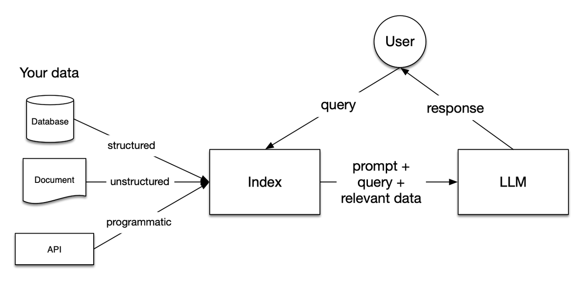
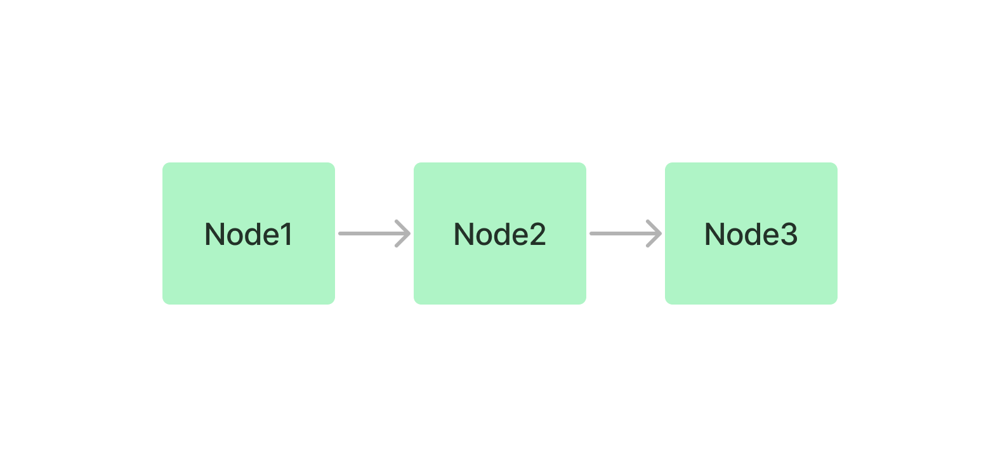
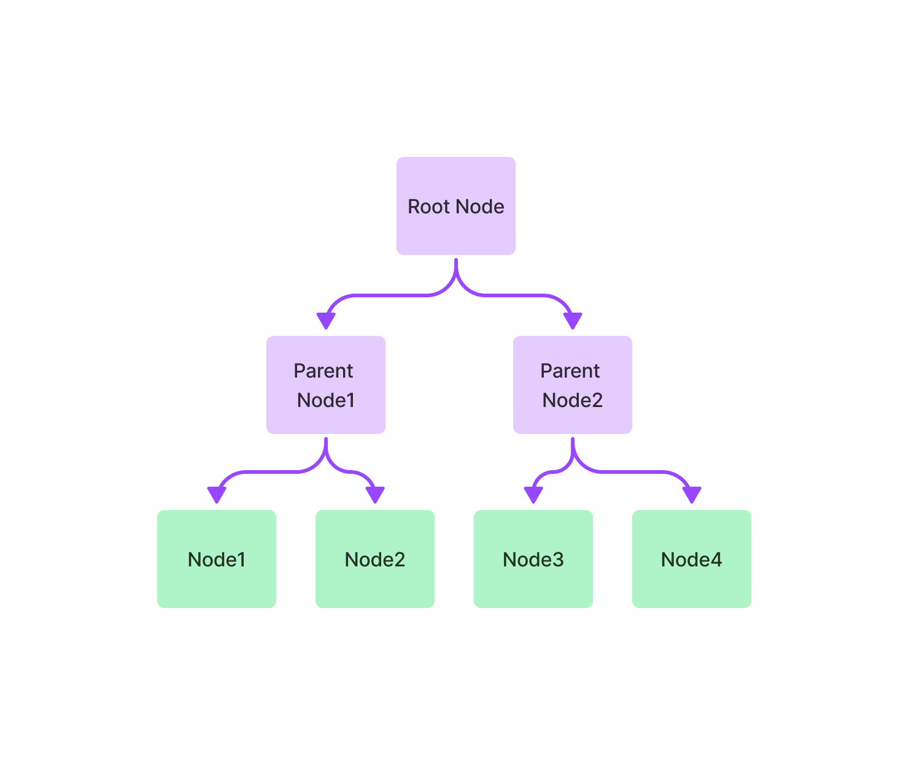
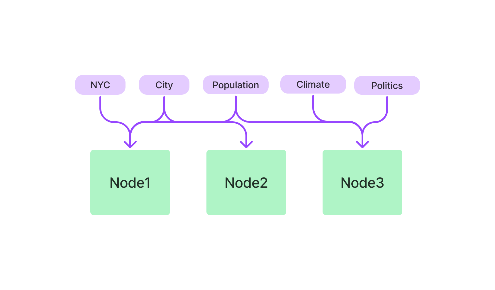

## Summary

本文介绍了**RAG**的基础概念，并基于**llama_index**的源码解读进一步演示了RAG的流程，包括data loader、transformation、index、query等。此外，本文也对llama_index RAG流程进行了一些性能上的分析并给出了对应优化建议。

## 1. Introduction

llama_index是一个用于构建上下文增强的大模型应用的框架，即基于用户的私有数据让模型在特定领域有更好表现。

llama_index主要提供以下工具：

- **data connector**：连接到用户私有数据，API、数据库等
- **data indexes**：数据structure成便于llm使用的形式
- **Engines**：提供自然语言访问途径
  - 如query engine：question-answering的接口，如知识库查询等
  - 如chat engine：多轮对话的接口，如gpt
- **Agents**：基于LLM提供服务，如任务自动化，客服等
- **Observability/Evaluation**：集成应用评估、监控工具

调研基于 `llama-index==0.10.40` 版本

## 2. RAG High Level Concepts

RAG即Retrieval-Augmented Generation，检索增强生成

通常，大模型使用公开数据集进行训练，但对于特定任务可能表现不佳。RAG可以将用户私有数据加入到大模型可以访问到的数据中，作为上下文一起喂给模型，这一步骤**不需要对模型进行微调或训练**



大致流程：

1. 数据加载和索引：

    - 加载数据：将私有数据（例如文档（非结构化）、数据库（结构化）、API 等）加载。
    - 创建索引：对加载的数据进行预处理和索引，以便快速检索。这个 Index 是一个结构化的中间表示，能够高效地筛选出与查询相关的内容。

2. 用户查询：

    - 首先查询预先创建的索引
    - 检索：从索引中筛选出与查询最相关的内容
    - 这些被检索到的相关内容构成了上下文，用于辅助 LLM 的生成过程。

3. 生成回答：

    - 结合上下文和查询：将检索到的相关内容（上下文）与用户查询一起传递给 LLM。
    - 生成响应：LLM 使用这些上下文信息生成更准确、相关性更高的回答。


技术上来说，一共有五个阶段：

- **Loading**:

  - **Nodes and Documents**: `Document`是一个容器，如PDF、API等都可以封装为一个容器，包含完整的数据源内容；`Node` 是LlamaIndex 中的数据原子单位，表示源 Document 的一个“块”或片段，每个`Node`都有自己的meta data来与所在的document和其他node产生关联
  - **Connectors**: 或者称之为`Reader`，将数据源structure处理并转化为 `Documents` 和 `Nodes`.

- **Indexing**:

  - **Indexes**: 组织好的数据索引，如存储在`VectorStore`中的`vector embeddings`。索引也包含所需的metadata
  - **Embeddings**：`embeddings`即文本的数值表示。如vector embeddings是高维向量，表示数据的语义信息，相似语义的数据在向量空间中接近，进而便于query

- **Storing**: 把已经构建好的索引和其他metadata存储，避免反复构建

- **Querying**:

  - **Retrievers**: `retriever`定义了在接收到查询时，如何高效地从索引中检索相关的context。检索策略直接影响检索到的数据的相关性和检索效率
  - **Routers**: `router` 决定使用哪个 Retriever 检索相关的context。具体而言，我们使用 `RouterRetriever` 类负责选择一个或多个候选 Retriever 执行查询，使用`selector`根据metadata 和 query 内容决定最佳retriever.
  - **Node Postprocessors**:  接收一组检索到的节点并对其应用变换、过滤或重新排序逻辑。
  - **Response Synthesizers**: 使用用户query和检索context+promot拼接成输入，基于大模型生成response

- **Evaluation**: 评估查询策略、pipeline及结果是否准确。

## 3. Llama index使用示例

我们使用[**ollama**](https://docs.llamaindex.ai/en/stable/getting_started/starter_example_local/)云端部署了一个7B llama3，documents来自于一个简短的[文本](https://raw.githubusercontent.com/run-llama/llama_index/main/docs/docs/examples/data/paul_graham/paul_graham_essay.txt)，78KB）然后在mac（Core i7 2.6 GHz）上运行以下代码

```py
import time
from llama_index.core import VectorStoreIndex, SimpleDirectoryReader, Settings
from llama_index.embeddings.huggingface import HuggingFaceEmbedding
from llama_index.llms.ollama import Ollama

start_time = time.time()

load_start = time.time()
documents = SimpleDirectoryReader("data").load_data()
load_end = time.time()

embed_start = time.time()
Settings.embed_model = HuggingFaceEmbedding(model_name="BAAI/bge-base-en-v1.5")
embed_end = time.time()

llm_start = time.time()
Settings.llm = Ollama(model="llama3", request_timeout=360.0)
llm_end = time.time()

index_start = time.time()
index = VectorStoreIndex.from_documents(documents)
index_end = time.time()

query_engine_start = time.time()
query_engine = index.as_query_engine()
query_engine_end = time.time()

query_start = time.time()
response = query_engine.query("What did the author do growing up?")
query_end = time.time()

print(response)

print(f"Data loading time: {load_end - load_start} seconds")
print(f"Embedding model setup time: {embed_end - embed_start} seconds")
print(f"LLM setup time: {llm_end - llm_start} seconds")
print(f"Index creation time: {index_end - index_start} seconds")
print(f"Query engine creation time: {query_engine_end - query_engine_start} seconds")
print(f"Query execution time: {query_end - query_start} seconds")
print(f"Total time: {time.time() - start_time} seconds")
```

输出：

```bash
According to the provided context, before college, the author worked on writing and programming outside of school. Specifically, he wrote short stories in his teenage years and tried writing programs on an IBM 1401 computer using an early version of Fortran in 9th grade (when he was around 13 or 14).
Data loading time: 0.021808862686157227 seconds
Embedding model setup time: 3.6557559967041016 seconds
LLM setup time: 0.0005099773406982422 seconds
Index creation time: 10.546114921569824 seconds
Query engine creation time: 0.0671701431274414 seconds
Query execution time: 1.3822910785675049 seconds
Total time: 15.673884868621826 seconds
```

可以看到，即使是78KB的一篇document创建index、query到返回结果，总共需要15s左右时间左右时间，其中创建index就花了10s+，为什么会有这么大的时间开销呢？我们后文进一步解析

## 4. llama index源码解析

### 4.1 Loading

Loading主要有三种模式：从文件读、从db读、直接从text构建出document对象

我们主要以`SimpleDirectoryReader`和`DatabaseReader`为例说明

值得指出的是，[llama_hub](https://llamahub.ai/) 生态提供了很多reader选项

#### 4.1.1 SimpleDirectoryReader

SimpleDirectoryReader从文件夹读取，对于每个file构建一个document

```py
from llama_index.core import SimpleDirectoryReader

documents = SimpleDirectoryReader("./data").load_data()
```

关键路径：`load_data()`，支持`num_workers`多进程读取（进程池）

```py
# llama-index-core/llama_index/core/readers/file/base.py
class SimpleDirectoryReader(BaseReader, ResourcesReaderMixin, FileSystemReaderMixin):
    def load_data(
        self, # ...
    ) -> List[Document]:
        # ...
        if num_workers and num_workers > 1:
            # multiprocessing ...
        else:
            # ... 
            for input_file in files_to_process:
                documents.extend(
                    SimpleDirectoryReader.load_file(
                        # ...
                    )
                )

        return self._exclude_metadata(documents)
```

在`load_file()`中，又有两个路径：对于`['.pdf', '.docx', '.pptx', '.png', '.mp3', '.mp4', '.csv', '.md', '.mbox', '.ipynb']`等特殊文件有默认的cls构建reader可以读取，否则直接`fs.open()`读文本

```py
# llama-index-core/llama_index/core/readers/file/base.py
class SimpleDirectoryReader(BaseReader, ResourcesReaderMixin, FileSystemReaderMixin):
    @staticmethod
    def load_file(
        input_file: Path, # ...
    ) -> List[Document]:
        # ...
        if file_suffix in default_file_reader_suffix or file_suffix in file_extractor:
            # specific files ...
            documents.extend(docs)
        else:
            # common text file ...
            with fs.open(input_file, errors=errors, encoding=encoding) as f:
                data = f.read().decode(encoding, errors=errors)

            doc = Document(text=data, metadata=metadata or {})
            documents.append(doc)

        return documents
```

#### 4.1.2 DatabaseReader

DatabaseReader从数据库读取，**这里需要用户手写sql**，此外，这个其实是[插件](https://llamahub.ai/l/readers/llama-index-readers-database)

```py
from llama_index.readers.database import DatabaseReader

connection_uri = "sqlite:///example.db"
reader = DatabaseReader(uri=connection_uri)

query = "SELECT * FROM users"
documents = reader.load_data(query=query)

# llama-index-readers-database/llama_index/readers/database/base.py
class DatabaseReader(BaseReader):
    def load_data(self, query: str) -> List[Document]:
        with self.sql_database.engine.connect() as connection:
            # ...
            result = connection.execute(text(query))

            for item in result.fetchall():
                doc_str = ", ".join(
                    [f"{col}: {entry}" for col, entry in zip(result.keys(), item)]
                )
                documents.append(Document(text=doc_str))
        return documents
```

这里读取直接使用用户的query然后`fetchall`返回所有项，然后把text封入`document`

### 4.2 Transformation

读取data为document后，我们需要对数据做一些transformation如chunking, 提取 metadata,  embedding等。Transformation的input和output均为`Node`（注意document也是Node的子类）

llama_index同时提供了high level和low level（用户更多自由度）的API

#### 4.2.1 NodeParser

NodeParser主要有三类：File-Based Node Parsers、Text-Splitters和Relation-Based Node Parsers，它们的输入都是node（document也是node），输出是处理后的node，多用于transformation

如file-based node parser:

```py
from llama_index.core.node_parser import SimpleFileNodeParser
from llama_index.readers.file import FlatReader
from pathlib import Path

md_docs = FlatReader().load_data(Path("./test.md"))
parser = SimpleFileNodeParser()
md_nodes = parser.get_nodes_from_documents(md_docs)
```

Text-Splitters我们在后面会展开介绍

Relation-Based Node Parsers目前只有`HierarchicalNodeParser`，用于将node拆分为有继承关系的node，例如：

```py
from llama_index.core.schema import Document
from llama_index.core.node_parser import (
    HierarchicalNodeParser,
    get_leaf_nodes,
    get_root_nodes,
)

doc_text = """ ... """

docs = [Document(text=doc_text)]
# default chunk size [2048, 512, 128]
node_parser = HierarchicalNodeParser.from_defaults()
nodes = node_parser.get_nodes_from_documents(docs)

# Get specific kind of nodes
leaf_nodes = get_leaf_nodes(nodes)
root_nodes = get_root_nodes(nodes)
level_nodes = get_deeper_nodes(nodes, depth=2)
```

我们会获得根节点：

```py
TextNode(
    id_='6562f0e3-e0bf-47c3-a75f-df3f19b99e71',
    embedding=None,
    metadata={},
    excluded_embed_metadata_keys=[],
    excluded_llm_metadata_keys=[],
    relationships={
        <NodeRelationship.SOURCE: '1'>: RelatedNodeInfo(
            node_id='8001ac4d-f9b0-4b51-b3e4-1f61aa44449a', 
            # ...
        ),
        <NodeRelationship.CHILD: '5'>: [
            RelatedNodeInfo(
                node_id='921ce06b-7880-483c-bf00-3ebf4746dc83', 
                # ...
            )
        ]
    },
    text='...',
    # ...
)
```

与其中一个叶子结点：

```py
TextNode(
    id_='2ab92648-63d2-4197-98e5-b9afb892538d',
    # ...
    relationships={
        <NodeRelationship.SOURCE: '1'>: RelatedNodeInfo(
            node_id='921ce06b-7880-483c-bf00-3ebf4746dc83', 
            # ...
        ), 
        <NodeRelationship.PARENT: '4'>: RelatedNodeInfo(
            node_id='921ce06b-7880-483c-bf00-3ebf4746dc83', 
            # ...
        )
    }, 
)
```

带继承关系的node切分后如何获取某一层的节点呢？llama_index使用了遍历的策略，而这**并不高效**：

```py
# llama-index-core/llama_index/core/node_parser/relational/hierarchical.py
def get_deeper_nodes(nodes: List[BaseNode], depth: int = 1) -> List[BaseNode]:
    """Get children of root nodes in given nodes that have given depth."""
    if depth < 0:
        raise ValueError("Depth cannot be a negative number!")
    root_nodes = get_root_nodes(nodes)
    if not root_nodes:
        raise ValueError("There is no root nodes in given nodes!")

    deeper_nodes = root_nodes
    for _ in range(depth):
        deeper_nodes = get_child_nodes(deeper_nodes, nodes)

    return deeper_nodes
    
 def get_root_nodes(nodes: List[BaseNode]) -> List[BaseNode]:
    root_nodes = []
    for node in nodes:
        if NodeRelationship.PARENT not in node.relationships:
            root_nodes.append(node)
    return root_nodes
    
def get_child_nodes(nodes: List[BaseNode], all_nodes: List[BaseNode]) -> List[BaseNode]:
    """Get child nodes of nodes from given all_nodes."""
    children_ids = []
    for node in nodes:
        if NodeRelationship.CHILD not in node.relationships:
            continue

        children_ids.extend(
            [r.node_id for r in node.relationships[NodeRelationship.CHILD]]
        )

    child_nodes = []
    for candidate_node in all_nodes:
        if candidate_node.node_id not in children_ids:
            continue
        child_nodes.append(candidate_node)

    return child_nodes
```

注意：由于 HierarchicalNodeParser将所有nodes放在一个列表里返回，**我们必须获取某一层节点（`get_deeper_nodes`）后再构建index执行embedding**，否则切出来的nodes**含有很多重复内容**，会大大降低rag整体效率

这种继承关系的信息可以与`AutoMergingRetriever`一起使用，参考[auto_merger](https://docs.llamaindex.ai/en/stable/examples/retrievers/auto_merging_retriever/)

即将叶子节点送入构建index，但能够自动merge叶子节点来获取更丰富的上下文，最终获得更高的评分

| Names                   | Correctness | Relevancy | Faithfulness | Semantic Similarity |
|-------------------------|-------------|-----------|--------------|---------------------|
| Auto Merging Retriever  | 4.266667    | 0.916667  | 0.95         | 0.962196            |
| Base Retriever          | 4.208333    | 0.916667  | 0.95         | 0.960602            |

#### 4.2.2 High level api：VectorStoreIndex

```py

from llama_index.core import VectorStoreIndex, SimpleDirectoryReader

documents = SimpleDirectoryReader("./data").load_data()
vector_index = VectorStoreIndex.from_documents(documents)
vector_index.as_query_engine()
```

我们从文档中构建index：

```py
# llama_index/core/indices/base.py
class BaseIndex(Generic[IS], ABC):
    @classmethod
    def from_documents(
        cls: Type[IndexType], documents: Sequence[Document], # ...
    ) -> IndexType:
        # ...
        nodes = run_transformations(
            documents,  # type: ignore
            transformations,
            # ...
        )

        return cls(
            nodes=nodes,
            # ...
        )

# llama_index/core/ingestion/pipeline.py
def run_transformations(
    nodes: List[BaseNode], transformations: Sequence[TransformComponent], # ...
) -> List[BaseNode]:
    if not in_place:
        nodes = list(nodes)

    for transform in transformations:
        if cache is not None:
            hash = get_transformation_hash(nodes, transform)
            cached_nodes = cache.get(hash, collection=cache_collection)
            if cached_nodes is not None:
                nodes = cached_nodes
            else:
                nodes = transform(nodes, **kwargs)
                cache.put(hash, nodes, collection=cache_collection)
        else:
            nodes = transform(nodes, **kwargs)

    return nodes
```

如果用户没有配置，默认的transform只有`SentenceSplitter`，其有一个很长的子类继承链路：

`Representation` -> `BaseModel` -> `BaseComponent` -> `TransformComponent` -> `NodeParser` -> `TextSplitter` -> `MetadataAwareTextSplitter` -> `SentenceSplitter`

调用`transform()`到基类的`__call__`方法，然后一路兜兜转转处理到

```py
# llama_index/core/node_parser/text/sentence.py
class SentenceSplitter(MetadataAwareTextSplitter):
    def _split_text(self, text: str, chunk_size: int) -> List[str]:
        # ...
        splits = self._split(text, chunk_size)
        chunks = self._merge(splits, chunk_size)
        return chunks

    def _split(self, text: str, chunk_size: int) -> List[_Split]:
        token_size = self._token_size(text)
        if token_size <= chunk_size:
            return [_Split(text, is_sentence=True, token_size=token_size)]

        text_splits_by_fns, is_sentence = self._get_splits_by_fns(text)

        text_splits = []
        for text_split_by_fns in text_splits_by_fns:
            token_size = self._token_size(text_split_by_fns)
            if token_size <= chunk_size:
                text_splits.append(
                    _Split(
                        text_split_by_fns,
                        is_sentence=is_sentence,
                        token_size=token_size,
                    )
                )
            else:
                recursive_text_splits = self._split(
                    text_split_by_fns, chunk_size=chunk_size
                )
                text_splits.extend(recursive_text_splits)
        return text_splits
```

在这里，`_split`将text split成多个`_Split`块，这里的分割策略顺序为：

1. 用段落分割('\n\n\n')
2. 用nltk句子分割器（一个基于Punkt模型的pip包）分割
3. 用一个正则`[^,\.;]+[,\.;]?`分割（取字符串 + 标点（逗号、句号、分号）正则）
4. 用 `" "`分割。
5. 用字符分割（几乎不会使用）

如果满足chunk_size会提前返回，不继续细分。注意这里有一个递归循环逻辑`recursive_text_splits`

例如我们示例的text，75000字符，会切成`len(splits)=759`的列表

`_merge`则会将分割好的splits合并成正式的chunks

```py
# llama_index/core/node_parser/text/sentence.py
class SentenceSplitter(MetadataAwareTextSplitter):
    def _merge(self, splits: List[_Split], chunk_size: int) -> List[str]:
        # ...
        def close_chunk() -> None:
            # finish a chunk and then create a new one
            pass

        while len(splits) > 0:
            cur_split = splits[0]
            if cur_split.token_size > chunk_size:
                raise ValueError("Single token exceeded chunk size")
            if cur_chunk_len + cur_split.token_size > chunk_size and not new_chunk:
                # if adding split to current chunk exceeds chunk size
                close_chunk()
            else:
                if (
                    cur_split.is_sentence
                    or cur_chunk_len + cur_split.token_size <= chunk_size
                    or new_chunk  # new chunk, always add at least one split
                ):
                    # add split to chunk
                    cur_chunk_len += cur_split.token_size
                    cur_chunk.append((cur_split.text, cur_split.token_size))
                    splits.pop(0)
                    new_chunk = False
                else:
                    # close out chunk
                    close_chunk()

        # handle the last chunk
        if not new_chunk:
            chunk = "".join([text for text, length in cur_chunk])
            chunks.append(chunk)

        # run postprocessing to remove blank spaces
        return self._postprocess_chunks(chunks)
```

如果满足chunk_size条件，则会将尽可能多的split merge成一个chunk，注意此处还有**chunk overlap**，即两个相邻chunk有一些重叠的文本（默认200 token），提供更好的上下文连续性。

`_split`和`_merge`完成后，对chunk封装成nodes返回

如本文例子的document，再合并为nodes后`len(nodes)=22`

**性能上**，这部分存在较为复杂的python处理，**O（N）线性增长**，可以考虑用c++/并行（在low level api中有）等方式优化。此外，逻辑上也有优化空间（splits切得太碎以至于chunks merge有较多反复循环，此外还有无意义的`pop(0)`）。此外，还有初始化tokenizer与较多反复调用`tokenize()`的开销（这部分见下文store详细展开）

#### 4.2.3 Low level api：IngestionPipeline

```py
from llama_index.core import SimpleDirectoryReader, VectorStoreIndex
from llama_index.core.ingestion import IngestionPipeline
from llama_index.core.node_parser import TokenTextSplitter

documents = SimpleDirectoryReader("./data").load_data()

pipeline = IngestionPipeline(transformations=[TokenTextSplitter(), embed_model, ...])

nodes = pipeline.run(documents=documents)

index = VectorStoreIndex(nodes)
```

pipeline的run方法**支持并行和cache**

```py
# llama_index/core/ingestion/pipeline.py
class IngestionPipeline(BaseModel):
    def run(
        self, # ...
    ) -> Sequence[BaseNode]:
        input_nodes = self._prepare_inputs(documents, nodes)
        # ...
        if num_workers and num_workers > 1:
            # multiprocessing ...
        else:
            nodes = run_transformations(
                nodes_to_run,
                self.transformations,
                cache=self.cache if not self.disable_cache else None,
                # ...
            )

        if self.vector_store is not None:
            self.vector_store.add([n for n in nodes if n.embedding is not None])

        return nodes
```

`cache`在`run_transformations`时应用，即应用`nodes`和`transform hash`值为键存储查询，在pipeline中有重复任务时可避免重复运算。

对于`IngestionCache`而言，其应用的cache本质是`SimpleCache`（一个**in-memory** cache）

llama_index也支持一些其他db cache，如基于`sqlalchemy`接入db

### 4.3 Indexing & Embedding

#### 4.3.1 Basic Concepts

在使用transformation构建出nodes后，我们需要将nodes进一步处理为index，这一部分也是文档处理**消耗时间最长的地方**，我们以`VectorStoreIndex`为例来说明。

`VectorStoreIndex`会为每个node创建`vector embedding`，embedding即text数据的数值化表示，语义相似的文本在数学上有相似的embedding，这使得我们可以使用语义搜索而不是简单的关键词匹配来实现查询。

例如：两个相同语义的句子有较高的余弦相似度（本质是向量夹角的余弦，为1表示方向相同）

```bash
Embedding for 'The cat is on the mat.'（猫在垫子上）:
 [ 0.021,  0.012, -0.034,  0.045,  0.038, -0.026,  0.056, -0.024,  0.013, -0.017]
Embedding for 'The feline is on the rug.'（猫咪在地毯上）:
 [ 0.023,  0.010, -0.032,  0.046,  0.036, -0.025,  0.057, -0.022,  0.011, -0.018]
 
Cosine Similarity（余弦相似度）: 0.995
```

查询时，query也会被转化为embedding，然后与所有nodes进行相似度计算，取top-k相似度最高的embedding返回。

其他一些index介绍：

- **SummaryIndex**（之前为List Index）

    

- **TreeIndex**：node有一个树状存储结构（继承关系）

    

    Tree node便于检索有继承关系的node，query时从root开始，逐级往下查找到leaf node

- **Keyword Table Index**：

    

- **property graph index**:例如

```bash
        +---------+              +---------+
        |         | WorksAt      |         |
        |  Alice  +------------->|  OpenAI |
        |         |              |         |
        +----+----+              +---------+
             |
             | Knows
             |
        +----v----+
        |         |
        |   Bob   |
        |         |
        +----+----+
             |
             | WorksAt
             |
        +----v----+
        |         |
        |Microsoft|
        |         |
        +---------+
```

#### 4.3.2 Process of building index

```py
# llama_index/core/indices/vector_store/base.py
class VectorStoreIndex(BaseIndex[IndexDict]):
    def __init__(
        self, nodes: Optional[Sequence[BaseNode]] = None, # ...
    ) -> None:
        # ...
        super().__init__(
            nodes=nodes, index_struct=index_struct, # ...
        )
        
# llama_index/core/indices/base.py
class BaseIndex(Generic[IS], ABC):
    def __init__(
        self, nodes: Optional[Sequence[BaseNode]] = None, # ...
    ) -> None:
        # ...
        if index_struct is None:
            nodes = nodes or []
            index_struct = self.build_index_from_nodes(
                nodes + objects  # type: ignore
            )
        self._index_struct = index_struct
        self._storage_context.index_store.add_index_struct(self._index_struct)
        self._transformations = (
            transformations
            or transformations_from_settings_or_context(Settings, service_context)
        )
```

在基类初始化时调用`build_index_from_nodes`，然后一路调用至`_add_nodes_to_index`，然后对每个node进行`get_text_embedding_batch`

```py
# llama_index/core/indices/vector_store/base.py
class VectorStoreIndex(BaseIndex[IndexDict]):
    def _add_nodes_to_index(
        self, index_struct: IndexDict, nodes: Sequence[BaseNode], # ...
    ) -> None:
        # ...
        for nodes_batch in iter_batch(nodes, self._insert_batch_size):
            nodes_batch = self._get_node_with_embedding(nodes_batch, show_progress)
            new_ids = self._vector_store.add(nodes_batch, **insert_kwargs)

            if not self._vector_store.stores_text or self._store_nodes_override:
                for node, new_id in zip(nodes_batch, new_ids):
                    # NOTE: remove embedding from node to avoid duplication
                    node_without_embedding = node.copy()
                    node_without_embedding.embedding = None
                    index_struct.add_node(node_without_embedding, text_id=new_id)
                    self._docstore.add_documents(
                        [node_without_embedding], allow_update=True
                    )
            else:
                # image embedding ...
                        
# llama_index/core/indices/utils.py        
def embed_nodes(
    nodes: Sequence[BaseNode], embed_model: BaseEmbedding, # ...
) -> Dict[str, List[float]]:
    # ...
    new_embeddings = embed_model.get_text_embedding_batch(
        texts_to_embed, show_progress=show_progress
    )

    for new_id, text_embedding in zip(ids_to_embed, new_embeddings):
        id_to_embed_map[new_id] = text_embedding

    return id_to_embed_map
```

在调用链路中，我们发现了一个function wrapper的机制`@dispatcher.span`：通过在函数调用前后插入 `span`，可以捕捉和记录每个函数的执行时间、输入输出和错误情况。

```py
# llama_index/core/base/embeddings/base.py
class BaseEmbedding(TransformComponent):
    @dispatcher.span
    def get_text_embedding_batch(
        self, texts: List[str], # ...
    ) -> List[Embedding]:
        # ...
        model_dict = self.to_dict()
        for idx, text in queue_with_progress:
            cur_batch.append(text)
            if idx == len(texts) - 1 or len(cur_batch) == self.embed_batch_size:
                # ...
                embeddings = self._get_text_embeddings(cur_batch)
                result_embeddings.extend(embeddings)
                # ...
                cur_batch = []

        return result_embeddings
```

这里有一个batch的逻辑，积攒（默认10）个text后一起送入embedding。

再一路兜兜转转，最后便是调用模型本身的的encode接口，如我们使用`BAAI/bge-base-en-v1.5` embedding模型，最后会到hugging face model embedding

```py
# llama_index/embeddings/huggingface/base.py
class HuggingFaceEmbedding(BaseEmbedding):
    # ...
    def _embed(
        self, sentences: List[str], prompt_name: Optional[str] = None,
    ) -> List[List[float]]:
        return self._model.encode(
            sentences, batch_size=self.embed_batch_size, # ...
        ).tolist()
```

再往下调用就是`sentence_transformers/SentenceTransformer.py`的encode接口了，我们不再展开。

然后一路返回，将`node`加到`index_struct`中，将`node_without_embedding`加到`self._docstore`数据结构中，indexing就构建完成了。

性能上，我们做了一个简单的时间统计：**大部分时间开销来自embedding构建**（没有使用gpu模拟host场景），这部分底层调用优化提升空间可能并不大。目前llama_index embedding并行这块做的不好，**得专门放到transformation里（进了vector index初始化就和并行无关了）**

```python
_get_text_embeddings time:  5.118131160736084
_get_text_embeddings time:  2.813439130783081
all index time:  8.08009123802185
```
