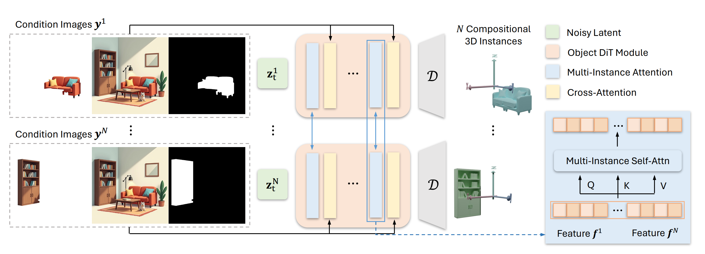

## 0. Materials

- [Paper](https://arxiv.org/pdf/2412.03558)

- [Github](https://github.com/VAST-AI-Research/MIDI-3D)

## 1. What is the paper about?

WorkFlow: Grounded-SAM segmentation -> Input: mask + local view + global view (7 channels in total) -> Multi-instance diffusion parallel denoising (with cross-instance attention).

- Introduces **MIDI (Multi-Instance Diffusion)**, the first framework that turns a pre-trained single-object diffusion model into a multi-object generator able to create a full 3-D indoor scene from one image

- **Parallel denoising of N latent codes** (one per object) with **shared weights** plus new **multi-instance attention** so every object token can attend to all other objects, enforcing correct spatial relations during generation

- Conditioning combines each cropped object image, its mask and the global scene image; final latents are decoded to meshes and compose the scene without extra layout optimization

## 2. What is new compared to prior work?

- Replaces the long pipeline "segment → inpaint → single-object generation → layout solve" used by Gen3DSR, REPARO, etc., with a **single diffusion pass**

- **Multi-instance attention layer** generalises object self-attention to cross-object attention, letting tokens query all instances instead of only their own, which previous single-object models lacked

- Applies **LoRA** to adapt the 21-layer DiT backbone with only a few percent of parameters, keeping the pre-trained geometry prior intact

- Mixes a small, cleaned split of **3D-FRONT** scenes with single-object **Objaverse** samples, preserving shape diversity while learning spatial relations

## 3. What experiments were run to support the arguments in this paper?

- Quantitative evaluation on **3D-FRONT** and **BlendSwap**; MIDI wins in scene-level & object-level Chamfer-D, F-Score and bounding-box IoU while running in 40 s vs. 4–9 min for multi-stage baselines

- Qualitative comparison on **Matterport3D** and **ScanNet** shows more complete geometry and better alignment than PanoRecon, Total3D, InstPIFu, SSR, DiffCAD, Gen3DSR, REPARO

- Feeding SDXL-generated cartoon / CG / illustration scenes demonstrates strong out-of-distribution generalisation; REPARO often mis-places objects while MIDI stays coherent

- Ablations:
  - Vary number of multi-instance attention layers (K = 0, 5, 21) → K = 5 best; K = 0 breaks spatial coherence, K = 21 over-fits and distorts geometry
  - Remove global scene image or Objaverse mixing → IoU/F-Score drop and shapes degrade, proving both components are critical

- Full scene produced in ~40 s on a single A100 GPU

## 4. What are the shortcomings/limitations of this paper?

- Generating all instances in the same normalised scene box causes tiny objects to occupy few voxels, lowering their resolution

- **Interaction diversity** is limited by current datasets; dynamic or articulated relations (e.g., a person holding a mug) are not well modelled

- Instance count capped (N ≤ 5) during training/inference due to GPU memory; large cluttered rooms must be processed in batches

- Background layout (walls, floors) is not generated—must be added with external methods, unlike holistic feed-forward reconstructions

- Relies on accurate segmentation masks; errors from Grounded-SAM propagate to 3-D output

## 5. What is a reasonable next step to build upon this paper?

- Predict each object in its own local coordinate (full resolution) and regress a 6-DoF pose to place it in the scene, solving the small-object resolution issue while keeping joint optimization.

- Augment training with **interaction-rich datasets** (e.g., synthetic articulated scenes or MOABA—"manipulating-objects-and-body" assets) to scale the multi-instance attention toward human–object and object–object dynamics.

- Explore **geometry-aware attention** that injects explicit 3-D positional encodings (distance, relative orientation) to improve spatial reasoning efficiency and allow deeper stacks without over-fitting.

- Pair MIDI with **open-world segmentation + text prompts** so it can tackle outdoor streetscapes or mixed reality scenes.

Integrate a **layout-aware refinement network** that upsamples small objects and predicts background surfaces, delivering complete editable CAD-like scenes.

## Appendix

- **Diffusion Transformer (DiT)** – a diffusion model whose denoising network is a Transformer that operates on latent patches rather than a U-Net

- **VAE (Variational Auto-Encoder)** – an encoder–decoder generative model that compresses data into a low-dimensional latent space and reconstructs it stochastically.

- **CFG (Classifier-Free Guidance)** – inference trick that mixes a conditional and an unconditional denoising prediction; the guidance scale (here 7) multiplies their difference to strengthen conditioning

- **LoRA (Low-Rank Adaptation)** – fine-tuning technique that inserts tiny low-rank matrices into pretrained weights, allowing efficient adaptation with few trainable parameters

- **Grounded-SAM** – an open-vocabulary instance-segmentation system that combines Grounding-DINO detection with SAM masks; used to obtain object masks before running MIDI

- **Chamfer Distance (CD)** – average nearest-point distance between two point clouds; lower values mean closer geometry

- **F-Score (3-D reconstruction)** – harmonic mean of precision and recall computed with a fixed surface-to-surface threshold; higher is better

- **Volume IoU (IoU-B)** – intersection-over-union between predicted and ground-truth 3-D bounding-box volumes, measuring layout accuracy.

- **3D-FRONT** – large synthetic dataset of furnished indoor rooms with meshes, layouts and semantics; MIDI is trained and evaluated on it

- **Objaverse** – open collection of 800 k+ 3-D objects used to retain single-object shape diversity during training.

- **Matterport3D / ScanNet** – real-world RGB-D indoor scan datasets commonly used for scene reconstruction benchmarks.

- **SDXL (Stable Diffusion XL)** – an advanced text-to-image latent-diffusion model; its stylised images were fed to MIDI for out-of-distribution tests

- **DINO-ViT** – a Vision Transformer trained with self-distillation (DINO) that provides strong image features; serves as MIDI’s image encoder.

- **SDF (Signed Distance Function)** – scalar field giving signed distance to the nearest surface; decoding SDF values yields watertight 3-D meshes.

- **Tri-plane representation** – encodes a volumetric field with three orthogonal feature planes, enabling fast, memory-friendly 3-D generation/rendering

- **Baseline methods (InstPIFu, Total3D, DiffCAD, Gen3DSR, REPARO)** – representative single-image 3-D reconstruction pipelines against which MIDI is compared, covering direct regression, retrieval-based and multi-stage compositional approaches.
