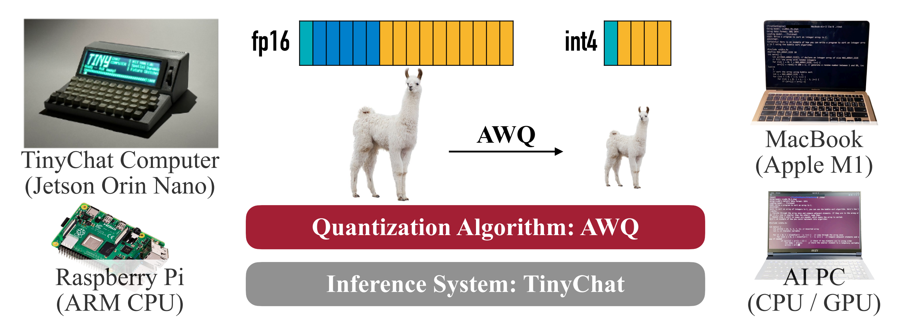

## Materials

- [Paper](https://arxiv.org/pdf/2306.00978)

- [Github](https://github.com/mit-han-lab/llm-awq)

## 1. What is the paper about?



- Introduces **AWQ (Activation-aware Weight Quantization)**, A training-free, weight-only quantization method and the **TinyChat** deployment system.

- Make **on-device/edge LLMs practical** (lower memory, higher speed) while preserving accuracy across instruction-tuned and multi-modal models.

## 2. What is new about this specific paper, compared to prior work?

- Use **activation statistics** to find **salient channels** (≈0.1–1% of weights) and scale them before quantization to cut error.

```text:
A numerical example
Δ=0.1, w=0.24.

If no AWQ
    w'-> 0.2, diff = 0.24 - 0.2 = 0.04

Apply with AWQ (set s=2):
    w*s = 0.48, w'/2->0.25, then diff = 0.25 - 0.24 = 0.01
```

- A deployment system **TinyChat** that turns the 4-bit memory savings (W4A16) into real speedups via **fused de-quantization**, **SIMD-aware packing**, and **kernel fusion**.

- Works with **~10× less calibration data** and is less sensitive to domain shift.

## 3. What experiments were run to support the arguments in this paper?

- LLaMA/Llama-2 & OPT (7B–70B) for **LM perplexity**, INT3/INT4, g=128; AWQ ≻ RTN and ≻/≈ GPTQ

- OpenFlamingo-9B on COCO (0/4/8/16/32-shot) and VILA-7B/13B on 11 VL benchmarks; **INT4 AWQ near-lossless** and > RTN/GPTQ

- CodeLlama-7B on MBPP and Llama-2 (7B/13B/70B) on GSM8K; **INT4 AWQ ≈ FP16** and ≥ baselines

- Calibration ablations with 16 vs 192 sequences; **AWQ needs less data and is more robust**

- Systems evaluation with **TinyChat** on RTX 4090, Jetson Orin, RTX 4070 laptop, Raspberry Pi 4B; **2.7–3.9× over HF FP16**

- Roofline and micro-benchmarks **shows W4A16 lifts arithmetic intensity ≈4×**

## 4. What are the shortcomings/limitations of this paper?

- Still needs a small calibration set;

- Focuses on **weight-only quantization**; activations/KV-cache largely **unquantized**.

- Some speedups **rely on hardware-specific engineering**, which may need porting effort across backends.

- Evaluation emphasizes perplexity and **GPT-4 judging**; limited human studies, safety/robustness stress tests.

## 5. What is a reasonable next step to build upon this paper?

- Extend to **activation and KV-cache quantization**; explore end-to-end **W4A8** or lower.

- **Dynamic/adaptive scaling** (per-layer, per-token, or input-aware) with online calibration

- Combine with sparsity/low-rank for further memory/latency gains.

## Appendix

- **GPTQ (Gradientless Post-Training Quantization)**: a PTQ algorithm that uses second-order (Hessian) information to reconstruct weights and compensate quantization error.
- **RTN (Round-To-Nearest)**: the simplest uniform PTQ baseline that rounds each value to the nearest quantization level.
- **Grouped quantization (g=128)**: partitioning weights into groups of 128 elements, each with its own scale/zero-point, to balance accuracy and storage.
- **COCO Captioning / CIDEr**: an image-caption dataset and its consensus-based evaluation metric (higher CIDEr is better).
- **OpenFlamingo  / VILA**: visual-language models that combine vision encoders with LLMs for multimodal tasks.
