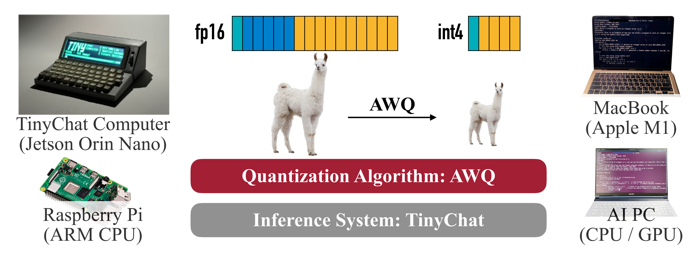

> 本博客使用`GPT-5`翻译，如有冲突请优先参考英文原文

## Materials

- [Paper](https://arxiv.org/pdf/2306.00978)

- [Github](https://github.com/mit-han-lab/llm-awq)

---

## 1. 这篇论文讲什么？



- 提出 **AWQ（Activation-aware Weight Quantization，激活感知的权重量化）**：一种免训练（training-free）、仅权重（weight-only）的量化方法，以及对应的 **TinyChat** 部署系统。

- 让 **端侧/本地 LLM** 更实用（更低内存、更高速度），同时在指令微调与多模态模型上**尽量保持精度**。

## 2. 相比以往工作，这篇论文的新意在哪里？

- 利用**激活统计**来发现**显著通道**（约占权重的 ≈0.1–1%），在量化前对其进行缩放以降低误差。

```text:
一个数值小例子
Δ=0.1, w=0.24.

若未使用 AWQ
    w'-> 0.2, diff = 0.24 - 0.2 = 0.04

使用 AWQ（设 s=2）：
    w*s = 0.48, w'/2->0.25, 则 diff = 0.25 - 0.24 = 0.01
```

- 提出部署系统 **TinyChat**，通过**融合反量化**、**SIMD 感知打包**与**算子/内核融合**，把 4bit 的内存节省（W4A16）转化为**实际加速**。

- **所需校准数据更少**（\~1/10），且对**领域迁移更不敏感**。

## 3. 为支撑论文观点做了哪些实验？

- 在 LLaMA/Llama-2 与 OPT（7B–70B）上做 **语言模型困惑度**评测，INT3/INT4、g=128；**AWQ 优于 RTN，且优于/接近 GPTQ**。

- OpenFlamingo-9B 于 COCO（0/4/8/16/32-shot）与 VILA-7B/13B 于 11 个视觉语言基准上；**INT4 AWQ 近乎无损**，且优于 RTN/GPTQ。

- CodeLlama-7B 于 MBPP，Llama-2（7B/13B/70B）于 GSM8K；**INT4 AWQ ≈ FP16**，且**不低于或好于**基线。

- 用 16 vs 192 条序列做校准消融；**AWQ 需要更少数据且更稳健**。

- 系统层面在 **RTX 4090、Jetson Orin、RTX 4070 笔记本、Raspberry Pi 4B** 上用 **TinyChat** 评测；**较 Hugging Face FP16 提速 2.7–3.9×**。

- Roofline 与微基准表明 **W4A16 将算术强度提升约 ≈4×**。

## 4. 这篇论文的不足/局限？

- 仍需一小部分校准数据；

- 主要关注**仅权重量化**；**激活/KV 缓存**基本**未量化**。

- 部分加速**依赖硬件特定工程优化**，跨后端移植可能需要额外工作。

- 评测更强调困惑度与 **GPT-4 判定**；**人工研究、安全/鲁棒性压力测试**有限。

## 5. 合理的后续工作？

- 扩展到**激活与 KV 缓存的量化**；探索端到端 **W4A8** 或更低比特。

- **动态/自适应缩放**（按层、按 token、或输入感知）配合**在线校准**。

- 与**稀疏化/低秩**结合以进一步降低内存与延迟。

## 附录

- **GPTQ**：一种无梯度的后训练量化方法，利用二阶（Hessian）信息重构权重并补偿量化误差。
- **RTN（Round-To-Nearest）**：最简单的均匀 PTQ 基线，把每个数值四舍五入到最近的量化等级。
- **分组量化（g=128）**：把权重按 128 个元素分组，每组有独立的 scale/zero-point，以在精度与存储之间折中。
- **COCO Captioning / CIDEr**：图像描述数据集及其一致性评测指标（CIDEr 越高越好）。
- **OpenFlamingo / VILA**：将视觉编码器与 LLM 结合的多模态模型。
