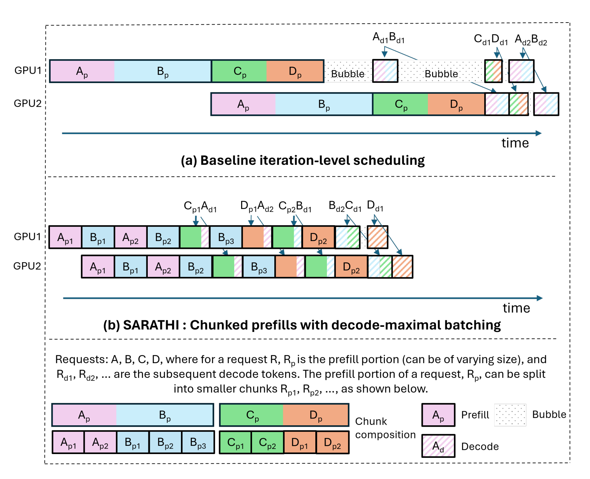

## Materials

- [Paper](https://arxiv.org/pdf/2308.16369)

## 1. What is the paper about?

- Proposes **SARATHI**, a scheduling/execution approach that makes LLM inference more efficient by **Chunked-prefills** and **Decode-maximal batching**

- It can raise GPU utilization during decode (normally memory-bound) and **eliminate pipeline bubbles** in PP by making micro-batches uniform and compute-intensive.

## 2. What is new about this specific paper, compared to prior work?

- Turns decode from **memory-bound** to **compute-bound** by **fusing** the prefill & decode linear layers into one matmul per batch.

- Introduces **chunked-prefills** that split a request's prefill into equal-compute chunks, with causal masks to keep correctness

- Introduces **decode-maximal batching** that build each batch from **one prefill chunk + as many decodes** as fit, so decodes "piggyback" on the prefill's compute.

- Shows **tile-quantization–aware** chunk sizing (aligning chunk+decode count to GPU matmul tile sizes) to avoid performance cliffs.

## 3. What experiments were run to support the arguments in this paper?

- Per-op per-token times & **arithmetic intensity** for prefill vs decode (LLaMA-13B/A6000) → decode proven memory-bound at practical batch sizes.

- Decode-only speedups up to **~10×**; end-to-end throughput gains up to **1.33×** (LLaMA-13B/A6000) and **1.25×** (LLaMA-33B/A100).

- Sweeps over **batch size**, **sequence length (1K–3K)**, **P:D ratio**, **chunk size (128/256/512)**; identified peak at `P:D ≈ C/(B−1)` and tile-size multiples.

- SARATHI outperforms **Orca** best-case (e.g., **1.23–1.27×** throughput gains) and far exceeds worst-case across sequence lengths and P:D ratios

- Bubble time in PP (GPT-3 on 64×A100) median reduced **6.29×**; throughput **1.91×** over TP+PP baseline and **1.48×** over TP-only replicas .

- Showed **256/512** chunks limit prefill loss to ≤20%/≤10%, and small chunks like 64 are harmful unless decode overlap dominates.

## 4. What are the shortcomings/limitations of this paper?

- Focuses primarily on **throughput**; does not co-optimize **tail latency**, **queuing**, or **fairness**—needed in production serving.

- **Chunk-size selection** left as **offline tuning**; no adaptive online policy when P:D, load, or hardware vary.

- Assume **similar token counts** per request, whereas real workloads have highly variable sequence lengths.

- Effectiveness with very long contexts (10^4–10^5) is unclear as attention cost grows quadratically.

- Technique mainly accelerates **decodes**; overall gains capped when prefill dominates.

## 5. What is a reasonable next step to build upon this paper?

- Online learning/auto-tuner to pick chunk size and batch composition that jointly optimize **throughput and latency/QoS** under changing P:D and arrival patterns.

- **Real-cluster experiments** validating bubble reduction, and cost per token vs TP-only baselines.

- Extend to **preemptive / fairness-aware scheduling** (e.g., FastServe-style) that cooperates with decode-maximal batching.

- Deeper fusion of linear ops, tile-aware layouts, and BF16/INT quantization paths specialized for mixed prefill+decode batches.

## Appendix

- **Iteration-level scheduling**: A batching policy where requests can join/leave a running batch at each iteration rather than only between batches. (Orca)

- **Throughput saturation**: Point where increasing batch/sequence no longer raises tokens-per-second because GPU is fully utilized.

- **P:D ratio**: The ratio of prefill tokens (P) to decode tokens (D) for a workload or batch.

- **FastServe**: Preemptive scheduling system targeting lower completion time for LLM inference.
