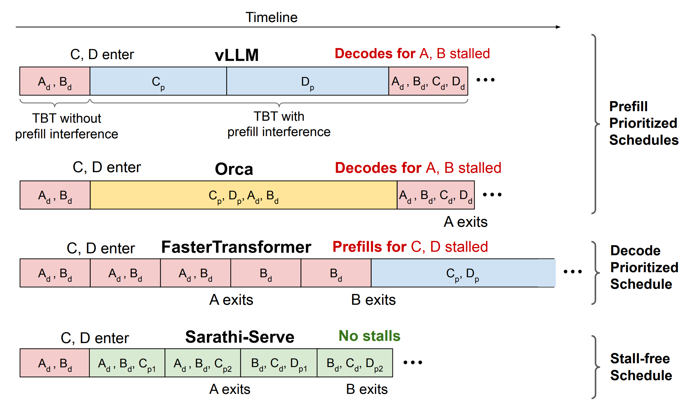

## Materials

- [Paper](https://arxiv.org/pdf/2403.02310)

- [Github](https://github.com/microsoft/sarathi-serve)

- [Previous Chunked Prefill](../chunked_prefill_SARATHI_summary/)

## 1. What is the paper about?

- Proposes **Sarathi-Serve**, an online LLM inference scheduler that simultaneously improves throughput and tail latency.

- Introduces **chunked-prefills** and **stall-free batching**.

- Yields **uniform-compute hybrid batches** (decode + small prefill chunks) that avoid generation stalls and reduce pipeline bubbles in PP deployments.

## 2. What is new about this specific paper, compared to prior work?

- Introduces **Stall-free batching**, admit decodes first, then partially completed prefills, then new prefills so that we never pausing decodes.

- **Systemized, SLO-aware scheduler** built on **vLLM** with FlashAttention v2/FlashInfer kernels; supports **TP/PP/hybrid** parallelism and extensive telemetry.

## 3. What experiments were run to support the arguments in this paper?

- Max sustainable **QPS** at P99 TBT targets (strict vs relaxed) across Mistral-7B (1×A100), Yi-34B (TP-2, 2×A100), LLaMA2-70B (TP-4 + PP-2, 8×A40), Falcon-180B (TP-4 + PP-2, 8×A100/2 nodes).

- Compare vLLM (max batch 32/64/128) vs Sarathi-Serve (token budgets 512/2048). Shows vLLM capped by stalls under tight SLOs

- Compare TP-8 vs TP-4 + PP-2 with/without Sarathi-Serve; show >2× lower median TBT than cross-node TP and big capacity gains.

- **Hybrid-batching-only** reduces TTFT but hurts TBT; **chunked-prefills-only** improves TBT but hurts TTFT; **Combined** lowers both.

## 4. What are the shortcomings/limitations of this paper?

- Choosing the token budget needs **per-deployment profiling** and **careful tile-size alignment**; dynamic control is not explored

- Small chunks increase TTFT and add HBM reads

- The scheduler focuses on **SLO-driven batching**; fairness, preemption, or per-tenant QoS are not the central focus.

- Results emphasize A100/A40 + 100 GbE/NVLink; behavior on other **interconnects**, very **long contexts**, **MoE**, or **speculative decoding** is not extensively studied.

## 5. What is a reasonable next step to build upon this paper?

- **Online RL/feedback control** to tune token budget and chunk sizes per iteration based on live TBT, batch mix, and PP bubble telemetry.

- Combine **stall-free batching** within replicas and prefill/decode disaggregation across replicas (with lightweight KV transfer/compression) to push TTFT and capacity further.

- Integrate with **speculative decoding**, **KV compression/quantization**, and **prefill caching** to reduce chunk overhead and HBM traffic.

## Appendix

- **TBT (Time-Between-Tokens)**: The elapsed time between two consecutive output tokens during decoding, often tracked at P99 to capture tail latency.

- **Token budget (τ)**: A per-iteration cap on the total tokens processed (decodes + prefill chunks) chosen to satisfy TBT SLOs.

- **Iteration-level batching**: Allowing requests to join or leave a batch at each model iteration.

- **Request-level batching**: Running a fixed set of requests to completion before admitting new ones.

- **Per-tenant QoS**: Policies ensuring each tenant gets specified performance (latency/throughput) or resource shares.

- **Telemetry**: Metrics and traces collected from the system to monitor performance and guide tuning.
