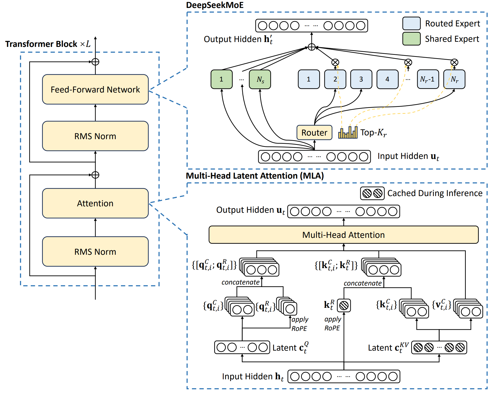

## 0. Materials

- [Paper](https://arxiv.org/pdf/2405.04434)

- [Github](https://github.com/deepseek-ai/DeepSeek-V2)

## 1. What is the paper about?

- Introduces **DeepSeek‑V2**, an open‑source 236 B MoE LLM supporting 128 K context with only 21 B active parameters per token.

- Proposes **MLA** to jointly compress keys/values into a small latent vector, slashing KV‑cache size without hurting accuracy.

- Presents **DeepSeekMoE**, a fine‑grained expert design with shared‑expert isolation, device‑limited routing, balance losses, and token‑dropping to train large sparse models economically.

- 1.5 M‑sample SFT followed by GRPO reinforcement learning, yielding DeepSeek‑V2‑Chat (SFT) and DeepSeek‑V2‑Chat (RL).

## 2. What is new compared to prior work?

- **MLA** replaces MHA / GQA / MQA by low‑rank joint KV compression + decoupled RoPE, cutting cache ≈ ×9 while improving MMLU over MHA.

- **DeepSeekMoE** has 2 shared + 160 routed experts per layer, device‑limited routing (≤ 3 GPUs/token) and three‑level balance losses—significantly lowering communication relative to GShard.

- 16‑stage pipeline + 8‑way expert parallel + KV recompute **remove need for TP** while training, achieving 172.8 k GPU‑h/T‑tokens (‑42.5 % vs dense).

- **128 K context** via YaRN adaptation on the decoupled key path

- **GRPO** eliminates a critic network, reducing RL memory while boosting reasoning and open‑ended performance.

## 3. What experiments were run to support the arguments in this paper?

- Compare KV‑cache size, GPU‑hours, and throughput.

- MHA vs GQA vs MQA vs MLA; unrestricted vs device‑limited routing; SFT vs RL on math/code for **ablations**.

- MMLU, GSM8K, HumanEval, C‑Eval and more for standard benchmarks, beating or matching Llama‑3‑70B, Mixtral‑8×22 B, Qwen‑1.5‑72 B.

- MT‑Bench and AlpacaEval for open‑ended chat.

- NIAH precision stays >90 % up to 128 K tokens for **long‑context**.

## 4. What are the shortcomings/limitations of this paper?

- Hallucination risk persists, e.g., code package "slop-squatting" vulnerabilities common to LLMs.

- Alignment introduces an "alignment tax"—BBH and some logical tasks drop slightly after RL.

- Performance still trails large proprietary models (GPT‑4‑Turbo, ERNIE‑4.0) on hardest Chinese reasoning and cross‑lingual tasks.

- Supports only the text modality, with limited capabilities in languages beyond Chinese & English.

## 5. What is a reasonable next step to build upon this paper?

- Scale up MoE (more experts / depth) while keeping activated params low to approach higher performance without prohibitive cost.

- Extend to multimodal inputs (vision‑text, audio).

- Explore critic‑free or direct‑preference optimisation to reduce alignment tax and further boost reasoning.

- Broaden multilingual coverage by adding high‑quality data and targeted SFT/RL for non‑EN/ZH languages.

## Appendix

- **Needle‑in‑a‑Haystack (NIAH)** Benchmark – tests long‑context recall by hiding a short "needle" passage inside tens of thousands of filler tokens and asking the model about it.

- **AlpacaEval** 2.0 – an automatic, GPT‑4‑judged evaluation that reports the win rate of a model's responses against a strong reference across diverse user instructions.

- **MT‑Bench** – a multi‑turn dialogue benchmark where LLMs are scored by other strong LLMs on coherence, helpfulness and depth over 80 chatbot conversations.
