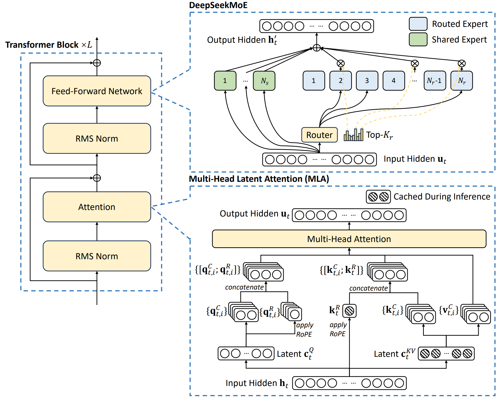

> 本博客使用`o3`翻译，如有冲突请优先参考英文原文

## 0. Materials

- [Paper](https://arxiv.org/pdf/2405.04434)

- [Github](https://github.com/deepseek-ai/DeepSeek-V2)

## 1. 论文讲了什么？

- **DeepSeek‑V2**：提出一款开源的 236 B 参数 MoE 大语言模型，每个 token 仅激活 21 B 参数，支持 128 K 上下文长度。
- **MLA**（Multi‑Head Latent Attention）：将 key/value 共同压缩为低秩潜向量，并与解耦的 RoPE 结合，在保持精度的同时使 KV‑cache 体积减少约 9 倍。
- **DeepSeekMoE**：提出细粒度专家设计，包括共享‑专家隔离、设备受限路由、三级负载均衡损失以及 token‑dropping，使大规模稀疏模型训练更经济。
- 采用 150 万样本的 SFT，并在此基础上使用 **GRPO**（无 critic 的偏好强化学习）进行对齐，得到 **DeepSeek‑V2‑Chat (SFT)** 与 **DeepSeek‑V2‑Chat (RL)**。

## 2. 相比以往工作的创新点

- **MLA** 取代传统 MHA / GQA / MQA，通过低秩联合 KV 压缩与解耦 RoPE，实现 KV‑cache ≈ ×9 缩减，且 MMLU 表现优于 MHA。
- **DeepSeekMoE**：每层 2 个共享专家 + 160 个路由专家；采用设备受限路由（每 token 最多使用 3 张 GPU）与三级负载均衡损失，通信开销显著低于 GShard。
- 16 段流水线并行 + 8 向专家并行 + KV 重新计算 **无需 TP** 即可训练，训练开销 172.8 k GPU‑h/T‑tokens，比同规模稠密模型减少 42.5 %。
- 通过 YaRN 适配，在解耦的 key 路径上实现 **128 K 上下文** 支持。
- **GRPO** 省去 critic 网络，降低 RL 内存占用，同时提升推理与开放式任务性能。

## 3. 实验验证

- 对比 KV‑cache 大小、GPU‑小时与吞吐量。
- 比较 MHA、GQA、MQA 与 **MLA**；无限制路由 vs. 设备受限路由；SFT 与 RL 在数学/代码任务上的消融实验。
- 在 MMLU、GSM8K、HumanEval、C‑Eval 等基准上表现超越或匹配 Llama‑3‑70B、Mixtral‑8×22 B、Qwen‑1.5‑72 B。
- 在 MT‑Bench 与 AlpacaEval 的开放式聊天评测中获得更高分数。
- **长上下文**：在 128 K token 范围内，Needle‑in‑a‑Haystack (NIAH) 精确率维持在 90 % 以上。

## 4. 局限与不足

- 仍存在幻觉风险，例如代码依赖“域名接管”类漏洞。
- 对齐过程带来 “对齐税”：在 BBH 与部分逻辑任务上 RL 版本略有下降。
- 在最难的中文推理与跨语言任务上仍落后于 GPT‑4‑Turbo、ERNIE‑4.0 等闭源大模型。
- 仅支持文本模态，对除中英文外的多语言能力有限。

## 5. 后续可行的研究方向

1. **扩展 MoE 规模**：在保持激活参数量低的前提下增加专家数量或模型深度，以逼近更高性能。
2. **多模态扩展**：加入视觉‑文本、语音等模态。
3. **改进对齐**：探索无 critic 或直接偏好优化，减少对齐税并进一步提升推理能力。
4. **增强多语言**：引入高质量数据并针对非 EN/ZH 语言进行定向 SFT/RL。

## 附录

- **Needle‑in‑a‑Haystack (NIAH)**：在几十万 token 的“草堆”中插入短“针”并提问，用于测试长上下文检索能力。
- **AlpacaEval 2.0**：由 GPT‑4 评判，衡量模型在多样用户指令下的胜率。
- **MT‑Bench**：80 轮多轮对话，由强大 LLM 评分，考察连贯性、帮助性与深度。
