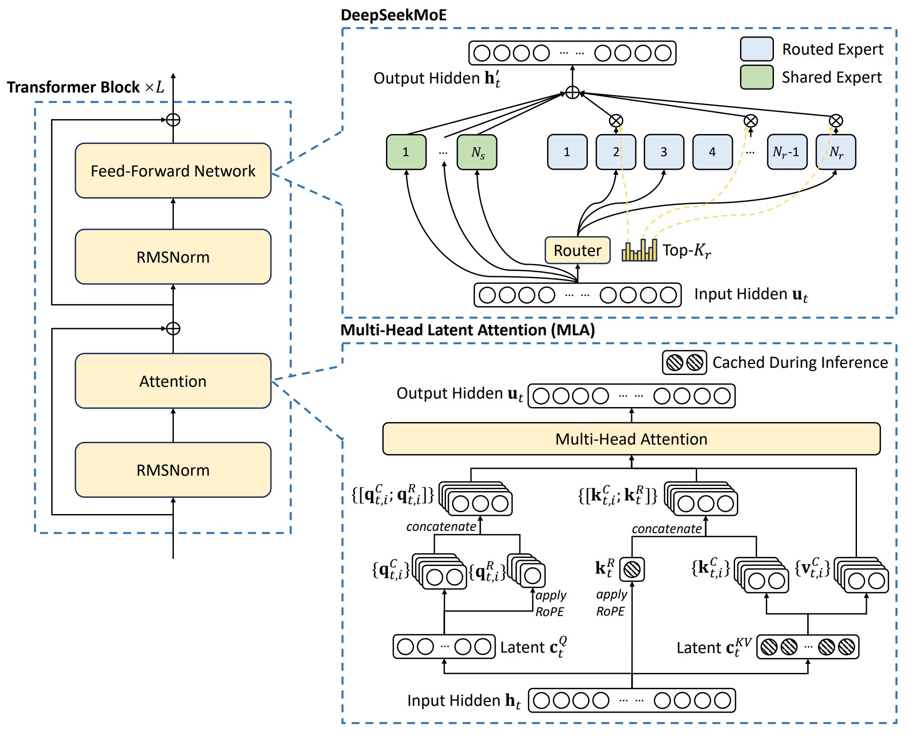

## 0. Materials

- [Paper](https://arxiv.org/pdf/2412.19437)

- [Github](https://github.com/deepseek-ai/DeepSeek-V3)

## 1. What is the paper about?

- Introduces **DeepSeek-V3**, a 671B parameter MoE LLM that activates only 37 B parameters per token for inference, slashing FLOPs and memory needs compared with dense peers.

- **MLA** for small KV cache, **DeepSeekMoE** experts, an auxiliary-loss-free load-balancing algorithm, **FP8 mixed-precision training** and the **"DualPipe"** bidirectional pipeline parallelism scheme.

- Details a full training and alignment pipeline (14.8 T tokens pre-train → 128 K-token YaRN extension → SFT on 1.5 M instructions → **GRPO** reinforcement learning).

- Showing V3 outperforms all open-source models (and nears GPT-4o / Claude-3.5) on knowledge, reasoning, code, maths and long-context tasks while keeping training cost at **2.788 M H800 GPU-hours**.

## 2. What is new compared to prior work?

- Replaces classic auxiliary-loss with per-expert dynamic bias → better accuracy & expert specialisation without gradient bleed-through.

- **Multi-Token Prediction (MTP)**: adds a shallow branch that predicts the next 2 tokens during training, enabling speculative decoding and +1.8 × TPS at test time.

- Fine-grained 1×128 (per-token) / 128×128 (per-block) tile **FP8 quantisation** plus high-precision CUDA-core accumulation keeps loss `Δ < 0.25` % relative to BF16.

- **DualPipe** fully overlaps forward/backward compute with **MoE all-to-all and TP comms**, cutting bubbles by 50 % and using only 20 SMs for comms.

- **GRPO** removes the costly critic network by normalising rewards within a batch group.

## 3. What experiments were run to support the arguments in this paper?

- MMLU-Pro, GPQA-Diamond, DROP, LongBench-v2, FRAMES for **long-context benchmarks**; V3 tops all open-source and trails only Claude-3.5 on a few.

- MATH-500, AIME-24, CNMO-24, HumanEval-Mul, LiveCodeBench Aug-Nov 2024 for **math / code**; V3 sets new SOTA margins.

- SWE-Bench-Verified & Aider edit/polyglot for **engineering** show big gains over previous open-source MoEs.

- Arena-Hard & AlpacaEval-2.0 for **open-ended evaluations** – first open-source model to beat 85 % on Arena-Hard.

- Ablations: MTP vs baseline; Aux-loss-free vs aux-loss models

## 4. What are the shortcomings/limitations of this paper?

- Recommended **prefill unit is 32 GPUs** and **decode unit 320 GPUs**; hard for small teams to serve.

- Decoding still slower than dense peers despite 1.8 × boost

- English factual QA (SimpleQA) lags GPT-4o/Claude due to **Chinese-heavy data mix**.

- R1 distillation improves accuracy but increases **verbosity**, requiring careful rejection sampling.

## 5. What is a reasonable next step to build upon this paper?

- **Shrink deployment footprint** via hierarchical MoE or dynamic expert pruning so that < 8 GPUs can serve typical workloads.

- **Optimise speculative decoding** – raise second-token acceptance > 90 % and generalise MTP to k > 2 for larger speed-ups.

- Retrieval-augmented training to close SimpleQA gaps without sacrificing Chinese strengths.

- Port DualPipe + FP8 to Blackwell's microscaling tensor cores and upstream tile-wise quantisation support.

## Appendix

- **Auxiliary loss** – an extra regularization term added to MoE routing that penalises experts with above-average traffic to encourage a uniform load across experts.

- **Auxiliary-loss-free balancing** – DeepSeek-V3’s alternative that drops the auxiliary term and instead adds a per-expert bias updated every step, preserving accuracy while still evening out traffic.

- **Multi-Token Prediction** (MTP) – a training head that asks the model to predict the next two tokens instead of one, densifying supervision during training and enabling fast speculative decoding.

- **E4M3 format** – an FP8 variant that allocates 4 exponent + 3 mantissa bits;

- **Tile / block-wise quantisation** – scaling activations per 1 × 128 token×channel tile and weights per 128 × 128 block to curb outliers before converting to FP8.

- **DualPipe** – a bidirectional pipeline-parallel algorithm that interleaves forward and backward micro-batches so all-to-all + TP communications are fully hidden inside compute.

- **YaRN – "Yet-another RoPE extensioN"**; a data-efficient method that rescales Rotary Positional Embeddings so pre-trained models can be fine-tuned to 32 K–128 K token contexts.
