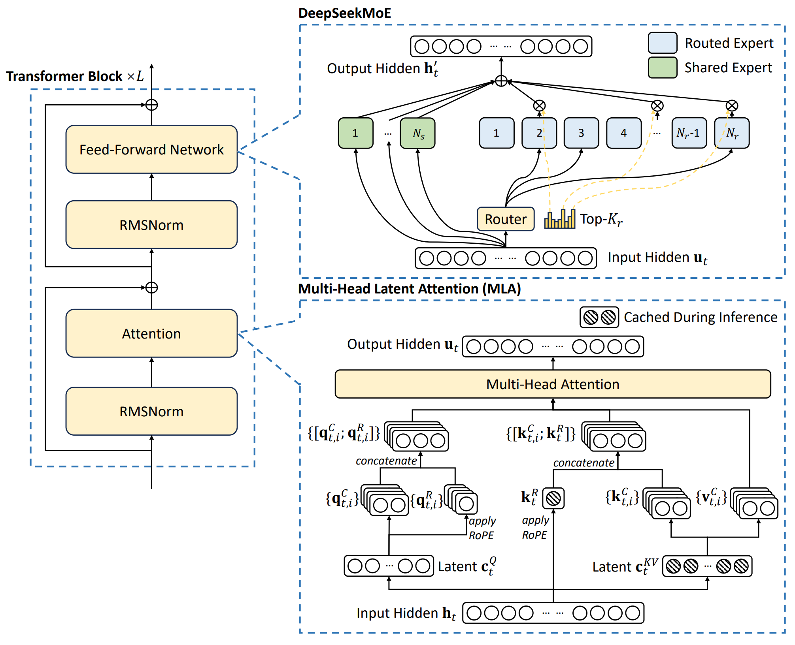

> 本博客使用`o3`翻译，如有冲突请优先参考英文原文

## 0. Materials

- [Paper](https://arxiv.org/pdf/2412.19437)

- [Github](https://github.com/deepseek-ai/DeepSeek-V3)

## 1. 论文主要内容

- **DeepSeek-V3** 是一款 671B 参数的 MoE 大语言模型，推理阶段每个 token 仅激活 37 B 参数，在同尺寸稠密模型中大幅降低 FLOPs 与显存需求。

- 采用 **MLA** 缩小 KV 缓存，引入 **DeepSeekMoE** 专家、无辅助损失的负载均衡算法，使用 **FP8 混合精度训练** 与 **“DualPipe” 双向流水线并行**。

- 提供完整训练与对齐流程（14.8 T 令牌预训练 → 128 K-token YaRN 扩展 → 150 万指令 SFT → **GRPO** 强化学习）。

- 在知识、推理、代码、数学及长上下文任务上全面超越全部开源模型，并在多数指标上逼近 GPT-4o / Claude-3.5；总训练成本仅 2.788 M H800 GPU-小时。

## 2. 与已有工作的差异

- 以每专家动态偏置取代传统辅助损失 → 提升精度和专家专化度，避免梯度泄漏。

- **多 Token 预测 (MTP)**：训练时额外预测下 2 个 token，使推测式解码 TPS 提升 1.8 ×。

- 细粒度 1 × 128（按 token）/128 × 128（按块）tile FP8 量化，并在 CUDA 核心中高精累加，损失相对 BF16 仅增 0.25 %。

- **DualPipe** 完全重叠前/后向计算与 MoE all-to-all 与 TP 通信，空闲减少 50 %，通信仅占用 20 个 SM。

- **GRPO** 通过批组内奖励归一化，去除昂贵的 critic 网络。

## 3. 支撑论点的实验

- **长上下文评测**：MMLU-Pro、GPQA-Diamond、DROP、LongBench-v2、FRAMES——V3 领跑所有开源模型，仅个别项目略逊 Claude-3.5。

- **数学 / 代码**：MATH-500、AIME-24、CNMO-24、HumanEval-Mul、LiveCodeBench 2024-08\~11——V3 创下全新 SOTA。

- **工程**：SWE-Bench-Verified & Aider edit/polyglot 显示对旧开源 MoE 的显著增益。

- **开放式评测**：Arena-Hard & AlpacaEval-2.0——V3 为首个在 Arena-Hard 得分 > 85 % 的开源模型。

- **消融实验**：MTP vs 基线；无辅助损失 vs 含辅助损失模型。

## 4. 局限 / 不足

- 推荐 **prefill** 单元 32 张 GPU、**decode** 单元 320 张 GPU——中小团队部署困难。

- 即便加速 1.8 ×，解码仍慢于稠密模型。

- 数据集中文占比较高，英文事实问答 (SimpleQA) 落后 GPT-4o / Claude-3.5。

- R1 蒸馏提高准确率却增加**冗长性**，需审慎拒绝采样。

## 5. 合理的后续工作

- 通过层次化 MoE 或动态专家剪枝 **缩小部署规模**，让 < 8 张 GPU 足以服务常规负载。

- **优化推测式解码**：将第二 token 接受率提升至 > 90 %，并将 MTP 推广至 k > 2 以取得更大加速。

- 引入检索增强训练，弥补 SimpleQA 缺口，同时保持中文优势。

- 将 DualPipe + FP8 移植至 Blackwell 微尺度张量核，并向上游提交 tile 量化支持。

## 附录

- **辅助损失** —— 在 MoE 路由中加入额外正则项，对流量高于平均的专家进行惩罚，以平衡负载。

- **无辅助损失负载均衡** —— DeepSeek-V3 的替代方案：移除辅助项，改用每步更新的专家偏置，同时保持精度并均衡流量。

- **多 Token 预测 (MTP)** —— 训练头要求模型预测下两个 token 而非一个，密集监督并支持快速推测式解码。

- **E4M3 格式** —— 一种 FP8 变体，4 位指数 + 3 位尾数。

- **Tile / block-wise 量化** —— 激活按 1 × 128 token×channel tile、权重按 128 × 128 block 缩放后再转 FP8，以抑制异常值。

- **DualPipe** —— 双向流水线并行算法，交错前向 / 反向微批，使 all-to-all + TP 通信完全隐藏于计算之内。

- **YaRN —— “Yet-another RoPE extensioN”**：通过缩放旋转位置编码，使预训练模型能微调到 32 K–128 K token 长度。
