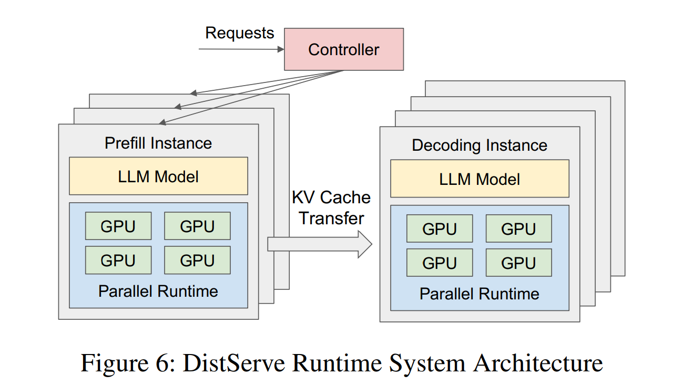

## 0. Materials

- [Paper](https://arxiv.org/pdf/2401.09670)

- [Github](https://github.com/LLMServe/DistServe)

## 1. What is the paper about?

- Serving a production LLM request has two stages—**prefill** and **decoding**. Running them on the same GPUs causes resource contention that hurts latency Service-Level Objectives (SLOs) for time-to-first-token (TTFT) and time-per-output-token (TPOT).

- **DistServe** physically disaggregates the two stages onto separate GPU pools, then uses a simulator-driven search to pick the best parallelism (intra-op, inter-op, replication) and placement for each pool so that per-GPU goodput—the maximum request rate that still meets latency SLOs—is maximised.

- Across OPT-13 B/66 B/175 B and three workloads (chat, code completion, document summarisation), DistServe delivers up to **7.4 × more goodput** or **sustains 12.6 × stricter SLOs** than state-of-the-art serving systems while keeping > 90 % of requests within latency budgets.

## 2. What is new compared to prior work?

- Earlier systems (vLLM’s continuous batching or DeepSpeed-MII’s chunked-prefill piggy-back) keep both stages on the same GPU and try to schedule around the interference; DistServe removes the interference entirely by giving each stage its own GPUs.

- Prior work mostly optimises raw throughput; DistServe explicitly maximises goodput under dual-latency SLOs, a metric that better aligns with user experience and cost.

- It contributes two search algorithms—one for **high-bandwidth clusters** and one that constrains prefill/decoding segments to share NVLink when **cross-node links are slow**—minimising KV-cache transfer overhead.

- It models prefill as an **M/D/1 queue** and shows how **intra-op** (tensor parallel) vs **inter-op** (pipeline parallel) parallelism trades off execution time vs queueing delay.

## 3. What experiments were run to support the arguments in this paper?

- Chatbot (ShareGPT), Code completion (HumanEval) and Summarisation (LongBench) on OPT-13 B/66 B/175 B, all compared against vLLM and DeepSpeed-MII via SLO attainment vs request rate, and vs tightened latency (SLO Scale).

- Measures the fraction of total time spent in prefill queue/exec, KV-transfer, decode queue/exec; shows **transfer < 0.1 % even on 175 B with 25 Gb links**

- DistServe-Low (bandwidth-constrained search) vs DistServe-High (cross-node freedom) isolates the value of the placement algorithm.

- Table 2 compares simulator-predicted SLO attainment with real runs across seven load levels (≤ 2 % error).

- Figure 12 reports algorithm wall-time (1–82 s on up to 32 GPUs, 96 CPU cores).

- Results are contextualised against other disaggregation contemporaries such as TetriInfer and Splitwise, highlighting DistServe’s focus on goodput & bandwidth.

## 4. What are the shortcomings/limitations of this paper?

- Prefill and decoding replicas each keep full model weights, doubling GPU memory consumption and making the design unattractive on smaller cards.

- Benefit assumes NVLink-class bandwidth; clusters limited to PCIe-only or slow cross-node links may not realise the gains, especially for very small prompts.

- In single- or dual-GPU deployments the design space collapses and DistServe cannot split stages effectively— acknowledged by the authors.

- A failed decoding GPU can stall many prefill GPUs; the paper leaves robustness to future work.

- Does not evaluate newer attention variants (KV-sharing, MoE, speculative decoding) which could alter the compute/IO balance.

- Throughput-oriented or offline workloads may prefer **chunked-prefill batching, which DistServe does not optimise for**.

## 5. What is a reasonable next step to build upon this paper?

- Add quantisation or on-demand weight paging so prefill/decoding replicas can share parameters, shrinking the doubled memory footprint and enabling mid-tier GPUs.

- Integrate preemption and replica-level fault-isolation so that one crashed decoding instance does not cascade to multiple prefill queues.

- Develop a runtime that can merge stages back onto the same GPU during low load to save energy, and split them dynamically when SLOs tighten.

- Evaluate with speculative decoding, Grouped-Query-Attention and Mixture-of-Experts LLMs; adapt the simulator’s latency model accordingly.

- Combine DistServe’s disaggregation with **chunked-prefill batching**, automatically choosing the mix that maximises revenue per GPU under a service-level cost model.

## Appendix

- **Continuous batching**: vLLM’s technique that mixes prefill and decoding tokens in the same batch to keep GPUs busy.

- **Chunked-prefill batching**: DeepSpeed-MII’s idea of splitting long prefills into smaller chunks and piggy-backing them onto decode batches to reduce interference.

- **SARATHI**: Microsoft system that combines chunked-prefill and aggressive decode batching for lower latency.

- **DeepSpeed-MII**: DeepSpeed’s inference wrapper that supports chunked-prefill but not physical disaggregation.

- **Splitwise** / **TetriInfer** / **DéjàVu**: Concurrent research projects that also separate prefill and decoding to curb interference; each explores different split granularities.

- **Grouped-Query-Attention (GQA)**: Attention variant where groups of query heads share a single key/value pair set, shrinking KV-cache while keeping some head diversity.

- **Multi-Query-Attention (MQA)**: Extreme form of GQA where all query heads share one key/value pair set.

- **Mixture-of-Experts (MoE)**: Architecture where each token is routed to a subset of specialist sub-networks ("experts"), increasing parameter count without linear compute growth.

- **M/D/1 queue**: Queueing model with Poisson arrivals (M), deterministic service time (D) and one server (1); used to analyse prefill latency.

- **Goodput**: Request rate per GPU that still meets both TTFT and TPOT SLOs; DistServe’s optimisation target.

- **KV-cache streaming**: Runtime mechanism that moves KV-cache slices between GPUs on demand instead of keeping everything resident.
