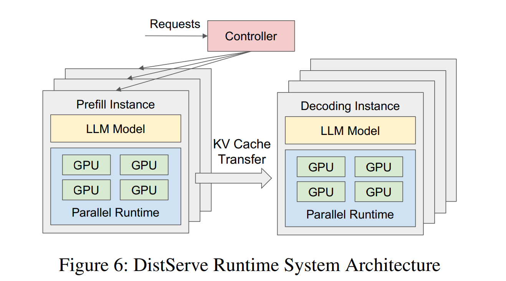

> 本博客使用`o3`翻译，如有冲突请优先参考英文原文

## 0. Materials

- [Paper](https://arxiv.org/pdf/2401.09670)

- [Github](https://github.com/LLMServe/DistServe)

## 1. 论文的内容是什么？

- **LLM 推理有两段**：**prefill**（一次性计算整段上下文）和 **decoding**（循环输出 token）。把二者放在同卡会导致算⼒与显存互相争抢，从而拖慢 **首 token 延迟 TTFT** 与 **单 token 延迟 TPOT**。
- **DistServe** 把两段分别放进两组 GPU，完全消除⼲扰；再让⼀个仿真器搜索 **张量并⾏、流水并⾏、副本数** 以及具体放置策略，直接最⼤化 **单卡 goodput**——即“既守住延迟 SLO 还尽可能多接请求”的吞吐指标。
- 在 OPT-13 B/66 B/175 B 加三种业务（聊天、代码补全、⻓⽂摘要）中，DistServe 可使每卡 goodput 最多提升 **7.4 倍**，或在同样吞吐下扛住 **12.6 倍更苛刻的延迟**。

## 2. 同类⽅案与本⽂区别

- **vLLM** 的 **continuous batching** 和 **DeepSpeed-MII** 的 **chunked-prefill piggy-back** 仍把两段放同卡，只是试图智能排班；DistServe 直接“分家”，从根本上消除争抢。
- 过往系统多追求“原始吞吐（throughput）”；DistServe 正式把 **goodput under dual-latency SLO** 作为⾸要优化目标，更贴合上线服务的体感与成本。
- 针对 **跨节点带宽慢** 的集群，作者额外设计了“prefill / decoding 段共⽤ NVLink，最小化 KV-cache 传输”的受限搜索算法。
- ⽂中把 prefill 等价成 **M/D/1 排队系统**，系统性分析 **张量并⾏（intra-op）** 与 **流水并⾏（inter-op）** 在计算时延 vs. 排队时延上的权衡。

## 3. 实验验证

- 三条⼯作负载：Chat（ShareGPT）、Code Completion（HumanEval）、Summarisation（LongBench）；模型覆盖 OPT-13 B/66 B/175 B。
- 横向对⽐对象：vLLM、DeepSpeed-MII；指标为 SLO 兑现率-vs-请求率，以及在**收紧延迟预算**（SLO Scale）时的打分。
- 将总时延拆解为 prefill 排队/执⾏、KV 传输、decoding 排队/执⾏；即便在 175 B + 25 Gb/s 链路下，**KV 传输仅占 < 0.1 %**。
- **DistServe-Low**（带宽受限搜索）与 **DistServe-High**（跨节点随意放置）对照，量化算法收益。
- **表 2** 显示模拟器预测的 SLO 兑现率与真机误差 ≤ 2 %。
- **图 12** 给出搜索⽤时：1 – 82 s，硬件最⾼ 32 GPU + 96 核 CPU。

## 4. 局限 / 未解问题

- **prefill / decoding 各保留全量权重** → 显存需求翻倍，⼩卡（如 A100-40G）成本劣势明显。
- **依赖 NVLink / 高速跨卡带宽**；PCIe -only 或跨节点慢链路的集群在短 prompt 场景下收益有限。
- **单/双卡部署** 时空间维度消失，DistServe 难以拆段，作者也在⽂中声明此局限。
- **解码卡宕机** 可能拖垮关联的多个 prefill 队列；鲁棒性留待后续。
- **未评估** KV-Sharing、MoE、Speculative Decoding 等新算⾦，这些会改变计算与传输占⽐。
- **离线或纯吞吐** 业务下，chunked-prefill 批处理仍可胜任，DistServe 并未对此做动态切换优化。

## 5. 可以如何扩展这项⼯作？

1. **量化或按需换页权重** —— 让 prefill / decoding 副本共⽤模型，降低“显存翻倍”负担。
2. **增加抢占与副本级故障隔离** —— 解码 GPU 崩溃不至于牵连多条 prefill 队列。
3. **负载感知地合并 / 拆分阶段** —— 低负载时合并回单卡省电，高负载再拆。
4. **适配 Spec-Decode、GQA、MoE** —— 扩展仿真器的时延模型。
5. **混合 chunked-prefill + 物理拆分** —— 在服务 / 成本模型下动态选最优。

## 附录

- **Continuous batching**：vLLM 的“⾏排＋列排”式混批。
- **Chunked-prefill batching**：DeepSpeed-MII 把⻓前缀切块塞进解码批。
- **SARATHI**：微软系结合 chunked-prefill 与激进解码批处理的系统。
- **DeepSpeed-MII**：DeepSpeed 推理框架，⽀持 chunked-prefill，但不物理拆段。
- **Splitwise / TetriInfer / DéjàVu**：同期研究，亦拆分 prefill & decoding，但关注点不尽相同。
- **GQA（Grouped-Query-Attention）**：多头共享⼀组 KV，减⼩ KV-cache。
- **MQA（Multi-Query-Attention）**：GQA 极端形态，所有头共用⼀组 KV。
- **MoE（Mixture-of-Experts）**：token 路由到专家子网，参数激增但计算线性放⼤。
- **M/D/1 排队模型**：泊松到达、确定服务时长、单服务台。
- **Goodput**：在双延迟 SLO 内可持续处理的请求数 / GPU。
- **KV-cache Streaming**：按需流动 KV-cache ⽽⾮全量常驻显存。
