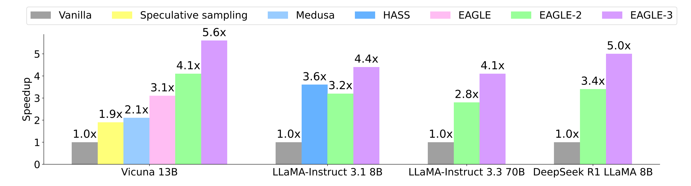

## 0. Materials

- [Paper](https://arxiv.org/pdf/2503.01840)

- [Github](https://github.com/SafeAILab/EAGLE)

## 1. What is the paper about?

- Proposes **EAGLE‑3**, an inference‑acceleration method that extends **speculative decoding** for LLM decoding.

- Replaces feature‑vector prediction with **direct token prediction** and introduces a **training‑time test (TTT)** loop to train the draft model on its own noisy outputs.

- Fuses **low, mid, and high‑level hidden states** from the target model, instead of relying solely on top‑layer features.

## 2. What is new compared to prior work?

- **Removes feature‑regression loss** present in EAGLE/EAGLE‑2, freeing the draft model from high‑dimensional MSE constraints.

- During training, the draft model **repeatedly feeds its own predictions back** as inputs, aligning train‑test distributions and preventing error accumulation.

## 3. What experiments were run to support the arguments in this paper?

- Speed‑up & acceptance length measured against vanilla decoding, spec‑sampling, PLD, Hydra, Medusa, HASS, EAGLE, and EAGLE‑2. **EAGLE‑3 tops all** with 3‑6.5 × gains.

- Throughput +38 % at batch 64 in **SGLang** on H100; EAGLE‑2 regresses beyond batch 24.

- Throughput still ≥ 1.4 × at batch 24 in **vLLM** on RTX 3090, while EAGLE‑2 turns negative earlier.

- Acceptance rates and speed‑ups grow nearly linearly with training‑data scale (1 ×→8 × ShareGPT), validating **scaling law**.

## 4. What are the shortcomings/limitations of this paper?

- No evidence on 400 B‑scale frontier models owing to GPU budget.

- Training still requires access to **target‑model hidden states**, limiting applicability to closed‑source APIs (Yes, close AI!).

- Additional FC + decoder layer adds draft‑model compute.

- Evaluation focuses on latency/throughput, **does not re‑validate generation quality**

## 5. What is a reasonable next step to build upon this paper?

- Scale to **100B +** LLMs (e.g., Mixtral, GPT‑J‑MoE).

- Combine with **quantization & MoE routing** to compound speed‑ups while controlling memory footprint.

- Extend TTT to **multi‑token prediction (Medusa‑style)** or **contrastive draft selection**, potentially raising acceptance length further.

- Integrate into **distributed serving** (TP / PP).

## Appendix

- **Medusa**: attaches multiple decoding heads to the backbone LLM to predict several future tokens in parallel

- **Hydra**: extension of Medusa where the multiple heads are sequentially dependent, further improving acceptance without extra passes

- **HASS** (HArmonized Speculative Sampling): method that distils "harmonised" objectives and contexts into the draft to mitigate train–test mismatch

- **Contrastive draft selection**: choosing between multiple draft candidates by ranking them with a contrastive objective
