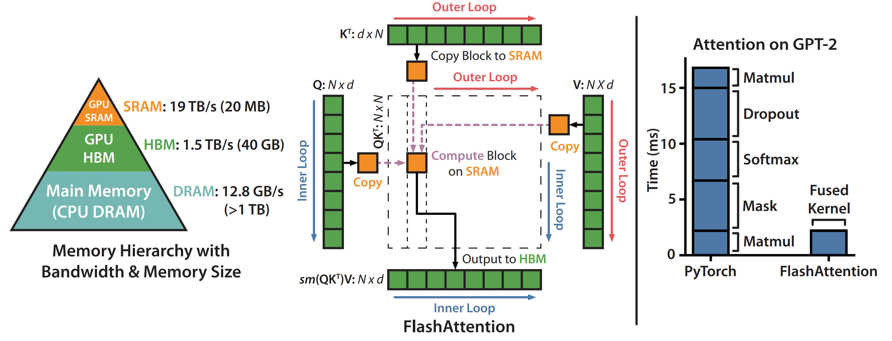

## 0. Materials

- [Paper](https://arxiv.org/pdf/2205.14135)

- [Github](https://github.com/Dao-AILab/flash-attention)

## 1. What is the paper about?

- Introduces **FlashAttention**, an IO-aware, exact self-attention algorithm that tiles the `Q`, `K`, `V` tensors so intermediate `N×N` matrices never leave on-chip **SRAM** (Shared memory), dramatically cutting reads/writes to GPU **HBM** (Global Memory).

- Achieves linear memory growth in sequence length and large wall-clock speed-ups (up to 7.6 × for the kernel, 3 × end-to-end) while preserving exact attention results.

- Extends the same idea to **Block-Sparse FlashAttention**, giving further speedups (≈2-4 ×) for very long sequences (up to 64 K tokens).

## 2. What is new compared to prior work?

- Focuses on HBM traffic rather than only FLOPs, filling a gap left by earlier approximate methods that often saved math but not wall-clock time.

- Proves an `O(N^2 * d^2 / M)` IO complexity and shows it is information-theoretically optimal for single-GPU SRAM size `M`.

- `matmul` + `mask` + `softmax` + `dropout` + `matmul` run in a single pass, eliminating kernel-launch & memory overheads.

- Keeps only `O(N)` statistics for backward, trading a few extra FLOPs for massive memory savings.

- Block-sparse generalisation that beats prior sparse/approximate attentions in both speed and memory across all tested lengths.

## 3. What experiments were run to support the arguments in this paper?

- Kernel-level benchmarks on A100 show 7.6 × speed-up and 9 × less HBM traffic than PyTorch attention (Fig. 2).

- End-to-end training:
  - **BERT-large** pre-training to **MLPerf** target in 17.4 min (15 % faster than Nvidia record).
  - **GPT-2 small/medium** on **OpenWebText**: 3.5 × faster than HuggingFace and 1.7–1.8 × faster than Megatron-LM at identical perplexity.
  - Long-Range Arena (1 K-4 K tokens): 2.4 × speed-up; block-sparse version reaches 2.8 × while matching accuracy.

- Quality with longer context:
  - **GPT-2 with 4 K context** trains 30 % faster and gets 0.7 lower perplexity than Megatron 1 K.
  - Long-document classification (**MIMIC-III**, **ECtHR**): up to 8.5 F1 improvement at 16 K tokens.
  - **Path-X** / **Path-256** maze tasks: first Transformers to beat chance—61.4 % (16 K) with dense FA, 63.1 % (64 K) with block-sparse.

- Comprehensive runtime & memory curves (Fig. 3) comparing FlashAttention to PyTorch, Megatron, Linformer, OpenAI Sparse, etc.

## 4. What are the shortcomings/limitations of this paper?

- Every new variant still requires a hand-written CUDA kernel; portability to future GPU architectures is non-trivial.

- Optimal within one GPU, but does not yet model or minimise inter-GPU traffic in distributed training.

- Focus on the attention layer only; other memory-bound modules (MLP, norms, optimizer states) remain untouched.

- Although IO is reduced, computational complexity is still `O(N2)`.

- Block sizes are picked heuristically and may need retuning for different SRAM sizes or future chips.

## 5. What is a reasonable next step to build upon this paper?

- Develop a high-level, IO-aware compiler that converts PyTorch-level attention definitions into optimised CUDA (akin to Halide for images), removing the manual kernel bottleneck.

- Generalise IO-aware design to other layers (MLP, LayerNorm, optimizer updates) to push whole-model memory traffic towards linear scaling.

- Extend to **multi-GPU & heterogeneous systems**, co-optimising on-chip SRAM, HBM and NVLink/PCIe transfers for distributed training.

- **Automate adaptive tiling** that selects block sizes at run-time based on actual SRAM availability and occupancy.

- Explore better parallel partitioning, H100 tensor-core utilisation and integrate them with sparsity or low-rank methods for further gains.

## Appendix

- **MLPerf** – A benchmark suite from the MLCommons consortium that measures how fast hardware + software stacks can train or infer a model to a target quality; results are published every six months.

- **OpenWebText** – An open-source recreation of OpenAI’s WebText corpus (the data used for GPT-2), built by scraping URLs listed in Reddit posts with high karma.

- **MIMIC-III** – A freely available, de-identified ICU database (40 K+ patients) containing vitals, meds, notes, imaging reports, etc.; widely used for clinical-NLP research.

- **ECtHR Dataset** – A corpus of European Court of Human Rights cases, annotated with the convention articles allegedly violated, supporting legal-reasoning and multi-label classification work.

- **Long-Range Arena** (LRA) – A benchmark suite from Google Research that stress-tests “efficient” Transformers on tasks with 1 K–64 K-token contexts.
  - **Path-X** – LRA sub-task: feed a 128 × 128 binary image pixel-by-pixel (≈16 K tokens) and predict whether two marked pixels are connected by a path.
  - **Path-256** – Same idea but with 256 × 256 images (≈64 K tokens), making it even longer and harder.

- **Linformer** – Attention variant that projects keys and values to a low-rank space, reducing time & memory complexity from `O(N^2)` to `O(N)`

- **Performer** – Uses random-feature kernels to approximate softmax attention and obtain linear complexity in sequence length.

- **Reformer** – Efficient Transformer that combines locality-sensitive-hashing (LSH) attention (`O(Nlog⁡N)`) with reversible residual layers to save activations.

- **SMYRF** – A sparse attention method based on asymmetric clustering that can be plugged into pre-trained models without retraining from scratch.

- **Apex FMHA** – NVIDIA Apex's "Fused Multi-Head Attention" CUDA kernels that fuse matmul + softmax to speed up standard attention
