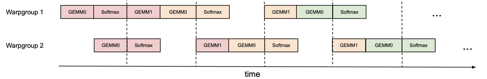
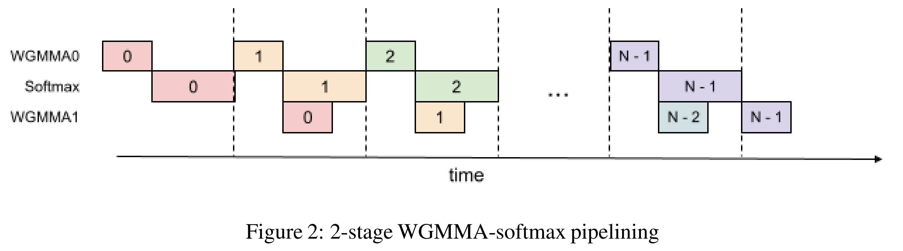

## 0. Materials

- [Paper](https://arxiv.org/pdf/2407.08608)

- [Github](https://github.com/Dao-AILab/flash-attention)

## 1. What is the paper about?

- Introduces **FlashAttention-3**, a non-approximate self-attention kernel optimised for NVIDIA Hopper GPUs.

- Exploits **asynchrony** (warp-specialised TMA loads + asynchronous WGMMA Tensor-Core matmuls) to overlap memory transfers, GEMMs and softmax.

- Adds **low-precision (FP8)** support with **block quantisation** and **"incoherent processing"** to keep accuracy while doubling raw math throughput.

- Delivers 1.5–2 × speed-up over FlashAttention-2 and up to 85 % peak utilisation on H100; FP8 version reaches ~1.3 PFLOPs/s.

## 2. What is new compared to prior work?

- Separates producer (TMA) and consumer (WGMMA) warps to fully hide load latency. Consider it as **inter-node pipeline:**

- Overlaps softmax of one block with the two GEMMs of the next, eliminating MUFU bottlenecks. Consider it as **intra-node pipeline:**

- **Register-level layout shuffles** so the FP32 accumulator of QKᵀ can be down-cast and fed directly as FP8 input to PV without extra memory traffic.

## 3. What experiments were run to support the arguments in this paper?

- **Throughput benchmarks** (BF16 & FP8, seq-length 512–16 k, head dims 64/128/256, causal & non-causal) vs. PyTorch baseline, FlashAttention-2, Triton FA-2, and cuDNN kernels. FlashAttention-3 achieves 1.5–2× speed-up and beats cuDNN for ≥ 1 k tokens.

- **Backward-pass benchmarks** showing 1.5–1.75× faster gradients than FlashAttention-2.

- **FP8 forward benchmarks** (head-dim 256) hitting 1.3 PFLOPs/s, outperforming Triton and cuDNN FP8 kernels.

- **Ablation Experiment** that removing warp-specialisation or 2-stage pipeline drops BF16 throughput from 661 → 582/570 TFLOPs/s, isolating each technique’s ~12-14 % contribution.

- **Numerical-error** test on synthetic "outlier" distributions shows FP8 FlashAttention-3 `RMSE = 9.1 e-3` vs. `2.4 e-2` for plain FP8 attention (2.6× better).

## 4. What are the shortcomings/limitations of this paper?

- **Inference-centric workloads** (tiny batch, KV-cache reuse) not yet optimised; kernels tuned for training-style large batches.

- FP8 training convergence assessed only on small synthetic tasks; full-scale LLM training stability still unverified.

- **Causal-mask short-sequence** cases sometimes still lag behind heavily hand-tuned vendor kernels.

## 5. What is a reasonable next step to build upon this paper?

- Design **inference-specific**, **persistent-kernel variants** that keep KV-cache in SMEM/registers and amortise launch overhead at small batch sizes.

- **End-to-end FP8 LLM training studies**, comparing convergence, final task quality, and energy use against BF16/FP16 baselines.

- Investigate **3-stage (or deeper) pipelines** with automated tile-size vs. register-count search to push utilisation past 85 %.

## Appendix

- **Warp-specialised TMA** – A producer/consumer kernel style where a few "producer" warps issue Tensor Memory Accelerator asynchronous loads, while the remaining "consumer" warps do compute, completely overlapping memory traffic with maths.

- **Circular SMEM buffer** – A ring of shared-memory tiles reused in round-robin fashion so new K/V blocks can be loaded while old ones are being consumed.

- `setmaxnreg` – A Hopper PTX instruction that dynamically reallocates the register budget between warp-groups, giving compute warps more registers and loaders fewer.

- **MUFU (Multi-Function Unit)** – The GPU sub-unit that executes slow ops (exp, log); it is the bottleneck for softmax relative to Tensor-Core GEMMs.

- **Block quantisation** – Low-precision scheme that stores one scale per tile (e.g., 64×d) instead of one scale per tensor, improving FP8 accuracy at negligible cost.

- **Incoherent processing** – Pre-multiplying Q and K by a random orthogonal (Hadamard-based) matrix so large outliers are "spread out" before FP8 quantisation. Key idea: `(QM)(KM)^⊤ = QK^⊤`

- **Hadamard matrix** – A ±1 orthogonal matrix that supports `O(d log d)` fast transforms and is used in incoherent processing for outlier mitigation.

- **k-major layout** – Memory layout where the innermost/contiguous dimension is K (shared width) rather than M/N; required by FP8 WGMMA operands in shared memory.

- **mn-major layout** – The conventional row-major (M-major) or column-major (N-major) ordering.

- **Register shuffle** – Using CUDA `__shfl*` instructions to permute data between threads so the FP32 accumulator pattern (Fig. 3) matches the FP8 operand pattern (Fig. 4).

- **Causal mask** – A triangular attention mask that prohibits each token from peeking at future tokens, enabling autoregressive generation. Non-causal mask for bidirectional attention.

- **Warpgroup** – Four consecutive warps (128 threads) that the Hopper scheduler can bind together for one WGMMA issue.
