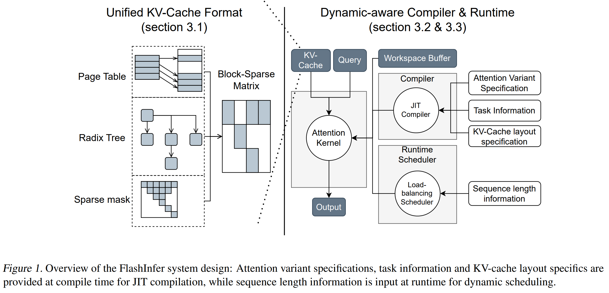

> 本博客使用`O3`翻译，如有冲突请优先参考英文原文

## 0. Materials

- [Paper](https://arxiv.org/pdf/2501.01005)

- [Github](https://github.com/flashinfer-ai/flashinfer)

## 1. 这篇论文研究什么？

- 提出 **FlashInfer**，一个 GPU 内核库与 JIT 编译器，用于加速 LLM 推理中的注意力计算。
- 将所有 KV-cache 布局（分页、基数树、树掩码等）统一表示为 **块稀疏行（Block-Sparse Row, BSR）矩阵**，实现“一套内核通吃多场景”。
- 可无缝集成到 vLLM、SGLang、MLC-Engine 等推理栈，显著降低在线延迟并提升吞吐。

## 2. 与现有工作相比有哪些新贡献？

- **统一 BSR 抽象** 将 Page-、Radix-、Tree-Attention 归一到一种数据格式。
- 通过 *gather → shared-mem → tensor-core* 管线，将 FlashAttention 2/3 扩展到 **任意列宽（甚至 1 × 16）**；而 Blocksparse/FlexAttention 需固定 16 × 16。
- 用户只需编写 Functor（Query/Key/Logits 变换、Mask 等），几分钟即可获得融合内核——**即插即用 JIT 模板**；在 Hopper GPU 上性能优于基于 Triton 的 FlexAttention。

## 3. 实验验证

- 将 FlashInfer 集成进 **SGLang**，在 Llama-3 8 B（1×H100）与 70 B（4×H100）模型上对比 Triton 后端；中位 Inter-Token Latency 降低 29–69 %，TTFT 最多提升 21 %。
- 在 A100-40 GB 与 H100-80 GB 上，对常数 / 均匀 / Zipf 长度分布测量带宽与 FLOP 利用率；FlashInfer 在偏斜批次中达到 **70–83 % 带宽**，而 FlashAttention 约为 45 %。
- 通过 JIT 生成融合 RoPE 内核（≈20 行代码）；相较未融合的 FlashAttention，延迟降低 28–30 %，带宽提升 1.6–3.7×。

## 4. 局限性

- 仅生成原生 CUDA/CUTLASS 代码，对非 NVIDIA 硬件支持受限。
- 虽规划成本可层内摊销，但生成阶段仍在 CPU 侧执行；极高 QPS 场景下 CPU 或成瓶颈。
- 基准聚焦 Llama 系列与两款数据中心 GPU（A100/H100）；对消费级 GPU、Intel/AMD 显卡或 >4 GPU 集群尚无报告。
- 主要关注 KV 稀疏；其他算子（FFN、MoE）仍依赖外部优化。

## 5. 后续可行工作

- 输出 Triton-IR、HIP 或 SYCL，以支持 AMD/Intel GPU，并与 OpenAI Triton 3 或 Mojo 编译栈整合。
- 将块稀疏抽象推广到 **FFN GEMM 与 MoE 路由**，实现端到端稀疏执行。
- 在多节点场景扩展确定性负载均衡器，结合 NVLink/InfiniBand 拓扑共同优化网络流量。

## 附录

- **Online-Softmax** —— 以增量方式维护最大值与和，在常数显存中计算 softmax，无需物化注意力矩阵。
- **Sigmoid-Attention / FlashSigmoid** —— 用按元素 sigmoid 替换 softmax，裁剪 logits。
- **RadixAttention** —— SGLang 采用基数树索引 KV 块，高效复用前缀。
- **Prefix-Caching** —— 共享提示前缀，多并发分支可复用同一 KV 前缀。
- **Ragged Tensor** —— 行长可变张量，使用指针数组而非填充。
- **Block-Sparse Row (BSR)** —— 将非零元素分组为固定块 (br×bc)，提高寄存器复用与张量核兼容性。
- **Vector-Sparsity** —— BSR 的极端形式，一维为 1（如 16 × 1），仍能使用张量核。
- **Gather → Shared-Mem → MMA** —— 先抓取稀疏列到共享内存，再用张量核指令 (MMA) 对打包数据做密集乘加。
- **Tensor Memory Accelerator (TMA)** —— Hopper 架构异步复制 tile 的硬件引擎。
- **WGMMA (WarpGroup MMA)** —— 在 64 行 tile 上执行 Warp-Grouped 矩阵乘加的 Hopper PTX 指令。
- **CTA (Cooperative Thread Array)** —— CUDA 中的 Block。
- **Stream-K** —— GPU 负载均衡方案，平均分配 tile，避免量化伪影。
- **确定性负载均衡调度器**（FlashInfer）—— 改进 Stream-K，无需原子操作即可为 CTA 分配 tile，确保结果可复现。
- **常驻内核 (Persistent Kernel)** —— 内部循环处理 tile，避免反复 relaunch，保持寄存器/共享内存“热”状态。
- **FlexAttention** —— 基于 Triton 的注意力框架，用户通过 functor 描述变体。
- **MLC-Engine** —— 基于 TVM 的跨设备推理栈。
- **Inter-Token Latency (ITL)** —— 流式推理中两个连续生成 token 之间的平均时间。
