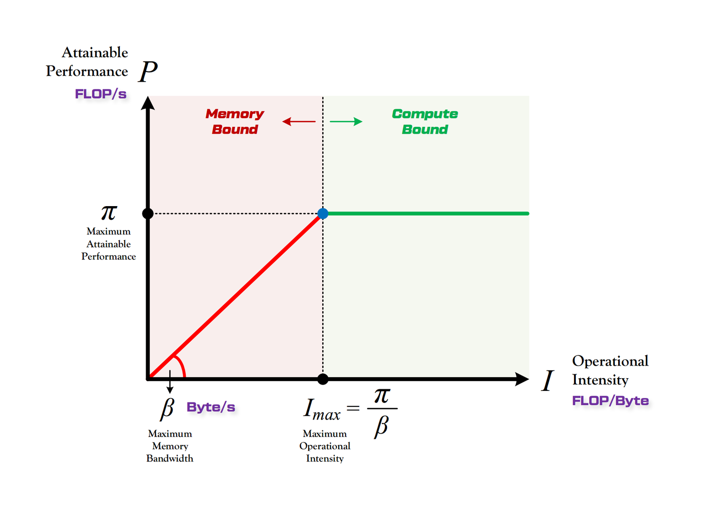

## 0. Materials

- [Paper](https://arxiv.org/pdf/2408.11743)

- [Github](https://github.com/IST-DASLab/marlin)

## 1. What is the paper about?

- Introduce **MARLIN** (Mixed-Precision Auto-Regressive LINear) kernel. Pairing 4-bit weight quantization with Ampere GPU features such as `cp.async`, **Tensor Cores** and **Sparse Tensor Cores**

- Covers **Sparse-MARLIN**, which adds **2 : 4 structured sparsity** and the `mma.sp` instruction

- Near-ideal **4 × speed-ups** up to batch 32 on an A10, ~3 × end-to-end gains in vLLM serving

## 2. What is new compared to prior work?

- Earlier 4-bit kernels hit compute limits once batch > 1; MARLIN’s multilevel pipeline (**HBM→L2→SMEM→TCU**) keeps weight loads dominant up to `batch≈50` by hiding compute behind `cp.async` prefetches

- Sparse-MARLIN rearranges 4-bit non-zeros and metadata offline so each warp issues 128-bit loads and one `ldmatrix` per four `mma.sp` calls

## 3. What experiments were run to support the arguments in this paper?

- **72 k × 18 k GEMM micro-benchmarks** on A10 vs PyTorch/CUTLASS FP16 baseline and 4 open-source 4-bit kernels across batch 1-128; MARLIN **stays within 5 % of the 3.87 × ideal until batch 32**, others collapse after batch 4

- Plotted FLOP/s vs arithmetic intensity for four matrix sizes `4 k-32 k` and batch `1-65 k`—data points hug the memory roof < 64-batch, move to compute roof > 64-batch, **matching theory (FLOP/Byte≈200)**

- **vLLM** integration on A10 for **E2E test**, with 64-in/64-out tokens—MARLIN 3 × faster TPOT, Sparse-MARLIN 3.3 ×

- Reported GPTQ INT4 and SparseGPT 2:4 INT4 **perplexity** on MMLU, ARC, WinoGrande: < 4 pp drop (INT4) and small gains after KD finetune (INT4+2:4)

## 4. What are the shortcomings/limitations of this paper?

- Optimisations heavily target NVIDIA Ampere (A10/A100); portability to Hopper, AMD or Intel GPUs is untested and non-trivial

- Only weight-only 4-bit; activations remain FP16, so memory for KV-caches and attention isn’t reduced

- ≥1024-batch prefill still ~10 % slower than FP16 due to compute limits; no further tuning shown.

## 5. What is a reasonable next step to build upon this paper?

- Add support for `W4 × A8` or `joint W3 × A4` schemes

- Re-implement core ideas using Hopper's **wgmma**, AMD matrix core intrinsics, or Intel AMX, enabling portable low-bit inference.

- Investigate whether runtime-generated 2:4 masks (e.g., from MOE sparsity) can be fused into Sparse-MARLIN’s pipeline.

## Appendix

- **RF (Register File)**: the per-SM bank of 32-bit registers that holds thread-private operands and accumulators

- **SPTC (Sparse Tensor Core)**: Ampere Tensor Cores that accelerate 2 : 4 structured-sparse matrices via the `mma.sp` instruction

- `cp.async`: an Ampere ISA instruction that issues asynchronous, non-blocking copies from global or L2 straight into SMEM, optionally bypassing L1

- `ldmatrix`: PTX instruction that loads 8/16 × 16 sub-tiles from SMEM to registers, optionally transposing them for Tensor Core consumption

- `mma.sync`: regular Tensor Core MMA operation that multiplies two 16-bit matrices and accumulates into FP32 registers in one cycle

- `mma.sp`: sparse Tensor Core instruction that multiplies a 50 % 2 : 4-sparse INT8/FP16 LHS with a dense RHS, skipping the zero lanes

- **Arithmetic Intensity**: the ratio of FLOPs to bytes moved (**FLOP/Byte = flops/s / bytes / s**), describing how many FP operations can be issued while fetching one byte

- **Roofline Model**: kernels below the roofline diagonal are memory-bound; compute bound otherwise.

- **AWQ (Activation-aware Weight Quantization)**: rescales only the 1 % most-salient channels to protect them during 4-bit rounding, avoiding mixed precision

- **joint W3 × A4**: weights are 3-bit vector-quantised and activations are 4-bit integer.

- **2 : 4 Sparsity**: hardware pattern requiring that, in every contiguous group of four values, any two must be zero, enabling 2× throughput on SPTCs
