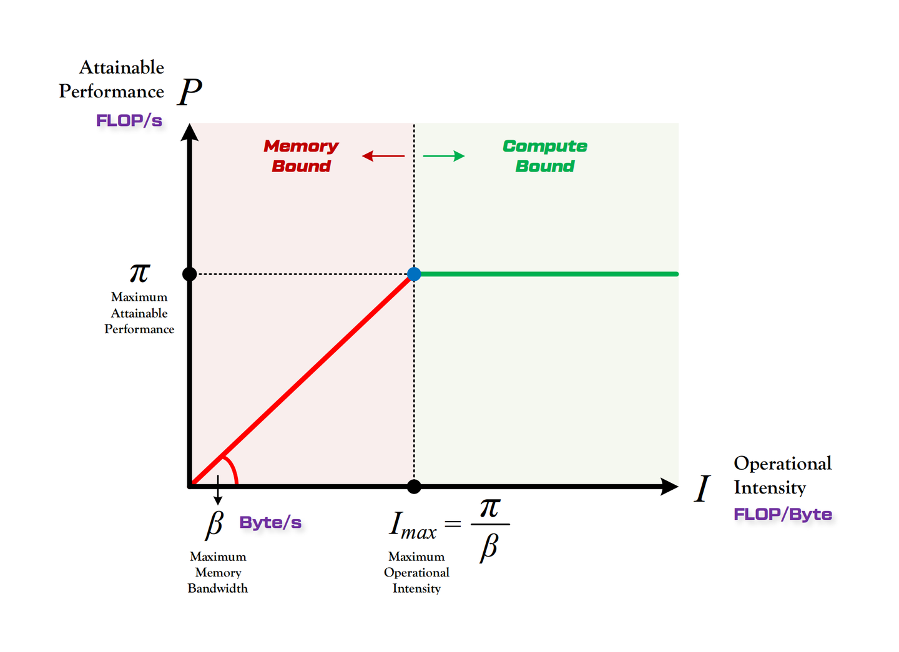

> 本博客使用`o3`翻译，如有冲突请优先参考英文原文

## 0. Materials

- [Paper](https://arxiv.org/pdf/2408.11743)

- [Github](https://github.com/IST-DASLab/marlin)

## 1. 论文主要内容

- 介绍 **MARLIN**（Mixed-Precision Auto-Regressive LINear）内核，将 4-bit 权重量化与 Ampere GPU 特性（`cp.async`、**Tensor Cores**、**Sparse Tensor Cores**）结合  
- 涵盖 **Sparse-MARLIN**，在 MARLIN 基础上加入 **2 : 4 结构化稀疏** 与 `mma.sp` 指令  
- 在 A10 上批量 32 以内实现近乎理想的 **4 × 加速**，在 vLLM 服务中端到端提升约 **3 ×**  

## 2. 相较于已有工作的创新

- 早期 4-bit 内核在 batch > 1 时受算力限制；MARLIN 的多级流水线（**HBM→L2→SMEM→TCU**）利用 `cp.async` 预取隐藏计算，使权重加载在 `batch≈50` 前始终占主导  
- Sparse-MARLIN 离线重排 4-bit 非零权重与元数据，使每个 warp 仅用一次 `ldmatrix` 即完成四次 `mma.sp`，同时发出 128-bit 加载  

## 3. 实验验证

- 在 A10 上针对 **72 k × 18 k GEMM** 进行微基准测试，比较 PyTorch/CUTLASS FP16 和 4 个开源 4-bit 内核，batch 1–128；**MARLIN 在 batch 32 内保持在理想 3.87 × 的 5 % 以内**，其余方法在 batch 4 后性能崩溃  
- 绘制 `4 k–32 k` × `1–65 k` 的 **FLOP/s–算术强度** 曲线：batch < 64 时数据点贴近内存屋脊，batch > 64 时逼近计算屋脊，**与理论 (FLOP/Byte≈200) 相符**  
- 将 **MARLIN 集成到 vLLM**，在 A10 上进行 **端到端测试**（64 in / 64 out tokens）：MARLIN 比 TPOT 快 **3 ×**，Sparse-MARLIN **3.3 ×**  
- 报告 GPTQ INT4 与 SparseGPT 2 : 4 INT4 在 MMLU、ARC、WinoGrande 上的 **困惑度**：INT4 掉点 < 4 pp，经 KD 微调后 INT4 + 2 : 4 略有提升  

## 4. 局限与不足

- 优化高度依赖 NVIDIA Ampere（A10/A100）；移植到 Hopper、AMD 或 Intel GPU 尚未验证且难度较大  
- 仅对权重做 4-bit 量化；激活仍为 FP16，KV-缓存与注意力显存占用未降低  
- ≥ 1024-batch 预填阶段仍比 FP16 慢约 10 %，且未给出进一步调优方案  

## 5. 未来工作方向

- 支持 `W4 × A8` 或 `joint W3 × A4` 量化方案  
- 借助 Hopper 的 **wgmma**、AMD 矩阵核或 Intel AMX 复现核心思想，实现跨平台低比特推理  
- 探索将运行时生成的 2 : 4 掩码（如 MOE 稀疏性）融合进 Sparse-MARLIN 流水线的可行性  

## 附录

- **RF（寄存器文件）**：每个 SM 内的 32-bit 寄存器组，用于存放线程私有操作数与累加器  
- **SPTC（Sparse Tensor Core）**：Ampere Tensor Cores，通过 `mma.sp` 加速 2 : 4 结构化稀疏矩阵  
- `cp.async`：Ampere 指令，异步、非阻塞地将数据从全局 / L2 复制到 SMEM，可绕过 L1  
- `ldmatrix`：PTX 指令，从 SMEM 加载 8/16 × 16 子 tile 至寄存器，可选转置供 Tensor Core 使用  
- `mma.sync`：常规 Tensor Core 运算，一周期内完成两矩阵相乘（FP16）并累加到 FP32  
- `mma.sp`：稀疏 Tensor Core 运算，跳过零通道，计算 50 % 2 : 4 稀疏 INT8/FP16 LHS 与密集 RHS 的乘积  
- **算术强度**：FLOP 与数据传输字节比 (**FLOP/Byte = flops/s ÷ bytes/s**)，衡量每传输 1 byte 可执行的 FP 运算量  

- **屋脊模型（Roofline Model）**：位于对角线下方表示内存受限；以上则为计算受限  
- **AWQ（Activation-aware Weight Quantization）**：仅重新缩放最显著的 1 % 通道，在 4-bit 舍入中保护其精度，避免混合精度  
- **joint W3 × A4**：权重量化至 3-bit 向量，激活量化至 4-bit 整数  
- **2 : 4 稀疏性**：硬件模式，要求每连续 4 个值中任意 2 个为 0，可在 SPTC 上实现 2 × 吞吐  
