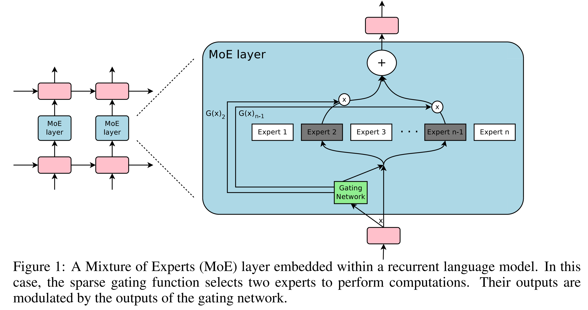

## 0. Materials

- [Paper](https://arxiv.org/pdf/1701.06538)

## 1. What is the paper about?

- Introduces a Sparsely-Gated **Mixture-of-Experts (MoE)** layer as a practical way to massively increase neural network capacity
- Demonstrates how to **achieve 1000x+ improvements** in model capacity with only minor losses in computational efficiency
- The MoE layer consists of thousands of expert networks and a trainable gating network that selects a sparse combination of experts for each input
- Applies this technique to language modeling and machine translation tasks, achieving state-of-the-art results

## 2. What is new compared to prior work?

- While conditional computation was proposed theoretically before, this is **the first to show major practical wins at scale**
- Introduces noisy **top-k gating** that keeps only k experts active per example
- Successfully trains models with **up to 137 billion parameters** in the MoE layer alone
- New soft constraint approach using importance loss and load loss to ensure balanced expert utilization

## 3. What experiments were run to support the arguments in this paper?

- 1 Billion Word Language Modeling:
  - Compared MoE models with 4 to 4096 experts against LSTM baselines
  - Showed 24% perplexity reduction with similar computational budget

- 100 Billion Word Google News Corpus:
  - Tested models with up to **131,072 experts (137 billion parameters)**
  - Showed continued improvements up to 65,536 experts (39% perplexity reduction)

- Machine Translation (Single Language Pair):

  - WMT'14 En→Fr / En->De: Achieved 40.56 BLEU higher than baseline
  - Google Production dataset: Better results with 1/6 training time

- Multilingual Machine Translation:
  - 19% lower perplexity than multilingual GNMT baseline

## 4. What are the shortcomings/limitations of this paper?

- Only tested MoE between LSTM layers; didn't explore other placements or architectures
- Actual FLOPS utilization (0.74-1.56 TFLOPS/GPU) is relatively low compared to theoretical maximum
- Requires **careful tuning of multiple loss terms** (importance and load losses) to work properly
- The top-k gating creates **"theoretically scary discontinuities"** that could potentially cause training instabilities
- Provides limited analysis of what different experts learn

## 5. What is a reasonable next step to build upon this paper?

- Apply MoE to Transformer architectures
- Investigate **dynamic k (number of active experts)** based on input complexity
- Develop better load balancing methods that don't require manual tuning
- Explore learned routing that doesn't rely on noisy gating
- Explore quantization and pruning techniques for MoE models

## Appendix

- **GNMT (Google Neural Machine Translation)**: Google's neural machine translation system that served as a baseline in this paper.

- **Hierarchical MoE**: A two-level MoE structure where a primary gating network selects groups of experts, and secondary gating networks select within groups.

- **MoE (Mixture of Experts)**: A neural network architecture where multiple expert networks are combined through a gating mechanism.

- **WMT'14**: The 2014 Workshop on Machine Translation, providing standard datasets for evaluating translation systems.
