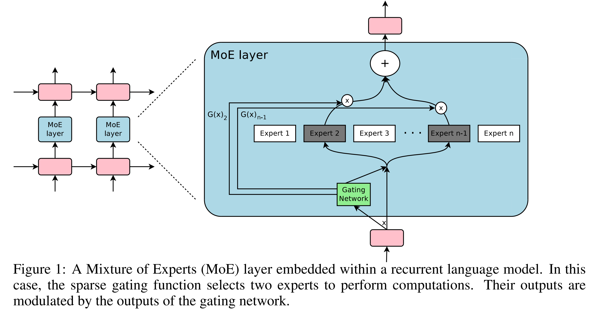

> 本博客使用`claude Opus 4`翻译，如有冲突请优先参考英文原文

## 0. Materials

- [Paper](https://arxiv.org/pdf/1701.06538)

## 1. 这篇论文讲了什么？

- 介绍了稀疏门控**专家混合（MoE）**层，作为大规模增加神经网络容量的实用方法
- 展示了如何在计算效率仅有轻微损失的情况下，**实现模型容量1000倍以上的提升**
- MoE层由数千个专家网络和一个可训练的门控网络组成，门控网络为每个输入选择专家的稀疏组合
- 将该技术应用于语言建模和机器翻译任务，取得了当时最先进的结果

## 2. 与之前工作相比有什么创新？

- 虽然条件计算在理论上早有提出，但这是**首次在大规模应用中展示重大实际收益**
- 引入了带噪声的**top-k门控**，每个样本仅激活k个专家
- 成功训练了仅MoE层就包含**高达1370亿参数**的模型
- 提出了使用重要性损失和负载损失的新型软约束方法，确保专家利用的均衡性

## 3. 论文通过哪些实验来支撑其论点？

- 10亿词语言建模：
  - 对比了包含4到4096个专家的MoE模型与LSTM基线
  - 在相似计算预算下，困惑度降低24%

- 1000亿词谷歌新闻语料库：
  - 测试了多达**131,072个专家（1370亿参数）**的模型
  - 在65,536个专家时仍有持续改进（困惑度降低39%）

- 机器翻译（单语言对）：
  - WMT'14 英→法 / 英→德：BLEU分数达到40.56，超越基线
  - 谷歌生产数据集：用1/6的训练时间取得更好结果

- 多语言机器翻译：
  - 相比多语言GNMT基线，困惑度降低19%

## 4. 这篇论文有哪些不足/局限性？

- 仅在LSTM层之间测试了MoE；未探索其他位置或架构
- 实际FLOPS利用率（0.74-1.56 TFLOPS/GPU）相对理论最大值较低
- 需要**仔细调整多个损失项**（重要性和负载损失）才能正常工作
- Top-k门控产生了**"理论上令人担忧的不连续性"**，可能导致训练不稳定
- 对不同专家学到什么内容的分析有限

## 5. 基于这篇论文的合理后续研究方向是什么？

- 将MoE应用于Transformer架构
- 研究基于输入复杂度的**动态k值（激活专家数）**
- 开发不需要手动调参的更好负载均衡方法
- 探索不依赖噪声门控的学习路由方法
- 探索MoE模型的量化和剪枝技术

## 附录

- **GNMT（谷歌神经机器翻译）**：谷歌的神经机器翻译系统，在本文中作为基线。

- **层次化MoE**：两级MoE结构，主门控网络选择专家组，次级门控网络在组内选择。

- **MoE（专家混合）**：通过门控机制组合多个专家网络的神经网络架构。

- **WMT'14**：2014年机器翻译研讨会，提供评估翻译系统的标准数据集。
