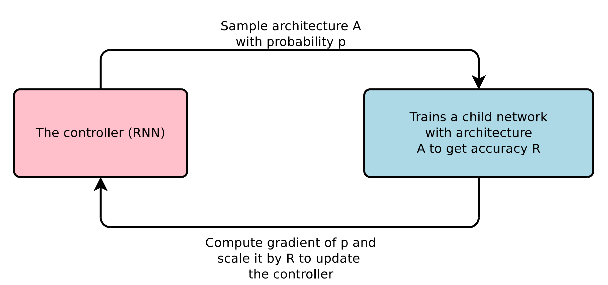

> 本博客使用`o3-mini-high`翻译，如有冲突请优先参考英文原文

## 下载论文

[论文链接](https://arxiv.org/pdf/1611.01578)

## 论文主要内容

- 本文提出了 **神经架构搜索（Neural Architecture Search，NAS）** 方法，该方法使用一个循环神经网络（RNN）作为“控制器”来自动生成神经网络架构。
- 控制器通过 **强化学习** 进行训练，将“子网络”在验证集上的准确率作为奖励信号。
- 该方法能够发现既适用于 **卷积网络**（在 CIFAR-10 数据集上）又适用于 **循环网络**（在 Penn Treebank 数据集上）的架构，这些架构的性能可以与甚至超越人工设计的模型。

---

## 与之前的工作相比，这篇论文的新颖之处

- 提出了一个 **灵活的控制器 RNN**，可以采样 **可变长度** 的架构描述，突破了传统贝叶斯优化或随机搜索中固定超参数设置的限制。
- 采用强化学习（RL）直接优化架构，使得生成的网络在验证集上取得更高准确率，而不依赖于监督信号或手工设计的启发式规则。
- 在 CIFAR-10 和 Penn Treebank 上取得了 **最先进的性能**，表明自动搜索到的架构能够与顶尖的人工设计模型竞争。

---

## 实验支持的论点

**CIFAR-10 图像分类：**

- 作者使用控制器搜索带有可选跳连接和池化层的卷积网络架构。
- 搜索到的架构经过训练和测试，其错误率优于目前主流的手工设计网络。

**Penn Treebank 语言建模：**

- 利用控制器搜索出了全新的 **循环单元** 架构（不仅限于 LSTM）。
- 搜索到的最佳单元在测试集上取得的困惑度优于之前的最先进模型。
- 此外，作者还将新单元应用于 **字符级语言模型**（仍在 PTB 上）以及 **机器翻译** 任务（在 GNMT 框架中），进一步证明了其性能提升。

---

## 本文的不足与局限

- 即便借助大规模并行资源，训练成千上万个候选架构的过程仍然 **计算成本极高**。
- 虽然搜索空间很大，但依然受限于设计选择（例如固定的卷积核尺寸、跳连接类型或循环单元结构）。
- 尽管搜索到的架构在 CIFAR-10 和 PTB 上表现优异，但 **不能保证** 它们在其他数据集或任务上的最优性。
- 搭建大规模架构搜索所需的分布式强化学习系统需要 **大量工程工作**。

---

## 后续合理的研究方向

- 探索更加高效或样本高效的搜索策略，如权重共享、早停策略或更先进的强化学习算法，以降低计算资源的消耗。
- 在保持搜索过程可控的前提下，尝试整合 **更多类型的层或操作**（例如注意力机制、动态路由等）。
- 研究如何将搜索到的架构在不同任务间进行迁移，探索通过最小化再训练来适应新任务的方法。
- 考虑在内存、延迟或功耗等约束下搜索架构，使该方法更适用于实际应用场景。

---

## 附录

- **CIFAR-10**：一个图像分类基准数据集，包含 **60,000** 张 `32×32` 彩色图像，共 **10** 个类别。
- **Penn Treebank (PTB)**：用于评估循环神经网络性能的语言建模基准数据集。
- **权重共享**：在网络的不同部分共享相同的权重，从而降低搜索过程中的计算成本。