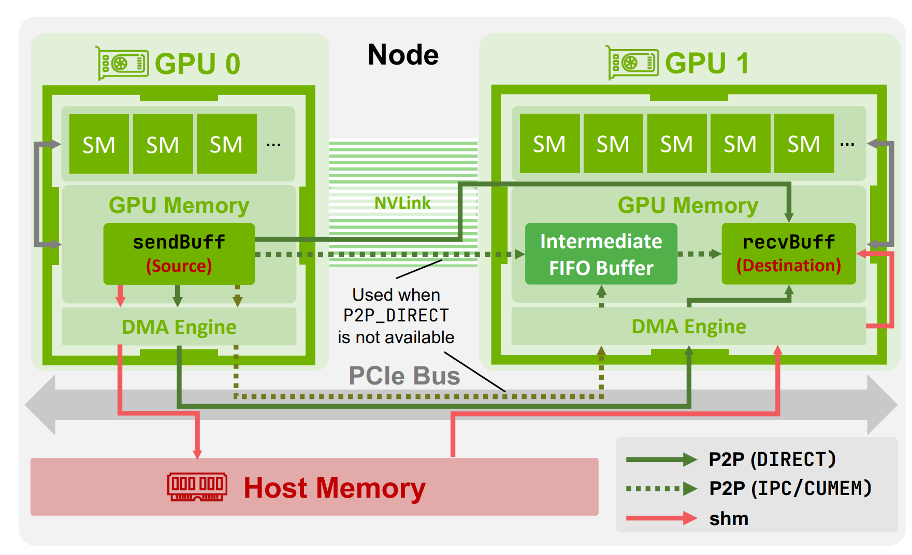
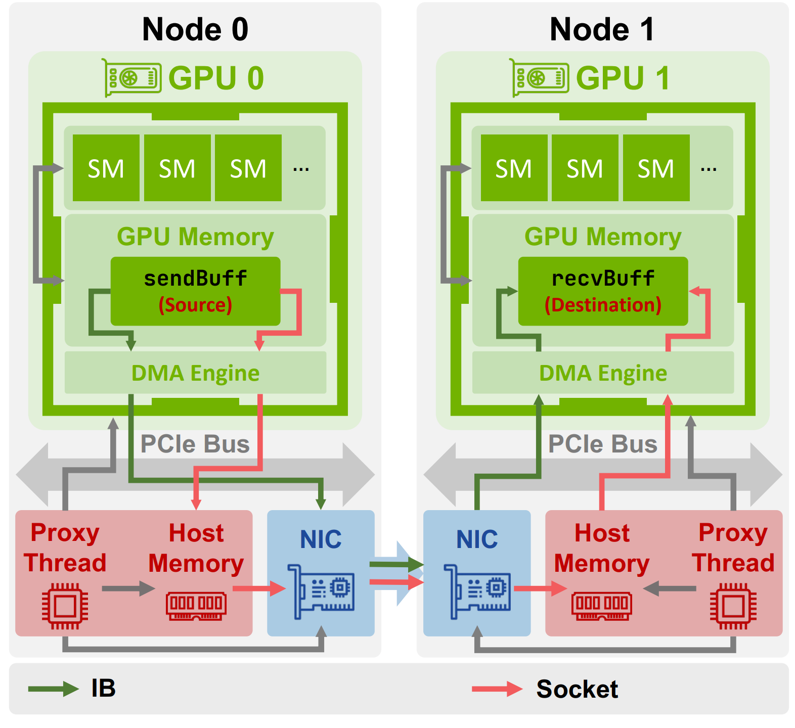
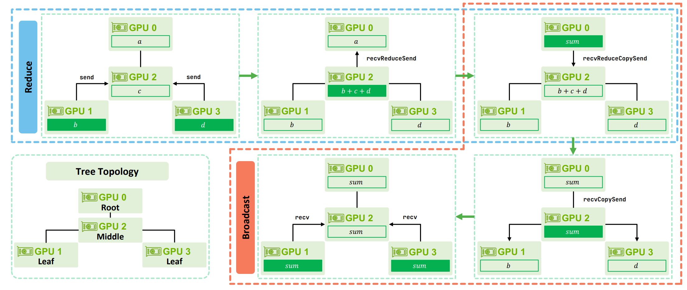

## Materials

- [Paper](https://arxiv.org/pdf/2507.04786)

- [Github](https://github.com/NVIDIA/nccl)

## 1. What is the paper about?

- Introduces **NCCL**: its communication protocols (**Simple**, **LL**, **LL128**), intra-/inter-node data paths and transports (**P2P**, **SHM**, etc.), and collective algorithms (**ring**, **tree**).

- How NCCL achieves throughput via **channels → slots → chunks** and how these pipelines map onto CUDA (**grid/block/warp**).

- Using these insights to build **ATLAHS**, an application-trace–driven simulator that reproduces NCCL behavior for large-scale AI training.

## 2. What is new about this specific paper, compared to prior work?

- Introduces fine-grained execution including **device primitives** (recvReduceSend, recvCopySend, …), **synchronization** (fences vs. flags), per-protocol buffer sizes, and per-hop latency/bandwidth trade-offs.

- Clarifies transport decisions (**P2P_DIRECT** vs **IPC/FIFO**, SHM fallbacks, GPUDirect RDMA conditions, etc).

- Provides a nice overview for intra-node data transfer

- And for inter-node data transfer

- Illustrates Tree All-reduce using good example (Note: for ring all reduce, you can take a further reading at [my previous blog](../../overview_of_distribution_training/#all-reduce-example)):

## 3. What experiments were run to support the arguments in this paper?

- Compare **Simple, LL, LL128 protocols** under **Ring and Tree algorithms**, both inter-node and intra-node. Sweep message sizes (from ≤64 KiB to GB scale) and report medians/violin plots.

- **Findings**: inter-node—LL/LL128 win for small messages, but Simple dominates at large sizes; intra-node—LL128 is consistently strong (near Simple for large, near LL for small). Ring favors large messages; Tree favors small.

## 4. What are the shortcomings/limitations of this paper?

- **CollNet/NVLS (and newer PAT)** are acknowledged but not analyzed, the main analysis centers on Ring/Tree.

- Experiments focus on GH200 (Hopper); portability of quantitative to other topologies may vary.

- Emphasis on collective micro-benchmarks (AllReduce in the main text); limited E2E  evaluations are reported.

## 5. What is a reasonable next step to build upon this paper?

- Extend the analysis to NVLS/CollNet/SHARP and PAT, including their protocol pairings and hardware constraints.

- Broaden validation across more fabrics and topologies (PCIe Gen5, NDR/HDR IB, RoCE), and larger scales.

- Cover richer patterns (e.g., all-to-all/MoE, mixture of collectives) and integrate with real E2E performance studies.

## Appendix

- **PCIe Gen5**: The 5th-gen Peripheral Component Interconnect Express, offering 32 GT/s per lane to attach GPUs/NICs/CPUs with far higher host-device bandwidth than Gen4.

- **HDR/NDR InfiniBand**: High-speed InfiniBand generations (HDR≈200 Gb/s, NDR≈400 Gb/s per link) providing low-latency RDMA networking.

- **RoCE**: RDMA over Converged Ethernet: RDMA semantics carried over Ethernet (typically RoCEv2/UDP/IP).

- **NIC**: Network Interface Card; the adapter that executes RDMA/verbs operations and moves data over the network.

- **Grace Hopper (GH200)**: NVIDIA CPU+GPU "superchip" pairing Grace CPU with Hopper GPU via high-bandwidth NVLink-C2C.

- **GPUDirect P2P**: Intra-node direct GPU-to-GPU memory access over NVLink/PCIe without staging in host memory.

- **GPUDirect RDMA** (GDR/GDRDMA): Allows an RDMA-capable NIC to DMA directly to/from GPU memory, bypassing host memory.

- **SHM**: NCCL's shared-host-memory path that stages data in DRAM when P2P is unavailable or sub-optimal.

- **QP (Queue Pair)**: A send/receive queue pair used by RDMA

- **NVLS (NVLink SHARP)**: NVSwitch-based in-network reduction inside a node, optionally combined with CollNet across nodes.

- **CollNet**: NCCL algorithms that leverage in-network compute (e.g., SHARP) to offload parts of collectives to switches.

- **PAT (Parallel Aggregated Trees)**: A newer NCCL algorithm family that builds multiple trees to boost parallelism.

- **Channel**: A per-operation parallel lane mapped 1:1 to a CUDA block to split work across SMs.

- **Slot (NCCL_STEPS)**: Fixed segments inside a channel buffer that advance in a circular pipeline to overlap compute and transfer.

- **Chunk**: The per-step data unit processed in one elementary step and placed into a slot.

- **RCCL / oneCCL / Gloo**: Collective communication libraries from AMD, Intel, and Meta respectively; alternatives to NCCL.
