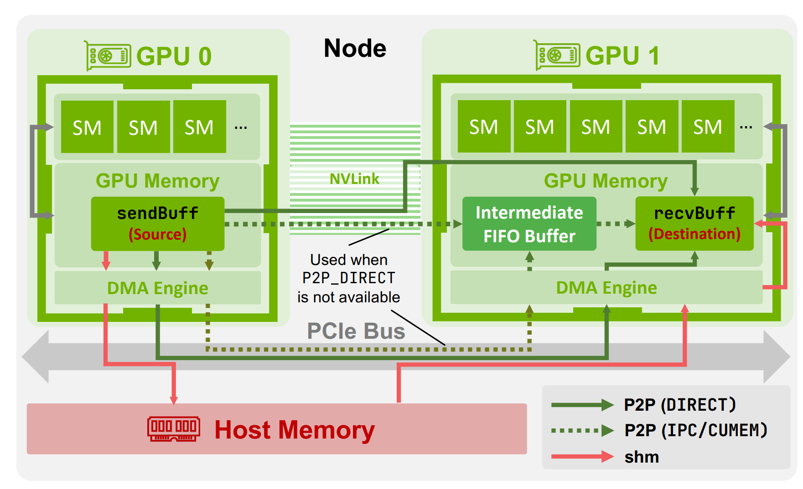
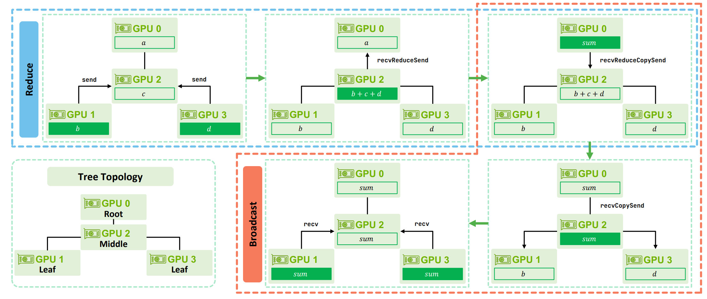

> 本博客使用`GPT-5`翻译，如有冲突请优先参考英文原文

## Materials

- [Paper](https://arxiv.org/pdf/2507.04786)

- [Github](https://github.com/NVIDIA/nccl)

---

## 1. 这篇论文主要讲什么？

- 介绍 **NCCL**：其通信协议（**Simple**、**LL**、**LL128**）、节点内/节点间的数据路径与传输方式（**P2P**、**SHM** 等），以及集合通信算法（**ring**、**tree**）。

- 解释 NCCL 如何通过 **channel → slot → chunk** 的流水线提升吞吐，并说明这些流水线如何映射到 CUDA（**grid/block/warp**）。

- 利用上述洞见构建 **ATLAHS**：一种由应用跟踪驱动的模拟器，可在大规模 AI 训练中复现 NCCL 的行为。

## 2. 相比既有工作，这篇论文有哪些新意？

- 引入更细粒度的执行视角，包括**设备原语**（recvReduceSend、recvCopySend 等）、**同步机制**（栅栏 vs. 标志，fences vs. flags）、按协议划分的缓冲区大小，以及逐跳（per-hop）**延迟/带宽**权衡。

- 澄清传输路径的决策依据（**P2P\_DIRECT** 与 **IPC/FIFO** 的取舍、**SHM** 的回退策略、**GPUDirect RDMA** 的启用条件等）。

- 提供了节点内/节点间数据传输的清晰总览

- 通过示例直观说明**树形 All-Reduce（全规约）**（注：关于**环形 All-Reduce**，可参见[我之前的博客](../../overview_of_distribution_training/#all-reduce-example)）：

## 3. 为支撑论点，论文做了哪些实验？

- 在**环形**与**树形**两种算法下，对比 **Simple、LL、LL128** 在**节点间**与**节点内**的表现；横跨消息大小（从 ≤64 KiB 到 GB 级），报告中位数与小提琴图。

- **发现**：
  节点间——小消息 **LL/LL128** 更优，大消息 **Simple** 占优；
  节点内——**LL128** 一直表现强劲（大消息接近 **Simple**，小消息接近 **LL**）。
  **环形**更适合大消息；**树形**更适合小消息。

## 4. 这篇论文有哪些不足/局限？

- 提及 **CollNet/NVLS**（以及较新的 **PAT**），但未展开分析；主体仍聚焦于**环/树**。

- 实验主要基于 **GH200（Hopper）**；定量结论在其他拓扑与平台上的可移植性可能有所差异。

- 更偏重集合通信**微基准**（正文以 **All-Reduce** 为主）；\*\*端到端（E2E）\*\*评估相对有限。

## 5. 基于本文，哪些是合理的下一步工作？

- 将分析扩展到 **NVLS/CollNet/SHARP** 与 **PAT**，覆盖其协议组合与硬件约束。

- 在更多互连与拓扑上拓展验证（**PCIe Gen5**、**HDR/NDR InfiniBand**、**RoCE**），并扩大规模。

- 覆盖更丰富的通信模式（如 **all-to-all/MoE**、多种集合通信的混合），并结合真实的 **E2E** 性能研究。

## 附录

- **PCIe Gen5**：第五代外围组件高速互连，每通道 32 GT/s；用于连接 GPU/NIC/CPU，相比 Gen4 提供更高的主机—设备带宽。

- **HDR/NDR InfiniBand**：高速 InfiniBand 代际（HDR≈200 Gb/s，NDR≈400 Gb/s），提供低延迟的 RDMA 网络。

- **RoCE**：基于以太网的 RDMA（通常为 RoCEv2/UDP/IP）。

- **NIC**：网络接口卡；执行 RDMA/verbs 操作并在网络上传输数据的适配器。

- **Grace Hopper（GH200）**：NVIDIA 的 CPU+GPU“超级芯片”，通过高带宽 **NVLink-C2C** 连接 Grace CPU 与 Hopper GPU。

- **GPUDirect P2P**：节点内直接的 GPU-GPU 内存访问，经 **NVLink/PCIe**，无需在主存中转。

- **GPUDirect RDMA（GDR/GDRDMA）**：允许具备 RDMA 能力的 NIC 直接对 GPU 内存进行 DMA，绕过主存。

- **SHM**：NCCL 的共享主存路径；当 P2P 不可用或不理想时将数据暂存于 DRAM。

- **QP（Queue Pair）**：RDMA 使用的发送/接收**队列对**。

- **NVLS（NVLink SHARP）**：节点内基于 **NVSwitch** 的网络内归约，可与 **CollNet** 跨节点组合。

- **CollNet**：NCCL 的算法族，利用网络内计算（如 **SHARP**）将部分集合通信卸载至交换机。

- **PAT（Parallel Aggregated Trees）**：较新的 NCCL 算法族，通过构建多棵并行树提升并行度。

- **Channel**（通道）：每次操作的并行通道，**与一个 CUDA block 一一对应**，用于在 SM 之间划分工作。

- **Slot（NCCL\_STEPS，槽）**：通道缓冲区内的固定分段，以环形流水线推进以重叠计算与传输。

- **Chunk（块）**：每一步处理的数据单元，放入某个 slot 中。

- **RCCL / oneCCL / Gloo**：分别由 AMD、Intel 与 Meta 提供的集合通信库，可作为 NCCL 的替代方案。
