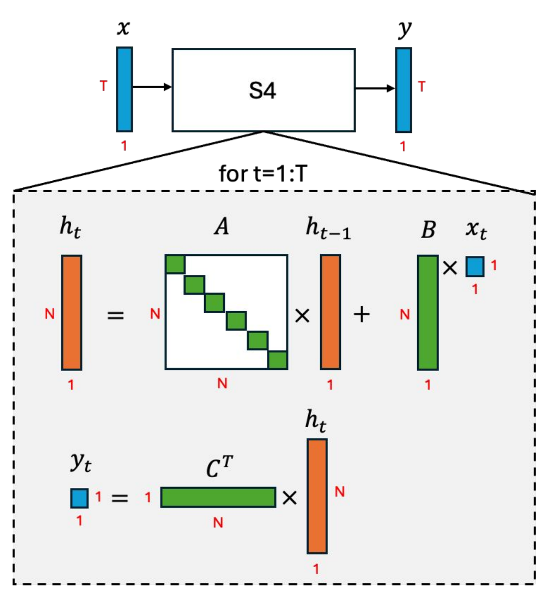

> 本博客使用`GPT-5`翻译，如有冲突请优先参考英文原文

## Materials

- [Paper](https://arxiv.org/pdf/2111.00396)

- [Github](https://github.com/state-spaces/s4)

## 1. 论文讲了什么？

（类 RNN 视角）

- 提出 **S4（Structured State Space Sequence Model）**，让状态空间模型（SSM）在超长序列上可行且高效。

- 统一 SSM 的三种视角——**连续时间**、**递归（类 RNN）** 与 **卷积**，并展示如何以高效且稳定的方式计算。

- 通过基于 HiPPO 的状态矩阵来处理**长程依赖（LRD）**，同时实现**近线性**的时间与内存复杂度。

## 2. 与以往工作的主要区别是什么？

- **NPLR 参数化** 将 HiPPO 矩阵分解为 **正规 + 低秩**（$A = V\Lambda V^* - P Q^*$），便于进行条件良好的对角化。

- 通过**频域核**使用**截断生成函数**（引理 C.3）来计算 SSM 的卷积核。

- 利用 **Woodbury**（算法 1：第 3 步）与 **Cauchy 降维**（算法 1：第 2 步）处理低秩修正，把问题规模降到近线性。

## 3. 为支撑论文结论做了哪些实验？

- 相比 LSSL，S4 训练**最高快约 30×**，**显存减少约 400×**；速度/显存与 Performer/Linear Transformer 相当。

- 在 Long Range Arena（LRA）的**全部 6 个任务**上取得 **SOTA**，包括**解决 Path-X（长度 16,384）**，此前模型均失败。

- 原始 16k 采样点的语音分类（SC10）达到 **98.3%** 准确率。

- **WikiText-103 上困惑度 20.95**，并带来**约 60×** 的生成提速。

- 消融实验（CIFAR-10，≤100K 参数）显示仅用 **随机 NPLR** 不足，**HiPPO+NPLR**（完整 S4）效果最佳。

## 4. 论文的不足/限制是什么？

- 依赖特制算子（Cauchy 乘法、FFT、NPLR 机制）；实现与优化比标准卷积/注意力更困难。

- 虽表现强劲，但在大规模语言建模上 **尚未超越顶级 Transformer**。

- 多数视觉实验将图像视为一维序列处理；缺乏原生二维归纳偏置，在某些视觉任务上可能次优。

- 状态维度（N）、步长与 HiPPO 变体等仍**高度依赖超参数**；缺乏自动选择的明确指引。

## 5. 合理的后续研究方向？

- 将 S4 与**局部/全局注意力**或卷积结合，构建**混合模型**。

- 采用现代训练范式在语言/音频上**预训练更大的 S4 主干**，检验其在大规模下的竞争力。

- 设计面向视觉、视频与时空预测的 **2D/ND SSM 核**（避免展平）。

- 为 **Cauchy** 运算与长上下文解码的内存高效递归**优化 GPU/TPU 实现**。

## 附录

- **SSM（状态空间模型）**：一种线性动力系统，使用隐藏状态 `x_t` 以及矩阵 A、B、C（与可选的 D）将输入 `u_t` 映射为输出 `y_t`。

- **HiPPO**：一族特殊结构的（A）矩阵，能够以可证明的方式压缩并跟踪近期历史，为 SSM 提供强大的长程记忆。

- **Path-X**：LRA 中最困难的任务，需要在展平的图像（长度 16,384）上进行推理以判断两个标记是否连通。
