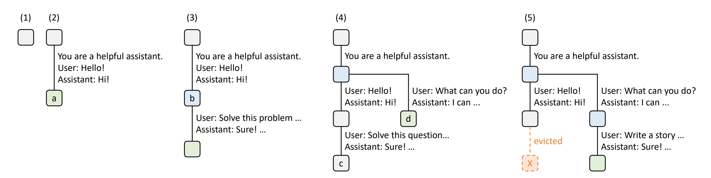
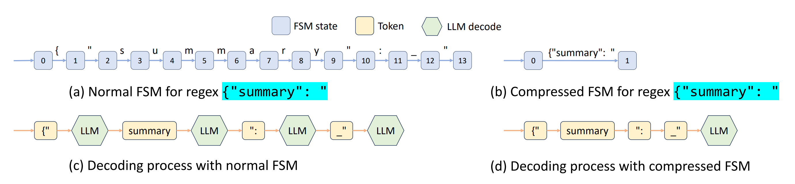

## Materials

- [Paper](https://arxiv.org/pdf/2312.07104)

- [Github](https://github.com/sgl-project/sglang)

## 1. What is the paper about?

Proposes **SGLang**, a Python-embedded DSL and efficiently execute multi-call, structured LLM workflows.

Key runtime ideas: **RadixAttention** for KV-cache reuse, **compressed finite-state machine (cFSM)** for fast constrained (e.g., JSON/regex) decoding, and **API speculative execution** for black-box endpoints.

## 2. What is new about this specific paper, compared to prior work?

- Treats the KV cache as a **tree-based LRU cache (radix tree)** with **cache-aware scheduling** and frontend/runtime co-design; authors argue this is the first solution supporting multi-level sharing, LRU eviction, co-scheduling, and distributed cases.

- Prior engines (e.g., **vLLM/PagedAttentio**n) do memory paging and simple prefix reuse but not tree-structured, multi-level reuse with LRU and scheduling.

- Other reuse lines (e.g., **PromptCache**, **ChunkAttention**) explore modular or prefix-aware reuse, but either risk accuracy drops or focus on kernel-level changes rather than an integrated cache+scheduler+language design.

- Introduces a **compressed FSM** so multiple tokens along deterministic paths are decoded in one pass—speeding up constrained decoding beyond token-by-token masking in prior systems.

## 3. What experiments were run to support the arguments in this paper?

- Up to **6.4×** higher throughput and **3.7×** lower latency across MMLU, HellaSwag, ReAct/Generative agents, Tree-/Skeleton-of-Thought, JSON decoding, multi-turn chat, and a DSPy RAG pipeline.

- Similar gains on Mixtral-8×7B and Llama-70B.

- Big throughput gains on LLaVA-v1.5-7B (image) and LLaVA-NeXT-34B (video); e.g., 0.18 → 1.15 image/s and 0.02 → 0.10 frame/s.

- **Ablations** show that each component (tree cache, scheduling, frontend hints/parallelism) contributes; cFSM yields ~1.6× throughput in JSON decoding.

## 4. What are the shortcomings/limitations of this paper?

- The paper only **compares to an earlier vLLM version**. Results may shift as baselines evolve.

- For cFSM, the appendix flags potential probability distortion for some regex choices—an accuracy concern to study further.

## 5. What is a reasonable next step to build upon this paper?

- Adapt RadixAttention across **memory tiers** (DRAM/disk), add **fuzzy semantic matching**, fix possible **starvation** in cache-aware scheduling, and strengthen the **compiler** for static planning.

- Harden support for multimodal workflows and compare against newer KV-reuse baselines (e.g., updated vLLM, ChunkAttention) under identical settings.

## Appendix

- **Radix tree**: a space-optimized trie whose edges can store sequences (not just single symbols), enabling efficient prefix search and insertion.

- **Structured decoding**: generation under hard constraints (e.g., regex/CFG) by masking invalid tokens

- **Fuzzy semantic matching** — an informal term for matching by meaning rather than exact text (e.g., vector/embedding similarity) and tolerating surface mismatch, often used in RAG-style retrieval.
