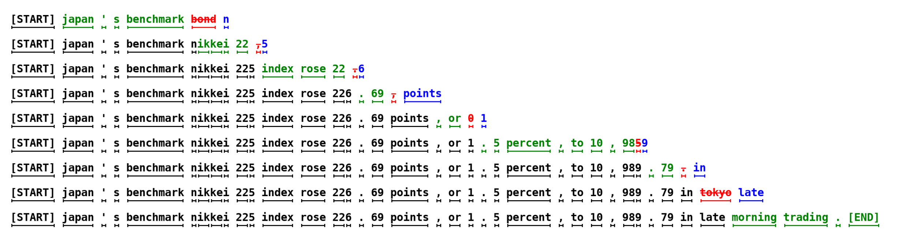

## 0. Materials

- [Paper](https://arxiv.org/pdf/2211.17192)

- [Github](https://github.com/feifeibear/LLMSpeculativeSampling)

## 1. What is the paper about?

- It introduces **speculative decoding**, a method to accelerate inference in large auto-regressive models.

- It leverages **speculative execution** to generate multiple candidate tokens in parallel using a more efficient approximation model, reducing the number of serial model evaluations.

- It guarantees **identical output distributions** to standard decoding, offering speedup without requiring changes to the model architecture or retraining.

## 2. What is new compared to prior work?

- It **does not require** architecture changes or retraining, which differentiates it from prior methods like **adaptive computation**, **distillation**, or **model pruning**.

- It allows for faster **parallel execution** and guarantees identical output distributions, unlike previous approaches (e.g., **Wisdom of Committees**, **Blockwise Parallel Decoding**, and **Shallow Aggressive Decoding**) that either sacrifice output quality or need additional training.

## 3. What experiments were run to support the arguments in this paper?

- The authors tested **T5-XXL (11B)** on two tasks:

  - English-to-German Translation (fine-tuned on WMT EnDe)
  - Text Summarization (fine-tuned on CCN/DM)

- Experiments involved different approximation models (T5-small, T5-base, and T5-large).

- Walltime improvements were measured with **TPU-v4** on a batch size of 1 using both **argmax sampling** (temperature 0) and **standard sampling** (temperature 1).

- Observed **speedups of 2.6X to 3.4X** on the translation task and **2.3X to 3.1X** on the summarization task.

## 4. What are the shortcomings/limitations of this paper?

- It increases **arithmetic operations** due to higher concurrency, which may not be beneficial in setups where **computation resources are limited**.

- While it works well with existing models, there are potential **trade-offs** in operation complexity and resource usage that need to be carefully considered depending on the task and available hardware.

- **Exploration in non-text domains** (e.g., images) was not covered in this paper, limiting the scope of the method's general applicability.

## 5. What is a reasonable next step to build upon this paper?

- Investigate the compatibility of speculative decoding with **beam search** to explore its potential for tasks that require multiple candidate generation (Appendix A.4).

- Explore **dynamic adjustment of γ during inference** to optimize the number of guesses based on the real-time performance of the model.

- Extend the application to **other domains**, such as image generation or reinforcement learning.

- Experiment with **training approximation models** specifically to improve α (acceptance rate) for greater efficiency.

## Appendix

1. **Wisdom of Committees**: A model ensemble approach that combines the outputs of multiple independently trained models to improve prediction accuracy and efficiency.

2. **Blockwise Parallel Decoding**: A parallel decoding strategy that simultaneously predicts multiple future time steps in autoregressive models and then reverts to the longest validated prefix for verification, accelerating the generation process.

3. **Shallow Aggressive Decoding (SAD)**: A decoding method that improves inference efficiency by aggressively decoding as many tokens as possible in parallel on a shallow decoder, suitable for tasks like grammatical error correction.

4. **Adaptive Computation**: A method that dynamically adjusts the allocation of computational resources in a model based on the complexity of the input to improve efficiency.
