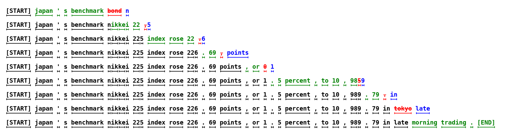

> 本博客使用`o3`翻译，如有冲突请优先参考英文原文

## 0. Materials

- [Paper](https://arxiv.org/pdf/2211.17192)

- [Github](https://github.com/feifeibear/LLMSpeculativeSampling)

## 1. 论文的内容是什么？

- 本文介绍了**推测性解码**（speculative decoding），一种加速大规模自回归模型推理的方法。

- 该方法利用**推测性执行**（speculative execution），通过使用更高效的近似模型并行生成多个候选token，从而减少模型评估的串行次数。

- 它保证**输出分布与标准解码一致**，在不需要改变模型架构或重训练的情况下提供加速。

## 2. 相较于之前的工作，有什么创新？

- 该方法**不需要**更改架构或重新训练，这使其与之前的**自适应计算**、**蒸馏**或**模型剪枝**等方法有所不同。

- 它允许更快速的**并行执行**，并且保证输出分布与标准解码一致，而不像以前的方法（例如**智慧委员会**、**块级并行解码**和**浅层激进解码**）那样牺牲输出质量或需要额外的训练。

## 3. 本文支持论点的实验是什么？

- 作者在两个任务上测试了**T5-XXL (11B)** 模型：
  - 英文到德文的翻译（在WMT EnDe上微调）
  - 文本摘要（在CCN/DM上微调）

- 实验使用了不同的近似模型（T5-small、T5-base和T5-large）。

- 通过在**TPU-v4**上进行的批处理大小为1的实验，分别使用**argmax采样**（温度为0）和**标准采样**（温度为1）来测量推理时间的改进。

- 在翻译任务上，观察到**2.6倍到3.4倍**的加速效果，在摘要任务上观察到**2.3倍到3.1倍**的加速效果。

## 4. 论文的不足/局限性是什么？

- 由于提高了并发性，该方法增加了**算术操作**，在计算资源有限的环境下可能不适用。

- 尽管在现有模型中表现良好，但在操作复杂性和资源使用方面可能存在**权衡**，需要根据任务和硬件资源来谨慎考虑。

- 本文没有涉及在**非文本领域**（如图像生成等）的探索，这限制了该方法的通用性。

## 5. 基于本文，合理的下一步研究方向是什么？

- 探索推测性解码与\*\*束搜索（beam search）\*\*的兼容性，以研究其在需要生成多个候选的任务中的潜力（见附录A.4）。

- 探索**在推理过程中动态调整γ值**，根据模型的实时性能优化猜测的数量。

- 将该方法的应用扩展到**其他领域**，如图像生成或强化学习等。

- 尝试**训练专门的近似模型**，特别是针对提高α（接受率）以提高效率。

## 附录

1. **智慧委员会（Wisdom of Committees）**：一种模型集成方法，通过组合多个独立训练的模型的输出，来提高预测准确性和效率。

2. **块级并行解码（Blockwise Parallel Decoding）**：一种并行解码策略，在自回归模型中同时预测多个未来时间步的输出，然后回退到最长的已验证前缀进行验证，从而加速生成过程。

3. **浅层激进解码（Shallow Aggressive Decoding，SAD）**：一种解码方法，通过在浅层解码器上并行解码尽可能多的标记来提高推理效率，适用于语法错误修正等任务。

4. **自适应计算（Adaptive Computation）**：一种方法，根据输入的复杂性动态调整模型中计算资源的分配，以提高效率。
