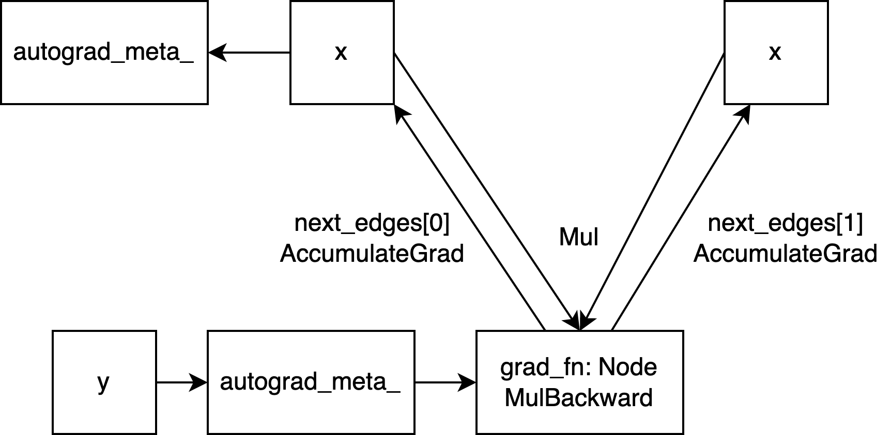

## Backward Propagation, `y.backward()`

### Python Layer `Tensor.backward` Encapsulation

When we call `tensor.backward()`, it does not directly call the C++ layer, but does some processing in the Python layer.

```py
# torch/_tensor.py
class Tensor(torch._C._TensorBase):
    def backward(
        self, gradient=None, retain_graph=None, create_graph=False, inputs=None
    ):
      r"""
      Args:
          gradient (Tensor or None): grad_output, if not passed, can be considered as 1
          retain_graph (bool, optional): Whether to retain the computation graph, it is generally not necessary to set this
          create_graph (bool, optional): Whether to create a computation graph for derivatives to compute higher-order derivatives, we will explain this parameter with an example below
          inputs (sequence of Tensor): Only computes the gradients of specified inputs, the gradients of other tensors (even if they are leaf nodes) will be ignored
        """

      # ...
        torch.autograd.backward(
            self, gradient, retain_graph, create_graph, inputs=inputs
        )

# torch/autograd/__init__.py
def backward(
    tensors: _TensorOrTensors,
    grad_tensors: Optional[_TensorOrTensors] = None,
    retain_graph: Optional[bool] = None,
    create_graph: bool = False,
    grad_variables: Optional[_TensorOrTensors] = None,
    inputs: Optional[_TensorOrTensors] = None,
) -> None:
    # ...
    if retain_graph is None:
        retain_graph = create_graph

    Variable._execution_engine.run_backward(
        tensors, grad_tensors_, retain_graph, create_graph, inputs,
        allow_unreachable=True, accumulate_grad=True)
```

The `create_graph` parameter is used to indicate whether to create a computation graph for derivatives to compute higher-order derivatives, for example:

```py
import torch

x = torch.tensor([3.0], requires_grad=True)
y = x * x
y.backward(create_graph=True)
print(x.grad)   # tensor([6.])

# Calculate the second derivative on a new computation graph
grad1 = x.grad.clone() 
# x.grad.zero_()  # Clear the gradient of x
grad1.backward()

# y = x^2, the result of the second derivative is 2
# Depending on whether the gradient of x is cleared, the result is either tensor([2.]) or tensor([8.])
print(x.grad)
```

### Parsing Python Parameters, Calling `Engine::execute`

Then it runs to `python_engine.cpp`, parses the Python parameters, and breaks them down into data structures required by C++ internal functions.

```c++
// torch/csrc/autograd/python_engine.cpp
PyObject* THPEngine_run_backward(
    PyObject* self,
    PyObject* args,
    PyObject* kwargs) {

  bool backward_api_called = accumulate_grad;
  // ...

  edge_list roots;
  roots.reserve(num_tensors);
  variable_list grads;
  grads.reserve(num_tensors);
  // Store params in `edge_list roots` and `variable_list grads`
  for (const auto i : c10::irange(num_tensors)) {
    PyObject* _tensor = PyTuple_GET_ITEM(tensors, i);
    // ...
    const auto& variable = THPVariable_Unpack(_tensor);
    auto gradient_edge = torch::autograd::impl::gradient_edge(variable);
    // ...
    roots.push_back(std::move(gradient_edge));

    PyObject* grad = PyTuple_GET_ITEM(grad_tensors, i);
    if (THPVariable_Check(grad)) {
      const Variable& grad_var = THPVariable_Unpack(grad);
      // ...
      grads.push_back(grad_var);
    }
    // If inputs are specified during backward (only compute the gradients of these inputs), collect output edges
    std::vector<Edge> output_edges;
    if (inputs != nullptr) {
      // ...
    }

    variable_list outputs;
    {
      pybind11::gil_scoped_release no_gil;
      // torch::autograd::Engine
      auto& engine = python::PythonEngine::get_python_engine();
      outputs = engine.execute(
          roots,
          grads,
          keep_graph,
          create_graph,
          accumulate_grad,
          output_edges);
    }

    // If inputs are specified and accumulate_grad is false, generate return values and return
    if (!backward_api_called && inputs != nullptr) {
      // ...
      return py_outputs.release();
    } else {
      Py_RETURN_NONE;
    }
    // ...
  }
}
```

Note `auto gradient_edge = torch::autograd::impl::gradient_edge(variable);`, here the `grad_fn` of the variable is `MulBackward0`, `output_nr` is 0 (you can get it with `set_history` in the previous section), then this new edge is added to `edge_list roots`.

```c++
Edge gradient_edge(const Variable& self) {
  if (const auto& gradient = self.grad_fn()) {
    return Edge(gradient, self.output_nr());
  } else {
    return Edge(grad_accumulator(self), 0);
  }
}
```

After preparing the parameters, call `Engine::execute()` to formally execute the backward.

### Preparing `graph_task`, Calculating Dependency Count

```c++
// torch/csrc/autograd/engine.cpp
auto Engine::execute(
    const edge_list& root_edges,
    const variable_list& inputs,
    bool keep_graph,
    bool create_graph,
    bool accumulate_grad,
    const edge_list& outputs) -> variable_list {
  // ...

  // Initialize a thread local queue on the CPU, or reuse an existing queue
  init_local_ready_queue();
  // not_reentrant_backward_call marks whether the current backward propagation is a reentry call
  // Reentry calls refer to new backward propagation tasks that start before the current task ends due to certain operations (such as hooks or custom autograd functions).
  bool not_reentrant_backward_call = worker_device == NO_DEVICE;

  // Use a vector to store root nodes
  c10::SmallVector<Node*, 4> temp_roots{root_edges.size()};
  for (const auto i : c10::irange(root_edges.size())) {
    temp_roots[i] = root_edges[i].function.get();
  }

  // GraphTask contains metadata required by backward
  auto graph_task = std::make_shared<GraphTask>(
      /* keep_graph */ keep_graph,
      /* create_graph */ create_graph,
      /* depth */ not_reentrant_backward_call ? 0 : total_depth + 1,
      /* cpu_ready_queue */ local_ready_queue,
      /* graph_roots */ std::move(temp_roots));
  
  // If there is only one root node, there is no need to create an additional root node
  // In the context of this article, the root node here is `torch::autograd::generated::MulBackward0`
  bool skip_dummy_node = root_edges.size() == 1;
  auto graph_root = skip_dummy_node
      ? root_edges.at(0).function
      : std::make_shared<GraphRoot>(root_edges, inputs);

  // Iterate over and retrieve the smallest topo_nr from outputs
  // (here outputs are the inputs parameter passed in from the Python layer `backward`),
  // if outputs are empty, then min_topo_nr is 0 here.
  auto min_topo_nr = compute_min_topological_nr(outputs);
  compute_dependencies(graph_root.get(), *graph_task, min_topo_nr);
  if (!outputs.empty()) {
    graph_task->init_to_execute(
        *graph_root, outputs, accumulate_grad, min_topo_nr);
  }

  if (skip_dummy_node) {
    InputBuffer input_buffer(root_edges.at(0).function->num_inputs());
    // Here input is the gradient parameter passed in by backward, if not passed by user, the default is tensor([1.])
    auto input = inputs.at(0);
    // In PyTorch, a stream is an independent task queue where tasks are executed in the order they are added
    const auto input_stream = InputMetadata(input).stream();
    // Try to get the CUDA stream of the root node (if there is one), if not, it is still a CPU stream
    const auto opt_next_stream =
        root_edges.at(0).function->stream(c10::DeviceType::CUDA);
    input_buffer.add(
        root_edges.at(0).input_nr,
        std::move(input),
        input_stream,
        opt_next_stream);

    execute_with_graph_task(
        graph_task, std::move(graph_root), std::move(input_buffer));
  } else {
    execute_with_graph_task(
        graph_task, std::move(graph_root), InputBuffer(variable_list()));
  }
  // Block until the overall result of graph_task is complete
  auto& fut = graph_task->future_result_;
  fut->wait();
  graph_task->warning_handler_.replay_warnings();
  return fut->value().toTensorVector();
}
```

Among them, `compute_dependencies` is quite important. It is used to calculate the number of dependencies of each node that needs gradients, and to build the `task.nodes_in_graph_` data structure, which facilitates the execution of backward.

Here, the number of dependencies and `evaluate_function` in the following sections can be looked at together for a better understanding: for the next that needs to be executed, if a node points to it during construction, its dependency is increased; when the node pointing to it has completed execution, its dependency is reduced by 1. If the number of dependencies decreases to 0, it means that this next is ready to be executed.

```c++
// torch/csrc/autograd/engine.cpp
auto Engine::compute_dependencies(
    Node* root,
    GraphTask& task,
    uint64_t min_topo_nr) -> void {

  // ...
  std::vector<Node*> queue{root};
  auto& dependencies = task.dependencies_;
  while (!queue.empty()) {
    auto fn = queue.back();
    queue.pop_back();
    if (fn->topological_nr() < min_topo_nr) {
      // For example, we passed an output with a topo_nr of 2 and calculated that min_topo_nr=2
      // It indicates that the output we need to calculate is at a distance of 2 from the leaf node
      // According to the previous description of topo_nr in this article (i.e., the minimum distance to any leaf node)
      // We can skip nodes with a topo_nr less than 2 and no longer consider calculating their gradients
      continue;
    }
    // ...
    // task.nodes_in_graph_ is an `unordered_set`
    // Here is to add the next function to be run to the set in order, and add dependencies
    for (const auto& edge : fn->next_edges()) {
      if (auto next_ptr = edge.function.get()) {
        dependencies[next_ptr] += 1;
        const bool was_inserted = task.nodes_in_graph_.insert(next_ptr).second;
        if (was_inserted)
          queue.push_back(next_ptr);
      }
    }
  }
  // ...
}
```

### Execute graph_task: `execute_with_graph_task` and the `thread_main` Loop

After preparing the dependencies and the required stream, `execute_with_graph_task` is executed.

```c++
// torch/csrc/autograd/engine.cpp
c10::intrusive_ptr<at::ivalue::Future> Engine::execute_with_graph_task(
    const std::shared_ptr<GraphTask>& graph_task,
    std::shared_ptr<Node> graph_root,
    InputBuffer&& input_buffer) {
  // Use `c10::call_once` to call `Engine::start_device_threads`, initialize the thread pool, and start multithreading
  // Each child thread will initialize an empty graph task, and then execute the `thread_main` function
  initialize_device_threads_pool();

  std::unique_lock<std::mutex> lock(graph_task->mutex_);

  // For the CPU, each graph task has a separate queue, while all CUDA tasks share the ready queue
  auto queue = ready_queue(graph_task->cpu_ready_queue_, input_buffer.device());

  if (worker_device == NO_DEVICE) {
    // This is a CPU thread, non-reentrant call
    set_device(CPU_DEVICE);
    graph_task->owner_ = worker_device;

    // Now all non-thread-safe fields have been correctly initialized and can be put into the queue (std::priority_queue)
    // `push` will also call the condition_variable not_empty_ to wake up other threads to execute tasks
    queue->push(
        NodeTask(graph_task, std::move(graph_root), std::move(input_buffer)));

    lock.unlock();
    thread_main(graph_task);
    TORCH_INTERNAL_ASSERT(graph_task->future_result_->completed());
    // Reset the worker_device to its initial state
    // There is no need to reset `local_ready_queue` because it can be reused each time call backward is called
    worker_device = NO_DEVICE;
  } else {
    // The device has been set, such as CPU, CUDA, etc., which means that this is a reentrant call
    graph_task->owner_ = worker_device;

    queue->push(
        NodeTask(graph_task, std::move(graph_root), std::move(input_buffer)));

    if (current_depth >= max_recursion_depth_) {
      // Reach the maximum depth, start a new thread
      add_thread_pool_task(graph_task);
    } else {
      // The number of reentrant calls of all threads
      ++total_depth;
      // The number of reentrant calls of the current thread
      ++current_depth;
      lock.unlock();
      thread_main(graph_task);
      --current_depth;
      --total_depth;
      TORCH_INTERNAL_ASSERT(graph_task->future_result_->completed());
    }
  }
  return graph_task->future_result_;
}
```

In the `execute_with_graph_task` function, PyTorch initializes many child threads to execute the `thread_main` function, and the main thread also executes the `thread_main` function until all the tasks in the queue are completed. Then the child thread puts a dummy task into the queue. When the main thread accepts it, it exits, and the `execute_with_graph_task` function is completed.

The `thread_main` function itself is a block loop, which will continuously execute tasks until the graph_task is marked as completed.

```c++
// torch/csrc/autograd/engine.cpp
auto Engine::thread_main(const std::shared_ptr<GraphTask>& graph_task) -> void {
  TORCH_INTERNAL_ASSERT(local_ready_queue != nullptr);
  while (graph_task == nullptr || !graph_task->future_result_->completed()) {
    std::shared_ptr<GraphTask> local_graph_task;
    {
      // A scope is divided here because NodeTask can be completely destroyed and all space released after this block
      NodeTask task = local_ready_queue->pop();
      if (task.isShutdownTask_) {
        C10_LOG_API_USAGE_ONCE("torch.autograd.thread_shutdown");
        break;
      }

      // `task.base_` is `std::weak_ptr<GraphTask>`, the lock() method tries to create a `std::shared_ptr<GraphTask>`
      // If the graphtask object has been destroyed, it returns an empty nullptr and skips this task
      if (!(local_graph_task = task.base_.lock())) {
        continue;
      }

      set_device(worker_device);

      // has_error_ is a `std::atomic_bool` value, when any thread meets an error, 
      // set this variable and let all other threads exit
      if (task.fn_ && !local_graph_task->has_error_.load()) {
        // RAII guard, save the tls and warning state, and restore the previous state after this block of code is executed
        at::ThreadLocalStateGuard tls_guard(local_graph_task->thread_locals_);
        c10::WarningUtils::WarningHandlerGuard warnings_guard(
            &local_graph_task->warning_handler_);
        try {
          // The function of the guard is the same as above, saving the current_graph_task state
          GraphTaskGuard guard(local_graph_task);
          NodeGuard ndguard(task.fn_);
          {
            // ...
            evaluate_function(
                local_graph_task,
                task.fn_.get(),
                task.inputs_,
                local_graph_task->cpu_ready_queue_);
          }
        } catch (std::exception& e) {
          thread_on_exception(local_graph_task, task.fn_, e);
        }
      }
    }

    // The content is detailed below...
  }
}
```

### `call_function` and Hooks

The above calls `evaluate_function`, then calls `call_function`. `call_function` will call the operator that actually performs the backward operation and invoke various hooks.

hooks include:

- `call_tensor_pre_hooks`
- `call_pre_hooks`
- `call_post_hooks`

```c++
// torch/csrc/autograd/engine.cpp
void Engine::evaluate_function(
    std::shared_ptr<GraphTask>& graph_task,
    Node* func,
    InputBuffer& inputs,
    const std::shared_ptr<ReadyQueue>& cpu_ready_queue) {
  // Try to get the CUDA stream, if the device is CPU, it's empty.
  // The guard can restore the original stream when it is destructed.
  const auto opt_parent_stream = (*func).stream(c10::DeviceType::CUDA);
  c10::OptionalStreamGuard parent_stream_guard{opt_parent_stream};

  // If exec_info_ is not empty, some additional operations such as pre-hook will be performed,
  // and whether to execute backward is determined based on the `need` variable.
  // There are also some deprecated capture hooks
  // (capturing variable usage, but now that tensor hooks have been introduced, it is unnecessary)
  auto& exec_info_ = graph_task->exec_info_;
  if (!exec_info_.empty()) {
    // ...
  }

  // The actual place to call the backward function, including the call to pre/post hooks
  auto outputs = call_function(graph_task, func, inputs);

  // The content is detailed below...
}

static variable_list call_function(
    std::shared_ptr<GraphTask>& graph_task,
    Node* func,
    InputBuffer& inputBuffer) {
  CheckpointValidGuard cpvguard(graph_task);
  auto& fn = *func;
  // calls tensor prehook
  auto inputs =
      call_tensor_pre_hooks(fn, InputBuffer::variables(std::move(inputBuffer)));
  // calls fn prehook
  inputs = call_pre_hooks(fn, std::move(inputs));
  if (!graph_task->keep_graph_) {
    // if keep_graph_ not set, release variables
    fn.will_release_variables();
  }

  const auto has_post_hooks = !fn.post_hooks().empty();
  variable_list outputs;

  if (has_post_hooks) {
    // This is a shallow copy, making the reference count +1
    auto inputs_copy = inputs;
    outputs = fn(std::move(inputs_copy));
  } else {
    outputs = fn(std::move(inputs));
  }

  // ...
  // finally calls post_hooks and returns
  if (has_post_hooks) {
    return call_post_hooks(fn, std::move(outputs), inputs);
  }
  return outputs;
}
```

### Execution of Backward: `MulBackward0::apply`

`fn()` dispatches to the actual place where backward is executed, such as `MulBackward0::apply`, where gradient computation is performed.

```c++
// torch/csrc/autograd/generated/Functions.cpp
variable_list MulBackward0::apply(variable_list&& grads) {
  std::lock_guard<std::mutex> lock(mutex_);

  IndexRangeGenerator gen;
  auto self_ix = gen.range(1);    // {0, 1}
  auto other_ix = gen.range(1);   // {1, 2}
  variable_list grad_inputs(gen.size());    // output: 2
  const auto& grad = grads[0];
  // Variables `other_`, `self_` declared by MulBackward0 Node structure
  // unpack() retrieves or generates variables based on saved variables.
  // In addition, operations such as version checking are also performed here
  auto other = other_.unpack();   
  auto self = self_.unpack();
  bool any_grad_defined = any_variable_defined(grads);
  if (task_should_compute_output({ other_ix })) {
    // uses self to calculate other's grad
    auto grad_result = any_grad_defined ? (mul_tensor_backward(grad, self, other_scalar_type)) : Tensor();
    // equals to grad_inputs[1] = grad_result
    copy_range(grad_inputs, other_ix, grad_result);
  }
  if (task_should_compute_output({ self_ix })) {
    // use `other` to calculate self's grad
    auto grad_result = any_grad_defined ? (mul_tensor_backward(grad, other, self_scalar_type)) : Tensor();
    // equals to grad_inputs[0] = grad_result
    copy_range(grad_inputs, self_ix, grad_result);
  }
  return grad_inputs;
}

// torch/csrc/autograd/FunctionsManual.cpp
template <typename T>
Tensor mul_tensor_backward(Tensor grad, T other, ScalarType self_st) {
  // `conj` is a complex number interface, if no complex numbers it simply returns `this`
  auto out = grad * other.conj();
  return handle_r_to_c(self_st, std::move(out));
}
```

### `evaluate_function` with Dependency Check and `readyQueue`

After `fn` is executed, the `grad` result has been computed. We return to `evaluate_function` to check the dependencies and push `next` into the `readyQueue`.

```c++
// torch/csrc/autograd/engine.cpp
void Engine::evaluate_function(
    std::shared_ptr<GraphTask>& graph_task,
    Node* func,
    InputBuffer& inputs,
    const std::shared_ptr<ReadyQueue>& cpu_ready_queue) {

  auto outputs = call_function(graph_task, func, inputs);

  // The content is detailed above...

  auto& fn = *func;
  if (!graph_task->keep_graph_) {
    // If `retain` is not set, release irrelevant variables
    // for `mul`, this means the intermediate values of `other_`, `self_`
    fn.release_variables();
  }

  int num_outputs = outputs.size();
  if (num_outputs == 0) { 
    // ...
    return;
  }

  // AnomalyMode mode to check `nan`
  if (AnomalyMode::is_enabled() && AnomalyMode::should_check_nan()) {
    // ...
  }

  std::lock_guard<std::mutex> lock(graph_task->mutex_);
  for (const auto i : c10::irange(num_outputs)) {
    auto& output = outputs[i];
    const auto& next = fn.next_edge(i);

    if (!next.is_valid())
      continue;

    bool is_ready = false;
    auto& dependencies = graph_task->dependencies_;
    auto it = dependencies.find(next.function.get());

    if (it == dependencies.end()) {
      // Check whether `next` has been built with dependencies in `graph_task`, and if not, an error is reported
      auto name = next.function->name();
      throw std::runtime_error(std::string("dependency not found for ") + name);
    } else if (--it->second == 0) {
      // If it is in `dependencies`, its number of dependencies will decrease by 1,
      // and if the number of dependencies becomes 0 after decreasing, it will be removed from `dependencies`
      // Mark `is_ready` as true, indicating that it is ready to be executed
      dependencies.erase(it);
      is_ready = true;
    }

    auto& not_ready = graph_task->not_ready_;
    auto not_ready_it = not_ready.find(next.function.get());
    if (not_ready_it == not_ready.end()) {
      // If `next` is not in `not_ready` (a `std::unordered_map`),
      // create `InputBuffer` and add it to `readyQueue` or `not_ready` map based on `is_ready` variable
      // ...
      InputBuffer input_buffer(next.function->num_inputs());
      const auto opt_next_stream = next.function->stream(c10::DeviceType::CUDA);
      input_buffer.add(
          next.input_nr, std::move(output), opt_parent_stream, opt_next_stream);
      if (is_ready) {
        auto queue = ready_queue(cpu_ready_queue, input_buffer.device());
        queue->push(
            NodeTask(graph_task, next.function, std::move(input_buffer)));
      } else {
        not_ready.emplace(next.function.get(), std::move(input_buffer));
      }
    } else {
      // If it is in `not_ready`, there must be `input_buffer` (having gone through the above branch once)
      auto& input_buffer = not_ready_it->second;
      const auto opt_next_stream = next.function->stream(c10::DeviceType::CUDA);
      input_buffer.add(
          next.input_nr, std::move(output), opt_parent_stream, opt_next_stream);
      if (is_ready) {
        auto queue = ready_queue(cpu_ready_queue, input_buffer.device());
        queue->push(
            NodeTask(graph_task, next.function, std::move(input_buffer)));
        not_ready.erase(not_ready_it);
      }
    }
  }
}
```

We also introduce the data structure of the task queue **ReadyQueue**:

```c++
// torch/csrc/autograd/engine.h
struct ReadyQueue {
 private:
  // Return true when `t2` should be executed before `t1`
  // Tasks that are closed are considered first, followed by empty node tasks
  struct CompareNodeTaskTime {
    bool operator()(NodeTask const& t1, NodeTask const& t2) {
      if (t2.isShutdownTask_) {
        return true;
      } else if (!t1.fn_ || t1.isShutdownTask_) {
        return false;
      } else if (!t2.fn_) {
        return true;
      } else if (t1.getReentrantDepth() == t2.getReentrantDepth()) {
        return t1.fn_->sequence_nr() < t2.fn_->sequence_nr();
      } else {
        return t1.getReentrantDepth() < t2.getReentrantDepth();
      }
    }
  };

  // Wake up the threads waiting for the `readyQueue`
  std::condition_variable not_empty_;
  // Lock for reading and writing `heap_`
  mutable std::mutex mutex_;
  // `priority_queue`: essentially a heap
  std::priority_queue<NodeTask, std::vector<NodeTask>, CompareNodeTaskTime> heap_;

 public:
  void push(NodeTask item, bool incrementOutstandingTasks = true);
  void pushShutdownTask();
  NodeTask pop();
  bool empty() const;
  size_t size() const;
};
```

In `readyQueue`, a `std::priority_queue` (essentially a heap) is used as the data storage container, and the task priority is compared using `CompareNodeTaskTime`.

When comparing, tasks that have been closed and empty tasks (which are processed quickly to free up space) are prioritized. Then tasks with shallower depth and larger `sequence_number` are selected.

### Execution of Backward: `AccumulateGrad::apply`

After `mul_backward` is executed, we add `AccumulateGrad` to the execution queue (this is because `AccumulateGrad` is the `next_edge` of `mul_backward`, if you don't understand, you can refer to the previous **forward** section), and after a similar scheduling process, finally execute `AccumulateGrad::apply` to accumulate gradients.

```c++
// torch/csrc/autograd/functions/accumulate_grad.cpp
auto AccumulateGrad::apply(variable_list&& grads) -> variable_list {
  // ...
  at::Tensor new_grad = std::move(grads[0]);

  // Here `variable` is our tensor parameter `self/other`, which was saved during the forward process
  at::Tensor& grad = variable.mutable_grad();
  accumulateGrad(
      variable,
      grad,
      new_grad,
      1 + !post_hooks().empty() /* num_expected_refs */,
      [&grad](at::Tensor&& grad_update) { grad = std::move(grad_update); });

  return variable_list();
}

struct TORCH_API AccumulateGrad : public Node {
  template <typename T>
  static void accumulateGrad(
      const Variable& variable,
      at::Tensor& variable_grad,
      const at::Tensor& new_grad,
      size_t num_expected_refs,
      const T& update_grad) {
    if (!variable_grad.defined()) {
      // ...
      update_grad(new_grad.detach());
    } else if (!GradMode::is_enabled()) {
      // ...
    } else {
      at::Tensor result;
      // ...
      result = variable_grad + new_grad;
      update_grad(std::move(result));
    }
  }
}
```

The logic of `accumulateGrad` is that if the tensor `variable_grad` is not defined, it is directly moved and assigned. If it is defined, accumulation is performed.

### Task Execution Complete, Marking and Cleaning Work

After processing, we return to the `thread_main` loop and repeat until all tasks are processed and the `thread_main` loop ends.

At the end of `thread_main`, some marking and cleaning work will be called, such as

```c++
auto Engine::thread_main(const std::shared_ptr<GraphTask>& graph_task) -> void {

  // The content is detailed above...

  --local_graph_task->outstanding_tasks_;

  if (local_graph_task->completed()) {
    // Exit if `local_graph_task->outstanding_tasks_` is 0 or there is an error

    // Mark the task as complete, unlock operations, etc.
    local_graph_task->mark_as_completed_and_run_post_processing();

    auto base_owner = local_graph_task->owner_;
    // Put a dummy task into the queue to ensure that the owner thread is in an awakened state
    if (worker_device != base_owner) {
      std::atomic_thread_fence(std::memory_order_release);
      ready_queue_by_index(local_graph_task->cpu_ready_queue_, base_owner)
          ->push(NodeTask(local_graph_task, nullptr, InputBuffer(0)));
    }
  }
}
```

Then return to `Engine::execute`, and then all the way back to the beginning of `python_engine.cpp`. The full process of `tensor.backward()` call is completed.

## Get grad value: `print(x.grad)`

Here, `x.grad` is called to directly get the grad property of the tensor. For the properties of the tensor, PyTorch gets them through **getter**.

```c++
template <typename T>
struct GetterBase {
  static PyObject* getter(THPVariable* self, void* /*unused*/) {
    // ...
    return THPVariable_Wrap(T::fn(THPVariable_Unpack(self)));
  }
};
```

Here `T` is `PropertyGrad`, `THPVariable_Unpack` parses the Python object, and `THPVariable_Wrap` encapsulates the C++ tensor class into the Python tensor class.

Then the `fn` method is called, and the `grad()` method is called:

```c++
// torch/csrc/autograd/python_variable.cpp
struct PropertyGrad : GetterBase<PropertyGrad> {
  static constexpr const char* name = "grad";
  static Tensor fn(const Tensor& t) {
    return t.grad();
  }
};

// aten/src/ATen/templates/TensorBody.h
class TORCH_API Tensor: public TensorBase {
  const Tensor& grad() const {
    const Tensor& maybe_grad = impl_->grad();
    // ...
    return maybe_grad;
  }
}
```

Then it calls the `grad()` method of `impl_`, and then calls the `grad()` method of `autograd_meta_` to directly get the grad variable.

```c++
// c10/core/TensorImpl.cpp
const at::Tensor& TensorImpl::grad() const {
  // if `autograd_meta_` is not set, return undefined tensor
  if (!autograd_meta_)
    return impl::GetAutogradMetaFactory()->undefined_tensor();
  return autograd_meta_->grad();
}

// torch/csrc/autograd/variable.h
struct TORCH_API AutogradMeta : public c10::AutogradMetaInterface {
  const Variable& grad() const override {
    return grad_;
  }
}
```

## Summary and Review

The whole process of autograd mainly consists of three steps:

1. Create tensor with `requires_grad=True`
2. Forward computation, construct computation graph
3. Backward derivation, accumulate gradients

For the example in this article (mul), the entire computation graph can be represented by the following figure:



In the forward computation, we introduced how to create **grad_fn**, **edge**, and construct the computation graph, and mentioned concepts related to **dispatch** and **structure kernel**.

During the backward derivation, we introduced the details of engine running: starting multithreading, constructing **graph_task**, `thread_main` loop, dependency check, **task queue**, etc., and deeply explored how **accumulateGrad** performs accumulation.

Hope this article can help you understand the underlying operation mechanism of PyTorch's autograd!

## Refference

- [pytorch](https://github.com/pytorch/pytorch)
