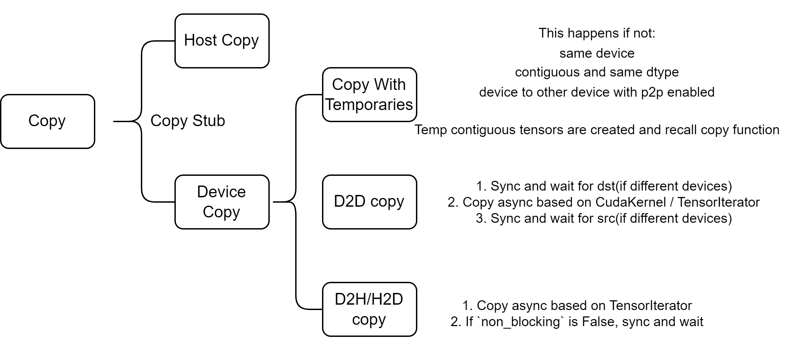

## Summary

这篇文章主要介绍了 PyTorch 设备 copy的细节，包含D2H/H2D和D2D（在同一设备与不同设备上）等内容。

---
以下内容为机器翻译

---

## 0. 引言

PyTorch中主要有两种类型的复制操作：

- 主机内复制：主机到主机（cpu到cpu）
- 设备上复制：包括D2H/H2D/D2D等

我们已经在[深入探究连续性](../deep_dive_into_contiguous_3/)中介绍了H2H的机制。

在本文中，我们将主要关注设备上的复制操作。

## 1. 复制入口

所有类型复制操作的入口点位于`Copy.cpp`中。

```c++
// aten/src/ATen/native/Copy.cpp
static Tensor & copy_impl(Tensor & self, const Tensor & src, bool non_blocking) {
  // ...

  if (self.is_same(src)) {
    return self;
  }

  // 如果self和src是同一数据的视图，则提前退出
  const bool is_same_data = (
      self.is_alias_of(src) &&
      self.storage_offset() == src.storage_offset() &&
      self.strides().equals(src.strides()) &&
      self.sizes().equals(src.sizes()) &&
      self.scalar_type() == src.scalar_type() &&
      self.is_conj() == src.is_conj() &&
      self.is_neg() == src.is_neg()
    );
  if (is_same_data) {
    return self;
  }

  auto iter = TensorIteratorConfig()
    .add_output(self)
    .add_input(src)
    .resize_outputs(false)
    .check_all_same_dtype(false)
    .check_all_same_device(false)
    .build();

  if (iter.numel() == 0) {
    return self;
  }

  DeviceType device_type = iter.device_type(0);
  if (iter.device_type(1) == kCUDA) {
    device_type = kCUDA;
  } else if (iter.device_type(1) == kHIP) {
    device_type = kHIP;
  } else if (iter.device_type(1) == kMPS) {
    device_type = kMPS;
  }

  // ...
  copy_stub(device_type, iter, non_blocking);
  return self;
}
```

在构建了**TensorIterator**之后，会调用`copy_stub`函数：

```c++
// aten/src/ATen/native/DispatchStub.h
template <typename rT, typename T, typename... Args>
struct DispatchStub<rT (*)(Args...), T> {
public:
  template <typename... ArgTypes>
  rT operator()(DeviceType device_type, ArgTypes&&... args) {
    FnPtr call_ptr = get_call_ptr(device_type);
    return (*call_ptr)(std::forward<ArgTypes>(args)...);
  }
}
```

注意，通过**DispatchStub**注册的内核（`call_ptr`）是在`Copy.cpp`和`Copy.h`中声明的。

```c++
// aten/src/ATen/native/Copy.cpp
DEFINE_DISPATCH(copy_stub);   // struct copy_stub copy_stub;

// torch/include/ATen/native/Copy.h
DECLARE_DISPATCH(copy_fn, copy_stub);
/* `DECLARE_DISPATCH`扩展为:
struct copy_stub : DispatchStub<copy_fn, copy_stub> {
  copy_stub() = default;
  copy_stub(const copy_stub&) = delete;
  copy_stub& operator=(const copy_stub&) = delete;
};
extern __attribute__((__visibility__("default"))) struct copy_stub copy_stub
*/
```

此外，内核是针对特定设备注册的：

```c++
// 对于CPU内核
// aten/src/ATen/native/cpu/CopyKernel.cpp
REGISTER_DISPATCH(copy_stub, &copy_kernel);

// 对于Cuda内核
// aten/src/ATen/native/cuda/Copy.cu
REGISTER_DISPATCH(copy_stub, &copy_kernel_cuda);
// 扩展为: static RegisterCUDADispatch<struct copy_stub> copy_stub__register(copy_stub, &copy_kernel_cuda);

// torch/include/ATen/native/DispatchStub.h
template <typename DispatchStub>
struct RegisterCUDADispatch {
  RegisterCUDADispatch(DispatchStub &stub, typename DispatchStub::FnPtr value) {
    stub.set_cuda_dispatch_ptr(value);
  }
};
```

## 2. 设备上的复制

分派后，将执行`copy_kernel_cuda`函数：

```c++
// aten/src/ATen/native/cuda/Copy.cu
static void copy_kernel_cuda(TensorIterator& iter, bool non_blocking) {
  AT_ASSERT(iter.ntensors() == 2);

  Device dst_device = iter.device(0);
  Device src_device = iter.device(1);

  //

 启用设备间的p2p访问。
  bool p2p_enabled = maybe_enable_p2p_access(dst_device, src_device);

  if (copy_requires_temporaries(iter, p2p_enabled)) {
    // ...
    return;
  }

  // 在GPU上（或GPU间）复制
  if (dst_device.is_cuda() && src_device.is_cuda()) {
    copy_device_to_device(iter, non_blocking, p2p_enabled);
    return;
  }

  // CPU和GPU间复制
  // ...
}
```

这个过程大致可以分为三个独特的部分：

- 使用临时变量的复制
- 如果**P2P**（Peer-to-Peer，指一块GPU直接访问另一块GPU的内存）启用，则在GPU上或GPU间复制
- CPU和GPU间复制，这不需要使用临时变量

### 2.1 使用临时变量的复制

如果满足以下条件，我们不需要考虑使用临时变量：

- **同一设备复制**：不需要临时变量。
- **连续且相同Dtype复制**：不需要临时变量。
- **设备到设备复制且P2P启用**：不需要临时变量。

在其他情况下，`copy_requires_temporaries`返回`True`，我们会使用临时连续张量来进行复制。

```c++
// aten/src/ATen/native/cuda/Copy.cu
static void copy_kernel_cuda(TensorIterator& iter, bool non_blocking) {
  // ...
  if (copy_requires_temporaries(iter, p2p_enabled)) {
    auto& dst = iter.tensor(0);
    Tensor dst_contig;
    Tensor src_contig;

    if (iter.device_type(0) == kCUDA || non_blocking) {
      // if分支：在cuda中或non_blocking设置

      // 如果dst是连续的，则使用dst，否则使用一个空的连续张量
      dst_contig = dst.is_contiguous() ? dst : at::empty_like(dst, LEGACY_CONTIGUOUS_MEMORY_FORMAT);
      // src与dst具有相同的dtype和形状，是连续的
      src_contig = iter.tensor(1).to(iter.dtype(0)).expand_as(dst).contiguous();
    } else {
      // else分支：不在cuda中且non_blocking为假

      bool same_type = iter.dtype(0) == iter.dtype(1);
      // 如果dst是连续的且与src具有相同的dtype，则使用dst
      dst_contig = (dst.is_contiguous() && same_type) ? dst : at::empty_like(dst, iter.dtype(1), LEGACY_CONTIGUOUS_MEMORY_FORMAT);
      // src与dst具有相同的形状，是连续的
      src_contig = iter.tensor(1).expand_as(dst).contiguous();
    }

    // ...

    // 在连续张量上执行相同dtype的复制
    dst_contig.copy_(src_contig, non_blocking);

    // 如果需要，将数据复制回dst
    if (!dst_contig.is_same(dst)) {
      TORCH_INTERNAL_ASSERT(dst_contig.device() == dst.device());
      dst.copy_(dst_contig, non_blocking);
    }
    return;
  }
}

static bool copy_requires_temporaries(TensorIterator& iter, bool p2p_enabled) {
  // ...
  if (dst_device == src_device) {
    // same device, no temporaries needed
    return false;
  }

  bool same_dtype = iter.dtype(0) == iter.dtype(1);
  if (same_dtype && iter.is_contiguous()) {
    // Contiguous same-dtype copies can always use `cudaMemcpyAsync`
    return false;
  } else if (dst_device.is_cuda() && src_device.is_cuda()) {
    // Copies between GPUs can use the copy kernel if P2P is supported
    return !p2p_enabled;
  } else {
    // The remaining cases require temporaries.
    return true;
  }
}
```

在这里，创建了临时张量如`dst_contig`和`src_contig`，然后重用`copy_`。现在所有输入都是连续的，我们可以继续执行下面的分支并完成复制。

最后，如果需要，数据会被复制回dst张量，如代码所示。

### 2.2 在GPU上复制

当两个张量都位于GPU上时，会发生D2D复制。

```c++
// aten/src/ATen/native/cuda/Copy.cu
static void copy_kernel_cuda(TensorIterator& iter, bool non_blocking) {
  // ...
  if (dst_device.is_cuda() && src_device.is_cuda()) {
    copy_device_to_device(iter, non_blocking, p2p_enabled);
    return;
  }
  // ...
}

void copy_device_to_device(TensorIterator& iter,
                           bool non_blocking,
                           bool p2p_enabled) {
  int64_t numel = iter.numel();

  // We can directly use memcpy if memcpy_eligible
  bool same_type = iter.dtype(0) == iter.dtype(1);
  bool same_conj = iter.tensor(0).is_conj() == iter.tensor(1).is_conj();
  bool same_neg = iter.tensor(0).is_neg() == iter.tensor(1).is_neg();
  bool memcpy_eligible = same_type && same_conj && same_neg && iter.is_contiguous();

  Device dst_device = iter.device(0);
  Device src_device = iter.device(1);

  // device guard is used to set/restore the current device context
  CUDAGuard device_guard(src_device);
  CUDAStream copy_stream = getCurrentCUDAStream(src_device.index());

  if (src_device != dst_device) {
    // sync ...
  }

  if (memcpy_eligible) {
    // same dtype, contiguous, same conjugation and negation
    void *dst = iter.data_ptr(0);
    void *src = iter.data_ptr(1);
    size_t size = numel * iter.element_size(0);
    if (src != dst || src_device != dst_device) {
      // Due to bizarre cuda driver intricacies, copies of
      // cudaMallocAsynced memory between devices that aren't
      // peer-to-peer-capable need "cudaMemcpyPeerAsync".
      bool needs_pool_specific_peer_access = CUDACachingAllocator::get()->needsPoolSpecificPeerAccess();
      bool needs_MemcpyPeer = (src_device != dst_device &&
                               needs_pool_specific_peer_access &&
                               !p2p_enabled);
      if (needs_MemcpyPeer) {
        AT_CUDA_CHECK(cudaMemcpyPeerAsync(
            dst, dst_device.index(),
            src, src_device.index(),
            size, copy_stream));
      } else {
        AT_CUDA_CHECK(cudaMemcpyAsync(
            dst, src, size,
            cudaMemcpyDeviceToDevice,
            copy_stream));
      }
    }
  } else {
    if (same_neg) {
      if (!same_conj) {
        conj_kernel_cuda(iter);
      } else {
        direct_copy_kernel_cuda(iter);
      }
    } else {
      if (!same_conj) {
        neg_conj_kernel_cuda(iter);
      } else {
        neg_kernel_cuda(iter);
      }
    }
  }

  if (src_device != dst_device) {
    // sync 
  }

  AT_CUDA_CHECK(cudaGetLastError());
}
```

这个过程分为三个主要阶段：

1. 阻塞并等待dst张量。（同步1）
2. 异步执行复制。
3. 阻

塞并等待src张量。（同步2）

异步复制的逻辑很简单：如果`memcpy_eligible`，我们直接使用`cudaMemcpyPeerAsync`或`cudaMemcpyAsync`。

如果不是，会执行一些其他操作。例如，在`direct_copy_kernel_cuda`的情况下（对于具有相同`conj`和`neg`条件的张量）：

```c++
// aten/src/ATen/native/cuda/Copy.cu
void direct_copy_kernel_cuda(TensorIteratorBase &iter) {
  ScalarType dtype = iter.dtype(0);
  if (isQIntType(dtype)) {
    AT_DISPATCH_QINT_TYPES(dtype, "copy_", [&] {
      gpu_kernel(iter, [] GPU_LAMBDA(scalar_t x) { return x; });
    });
  } else {
    AT_DISPATCH_ALL_TYPES_AND_COMPLEX_AND4(
        kHalf, kBool, kBFloat16, kComplexHalf, dtype, "copy_", [&] {
          gpu_kernel(iter, [] GPU_LAMBDA(scalar_t x) { return x; });
    });
  }
}
```

在这里，我们使用`gpu_kernel`来启动一个CUDA内核，使用**TensorIterator**计算出的数据指针和一个简单的lambda函数`return x;`。这一部分不会在这里展开，但对于感兴趣的读者，可以在我关于[TensorIterator](../structured_kernel_and_iterator/)的文档中找到更多信息。

关于同步，代码中有两个阻塞点，一个在src流中，等待dst准备就绪：

```c++
// aten/src/ATen/native/cuda/Copy.cu
void copy_device_to_device(TensorIterator& iter,
                           bool non_blocking,
                           bool p2p_enabled) {
  // ...

  // 设备保护用于设置/恢复当前设备上下文
  CUDAGuard device_guard(src_device);
  CUDAStream copy_stream = getCurrentCUDAStream(src_device.index());

  if (src_device != dst_device) {
    CUDAEvent dst_ready;
    device_guard.set_device(dst_device);
    // 在dst的流中记录此事件
    dst_ready.record(getCurrentCUDAStream(dst_device.index()));

    device_guard.set_device(src_device);
    // 阻塞直到dst在dst_ready事件之前的所有操作完成
    // 注意：这里不会阻塞CPU中的代码，只阻塞cuda流
    dst_ready.block(copy_stream);
  }

  // ... 执行异步复制

  if (src_device != dst_device) {
    CUDAEvent src_ready;
    // 在src的流中记录此事件
    src_ready.record(copy_stream);
    // 阻塞直到src中的所有操作完成
    device_guard.set_device(dst_device);
    src_ready.block(getCurrentCUDAStream(dst_device.index()));
  }

  AT_CUDA_CHECK(cudaGetLastError());
}
```

第一次同步（在src流中，等待dst准备就绪）确保了dst流中`dst_ready`事件之前的所有操作完成，为复制操作做好了准备。

然后，复制操作异步进行，src流中安排了一个任务。

最后，在dst流中进行同步，以确保复制操作的完成。

通过这些同步，我们可以确保复制过程在src流和dst流中都是安全的。

### 2.3 CPU和GPU间的复制（无临时变量）

这一部分处理了在主机和GPU之间的连续张量的复制。

```c++
// aten/src/ATen/native/cuda/Copy.cu
static void copy_kernel_cuda(TensorIterator& iter, bool non_blocking) {
  // ...

  // CPU和GPU间复制
  cuda::OptionalCUDAGuard device_guard;
  cudaMemcpyKind kind;
  if (dst_device.is_cuda() && src_device.is_cpu()) {
    device_guard.set_device(dst_device);
    kind = cudaMemcpyHostToDevice;
  } else if (dst_device.is_cpu() && src_device.is_cuda()) {
    device_guard.set_device(src_device);
    kind = cudaMemcpyDeviceToHost;
  } else {
    TORCH_INTERNAL_ASSERT(false, "unsupported devices in GPU copy_()");
  }

  void* dst = iter.data_ptr(0);
  void* src = iter.data_ptr(1);
  int64_t nbytes = iter.numel() * iter.element_size(0);
  CUDAStream stream = getCurrentCUDAStream();

  if (non_blocking) {


    AT_CUDA_CHECK(cudaMemcpyAsync(dst, src, nbytes, kind, stream));
    const auto& dst_tensor = iter.tensor(0);
    const auto& src_tensor = iter.tensor(1);
    const auto& host_tensor = (dst_device == kCPU ? dst_tensor : src_tensor);
    auto* ptr = (dst_device == kCPU ? dst : src);
    auto* ctx = host_tensor.storage().data_ptr().get_context();
    // 基于主机张量的上下文和数据指针，在当前cuda流中记录事件
    CachingHostAllocator_recordEvent(ptr, ctx, stream);
  } else {
    at::cuda::memcpy_and_sync(dst, src, nbytes, kind, stream);
  }

  // ... neg和conj操作
}

// torch/include/c10/cuda/CUDAFunctions.h
C10_CUDA_API void __inline__ memcpy_and_sync(
    void* dst,
    void* src,
    int64_t nbytes,
    cudaMemcpyKind kind,
    cudaStream_t stream) {
  // ... gpu追踪
  C10_CUDA_CHECK(cudaMemcpyAsync(dst, src, nbytes, kind, stream));
  C10_CUDA_CHECK(cudaStreamSynchronize(stream));
}
```

在这里使用TensorIterator，我们获得了src和dst张量的指针。根据`non_blocking`，我们要么直接调用`cudaMemcpyAsync`并记录事件，要么选择`memcpy_and_sync`。

注意：记录的事件关联于**CUDAHostAllocator**（管理主机张量的内存）。通常，直到事件标记为准备好之前，张量的内存块不会被重用。对于对内存缓存感兴趣的人，可以在`aten/src/ATen/cuda/CachingHostAllocator.cpp`中找到更多细节。

## 图表总结



## 参考资料

- [PyTorch](https://github.com/pytorch/pytorch)