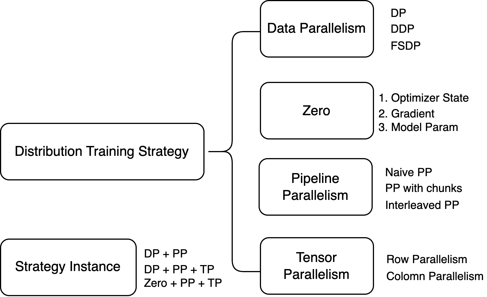
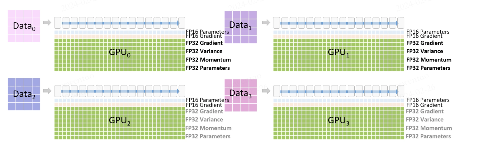
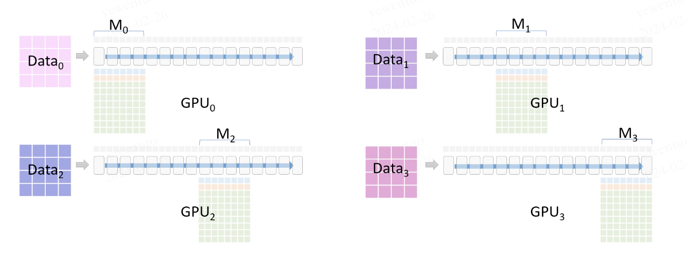
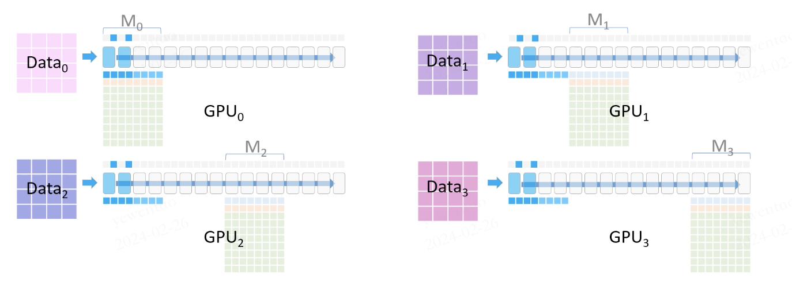
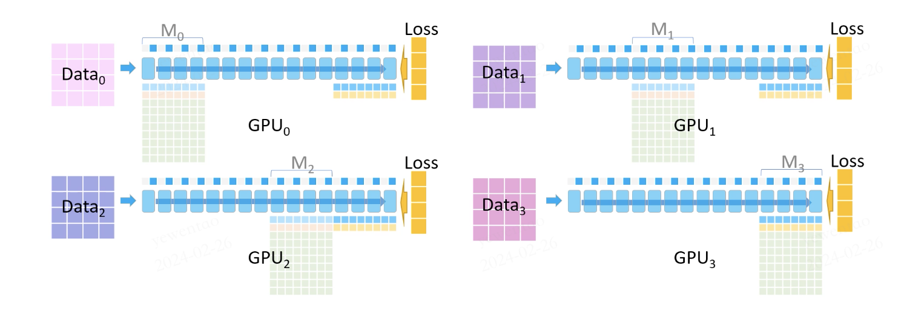
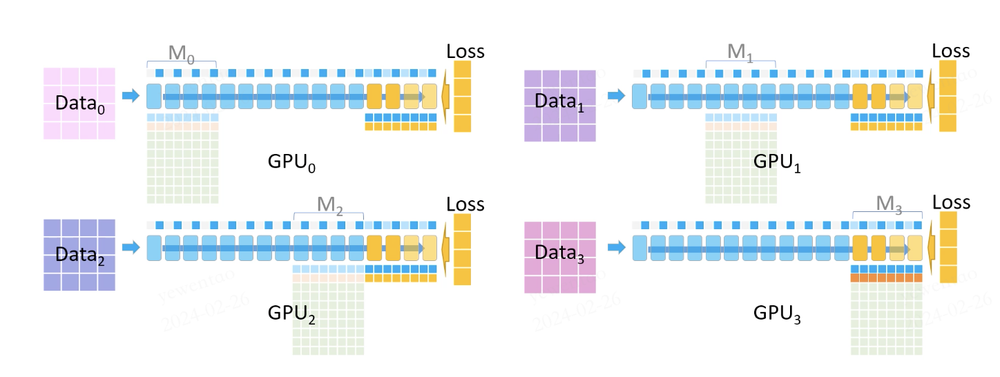
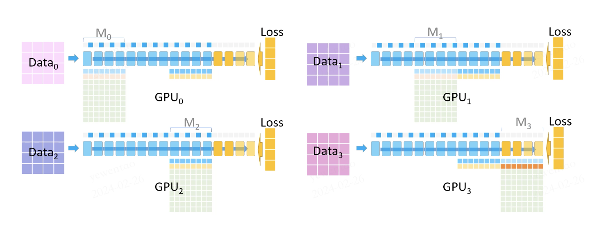
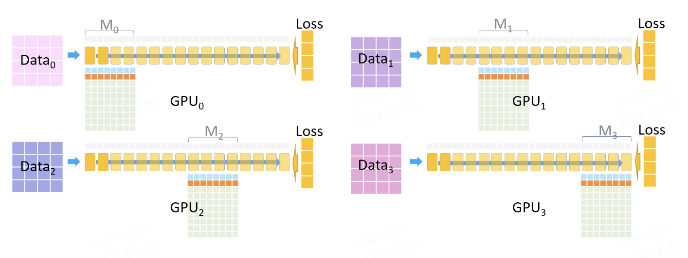
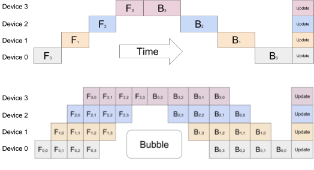

## Summary

This blog post explores advanced parallelism techniques in deep learning to optimize computational efficiency and memory usage across GPUs. It covers Data Parallelism (DP), Zero Redundancy Optimizer (Zero), Pipeline Parallelism (PP) and Tensor Parallelism (TP).

---



---

## Data Parallelism

Data parallelism is the simplest strategy for parallel processing. In this setup, each GPU holds a complete copy of the model and processes different training data inputs in parallel. During forward computation, each GPU independently executes its assigned data, calculates the loss, and performs backward propagation to compute gradients. The gradients are then reduced (averaged) through communication, broadcasted to all GPUs, and used to update the model weights with the average gradient.

However, because each GPU retains the entire model parameters and optimizer state, data parallelism **is not particularly memory-efficient**.

Moreover, data parallelism involves a communication step to aggregate gradients after each GPU has completed forward and backward computations. As the `DP_size` increases, the communication cost also grows. To mitigate this, the use of "micro_batches" allows for multiple forward and backward passes in one go, effectively reducing communication overhead.

Pytorch natively supports this functionality through `DataParallel (DP)` or `DistributedDataParallel (DDP)`. We strongly recommend using DDP over DP for the following reasons:

**Pytorch DDP:**

1. Upon initialization, each GPU holds a complete copy of the model.
2. The data is divided into multiple **micro batches**, and each GPU performs forward computation on its segment of data to compute loss and then gradients through backward propagation.
3. All GPUs communicate using **all-reduce** to obtain an averaged gradient across all units.
4. Each GPU updates its model using the averaged gradients.

**Pytorch DP:**

1. GPU0 loads a batch of data into memory, then partitions and distributes it to other GPUs.
2. GPU0 copies and transmits the entire model to the other GPUs, a process that **needs to be repeated for each batch**.
3. The other GPUs perform forward computations and send the results back to GPU0 to compute the loss.
4. Once the loss is computed, GPU0 broadcasts it to the other GPUs for backward propagation.
5. The other GPUs send their computed gradients back to GPU0 to average and sum.
6. GPU0 updates its model and repeats the process for the next batch.

From this, it is clear:

- In a single batch, Pytorch DDP only requires one all-reduce communication for gradient exchange, whereas DP requires five data exchanges (data distribution, model replication, forwarding results, loss broadcasting, and gradient aggregation).
- DP introduces a master node, creating a bottleneck that impedes overall utilization.
- DP employs `threads` for communication (subject to GIL constraints), whereas DDP utilizes `torch.distributed`.

Additionally, Pytorch has developed the **Fully Sharded Data Parallel (FSDP)**, which builds on DDP by sharding model parameters. However, due to its higher  complexity, the industry currently favors **Zero**, as discussed later.

## Zero Redundancy Optimizer：Zero

The Zero Redundancy Optimizer, commonly referred to as **Zero**, distributes the model states (parameters, gradients, and optimizer states) across various data parallel processes. This approach eliminates significant memory redundancy and employs a dynamic communication mechanism to share necessary states among devices.

### Three Stage of Zero


In the diagram, `Ψ` represents the number of model parameters, `K` denotes constants specific to the optimizer, and `Nd` indicates the number of GPUs. The optimization is segmented into three distinct stages.

**Stage 1**: This stage involves the partitioning of optimizer states, resulting in a fourfold reduction in memory usage as the diagram shows, with communication overhead equivalent to that of traditional data parallelism (DP).

**Stage 2**：This stage introduces gradient partitioning, which further reduces memory usage by eight times as the diagram shows, still maintaining the same level of communication as DP.

**Stage 3**：This final stage includes partitioning of the model parameters. Memory usage decreases linearly with the addition of GPUs. For instance, 64 GPUs would result in a 64-fold reduction. However, this stage increases the communication overhead by approximately 50%.

### Training Process Example

Let's consider a training scenario utilizing Zero's three stages with four GPUs (encompassing one forward and one backward passes and parameter updates):



Initially, the data is divided into four parts, each fed into a GPU. Each GPU stores FP16 parameters and gradients for actual computations, alongside stored FP32 optimizer states, which are utilized after the FP16 gradient computations.



During the forward pass, each GPU holds a portion of the model parameters. For parameters not present on a GPU, communication is required.



For example, GPU0 broadcasts its forward pass parameters (M0) to the other GPUs. Each GPU then performs forward computations with its portion of the data. Once the forward computations are completed, the shared parameters on other GPUs are deleted.

It is important to note that only a subset of activation values from the forward pass is retained to minimize memory usage. The discarded activation values are recomputed during the backward pass through a technique known as **"checkpointing"**.

Following this, GPU1 broadcasts its parameters (M1), and the process continues similarly until the entire forward pass is completed, calculating the loss for each GPU based on its dataset.



The backward pass then commences:


During this phase, all model parameters from M3 are still present, and missing activation values are recomputed using the previously retained activations (for instance, if the model has ten layers, and activations from layers 0, 2, 4, 6, and 8 were saved, these are used to compute the outputs for layers 1, 3, 5, 7, and 9).

Each GPU computes its own gradients based on the loss and activation values. These gradients are then communicated to GPU3, which accumulates them to form the complete gradient.



Once the gradient accumulation is complete, the other GPUs delete the parameters and gradients of M3 to further conserve memory, and all GPUs delete all stored forward activations. The backward pass continues:



Now, we need to compute the gradients for M2. GPU2 broadcasts its parameters to the other GPUs, and the gradients are recomputed using the parameters and the saved partial activations.

This process repeats until all gradients have been computed.



At this point, each GPU has its gradients (accumulated from all datasets).

The optimizer then uses these gradients (FP16) to update its model parameters (FP32).


Finally, these FP32 model parameters are cast to FP16, ready for the next iteration of model training (mixed precision training).

## Pipeline Parallel

The core idea of **Pipeline Parallelism (PP)** is to distribute different layers of a model across multiple GPUs, with each GPU responsible for a specific segment of the model.

For instance, consider a model with six layers divided across two GPUs (naive pipeline parallelism):

```bash
=============  =============
|  0 | 1 | 2   |  3 | 4 | 5 
=============  =============
     gpu0           gpu1
```

When a batch of data is inputted, it first processes through layers 0 to 2 on gpu0, and then moves via the `.to()` to gpu1 for processing through layers 3 to 5 (this transition incurs communication overhead, which is smaller if both GPUs are on the same machine but significantly larger across different machines).

Typically, **labels** are sent to the GPU where the last layer of the model resides to compute the loss directly, followed by backward propagation and parameter updates.

However, this design poses a problem: when gpu1 is processing a batch, gpu0 remains idle. To minimize GPU idle time, we introduce pipeline parallelism.

One implementation approach is **GPipe**:



The principle of GPipe is to divide the input data into several **micro-batches**, allowing GPUs to process different micro-batches in parallel to maximize utilization and minimize idle time (often referred to as **bubbles**). In the diagram, four GPUs train with **`chunk=4`** (meaning each pipeline stage simultaneously processes four batches of data). For example, GPU0 would perform four forward computations from F0 to F3 before handing off to the next GPU, and then perform four backward computations from B3 to B0.

When training simultaneously utilizes Data Parallelism (DP) and PP, we have `global_batch_size = micro_batch_size * dp_size * chunk`. For instance, if `global_batch_size=512`, `DP=4`, and `chunk=4`, then each `micro_batch_size=32`, meaning each micro-batch contains 32 data points.

Another PP implementation strategy is the **Interleaved Pipeline**:


As illustrated, through a strategic pipeline parallel design, we can reduce bubbles and enhance GPU utilization.

It is worth noting that PP only requires the transmission of batch data results between adjacent model layers. Furthermore, we can overlap computation and communication to further reduce overhead. Therefore, PP generally requires the least amount of communication and is often implemented across nodes, allowing intra-node high bandwidth communication to be reserved for **Tensor Parallelism (TP)**.

## Tensor Parallel（Model Parallel）

Tensor Parallelism, also known as Model Parallelism, is a computational optimization technique where each GPU processes only a part of the tensor (unlike Pipeline Parallelism, which handles different layers, Tensor Parallelism splits a single layer of the model) and aggregates the parts only when necessary.

For example, consider the operation `Y = GELU(XA)`, where `Y` is the output, `X` is the input, `A` represents the model weights, and `GELU` is a nonlinear activation function.


In this setup, the segments of A (A1, A2, A3) can be distributed across different GPUs to save on memory usage.

There are two primary methods of splitting in Tensor Parallelism: **row parallel** and **column parallel**:


In column parallelism, the model parameters are divided by columns (`4*1`), and the output (`2*1`) is concatenated to produce the final result (`2*2`). The input data (`2*4`) remains unpartitioned.

Row parallelism, on the other hand, partitions the input data by columns (`2*2`) and divides the model parameters by rows (`2*2`). The dot products are then summed to produce the result (`2*2`).

Tensor Parallelism can be directly incorporated into model designs such as the **Multi-Layer Perceptron (MLP)**:


Another example is the **Multi-Head Attention (MHA)**, which naturally supports parallel processing, making the introduction of Tensor Parallelism straightforward:


**Note**: Since Tensor Parallelism often requires gathering data across GPUs after computation, it typically involves significant communication overhead. It is not advisable to use Tensor Parallelism across different nodes (keep `tp_size < GPUs per node`).

Additionally, after partitioning, the amount of forward activation values each GPU needs to store is also divided, which can effectively reduce memory consumption.

## Instance Introduction

### DP + PP


As shown in the diagram, there are 4 GPUs configured with `2 DP + 2 PP`. The GPUs `GPU[0, 2]` and `GPU[1, 3]` form Pipeline Parallelism (PP) communication groups, while `GPU[0, 1]` form a Data Parallelism (DP) communication group.

For DP, only GPUs 0 and 1 are visible to each other, and GPUs 2 and 3 are "invisible." During training, DP divides the data between the two visible GPUs. GPUs 0 and 1 then covertly delegate part of their tasks to GPUs 2 and 3 using PP.

### DP + PP + TP


This setup involves eight nodes with a total of 32 GPUs, each node equipped with four GPUs. The Tensor Parallelism (TP) communication groups are set to the same node. Then, Pipeline Parallelism (PP) is set to 4, and Data Parallelism (DP) to 2, achieving a three-dimensional parallel training structure.

### Zero（DP） + PP + TP

Zero can be seen as a highly scalable form of DP, compatible with both PP and TP, but typically only suitable for Zero Stage 1.

This limitation arises because introducing Zero Stage 2 gradient partitioning means that each micro-batch operation would require a communication step to aggregate gradients. With PP naturally employing more micro-batches, this increases the communication overhead. Moreover, after introducing PP, the model is layered, and the gradient sizes become 1 / PP_size, reducing the effectiveness of memory savings. Therefore, Zero Stage 2 is generally not used in conjunction with PP.

Furthermore, using Zero allows for **Zero-Offload**, which offloads some optimizer states to the CPU to further save GPU memory. This technique is particularly valuable in scenarios where GPU memory is a limiting factor, enabling larger models or more complex computations without upgrading hardware.

## Referrence

- Microsoft Research Blog: "[Zero DeepSpeed: New System Optimizations Enable Training Models with Over 100 Billion Parameters](https://www.microsoft.com/en-us/research/blog/zero-deepspeed-new-system-optimizations-enable-training-models-with-over-100-billion-parameters/)"
- Hugging Face Transformers Documentation: "[Parallelism Techniques](https://huggingface.co/transformers/v4.11.3/parallelism.html?from_wecom=1)"
- Google AI Blog: "[Introducing GPipe: An Open Source Library for Efficiently Training Large-scale Neural Network Models](https://ai.googleblog.com/2019/03/introducing-gpipe-open-source-library.html)"
- AWS SageMaker Documentation: "[Model Parallel Core Features](https://docs.aws.amazon.com/sagemaker/latest/dg/model-parallel-core-features.html)"
- Arxiv Preprint: "[An Analysis of Model Parallelism in Training Large-scale Neural Networks](https://arxiv.org/abs/2104.04473)"
- DeepSpeed Tutorial: "[Pipeline Parallelism Tutorial](https://www.deepspeed.ai/tutorials/pipeline/)"
- Microsoft Research Blog: "[DeepSpeed: Extreme-Scale Model Training for Everyone](https://www.microsoft.com/en-us/research/blog/deepspeed-extreme-scale-model-training-for-everyone/)"
- Hugging Face Documentation: "[Training Large Models: A Deep Dive on GPU Performance](https://huggingface.co/docs/transformers/perf_train_gpu_many)"
