## Summary

这篇文章介绍了kafka的基本概念

## 介绍

### 实例引入

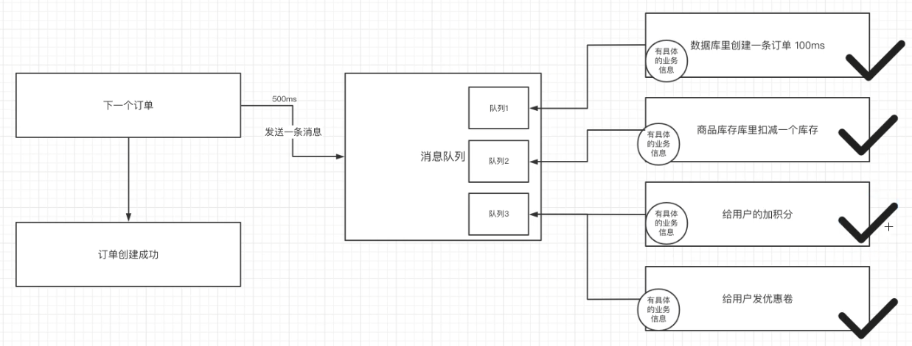

异步消费优势：

- 上游客户端快速成功，明显提升系统吞吐量
- 在分布式系统中，即使下游有服务失败，也可以通过分布式事务的保障实现最终一致。

### 消息队列

消息队列（message queue）解决的问题——通信问题，通过生产者消费者的通讯模型而不需要考虑底层的http/tcp就实现了双端通信。

分类：

- 有**broker**（消息中转站）
  - 重topic：消息转发时，以topic作为主要依据——**kafka**等
  - 轻topic：topic只是其中一种模式——**rabbitMQ**等
- 无**broker**：节点间通信发送到彼此的队列里，节点既是生产者也是消费者——**zeroMQ**（类似socket的API）

其中，kafka性能是最好的。

### Overview

简化流程： 生产者 -> kafka -> 消费者

流程：生产者 -> 消息（topic、分区、键、值）-> 分区器 -> kafka消息队列（具体分区） -> 消费者（指定偏移量）

kafka集群：上面的kafka消息队列作为一个`broker`，多个broker构成集群

## kafka架构

备注：之后zookeeper将被**kraft**取代

如果展开broker，其内部结点其实还相当复杂，包括leader和follower及topic、partition等关系

## 物理存储体系

### partition

当一个broker下的某个topic消息数量太多的时候，就会分区到其他broker下。**一个topic的消息可能存储在多个broker下，但一个patition的消息一定只在某个节点上**

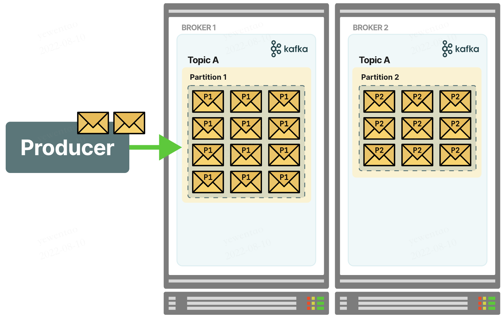

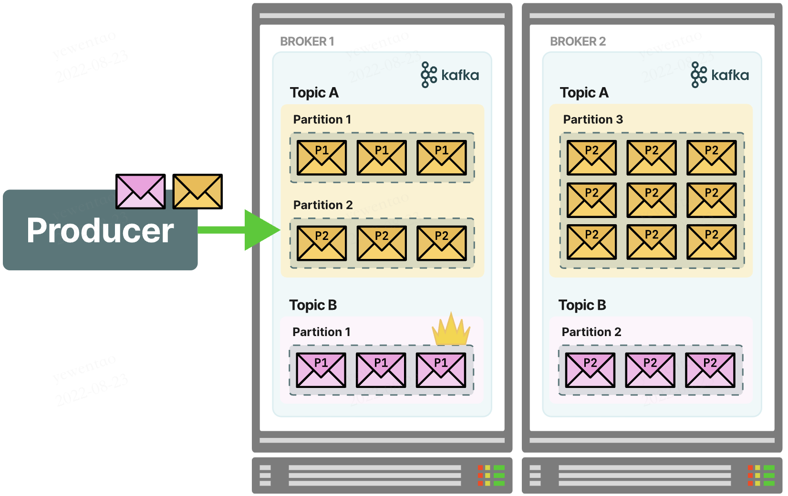

这种设计使得topic可以并行，提升可扩展性与吞吐量

`offset`：partition中的每个消息都有一个连续的序列号叫做offset, 用于partition唯一标识一条消息

### segment

partition物理上由多个segement构成，每个segment大小相等，但消息数量不一定相等。

segment由两部分组成：`index file`（稀疏格式的索引，受参数`log.index.interval.bytes`控制，默认4KB，每写4KB数据写一条索引。）和`data file`（数据），这两文件一一对应成对出现，命名上为上一个segment最后一条消息的offset值，如

而一个index和一个data file的对应关系如图所示

如索引中的6，1407元数据，表示数据文件中的第六个message（全局中为第368769+6=368775个message），offset为1407

而一个message的存储物理结构如图所示

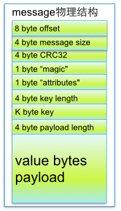

- `offset`：偏移量
- `size`：message大小
- `CRC32`: 校验位
- `magic`：kafka版本号
- `attributes`： 压缩类型或编码类型
- `key length`：key长度，为-1时 key字段不填
- `key`：可选key
- `payload`：实际数据

### 如何读写message？

- 写message：消息从java堆写入page cache（物理内存），异步线程刷盘，写始终为追加（顺序写，效率较高）
- 读message：如果有page cache，直接socket发送；如果没有，产生磁盘IO
- 如何基于offset查找message？先二分找segment file，再在file内顺序查找

### 日志留存策略

Kafka 会定期检查是否要删除旧消息，见参数 `log.retention.check.interval.ms`，默认5分钟。

kafka可以配置两种日志处理策略：删除（delete）或压缩（compact）

当前有三种日志清理策略：

- 基于空间：`log.retention.bytes`，默认未开启；
- 基于时间：`log.retention.hours`（mintues/ms），默认7天；
- 基于起始偏移：一般而言，日志文件的起始偏移量 `logStartOffset` 等于第一个日志分段的 `baseOffset`，但`logStartOffset`可能因`DeleteRecordsRequest`、日志的截断和清理等修改；基于起始偏移等删除策略即判断日志分段的起始偏移`baseOffset`是否小于`logStartOffset`，如小于则可以删除。

### log compression

通过消费更多的cpu资源，kafka可以将日志压缩，来减少网络带宽和磁盘IO的占用，并减少磁盘存储空间消耗。(在多replica factor时效果更佳明显)

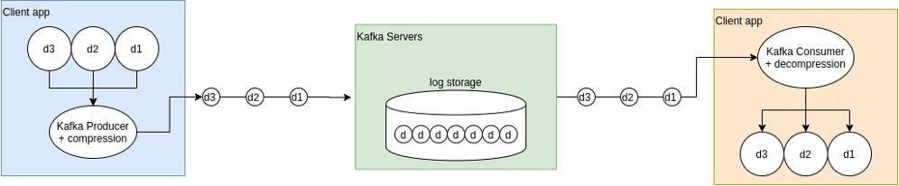

什么时候使用compression？

- 可以接受轻微延迟
- 数据易于压缩（如json、xml等而不是二进制数据）
- 带宽较小时
- 需要节省磁盘空间时

什么时候不建议使用compression？

- 通信数据体积较小时
- 对实时性要求较高的系统

支持的压缩类型

- gzip（压缩率高，时间长）
- snappy（压缩率适中，时间适中）
- lz4（压缩率低，很快）
- zstd（压缩率和cpu占用略高于snappy）

### 物理存储设计review

- topic拆分partition提高了存储上限，支持了负载均衡与横向水平扩展
- 多个文件段的设计便于定期清除消费了的文件减少占用
- 稀疏索引（只有部分信息还需要查找）减少index占用空间，能较快定位message

## 消息发送机制

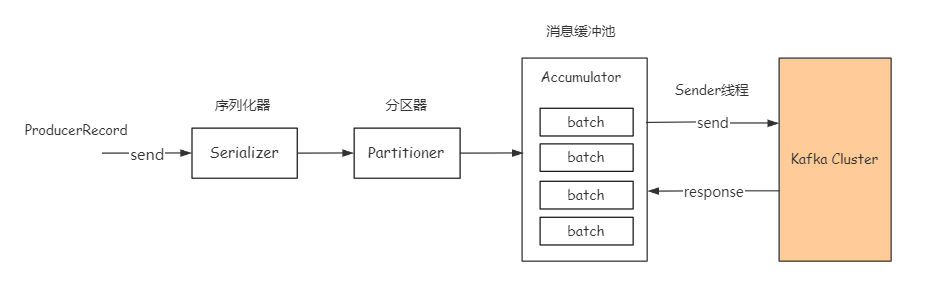

### 序列化器

序列化消息对象转成字节数组，然后通过网络传输。

### 分区器

计算消息发往的具体分区

- 如果指定了key，就将key hash后取模发送到具体partition
- 如果未指定key，那就轮流发送各个分区——（`round-robin`）
- 如果显示指定了partition，便不会走分区器。

### 消息缓冲池

消息经过序列化分区后先放到消息缓冲池，默认大小32M，见参数`buffer.memory`。如果buffer满了会阻塞`max.block.ms`的时间，再超时报异常。

### 批量发送

- 缓冲池中消息会交给`sender`按batch分批次发送，默认批次大小16KB，见参数batch.size。
- 降低batch size可以减少消息延时，提高batch size可以提高吞吐量
- 也可以通过`linger.ms`设置最大空闲时间，超过时间到batch即使没有达到size也会发送

### 消息送达语义

- `at-least-once`
  - 至少一次，不会丢失，可能重复(kafka默认实现)
  - 本质是`acks`=1 （ack有三种选项，1表示等leader确认，0表示不用确认，all表示等待leader和所有follower确认）
  - 且 `retries`=2147483647 （注意：有retry后，如果没有将`max.in.flight.requests.per.connection`设置为1，消息可能乱序，即message1失败后重发，但message2已经收到）

- `at-most-once`：至多一次，可能丢失但不会重复
  - `acks` = 0
  - `retries` = 0

- `exactly-once`：不丢不重复，只消费一次（幂等）
  - `enable.idempotence=true`
  - `acks=all`（必需）
  - 此外，为了幂等，kafka引入了`PID`（producer唯一id）和`sequence number`，对于接受的同一pid的消息，必须sequence number比broker的大才接收，否则丢弃（这样就可以利用at least once的机制重复发送了）

## 消息消费机制

- 生产端push，消费端pull
- pull可以让consumer控制消息的读取速度和数量，如果是服务主动push那可能一次数量太多造成consumer阻塞；但pull需要consumer持续pull才知道是否有数据

### 消费者如何提交offset

- offset在分区粒度上进行，即consumer需要为分配给它的每个分区提交各自的offset（本质是向`__consumer_offsets`提交消息）
- 如果consumer挂了或者有新的consumer加入触发rebalance，consumer需要消费新的分区，那么**读取上一个consumer对应该分区的最后一个offset**继续开始消费
- consumer提交的offset很灵活（没有校验），可以提交任何offset，但也要为结果负责。
  - 如果提交的offset小于客户端处理的最后一条offset，会造成**重复消费**，如下图，consumer处理完一波数据还没提交就挂了，导致下一个consumer从offset开始，会重复消费
  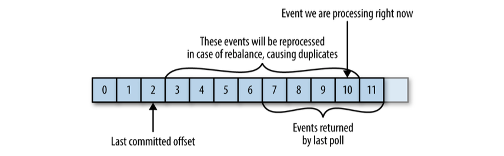
  - 如果提交的offset大于客户端处理的最后一条offset，会造成**数据丢失**
  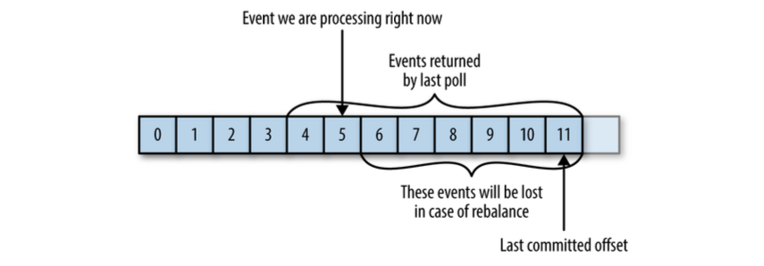

- 自动提交
  - 每过`auto.commit.interval.ms`时间自动提交一次`poll()`方法接收到的最新offset
  - 先提交上一批消息的offset，再处理这一批消息，下文的`at least once`语义

- 手动提交：`enable.auto.commit`设置为False，且手动调用API提交offset
  - 同步提交: `commitSync()`：提交`poll()`方法返回的最新offset，同步等待broker响应。注意需要等我们处理完poll返回等所有消息再调用。如果莽撞地过早调用，可能造成消息丢失
  - 异步提交：`commitAsync()`：提交即返回，无需等待回应，但相对不可靠。如由于某些原因提交2000 offset晚于提交3000 offset，那么导致2000～3000的消息可能会被重新消费
  - 组合提交：一般用异步提交，最后关闭consumer时使用手动提交。推荐
  - 任意位移提交，基于`seek()`实现

### 消息消费语义

- `at least once`
  - 先读取消息，然后处理消息，最后提交offset
  - **如果处理消息时宕机了，offset未提交，还会再消费该消息**，可能消费多次

- `at most once`
  - 先读取消息，然后提交offset，再处理消息。
  - **如果处理消息时宕机了，offset已经提交，不会再消费该消息**，最多消费一次
  - `enable.auto.commit=true`且`auto.commit.interval.ms`时间间隔设置得较小

- `exactly once`
  - 原子性消费，消息消费成功改变offset，失败回滚
  - `isolation.level=read_committed`，kafka的事务语义，实现上如同mysql，设置消息为`uncommited`和`commited`，通过可见性实现原子操作

### consumer group

- 消费者组，里面有多个consumer实例，共享一个group id，group内消费者协调一起订阅某个topic的所有分区。
- **一个group内部，一个partition只被1个consumer消费**
- rebalance：consumer group如何协调达成一致订阅topic的每个分区，如group下有20个consumer，topic 100个分区，那么一般分配每个consumer 5个，这个过程即rebalance
- rebalance触发条件：
  - group内consumer变更
  - 修改group订阅的topic
  - topic分区数变更
- 如何进行组内分配？详见下文“分区分配策略”

### 分区分配策略

#### RangeAssignor

- 针对每个topic进行独立的分区分配，当前默认策略
- 对partition排序，然后对consumer排序，期望尽可能均衡分配
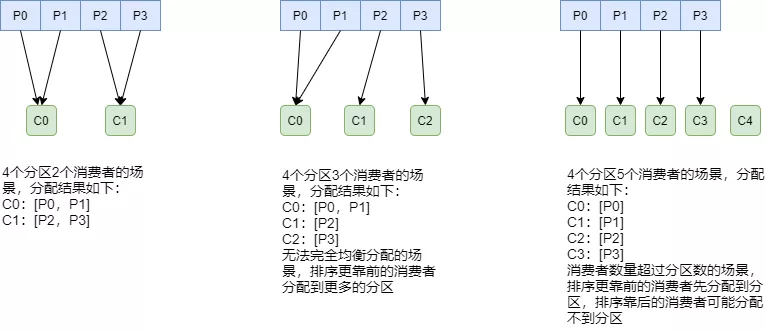
- 可能的问题：如果多个topic，每个都多给第一个consumer一个分区，那么消费就很不均衡了
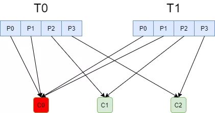

#### RoundRobinAssignor

- 和`RangeAssignor`相比，将所有topic分区纳入考虑，排序后尽量均衡
- 如果消费组内订阅的topic相同，则较为均衡
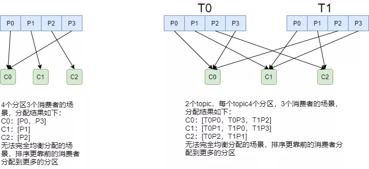
- 如果订阅topic不同，则可能很不均衡
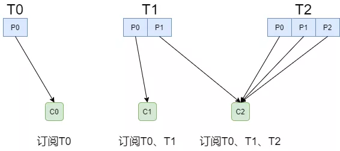

#### StickyAssignor

- 在上一次分配的基础上，尽量少调整分区分配的变动，节省因分区变更带来的开销，是一种“粘性”的策略
- 算法本身较为复杂不做具体展开，实例如下
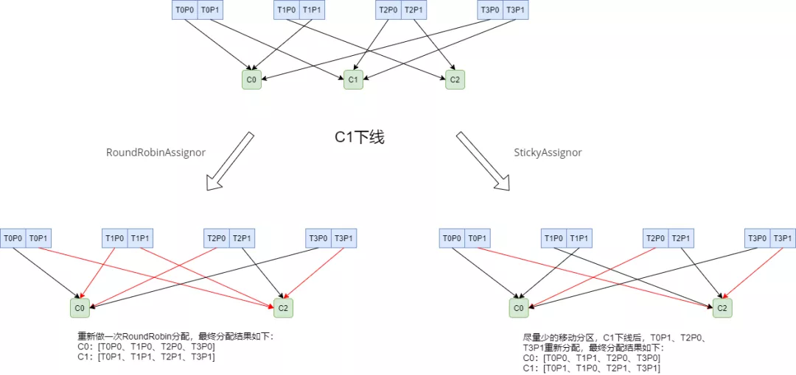

### Coordinator

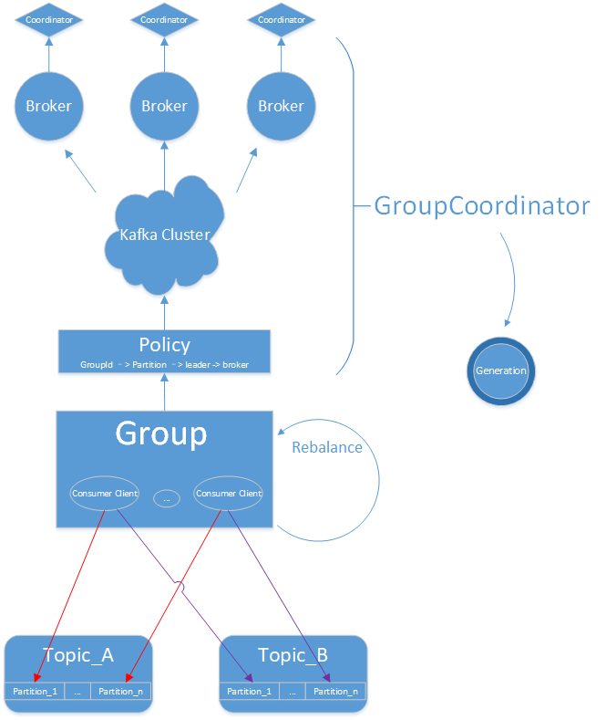

- 运行在broker上的group coordinator，用于管理group成员、管理offset和**group rebalance**

- 每个Group都会选择一个Coordinator来完成自己组内各Partition的Offset信息，`Coordinator`选择规则如下：
  - a、计算group需要消费的partition（这个partition是__consumer_offsets topic的partition，默认有50个——一个broker上可以有很多个partition）。`partitionId=Math.abs(groupId.hashCode() % offsetsTopicPartitionCount`
  - b、根据partition选择leader所在的broker，该broker上的coordinator就是group 的coordinator

- 所有consumer都给coordinator发`joinGroup`消息后，coordinator会选择一个consumer作为leader，**由leader进行partition分配**
- leader完成分配后，告知coordinator，其他follower请求coordinator来获知自己负责的partition

## 副本机制

所有副本统称为AR（assigned repllicas）

### replication-factor

topics可以设置复制因子参数，决定了每个partition有多少备份数据

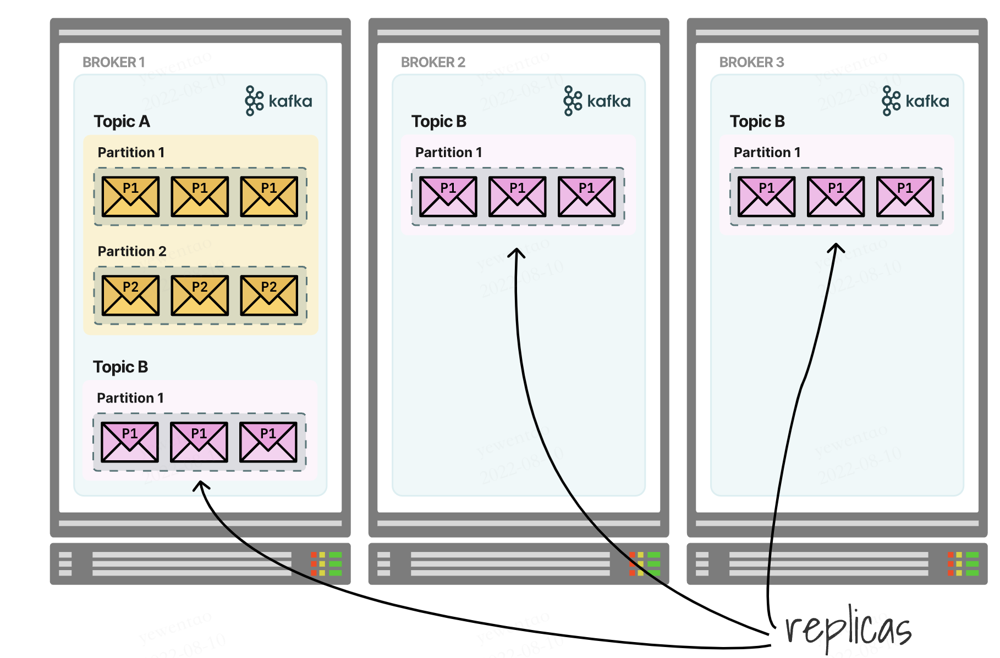

如图即一个topic在一个partition上，factor设置为3

如何保证数据一致呢？我们将partitions区分为leader和followers，leader来处理所有的读写，follower只负责失败后的恢复

follower的复制可以是sync的（in-sync replica，ISR），也可以是非sync的（out-sync replica，OSR）

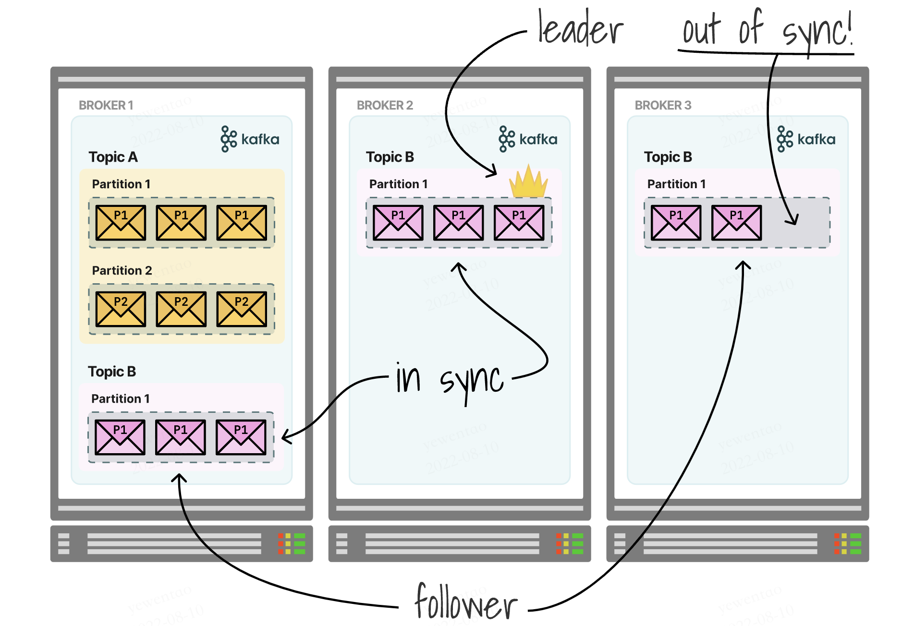

当leader挂了之后，分两种情况

1. 如果是sync模式，follower会选举出新的leader继续服务，维持高可用
2. 如果是aysnc的，follower数据未必完整，那么可以：a、等候leader恢复；b、牺牲一致性，让异步follower暂时成为leader（`unclean leader`）

### 使用注意

如果我们有两个brokser，一个leader一个sync replica follower，那么如果leader挂了，另一个follower成为leader，此时它就无法再找broker进行复制了，可用性很低。

所以一般建议为3个broker，replica factor设置为3

## 控制器

### 介绍

kafka集群中的一个broker被选举为控制器，负责管理集群中的分区和副本状态。

- **Leader选举时机**：a、leader故障。b、某leader负载过重，在这两种情况下，控制器会选举新的leader；注意在第二种情况下，属于`preferred leader`
- **数据服务**：具有最全的meta信息，接收请求并更新其他broker的meta信息，如某分区的ISR（in-sync replicas）或OSR（out-of-sync replicas）集合变化时，通知所有broker更新meta信息——follower落后太多时移入OSR，OSR追上进度时移入ISR。
- **主题管理**：为某个topic增加/减少分区数量
- **分区重分配**：对现有topic的分区进行细粒度的重新分配
- **成员管理**：自动检测新增 Broker、Broker 主动关闭及被动宕机（通过controller watch zookeeper来快速知道这一信息）

### 控制器保存的数据

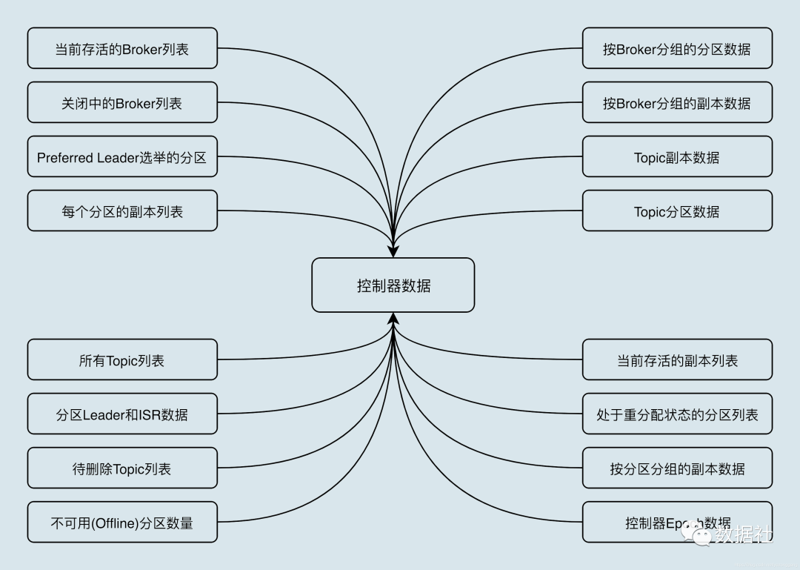

如果使用zookeeper，这些数据在zookeeper上也有一份，控制器借助zookeeper进行初始化

### 控制器选举(基于zookeeper)

- 最先在zookeeper上创建临时节点`/controller`成功的broker成为 controller
- zookeeper保证只有一个controller可以创建临时节点
- 如何处理脑裂？（一个controller暂时挂了又恢复，但又选择出了另一个controller）
  - 如raft算法类似，kafka使用epoch number计数，忽略epoch number更小的controller

### 控制器故障转移（failover）

- 控制器故障，kafka快速感知并启用新控制器

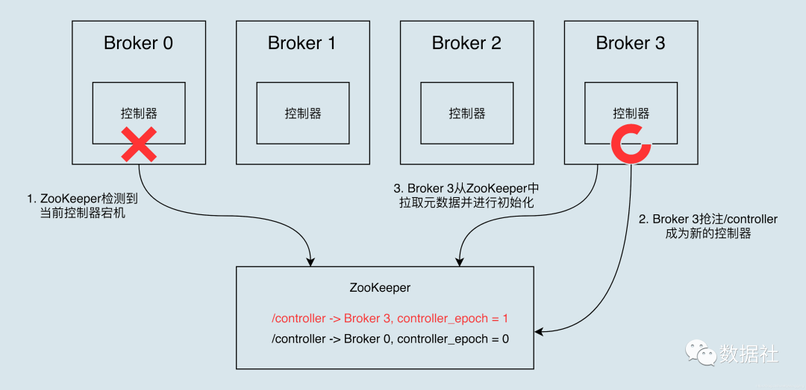

## HW（high watermark）高水位

### 高水位简介

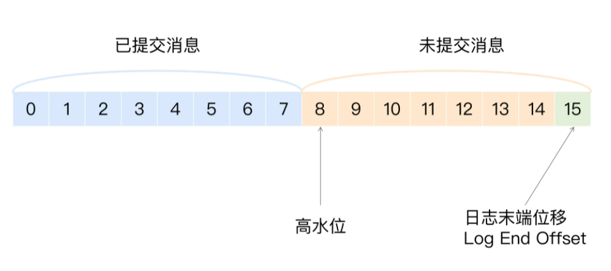

- 高水位（HW）是一个位置信息标记，它是用消息位移来表征的，**[0,HW)认为是已提交的消息**
- 日志末端偏移（log end offset），下一条将写入的offset，**[HW, LEO)是未提交消息**
- 所有副本都具有HW和LEO，但kafka使用leader的高水位来定义分区的高水位

### 作用

- 定义消息可见性，只有分区高水位以下的消息才能被消费；
- 帮助kafka完成副本同步，kafka是基于高水位实现的异步的副本同步机制。（日志截断：重新选举的leader发送“指令”让其余follower将日志截断至HW水准，避免可能的消息不一致）

### 更新策略

- leader所在broker上不仅仅有自己的HW和LEO，还包括所有副本的HW和LEO（远程副本，`remote replica`），便于更新计算值，确定分区整体的高水位HW

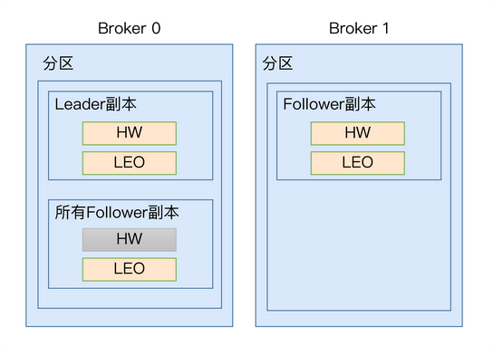

- 更新策略：
  - follower的leo：从leader拉取消息写入磁盘后更新
  - leader的leo：leader收到producer消息，写入磁盘后更新
  - leader的远程leo（副本）：follower fetch时带上自己的leo，leader用该值更新远程leo
  - follower的hw：follower更新leo后，比较leader发来的hw和自己的LEO，**取小值**
  - leader的hw：leader更新leo和远程leo后，**取所有副本的最小leo作为hw**

- 流程说明

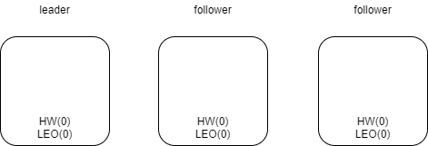

初始化状态，所有leo和hw都为0

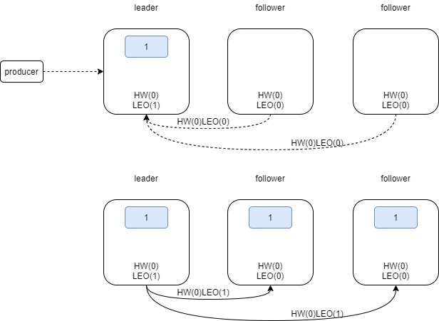

producer发来消息后，leader leo更新为1，HW=0（min（all hw）），**follower带着hw=0&leo=0第一次fetch**，follower拉取消息后，更新自己的leo为1，HW=0（min（leader hw和自己LEO））

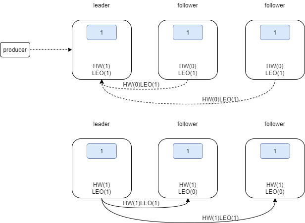

**follower带着hw=0&leo=1第二次fetch**，leader更新自己的远程leo为1，取所有副本最小leo=1为HW；follower拉取更新自己的HW为1，HW更新完成

- 需要两次fetch才更新HW，可能会存在不一致的问题：如leader更新HW，follower未更新，此时follower重启
  - 重启后LEO设置为之前的HW值（0）（临时状态，如果能正常拿到消息后恢复）
  - 重新同步leader，此时leader挂了，必须重新选举
  - 如果选举该follower成为leader，而LEO还是0，那么之前同步的那一条消息被截断，永久丢失

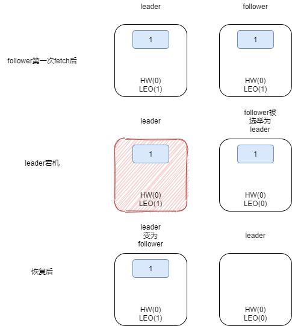

- kafka缓解策略：引入leader epoch和start offset
  - 即对于特定leader epoch，有特定的start offset
  - leader epoch小的不能行使leader权利
  - leader epoch和start offset存到`checkpoint`持久化文件中，新leader会首先查该缓存减少不一致现象。
  - 如针对上面的问题，重新选举follower成为leader，LEO更新为start offset=1，此时消息不会被截断丢失
