## Summary

This article introduces the basic concepts of Mysql

## To be translated

Oh Sorry!

This blog has't been translated to English, please wait for a little while...

## mysql架构

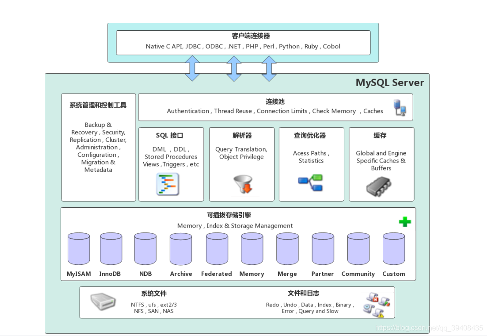

大致可以分为客户端连接层、数据库服务层、存储引擎层和系统文件层

### 客户端连接层

提供client与mysql server建立连接的能力，支持几乎所有主流语言。

### 数据库服务层

server的核心

- **连接池**：存储客户端与数据库的连接信息，一个线程负责一个客户端的连接
- **系统管理和控制工具**：如数据备份与恢复、安全管理、数据库集群的协调管理等
- **SQL接口**：接受sql命令发送到其他部分
- **解析器**：将sql解析为语法树，检验语法
- **查询优化器**：如果通过了解析器的语法检查，优化器将其转化为执行计划给存储引擎
- **缓存**：由一系列小缓存构成，如表缓存、记录缓存、权限缓存、引擎缓存等

### 存储引擎层

可插拔数据引擎（给服务层提供的接口屏蔽了不同引擎的差异），负责数据读写，与底层文件交互。

重点：**innodb**和**MyISAM**

### 系统文件层

mysql存储数据的底层文件，物理存储层

- 日志文件
  - 错误日志：mysql运行过程中的错误信息，`show variables like '%log_error%';`
  - 通用查询日志：记录一般查询信息，`show variables like '%general%';`
  - 二进制日志（binlog）：详见下文，记录写操作，`show binary logs;`
  - 慢查询日志：记录超过指定时间（默认10s）的sql

- 数据文件：
  - db.opt：当前库使用字符集和检验规则等
  - frm：表结构信息（备注：mysql8的innodb没有）
  - myd：myisam专用格式，记录数据
  - myi：myisam专用格式，记录索引
  - idb：innodb数据和索引文件
  - ib_logfile：**redo log**文件

- 配置文件：`my.cnf`在linux等，`my.ini`在windows
- pid文件：mysql进程运行等进程号，主要在linux中使用
- socket文件：在linux中使用，客户端可通过socket连接mysql

## 优化器（略）

mysql 优化器主要是将sql经过词法、语法解析后得到的**语法树**，通过数据字典和统计信息和一系列运算，得到**执行树（执行计划）**

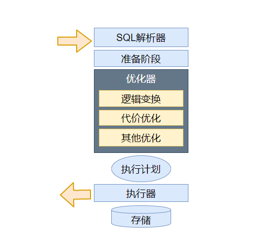

### 准备阶段

- 名称识别：找到并补全对应语句的表名、库名等
- 语义检查：如果数据字典找不到对应表名则返回报错
- 初级语义变换：根据语义规则，将部分外连接转化为内连接、子查询exist转为in再转为**semijoin**等

### 逻辑变换

- 在关系代数基础上的变换，以实现化简和前后一致。（基于规则的优化）
- 否定消除：多个表达式的和取和析取范式前有not的，将关系条件分解消除not
- 等值常量传递：将等式常量传给其他变量
- 常量表达式计算：可以立刻计算出结果的表达式直接计算
- 例子：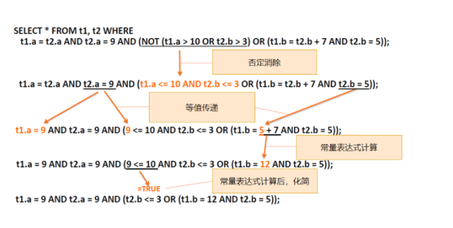

### 代价优化

- 基于代价的优化用于确定**是否应用索引、应用哪些索引、确定多表连接顺序、子查询执行策略**等问题
- mysql代价模型根据已知信息，通过一定方式计算查询代价，如join，即预估行数*单位代价
- 最后选择代价更低的执行计划执行，这也是为什么同一条查询语句，有时候走索引，有时候全表扫描

## buffer pool

- `innodb`引擎到一个内存缓冲池（一片连续的内存空间），用于提高读写性能
- 读取数据时，如果数据在buffer pool中直接读，否则去磁盘上读取；修改数据时，修改buffer pool中数据所在页，将其设置为**脏页**，由后台线程再写入磁盘
- 默认大小`128MB`，建议设置成可用内存的60%～80%

### buffer pool缓存内容

- `innodb`将数据划分为若干页，以页作为磁盘和内存交互单位，默认页大小16KB，buffer pool同样以页作为划分。
- buffer pool中包含数据页、索引页、插入缓存页、undo页、自适应哈希索引（表空间号+数据页号作key，value为缓存页地址，便于找到缓存页）、锁信息页等
- buffer pool使用控制块管理缓存页，控制块信息包括`缓存页等表空间、页号、缓存页地址`等
- 查询一条记录时，会将整页数据加载到buffer pool中，再定位具体位置

### 如何管理buffer pool

#### 空闲页管理

在mysql运行一段时间后，buffer pool的缓存页有空闲的，也有被使用的，如何快速找到空闲页而不需遍历这块内存空间呢？通过`free`链表实现

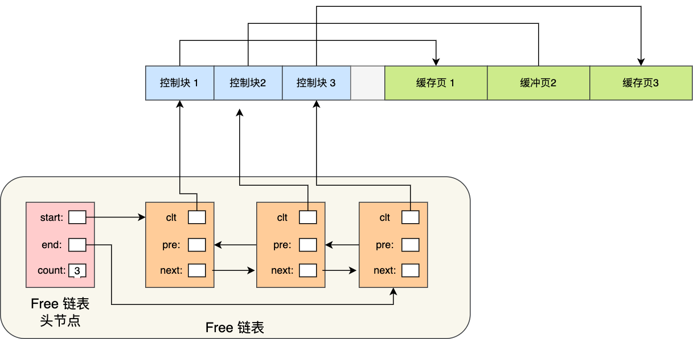

free链表有一个头节点，每个子节点指向一个控制块，通过控制块联系到对应的缓存页。

有了free链表后，加载新页到buffer pool时，就取空闲缓存页，填上控制块信息，然后移除该free链表结点即可。

#### 脏页管理


类似于free链表,flush list维护脏页信息，快速取到脏页数据刷到磁盘，然后将脏页移除flush链表。

#### 提高缓存命中率

- 我们希望频繁访问的数据一直停留在buffer pool中，及时清除访问次数少的数据。

- 最容易想到的是LRU（least recently used）算法，
  - 维护一个LRU链表保存近期访问的页
  - 访问的页在buffer pool里，该页放到链表头
  - 访问的页不在buffer pool，把该页读进来并放到链表头，并剔除链表尾的结点

- 该算法没有被使用，因为两个问题
  - **预读失效**：mysql预读机制会将数据临近页也一起加载进buffer pool，但可能这些页从头到尾都不会被访问，这个预读就白做了；此外还挤掉了其他可能有用的数据页名额
  - **buffer pool 污染**：一个sql扫描了大量数据，buffer pool空间又有限的话，可能将所有页都替换出去，导致大量热数据被淘汰，以至于再次访问这些热数据时大量磁盘IO。

- 如何解决预读失效？划分链表为young和old区域，默认时63:37。
  - 预读数据进来时，预读页插到old区域头，如果没有被读很快就会被剔除并且不影响young区域热数据
  - 如果old区域数据被读到，就会插到young区域头，并将最后一个young到页挤到old区域中

- 如何减少buffer pool污染的影响？old区域页进入young区域增加一个停留时间判断
  - `innodb_old_blocks_time`控制，默认为1s
  - 满足被访问和在old区域停留时间超过1s的页，才会被移动到young区域首部
  - 这样，如全表扫描，预读相邻数据会被立刻再次使用，但可能这个预读对其他扫描没什么用的情况被解决

- 补充：为了减少young区域结点频繁移动，mysql优化了young区域规则，让前1/4被访问不会移动

#### 脏页什么时候刷入磁盘

- 首先，即使脏页没有被及时刷入磁盘，mysql就宕机了，也可以通过`redo log`恢复

- 触发脏页刷新机制
  - redo log已满
  - buffer pool已满，淘汰部分数据页，此时可能淘汰脏页并刷数据
  - mysql认为自己空闲时后台线程刷适量脏页
  - mysql正常关闭时，刷所有脏页

- 补充：如果开了慢sql监控，发现“偶尔”有用时稍长的sql，可能是因为脏页刷到磁盘开销抖动，如果间断出现这种现象，可以增大buffer pool空间或redo log大小

### 总结

Innodb 存储引擎设计了一个缓冲池（Buffer Pool），以页为单位缓冲数据，来提高数据库的读写性能。

三种链表管理缓存页：free list（空闲链表）； flush list（脏页链表）；LRU list（存储最近最常使用数据）

LRU的两个优化：将 LRU 链表 分为young 和 old 两个区域解决**预读失效**问题；当「页被访问」且「 old 区域停留时间超过 innodb_old_blocks_time 阈值（默认为1秒）」时，才会将页插入到 young 区域，解决**buffer pool污染**问题

可以设置多个buffer pool实例来提升数据库并发性能。

## 日志

### binlog

- **binlog**记录写操作，以二进制形式存储在磁盘中，由**server**层记录
- 通过追加方式写入，可通过`max_binlog_size`设置大小，大小到达定值后生成新文件保存

- 使用场景：
  - 主从复制：master开启binlog，发到各个slave端，slave再次执行binlog实现主从一致
  - 数据恢复：通过如`mysqlbinlog`等工具恢复

- 刷盘时机：对于innodb而言，事务提交时才会记录binlog，刷盘时机通过`sync_binlog`参数设置，默认是`1`（每次产生就刷盘），`0`则系统判断刷盘，`N`则每N个事务刷盘

- 日志格式：
  - `STATEMENT`：基于sql语句的复制，将每一条会修改数据的sql记录到binlog中。
    - 优点：数据量小，性能高
    - 缺点：在某些情况下会造成主从不一致
  - `ROW`：基于行的复制，不记录sql和上下文信息，仅记录哪条数据被修改了
    - 优点：不会出现某些情况下存储过程无法被复制的问题
    - 缺点：产生大量日志，尤其是`alter table`的时候日志暴涨
  - `MIXED`
    - 两种结合的类型，一般使用`STATEMENT`，`STATEMENT`无法复制的操作使用`ROW`模式

### redo log

- 事务具有**持久性**，事务提交成功那么数据就永久保存。便是通过`redo log`实现一致性。
- 包括两部分，一为内存中的日志缓冲`redo log buffer`，一为磁盘上的`redo log file`，先在内存中积累，一定量后刷到磁盘file中。
- 通过`redo log`，mysql实现了先写日志，再刷数据到磁盘的WAL（write-ahead logging）

- WAL的实现


如一组redolog file4个，每个1g，`write pos`记录当前写日志位置，一边写一边后移；`checkpoint`是当前要擦除的位置，擦除前将记录更新到数据文件。如果write pos追上了checkpoint，那么暂时不执行更新，先推进checkpoint。

### undo log

- 回滚日志，记录数据被修改前的信息，表实际修改前，先把数据拷到undo log里，如果事务回滚可通过undo log还原。
- 如delete一条记录时，undo log里会记一条insert数据

## LBCC（Lock-Based Concurrent Control） 基于锁的并发控制

LBCC解决的是当前读（for update）情况下的常规理解幻读，MVCC解决的是快照读的问题

举例说明：

```sql
CREATE TABLE `test` (
  `id` int(11) NOT NULL,
  `name` varchar(50) DEFAULT NULL,
  PRIMARY KEY (`id`),
  KEY `NAME_INDEX` (`name`)
) ENGINE=InnoDB DEFAULT CHARSET=utf8;

INSERT INTO test VALUE(1,'n1');
INSERT INTO test VALUE(5,'n5');
INSERT INTO test VALUE(8,'n8');
INSERT INTO test VALUE(10,'n10');
INSERT INTO test VALUE(20,'n20');

CREATE TABLE `test2` (
  `id` varchar(32) NOT NULL,
  `name` varchar(32) DEFAULT NULL
) ENGINE=InnoDB DEFAULT CHARSET=utf8;

INSERT INTO test2 VALUE(1,'n1');
INSERT INTO test2 VALUE(5,'n5');
INSERT INTO test2 VALUE(8,'n8');
INSERT INTO test2 VALUE(10,'n10');
INSERT INTO test2 VALUE(20,'n20');
```

- innodb中，锁锁的是**索引**
  - 假如一张表没有索引，那么mysql会锁表（锁主键索引或隐藏列rowid主键索引）
  - 对辅助索引加锁，那么辅助索引对应的主键索引页会锁住
  - 主键索引一锁，整条记录都被锁住了（因为主键索引叶子结点存了整条记录）

简单验证：

```sql
事务A BEGIN;
事务A SELECT name FROM test WHERE name="n1" FOR UPDATE;
事务B SELECT name FROM test WHERE name="n1" FOR UPDATE;  # 阻塞
事务B SELECT * FROM test WHERE id=1 FOR UPDATE;  # 阻塞
事务B SELECT id FROM test WHERE id=1 FOR UPDATE;  # 阻塞
事务B SELECT * FROM test WHERE id=1;        # 正常查询，因为mvcc
事务A COMMIT;
事务B SELECT id FROM test WHERE id=1 FOR UPDATE;  # 正常查询
```

### 按模式分类：乐观锁与悲观锁

#### 要点

- 乐观锁：操作数据时乐观，认为别人不会同时修改数据，**不上锁**，更新操作时判断别人是否修改了数据，没修改则放弃操作。**在竞争较少时使用**
- 悲观锁：操作数据时悲观，认为别人一定会同时修改数据，**上锁**。在竞争**较多**时使用
- 乐观锁对于写比较多的场景会造成较多冲突，导致性能下降；此时应该用悲观锁
- 共享锁和排他锁都是悲观锁的实现方式

#### 乐观锁实现

- CAS（compare and swap）

三个操作数：需要读写的内存位置V，进行比较预期值A，拟写入新值B

如果V的值为预期A，那么更新为B，否则不进行操作。一般CAS操作是**自旋**的，操作不成功重试。

如何保证原子性？CAS是由CPU硬件层面支持的的原子性。

- 版本号机制

多存一个`version`字段，被修改时`version`++。数据查询时version也读出来，写回时version一致才能写回。

**灵活扩展**：不一定要`version`字段，`timestamp`等也是可以的

#### 乐观锁的缺点

- ABA问题

线程1读V预期值为A，线程2将它修改为B，然后又修改为A，这时候线程1进行CAS操作。

虽然操作成功，但线程2已经修改了，在栈顶场景可能带来未知隐患（修改为B后压栈好几个值，又压了A）。

解决思路：**再引入版本号双层保险**

- 高竞争开销

CAS不断重试会带来高开销，避免在高竞争环境下用乐观锁。

- 功能限制

只有单个变量（内存值）被CPU支持了原子性。

### 按粒度分类：全局锁、表锁、页锁、行锁

#### 全局锁

- 对全部数据库实例加锁，适用于**全库逻辑备份**（mysqldump）
- `Flush tables with read lock (FTWRL)` 让库只读，业务停止更新

#### 表级锁

- 一种是表锁 `lock tables … read/write；`，读锁不能写，写锁其他不能读写
- 一种是元数据锁（隐式，meta data lock，MDL），mysql 5.6后支持，为了保证读写正确

例如：

```sql
1. sessionA:
select* from t limit 1;

2. sessionB:
select* from t limit 1;
# 可以和A共存

3. sessionC:
altertable t add f int;
# 会因为A、B的mdl锁住阻塞

4. sessionD:
select* from t limit 1;
# 虽然只是读锁，但会被session C锁住，如果C未执行完成
```

#### 页级锁

粒度介于表锁和行锁之间，一次锁定相邻的一组记录（BDB引擎支持）

#### 行锁

- 只有**innodb**支持行锁，锁冲突概率低，并发高，但加锁慢开销大，容易死锁
- 实现上是锁**索引**，如果操作了主键索引，那么就锁定该条主键索引；如果是操作非主键索引，该非主键索引和对应的主键索引都会锁上。
- 在**update**和**delete**时，不仅会锁where扫过的所有索引，还会锁定其相邻键值，即**next-key locking**

### 按属性分类：共享锁和排他锁

#### 共享锁（读锁、s锁）

应用于并发读操作，不允许写操作以避免“不可重复读”问题

使用：`select …lock in share mode`

#### 排他锁（写锁、x锁）

- 加锁后不允许其他任何事务对该数据读写，与任何锁互斥，有效避免“脏读”

- innodb默认 update、delete、insert都会自动上排他锁，select不会自动加锁

- 使用：`select …for update`

### 按状态分：意向共享锁（is锁）和意向排他锁（ix锁）

- 是一种表锁，协调行锁和表锁的关系，支持多粒度锁并存
- 例如事务A有行锁时，mysql给该表加了意向锁，如果事务B想申请**表的写锁**（行写锁不受影响），那么不需要遍历每行判断是否有行锁，直接判断意向锁即可，**以加快判断效率**

### 按算法：记录锁、间隙锁、临键锁

#### 记录锁（record lock）

即封锁一条记录，本质就是行锁

#### 间隙锁（gap lock）

- 间隙锁为开区间，如上例子中间隙范围为（负无穷, 1）(1,5) (5,8) (8,10) (10,20) (20, 正无穷)
- 当查询没有命中记录的时候，innodb就会加上间隙锁，主要**阻塞插入操作**. 例如事务A `SELECT * FROM test WHERE id=2 FOR UPDATE;`，此时间隙(1,5)上锁，插入2～4数据都会阻塞
- 间隙锁与间隙锁不冲突，事务A加了间隙锁，事务B也可以在同一个间隙中加间隙锁。
- 补充：如果主键不是`int`，会转化为ASCII码后再确定间隙

### 临键锁（next-key lock）

- 临键锁是记录锁和间隙锁的结合，innodb默认行锁算法就是临键锁。
- 当范围查询时，不仅命中多条记录，且包括间隙时就会加上临键锁，这是一个**左开右闭**的区间

实例

```sql
事务A BEGIN;
事务A SELECT * FROM test WHERE id>=2 AND id<=6 FOR UPDATE;
事务B INSERT INTO test VALUE (2,"n2");   # 阻塞
事务B INSERT INTO test VALUE (6,"n6");  # 阻塞
事务B INSERT INTO test VALUE (8,"n8");  # 阻塞
事务B UPDATE test SET name="n55" WHERE id=5;
事务B SELECT * FROM test WHERE id=8 FOR UPDATE;    # 阻塞
事务B INSERT INTO test VALUE (9,"n9");        # 正常插入
事务A COMMIT;
事务B SELECT id FROM test WHERE id=1 FOR UPDATE;  # 正常查询
```

临键锁：锁间隙(1,5)(5,8)，锁记录5和8，所以整体锁范围(1,8]

- 为什么要把下一个区间(5,8)也锁上？如果不锁上，那么用户insert一个id=6，那么查询的时候就会多一个数据，导致不可重复读或者说常规理解上的幻读。

### 死锁

例子：

```sql
事务A BEGIN
事务A SELECT * FROM test WHERE id=10 FOR UPDATE;
事务B BEGIN
事务B SELECT * FROM test WHERE id=20 FOR UPDATE;
事务A SELECT * FROM test WHERE id=20 FOR UPDATE;    # 阻塞
事务B SELECT * FROM test WHERE id=10 FOR UPDATE;    # 报错ERROR 1213 (40001): Deadlock found
事务A 阻塞的查询获得结果
```

这里mysql检测到了死锁并立即回滚，没有等待超时后再回滚，是如何检测死锁的呢？

简单而言使用`wait-for graph`（等待图）实现，通过记录锁的信息链表和事务的等待链表构建图，如果图中存在回路即死锁

如何尽量避免死锁？

- 大事务拆分为多个小事务
- 查询避免无where查询，尽可能使用索引查询
- 尽量使用等值查询而不是范围查询（减少间隙锁）

### 附录

innodb里有三张表可以查询当前事务与锁状态

- `INNODB_TRX`：记录当前在执行的每个事务的信息，包括是否在等待锁、何时启动及正在执行的SQL语句(如果有)。
- `INNODB_LOCKS`：记录事务请求但尚未获得的锁信息；和一个事务持有锁但正在阻塞另一个事务的每个锁的信息。
- `INNODB_LOCK_WAITS`：记录了锁等待的信息。每个被阻塞的InnoDB事务包含一个或多个行，表示它所请求的锁以及正在阻塞该请求的任何锁。

## 事务

### ACID

- 原子性(Atomicity)：事务不可分割。事务中所有操作要么全部提交成功，要么全部失败回滚。
- 一致性(Consistency)：事务开始前和结束后，数据库的完整性约束没有被破坏 。
- 隔离性(Isolation)：每个读写事务的对象对其他事务的操作对象能相互分离，即该事务提交前对其他事务都不可见。
- 持久性(Durability)：事务一旦提交，其结果是永久性的，即使发生宕机等故障，数据库也能将数据恢复。

### innodb的事务隔离级别

#### 概念

- 读未提交（Read uncommitted)：一个事务可以读取另一个未提交事务的数据，可能出现**脏读、不可重复读、幻读**
- 读已提交（Read committed）：事务可以读取到另一个事务提交后到数据，可能出现**不可重复读、幻读**
- 可重复读（Repeatable read）：**innodb默认隔离级别**，保证一个事务多次读取同样数据结果相同，基于**mvcc**实现，可能出现**幻读**
- 串行化（serializable）：事务串行执行，不会有幻读问题，但效率很低

- 什么是幻读？一种**常规理解**：幻读是 事务A 执行两次 select 操作得到不同的数据集，即 select 1 得到 10 条记录，select 2 得到 11 条记录。但这其实并不是幻读，这是不可重复读的一种，只会在 R-U R-C 级别下出现，而在 mysql 默认的innodb存储引擎的 RR 隔离级别是不会出现的。
- 一种直观理解：某一次的 select 操作得到的结果所表征的数据状态无法支撑后续的业务操作。更为具体一些：select 某记录是否存在，不存在，准备插入此记录，但执行 insert 时发现此记录已存在，无法插入，此时就发生了幻读。**这种幻读在innodb的RR级别也会出现**

#### 实例1（不可重复读或者说常规理解的幻读）

一般实例很简单，如A事务读数据id=1，然后B事务修改了它，A事务再读就读到了B事务修改后的结果，这里不赘述。

下面介绍一种特殊的场景，我们主动加锁后也会造成不可重复读（也有人说这是幻读，有争议）：在可重复读隔离级别RR下，关闭间隙锁（gap lock进行实验）或者直接将隔离级别设为RC可以复现

```sql
CREATE TABLE `t`(
`id` int(11) NOT NULL, 
`c` int(11) DEFAULT NULL,
`d` int(11) DEFAULT NULL, 
PRIMARY KEY (`id`),
KEY `c` (`c`)) ENGINE=InnoDB;

insert into t values(0,0,0),(5,5,5),(10,10,10),(15,15,15),(20,20,20),(25,25,25);
```

```sql
事务A BEGIN
事务A SELECT * FROM t WHERE d = 5 FOR UPDATE   # 读到(5,5,5)
事务B UPDATE t SET d=5 WHERE id = 0            # 虽然上面给d=5加了锁，但没有给id=0加锁，所以正常执行
事务B提交
事务A SELECT * FROM t WHERE d = 5 FOR UPDATE   # 读到（0，0，5） (5,5,5)
事务A COMMIT 提交
```

这种不可重复读带来的问题：

- 可以看到，虽然事务A上了排他锁，但仍然无法阻止读到新插入的其他数据，**破坏了加锁的语义**

- 此外，事务写入binlog还会带来数据不一致的问题

```sql
事务A BEGIN
事务A SELECT * FROM t WHERE d = 5 FOR UPDATE   # 读到(5,5,5)
事务A UPDATE t SET d=100 WHERE d=5
# 数据：(0,0,0),(5,5,100)
事务B UPDATE t SET d=5 WHERE id = 0
事务B INSERT INTO t VALUES (1,1,5)
# 数据：(0,0,5),(1,1,5),(5,5,100)
事务B提交（写入binlog）
事务A SELECT * FROM t WHERE d = 5 FOR UPDATE   # 读到 （0，0，5）(1,1,5)
事务A提交（写入binlog）
```

sql恢复时，先执行`UPDATE t SET d=5 WHERE id = 0`和`INSERT INTO t VALUES (1,1,5)`

然后再执行`UPDATE t SET d=100 WHERE d=5`

数据就变成了`(0,0,100)(1,1,100)(5,5,100)`

#### 实例2-幻读

在mysql 可重复读（RR）级别下测试

```sql
T1: BEGIN SELECT * FROM `t` WHERE `id` = 1;     # Empty set (0.00 sec)
T2: INSERT INTO `t` VALUES (1, 1, 1);           # Query OK, 1 row affected (0.00 sec)
T1: INSERT INTO `t` VALUES (1, 1, 1);           # ERROR 1062 (23000): Duplicate entry '2' for key 'PRIMARY'
T1: SELECT * FROM `t` WHERE `id` = 1;           # Empty set (0.00 sec)
```

T1 select id =1的数据发现不存在，准备插入数据，T2插入了一条，此时T1的插入就会失败。“见鬼了，我刚才select没数据呀”

然而，因为MVCC机制T1再select，查询到还是空集合。T1 无论读取多少次，都查不到 id = 1 的记录，这就是幻读。

T1可以通过手动过加行锁（`SELECT ... FOR UPDATE`）规避这个问题，或者事务隔离级别上升为串行也可以解决。

## MVCC（Multiversion Concurrency Control）多版本并发控制

- 思想：保存**数据在某个时间点的快照**实现并发控制。

### MVCC解决了哪些问题

- 读写阻塞问题：让读不阻塞写，写不阻塞读，实现**读写并发**
- innodb的MVCC采用乐观锁机制，**降低了死锁的概率**
- 解决**一致性读**或者说**快照读**的问题：读某个数据只看到在某个时间点前的结果，即事务内部看到的数据不受其他事务影响。

### 基础概念（基于innodb）

- 隐藏字段：
  - **row_id**（非必须）：单调递增的id，没有主键和非null唯一键时出现，6字节
  - **trx_id**（必须）：事务id。事务每次开启时从数据库获得一个**自增长**的事务id（事务版本号）
  - **roll_pointer**（必须）：指针，指向回滚段的undo日志

- 版本链
  - 多个事务并行操作一行数据时，不同事务的修改形成多个版本，通过`roll_pointer`形成一个链表
  - 一张图理解：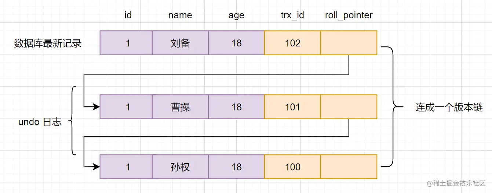
  - 原始数据是孙权，某事务修改成了曹操，那么事务id+1，且指针指向undo log中孙权

- 快照读和当前读
  - 快照读是具有**一致性**（读到的数据要么是事务开始前产生的，要么是事务本身修改的）**不加锁**的读。不加锁的select都是快照读。
  - **加锁的是当前读** `SELECT * FROM t WHERE id=1 LOCK IN SHARE MODE;`等读的是当前版本的数据。

- **Read View**
  - 事务执行sql时产生的读视图，用于判断当前事务**可见哪个版本的数据**
  - 重要属性
    - `m_ids`：当前系统活跃（未提交）的事务id列表
    - `min_limit_id`：生成readview时，当前活跃事务id最小值，即`min(m_ids)`
    - `max_limit_id`：表示生成read view时，系统应该分配给**下一个事务的id**
    - `creator_trx_id`：创建当前read view的事务id
  - 匹配条件
    - 先生成readview，如果读某行时发现`trx_id < min_limit_id`，说明修改/生成该行的事务已经提交，可以访问
    - 先生成readview，如果读某行时发现`trx_id >= max_limit_id`，说明修改/生成该行的事务在生成readview后才开始执行，则不能访问
    - 先生成readview，如果读某行时发现`min_limit_id <= trx_id < max_limit_id`，需要**重点讨论**
      - 如果`m_ids`里包含`trx_id`，说明readview生成时该事务还未提交，理论上不能访问，但如果`trx_id == creator_trx_id`说明事务是我自己提交的，就可以访问了。
      - 如果`m_ids`里不包含`trx_id`，说明生成readview前该事务已提交，则可以访问

### MVCC 如何实现

通过**readview** + **undo log**实现

- 查询一条记录的流程
  - 获取自己的事务id
  - **在开始读某条件数据时**生成readview
  - 查询得到的数据，与readview中事务版本号比较
  - 如果符合可见性规则，直接读，如果不符合，**从undo log中一层层往上导直到符合**
  - 返回数据

- 不同隔离级别下，readview工作方式不同
  - 如果是**读已提交（RC）**情况下，每次读某条件数据时都会生成新的readview，所以如果读同一数据两次。另一个事务刚好插入了一条数据，是会读到另一个事务的数据的。
  - 如果是**可重复读（RR）**情况下，读某条件数据时只会使用一个readview，就不会读到另一个事务的数据。
  
- 实例说明
  - 一样以这张图说明，初始数据为`trx_id`为100的孙权，隔离级别RC
  - 流程：
    - 事务A开启事务得到事务id101，事务B开启事务得到事务id102
    - 事务A想读取id为1的数据，生成readview：
      - `m_ids = [101, 102]`
      - `min_limit_id：101`
      - `max_limit_id：103`
      - `creator_trx_id：101`
    - 事务A读取id为1的数据，发现`trx_id(100) < min_limit_id`读到孙权
    - 事务B更新id为1的数据，trx_id更新为102，提交
    - 事务A想读取id为1的数据，**再次生成**readview：
      - `m_ids = [101]`
      - `min_limit_id：101`
      - `max_limit_id：103`
      - `creator_trx_id：101`
    - 事务A第二次读取id为1的数据，发现`min_limit_id(101) <= trx_id(102) < max_limit_id(103)`，但`m_ids`里不包含`trx_id`，说明生成readview前该事务已提交，则可以访问，所以读到了曹操
  - 上面流程如果是RR，那么事务A不会生成新readview，按照第一个readview执行，
    - 事务A第二次读取id为1的数据，发现`min_limit_id(101) <= trx_id(102) < max_limit_id(103)`，且`m_ids`里包含`trx_id`，说明readview生成时该事务还未提交，且`trx_id != creator_trx_id：101`，所以不能访问
    - 事务A按照roll_pointer读孙权的数据，再次比较发现符合条件，读到孙权数据

## join

一张图搞懂join类别：


- 默认是 **inner join**（等值连接）
- 补充：还有**cross join**（笛卡尔积）和**self join**（和自己连接），特定场景下使用

### join算法

#### Simple Nested-Loop Join(SNL，简单嵌套循环连接)

其实就是for循环，例如`SELECT * FROM User JOIN User_info on User.id = User_info.user_id`，驱动表user，被驱动表user_info

相当于伪代码

```c
for(User u:Users){

  for(UserInfo info:UserInfos){

    if(u.id == info.userId){

  //     得到匹配数据

    }

  }
```

每次拿user一个数据，user_info都要遍历一遍，效率很低

#### Index Nested-Loop Join(INL，索引嵌套循环连接)

通过索引减少扫描次数，如user_info表里如果user_id是主键的话，那么不需要遍历直接走索引效率很高；如果不是主键那匹配到user_id后拿到主键可能需要进行一次回表拿剩余数据（取决于select什么）

#### Block Nested-Loop Join(BNL，块嵌套循环连接)

在上面算法中，如果被驱动表没有索引，那么又会变成全表扫描，每次都会伴随大量IO（如果多次扫描，且语句执行超过1s，就会导致buffer pool热数据淘汰，buffer pool也不好用了）。

所以mysql进行了优化，即将驱动表数据一整块加载进 `join buffer`，然后再全表扫描被驱动表，这样就只需要扫描一次。

注意：默认`join buffer`大小为256KB，如果不能一次加载驱动表所有数据，那么还会需要多次全表扫描被驱动表。

#### hash-join（mysql 8 后出现）

如：`SELECT * FROM persons JOIN countries ON persons.country_id = countries.id`

- 1、构建阶段
  - 从join的两个表中选一个**占空间小**的表，假如选择了`countries`，对其需join的字段值hash计算`hash(countries.country_id)`放入hash table中，每一行都hash完成后构建完成
- 2、 探测阶段
  - 对`persons`中需要join的字段hash计算，匹配hash table数据，找到就发给client

- 磁盘溢出
  - 如果`join buffer`满了，会分多块溢出到磁盘，保证每一块适合可以刚好加载进join buffer中（最多128块）
  - 在构建阶段中，如果join buffer已满，会使用另一个hash函数（如`hash_2`)定位到指定数据块
  - 在探测阶段中，对于某行数据A，除了在内存中正常匹配外，还需要使用`hash_2`再次写到磁盘中（因为该数据行可能也会和构建阶段溢出写到磁盘中的数据匹配）。由于使用相同算法，所以**匹配的数据会写到同一个数据块中**
    
  - 例如：country表很大但小于persons表，country构建只能将A～F开头国家写到内存中，剩下国家就只能到磁盘上，如ZXX国家写到hash块Z中，探测阶段时某person国家也是ZXX，那么也会写入到块Z中
  - 在内存中数据过完后，处理块号相同的build块和probe块
    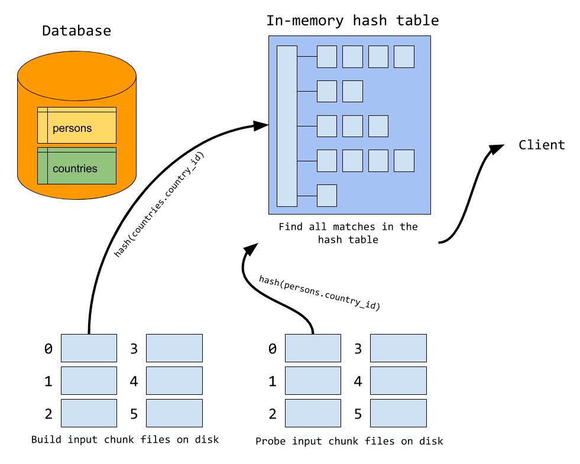
  - 为什么要使用不同的hash函数？如果磁盘分块也是用同一个hash函数，那么hash值相同的数据会进同一个块，这样加载进hash table的时候，因为hash值相同会形成一个很长的链表，不利于检索。

#### 优化思路

- 匹配条件加好索引（利用好索引INL）
- 增大join buffer（提高BNL效率）
- 减少不必要的字段查询（相当于提高join buffer利用率）

### 扩展：semijoin（半连接）

- 这是mysql内部使用的部分，在子查询带有in或exist的时候启用，即外层表查询依赖子查询语句作为过滤条件
- 不能包含`Union`、`GOURP BY`或`HAVING`

- 例如：`SELECT ... FROM Outer_tables WHERE expr IN/EXIST (SELECT ... FROM Inner_tables ...) And ...`
- 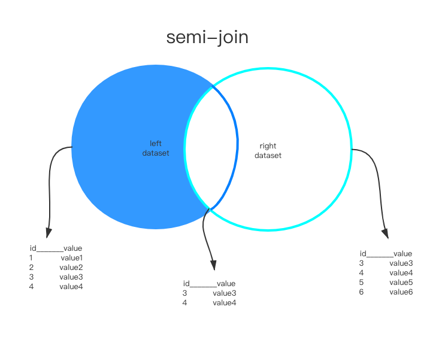
- 结果是左表子集
- 参考资料:[https://mariadb.com/kb/en/optimization-strategies/]

#### 策略

- **DuplicateWeedout**：当做普通innerJoin，之后使用临时表将重复项去除。
  - 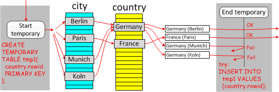
  - 在explain的extra中显示`Start temporary; End temporary`

- **Firstmatch**：执行join只挑选第一次匹配的项
  - 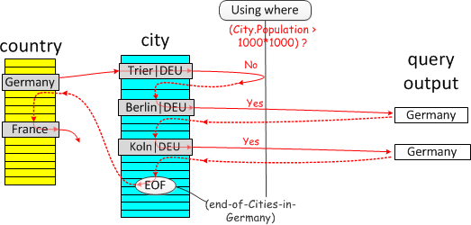（普通inner join）
  - 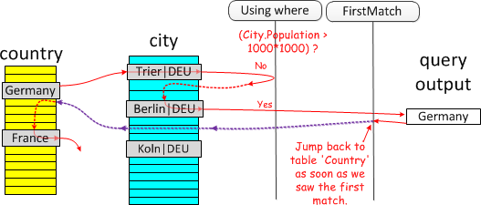（first match）
  - 在explain的extra中显示`FirstMatch(xx)`

- **Loosescan**：将重复项分组，每组返回一个
  - 例如`select * from Country where Country.code in (select country_code from Satellite)`
  - Satellite.country_code是索引,按索引顺序遍历已经是分好组的了，而一组内只需要判断第一条记录即可
  - 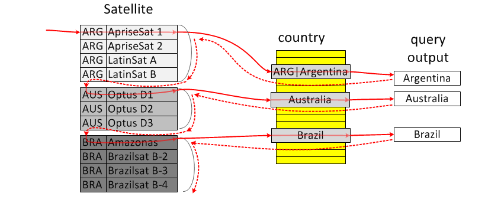
  - 在explain的extra中显示`LooseScan`

- **Materialize**：物化内表为临时表，临时表在条件字段上
  - `select * from Country where Country.code IN (select City.Country from City where City.Population > 7*1000*1000) and Country.continent='Europe'`
  - 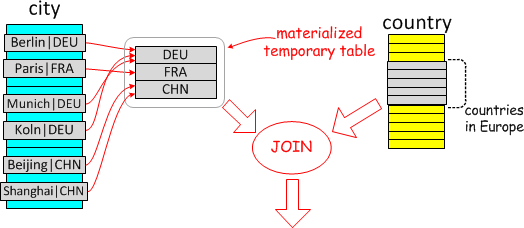
  - 物化为临时表后，join可以有两个方向
    - 物化表join `country`：意味着物化表是驱动表，需要一次全表扫描，称之为**Materialization-scan**.
    - `country` join 物化表：最经济的方式是lookup 物化表的主键（刚好因为主键也去重了），所以称之为**Materialization-lookup**
  - explain中extra显示`MATERIALIZED`

## 问题与思考

### 为什么不建议使用select *？

- 不必要的磁盘IO，特别是一些字段如`TEXT`、`BOLB`等
  注：不会使mysql占用更多内存，因为并不是在内存中存储所有结果集再返回给客户端，而是每获取一行，就写到`net_buffer`中，该内存大小由系统变量`net_buffer_length`控制，默认为16KB。写满后就会往本地网络栈的内存空间`socket_send_buffer`中写数据给客户端，发送成功后清空`net_buffer`，所以不会占用额外内存
- 加重网络时延，由上文的`net_buffer`可知如果数据量大很多，那么网络传输次数会很多，影响性能。即使MYSQL和应用程序在一台机器上，走的也是TCP，仍然需要额外时间开销。
- 无法使用覆盖索引，如下文这个表，有name和phone的联合索引和id的主键索引

  ```sql
  CREATE TABLE `user_innodb` (
  `id` int NOT NULL AUTO_INCREMENT,
  `name` varchar(255) DEFAULT NULL,
  `gender` tinyint(1) DEFAULT NULL,
  `phone` varchar(11) DEFAULT NULL,
  PRIMARY KEY (`id`),
  KEY `IDX_NAME_PHONE` (`name`,`phone`) USING BTREE
  ) ENGINE=InnoDB DEFAULT CHARSET=utf8mb4 COLLATE=utf8mb4_0900_ai_ci;
  ```

  如果SELECT * 查询，就需要拿到索引id后回表查其他值，如果是`SELECT id, name,  phone FROM user_innodb WHERE name = "弯越红鱼";`这样查就可以略去回表过程

- 可能拖慢JOIN连接查询
  - 由上文我们知道join时使用简单嵌套循环连接效率很低，MYSQL8.0前有`基于块的嵌套循环连接`（BNL），8.0后有`hash join`的方式，尽可能减少被驱动表的访问次数。
  - 两种方法都使用了`join buffer`在内存中完成匹配减少IO代价。因此，与上面`net_buffer`同理，如果数据量过大的话会拖慢join效率。

## 索引

### 基础

- 定义：一种帮助mysql提高查询效率的**排好序**的**数据结构**

- 优点：大大加快**查询**效率

- 缺点：维护索引消耗数据库资源；额外磁盘开销；增删改速度受影响

- 分类
  - 主键索引：设定主键后mysql自动建立索引（innodb为聚簇索引）
  - 单值索引（普通索引）：索引仅仅包括单个列，一个表可以有多个单值索引
  - 唯一索引：索引列值必须唯一，可以有空值null，但只能用一个（主键索引不能空）
  - 复合索引：一个索引多个列，当复合查询比较多（如name、age、birth一起查）的时候效率高
    - 最左前缀原则：name查可以利用索引；name、age可以；name、age、birth可以
    - 自动调整key：age、birth、name这样查mysql会帮你转成name、age、birth，但最好我们有意识用上索引
    - age、birth这样查**用不上索引**
  - 全文索引（full text）：定义索引的列上支持值的全文查找，在`CHAR`、`VARCHAR`、`TEXT`等类型上创建

### 索引原理

- 一张图搞懂核心思想：

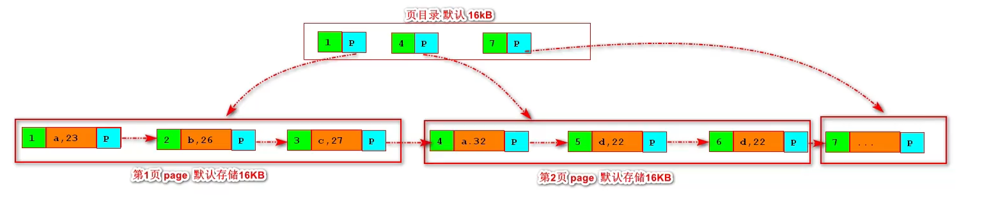

**注意：**叶子结点间指针是双向的，便于范围查找

建立索引后，会进行排序方便查找。这张图建立的是主键索引（聚簇），如果是普通（单值）索引，没有聚簇，那么它的索引**存的是主键id**，拿到主键id后再去查主键索引。

这是一个B+树结构，**顶层页常驻内存**，默认顶层页16KB，在内存里操作速度比磁盘IO快非常多，一般三层树就能存下千万到亿级别数据了。（假如id big int8字节，innodb里指针6字节，14字节可以放1170个索引指针，假设叶子结点可以放16个数据，三层1170*1170*16=2kw数据）

按页进行磁盘IO，即检索id=1后，会把id=1所在页都加载进内存避免多次IO。

- B+树

基于B树的优化实现，相对于B树，B+树**只在叶子结点存储数据**，这样同样树深可以存下更多数据。此外，同时叶子结点会有一个双向链表指针**便于范围查找**

- 聚簇索引：数据存储和索引放到了一起，索引结构的叶子结点保存了行数据（例如，上文图示的主键索引）
  - 如 `Innodb`，就是用了这种结构，生产中也多用该结构。（磁盘上两个文件，`.frm`表结构，`.ibd`数据）
- 非聚簇索引：索引结构的叶子结点指向了数据存储的对应位置，如id，总是要**二次查找**。为什么不在这个索引上存物理地址？那么增删改的时候消耗更大。
  - 如：`MYISAM`中用的是非聚簇索引，主键和辅助索引的B+树结点结构完全一致，叶子结点都是使用一个**地址**指向真正表数据而非存储实际数据。其他键**无需二次查找**，但是增删改时维护成本更大。（注：磁盘上三个文件，`.frm`表结构，`.myi`索引文件，`.myd`data文件）

- 为什么不用二叉（搜索）树？

在数据递增的情况下，二叉（搜索）树退化成链表，使用效率极低

- 为什么不用红黑树（二叉平衡树）？

二叉平衡树针对上面数据递增的情况下会有优化，自动调节树高不至于过深，但数据量很大的情况下，如500w，树深可能20+，这样大多数查找都要10几次磁盘I/O（对比一次要从磁盘IO一次数据），效率很低。

- 为什么不用hash表？

hash表加个链表存储数据。

有些时候hash表存索引key比B+树还快，但它仅支持=和IN等操作，不支持范围查询

### 应用注意

- innodb等聚簇（聚集）索引核心，**不要用uuid作为主键**，不好排序，可能插入一个中间值导致**索引结构变化**。建议使用int自增id索引，磁盘也是相邻的便于IO。（如果你不指定主键，mysql会尝试帮你找有没有唯一的列数据来利用B+树，都没有就建一个隐藏列rowid）

- 什么时候利用不上索引？
  - `like`关键字时第一个字符为`%`通配，用不上索引，如果`like`不是在第一个位置就可用
  - 复合索引没按照上面原则来
  - `OR`关键字，有一个没用上索引，那么都不会用索引。

- 扩展：联合索引底层如何存储数据结构？

相当于创建B+树的时候三者都考虑。例如：我们有这样一张表

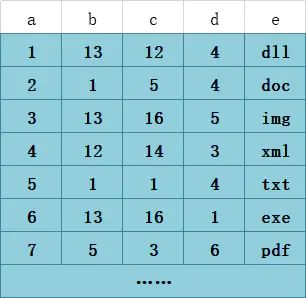，对b、c、d建立联合索引

索引结构如图所示：


我们要查询`b=12 AND c=14 AND d=3`，过程如图所示


这也解释了为什么有最左前缀原则。

参考：[知乎@问北](https://zhuanlan.zhihu.com/p/109623980)

- 为什么选择范围应该尽可能精确？

如表t里有8行，自增主键id和索引字段b、普通字段c，数据都是1~8

执行`select * from t where b>1`，如果走索引，那么走了索引之后还要拿id回表7次（拿到一个id拿id去查全数据）所以mysql优化后就直接变成去**全表扫描**。如果`select * from t where b>7`那么就能走上索引。如果`select b,id from t where b>1`也能走索引（覆盖索引）

### 全文索引

- 简介：通过**倒排索引**提交检索效率。解决判断是否**包含**的问题。在5.7.6之后版本支持中文（by`ngram`分词），支持`innodb`。会占用大量磁盘空间，以空间换时间。如果使用**like**如`like %abc`效率会很低（abc%还好）

#### 使用

- 创建索引：```FULLTEXT KEY content_tag_fulltext(`content`,`tag`)```，其中content一般是text
- 使用（全文索引自己的语法）：```select * from fulltext_test where match(`content`,`tag`) against('xxx xxx');```

- 全文索引模式：
  - 自然语言模式（natural language mode）：不能使用操作符；不能指定关键词必须出现或必须不出现等复杂查询（**默认**）
  - 布尔模式（boolean mode）：可以使用操作符指定关键词是否必须出现，如`SELECT id, title  FROM articles where MATCH ( content, title ) against ( '+风景 -爱情' IN BOOLEAN MODE );`
  - 查询扩展（query expansion）：查询可以联想出其他需要的结果

#### 注意事项

- 全文索引存在**最小搜索长度**和**最大搜索长度**，只有长度在中间的词语才会匹配。
- 建议先添加好数据，再创建索引
- 全文索引**不能完全实现like的效果**，连着的语句会因为分词形成多个词语。

#### 底层实现——倒排索引（inverted index）

- 正排索引是以文档id为关键字，记录文档中每个word的位置，如`id: 1, word1: position ……`
- 倒排索引相反，以word为关键字，在辅助表（**auxiliary table**）中存储了单词与单词自身在一个或多个文档位置的映射，有两种表现形式：
  - **inverted file index**：{单词， 单词所在文档id}
  - **full inverted index**：{单词， {单词所在文档id，在文档中具体位置}}

例如一张表t：
|  id   | content  |
|  ----  | ----  |
| 1  | some like it cold |
| 2  | some like it in the pot |

那么如果是`inverted file index`
|  id   | text | document|
|  ----  | ----  | ----|
| 1  | some | 1,2  |
| 2  | …… | …… |

那么如果是`full inverted index`
|  id   | text | document |
|  ----  | ----  | ----  |
| 1  | some | (1:1),(2:1)  |
| 2  | …… | …… |

- innodb中采用`full inverted index`实现
- 除此之外，innodb中还有**FTS Index Cache（全文检索索引缓存）**，是一个红黑树（二叉平衡树），用于提高全文索引的性能

## Explain（略）

`id` ：select查询的序列号，包含一组数字，表示查询中执行select子句或操作表的顺序
`select_type` ：查询类型 如simple 或者是 其他操作类型
`table` ：正在访问哪个表
`partitions` ：匹配的分区
`type` ：**重点**，访问的类型，如全表扫描，还是使用索引等
`possible_keys` ：显示可能应用在这张表中的索引，一个或多个，但不一定实际使用到
`key` ：实际使用到的索引，如果为NULL，则没有使用索引
`key_len` ：表示索引中使用的字节数，可通过该列计算查询中使用的索引的长度
`ref` ：显示索引的哪一列被使用了，如果可能的话，是一个常数，哪些列或常量被用于查找索引列上的值
`rows` ：根据表统计信息及索引选用情况，大致估算出找到所需的记录所需读取的行数
`filtered` ：查询的表行占表的百分比
`Extra` ：包含不适合在其它列中显示但十分重要的额外信息

- type字段类型：`NULL > system > const > eq_ref > ref > ref_or_null > index_merge > range > index > ALL`，从左到右，效率逐渐降低。

## 主从复制

### 主从复制的模式

- 一主一从或多从：常见的架构，可以读写分离实现高可用，提高集群并发能力
- 多主一从：将多个mysql数据库备份到一台存储性能好的服务器上（5.7后支持）
- 双主复制：两台server是彼此的主从，这样任一方的变更都会复制到另外一个server中
- 级联复制：部分slave节点不连接主节点，而是连接其他slave节点，减少主节点的压力

### 复制原理

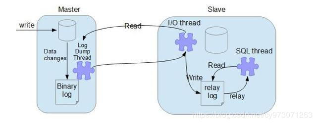

- 主节点log dump：主节点上创建的log dump线程，读取binlog前加锁，读取完后释放，随后发送给slave节点，**主节点给每个slave节点都创建一个log dump线程**
- 从节点I/O线程：从节点上`start slave`后，创建一个io线程连接主节点，请求binlog，然后保存在本地**relay-log**（中继日志）中
- 从节点SQL线程：读取relay-log中内容解析成操作并执行，实现一致性

### 复制模式

- **异步模式**（默认，async-mode）：主节点不会推送binlog到从节点，执行完客户端事务后立刻返回，并不关心从节点binlog状态。**此时如果主节点挂掉，binlog未传到从节点，从节点又升级为主节点，可能导致数据不一致**
- **半同步模式**（semi-sync）：等待至少一个从库接受并写binlog到relaylog中才返回成功信息给客户端，提高了数据可靠性，但造成了一定延迟，最少也是一个TCP/IP往返时间。
- **全同步模式**：所有从节点都复制了该事务并执行完成才返回给客户端，性能严重影响
- **GTID复制**（global transaction identifier，全局事务id）：mysql 5.6后支持
  - 在基于binlog的复制中，从库需要告诉主节点从哪个偏移量开始同步，如果指定错误可能会造成数据遗漏。
  - 而这种方式从库告诉主库已执行事务列表，主库返回从节点未执行的事务id列表返回
  - binlog中会额外带有GTID，便于从节点对比
  - 局限：主从库存储引擎必须一致；如果一个sql同时更新一个事务引擎和非事务引擎的表导致多个gtid粉给了一个事务等
- 多线程复制：5.7后可以用逻辑时钟的方式分配线程，提高复制性能

### 复制方式

基于sql的复制（statment）；基于行的复制（row）和混合模式复制（mixed）

详见binlog部分
