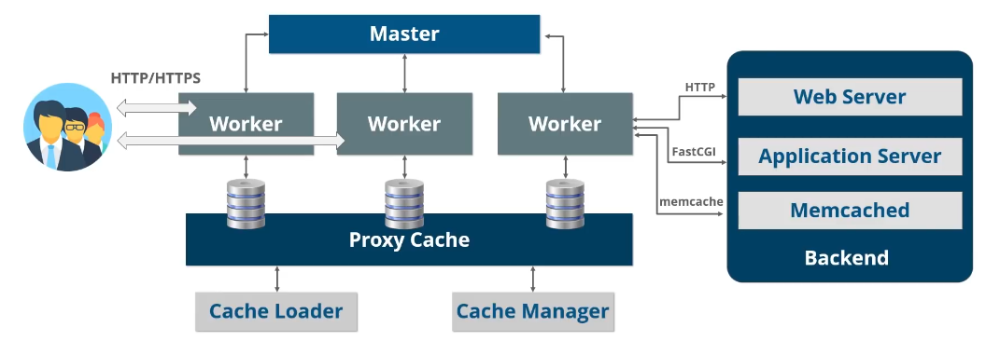

## Summary

这篇文章介绍了Nginx的基本概念

## overview

- 高效的HTTP和反向代理服务器，转发请求到后面的服务，可以有一定负载均衡（如加权轮询，把更多请求打到资源更充足的服务端）的能力。
- 占用内存小，并发能力强，官方数据支持5w个并发连接响应。
- 正向代理和反向代理：VPN-帮忙代理客户端，转发请求。反向代理：代理服务端，让客户端只访问一个域名就可以转到多个服务端。
- `iphash`：相同ip的请求都发到一个服务端，解决session不共享问题，不建议直接用nginx，考虑最前面用redis来作为最前端的server。
- **动静分离**：静态资源交给nginx直接返回
- 重写`rewrite`：比如访问80的都转到443



master-slave架构，事件驱动模型，异步进行，主要由三部分构成

- master：一个master thread，接受client请求，转发给worker并立刻接收下一个请求（不等待worker）；有worker返回数据后返回response给client
- workers：多个worker thread，处理master转发的client请求
- cache：用于缓存页面并快速返回，而不是从server中再次获取

## architecture


**一个nginx process**有一个master thread、多个worker threads、一个cache loader 和一个cache manager thread。

- master负责的内容主要有：
  - 读取和验证配置
  - 创建、绑定和关闭sockets
  - 开始、终止worker
  - 热配置（修改配置而不需要重新启动，reconfiguring）
  - 热升级（non-stop binary upgrades）
- worker负责接受、处理连接，反向代理等多种功能，实际干活的
- cache loader：负责检查在磁盘上的缓存项及更新内存中的 cache metadata
- cache manager：主要是处理cache 过期和 cache 失效

### workers

- nginx不会spawn一个process或thread来处理每个新接入的请求，而是在每个worker process（single thread）中执行一个高效的`run-loop`来处理数以千计的请求。
- nginx worker监听和发送请求使用OS kernel机制——socket
- 在worker的`run-loop`里，为了实现高效异步处理请求，nginx使用`modularity`、`event notification`、`callback function`、`timers`等多种机制来尽可能保证处理不阻塞
- 由于没有对每一个请求新建线程/进程处理，nginx的内存消耗和CPU使用都很低。spawn的多个worker也便于扩展和利用多核处理器。
- worker数量配置建议：如果主要是CPU处理的（大量TCP/IP请求、SSL、compression等）则worker数量等于CPU核数；如果有许多disk io的（如从存储中提供内容-静态代理）则worker数量为CPU核数的1.5~2倍

### Caching

- nginx的缓存是以文件系统上的分层数据存储形式实现的，文件树结构可通过directory配置
- cache key和cache metadata存储在shared memory中，worker、cache loader和cache manager都可以访问。
- 生成缓存的过程：当nginx从上游服务中获取response时，内容会先写进一个临时文件在cache directory之外，当nginx完整处理这个请求后该cache落盘到cache directory中

## Configuration

- nginx的配置项从配置文件中读取，可能是`/usr/local/etc/nginx`或`/etc/nginx`目录下，主要的配置文件为`nginx.conf`
- 现在也支持从template中生成配置文件，使得动态环境变量成为可能。例如：

```conf
# nginx.template
server {
  listen ${LISTEN PORT};
  location / {
    proxy_pass ${NGINX_PROXY_PASS};
  }
}
```

- nginx的配置项由`master`线程读取和校验，并通过进程中的内存共享方式给到`worker`
- 配置项分为不同的block上下文，有`main`、`http`、`server`、`location`、`upstream`、`mail`（mail proxy）等。上下文不会交叠（overlap）

## Internals

- nginx通过一个流水线（pipeline）或者说链路（chain）来处理连接，该pipeline有许多不同的modules构成。
- `functional modules`包括`event modules`, `phase handlers`, `output filters`, `variable handlers`, `protocols`, `upstreams` and `load balancers`
- `http`和`mail` module位于 `core` 和 functional module间，提供额外一层抽象，保证对functional module的调用是有序的。
- 一个典型的http调用过程如下
  1. 客户端发送http 请求
  2. nginx core基于配置的location选择合适的phase handler
  3. 如果有配置，load balancer选择一个上游server做代理
  4. phase handler处理工作，将`output buffer`传给第一个`filter`（filter处理handler的输出）
  5. 第一个filter将output传给第二个filter
  6. 第二个filter将output传给第三个filter（以此类推，但并不需要等待上一个filter完全处理好，只要input available后即可）
  7. 最终的response发送给client
- 对于`worker`，其工作的内部的action如下
  1. 开始`ngx_worker_process_cycle()`
  2. 通过OS机制（如`epoll`和`kqueue`）处理events
  3. 接收events并执行event对应相关操作
  4. 处理/代理 请求的 header和body
  5. 创建response content（header、body）并将它发送给client（流式传输）
  6. 结束一个请求
  7. 重新初始化timer和events
- nginx对于一个请求，会依次执行processing phases来处理（每个phase选择对应的handler），例如，有一个virtual server时，request经过以下六个phase
  1. `server rewrite phase`
  2. `location phase`
  3. `location rewrite phase` (可能会把rewrite带到上一个阶段)
  4. `access control phase`
  5. `try_files phase`
  6. `log phase`

- **subrequests**
  - 一些web框架也叫`internal redirect`，可以发起多个请求组织成一个response给client
  - nginx的subrequest还可以嵌套和继承，如一个subrequest发起很多sub-subrequests
  - subrequest可以映射到磁盘文件、其他handler、上游server等多处

- **upstream**：与`proxy_pass`相关，将请求发送到upstream server（`backend`）并接受上游server的response

- **load balancer**：与`proxy_pass`相关，有多个upstream时选择合适的server route请求，常用方法如`round-robin`、`ip-hash`

- nginx的memory管理主要基于传递指针共享，尽可能减少在内存中的复制操作

## 代理缓冲

- 概念：nginx缓存upstream的响应，再用合适的速度发送给客户端。使用`proxy_buffering`配置

- 为什么有代理缓冲？一般而言，nginx和server通信速度快，和clinet通信较慢（在同一个机房）。如果和client通信太慢，则nginx和server的通信也会被拖慢，造成一次连接请求耗时太长，对server可能造成连接积压。

- 优点：nginx尽快缓存响应体，以合适的速度发给客户端，server连接就断开了，减少资源消耗。
- 缺点：占用nginx内存，如果响应较大缓冲区存不下还需要写到磁盘中占用IO；

- 因此，如果客户端到nginx的请求速度也很快就关闭代理缓冲，效率会更高。

- 延伸：`proxy_request_buffering`即缓冲client的request再发给服务

## proxy

一些常用配置，详解用注释写在一旁：

```conf
# 将请求代理转发到另一个url，支持正则
proxy_pass http://10.198.32.254/;

# 传递client的真实ip
proxy_set_header X-Real-IP $remote_addr;

# nginx会记录并前向传递ip chain e.g: client1, proxy1, proxy2
proxy_set_header X-Forwarded-For $proxy_add_x_forwarded_for;

# proto: http/https
proxy_set_header X-Forwarded-Proto $scheme;    

# `$host` equals the server name in the “Host” request Header
# if it is not set by request, it equals to the primary server name
proxy_set_header Host $host;


# Default is HTTP/1, keepalive is only enabled in HTTP/1.1
# In HTTP/1.1, nginx's Default Connection is `close`
# So we use "" to overwrite it to allow keepalive
proxy_http_version 1.1;
proxy_set_header Connection "";
```

## 参考资料

- [nginx](https://www.aosabook.org/en/nginx.html)
