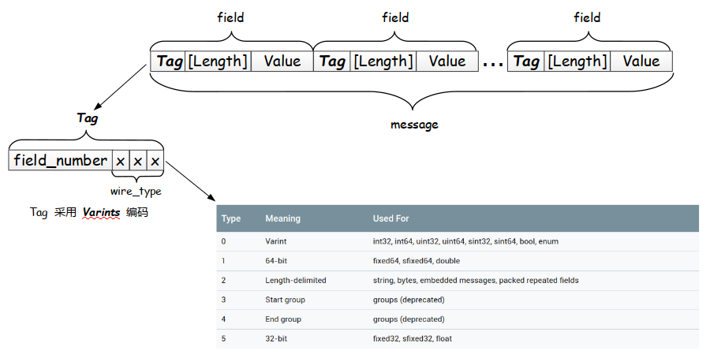
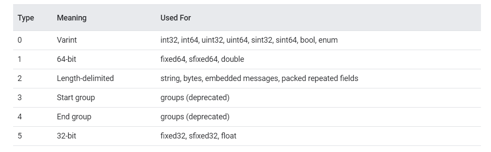
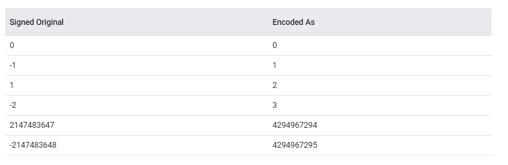

## Summary

This article introduces the basic concepts of Mysql.

## To be translated

Oh Sorry!

This blog has't been translated to English, please wait for a little while...

## 要点

1. 二进制序列化结构数据，时间和空间效率都比XML和json高。
2. proto3比proto2支持更多语言，且更简洁，去掉一些复杂的语法和特性。建议使用proto3
3. 基于现有proto进行自定义扩展如新增字段是可行的，但删除旧字段需要小心
4. 使用基于`SerializeToString`和`ParseFromString`两个核心操作

## 什么是protobuf

- **protocol buffers** 是一种**语言无关、平台无关、可扩展的序列化结构数据**的方法，它可用于（数据）通信协议、数据存储等。
- **可类比 XML**，但是比 XML 更小（3 ~ 10倍）、更快（20 ~ 100倍）、更为简单。
- 可自定义数据的结构，使用各种语言进行编写和读取结构数据。也可以更新数据结构，而不破坏由旧数据结构编译的已部署程序。

## protobuf版本说明

- proto3比proto2支持更多语言如go、ruby等，且更简洁，去掉一些复杂的语法和特性。
- 在第一行非空白非注释行写：`syntax = "proto3"`
- proto3移除了`required`，新增`Any`类型
- 移除`default`选项：字段默认值根据字段类型由系统生成。注意：默认值不会参与序列化
- 枚举第一个字段为必须为0
- ……

## 使用proto3

```protobuf
syntax = "proto3";      // 必须加上，否则默认使用proto2

message SearchRequest {
    string query = 1;     // 字段编号为1的字符串类型
    int32 page_number = 2;
    int32 result_per_page = 3;
    enum Corpus {
    UNIVERSAL = 0;
    WEB = 1;
    IMAGES = 2;
    LOCAL = 3;
    NEWS = 4;
    PRODUCTS = 5;
    VIDEO = 6;
    }
    Corpus corpus = 4;
}

message SearchResponse {
 ...
}
```

- 注意：每一个字段都有一个字段编号，用于二进制格式标识字段。1-15编号需要1个byte编码，16-2047编号需要两个字节。所以**高频使用字段放在1~15编号中**
- `singular`是默认字段规则，具有0/1个；`repeated`重复0~任意次
- `reserved`预留字段；或`enum`中的保留值
- `import`导入其他文件的定义，注意：导入proto2是可行的，但`enum`不能直接使用
- 支持嵌套类型
- `Any`需要`import "google/protobuf/any.proto"`，可以在没有指定proto定义情况下作为一个嵌套类型使用
- `oneof`：针对多个可选字段且只有一个字段会被设置时使用，可以节省内存
- `map`：关联映射如`map<string, Project> projects = 3;`
- `package`：可选添加，防止不同消息类型有命名冲突
- ……

## 对现有proto的扩展

可以在不破坏现有代码的情况下扩展proto，只需要满足以下条件：

- 不改变任何现有字段号
- 如果添加新字段，则在新代码中**注意旧消息的默认值**；旧代码中会视为**未知字段**并包含在序列化输出中（3.5及更晚版本）
- 如果删除某个字段，确保该字段不在新proto中使用
- `int32`、`uint32` `int64`、`uint64`、`bool`是兼容的，可以直接转换而不会破坏兼容性。（注意：64位数字用32位读取会产生截断）
- `sint32`、`sint64`是兼容的但不与其他`int`类型兼容
- `string`和`bytes`是兼容的，只要`bytes`是`utf-8`编码
- 嵌套消息和`bytes`是兼容的，只要`bytes`包含该消息的一个编码过的版本
- `fixed32`、`sfixed32`是兼容的，`fixed64`、`sfixed64`是兼容的
- 对于`string`、`bytes`、`message`，`optional`与`repeated`兼容
- `enum`与`int32`、`uint32` `int64`、`uint64`兼容（注意如果值不相兼容则会被截断），但客户端反序列化后可能需要不同的处理方式。
- 给`oneof`添加一个单独字段是安全且二进制兼容的，添加多个字段则需要小心只能有一个字段被设置。给任何现有的`oneof`添加任何字段都需要谨慎，这未必安全。

## 示例：电话簿应用（python）

- 编写proto文件

```protobuf
// adb.proto
syntax = "proto3";

message Person {
    string name = 1;
    int32 id = 2;
    string email = 3;
    // 电话类型枚举
    enum PhoneType {
        MOBILE = 0;
        HOME = 1;
        WORK = 2;
    }
    // 电话号码嵌套message
    message PhoneNumber {
        string number = 1;
        PhoneType type = 2;
    }
    // 一个人可能有多个电话，使用repeated
    repeated PhoneNumber phones = 4;
}

// 电话簿
message AddressBook {
    repeated Person people = 1;
}
```

- 进行编译
```protoc --python_out=./ adb.proto```

- 写测试

```python
import adb_pb2

def PromptForAddress(person):
    person.id = 1
    person.name = "ywt"
    person.email = "ywt@sensetime.com"
    phone_number = person.phones.add()
    phone_number.number = "12345678912"
    phone_number.type = adb_pb2.Person.MOBILE

def write_test():
    address_book = adb_pb2.AddressBook()
    address_book_file = "./book.txt"

    try:
        f = open(address_book_file, "rb")
        address_book.ParseFromString(f.read())
        f.close()
    except IOError:
        print(address_book_file + "Could not open file.  Creating a new one.")

    PromptForAddress(address_book.people.add())
    f = open(address_book_file, "wb")
    f.write(address_book.SerializeToString())
    f.close()
if __name__ == "__main__":
    write_test()
```

- 读测试

```python
import adb_pb2

def ListPeople(address_book):
    for person in address_book.people:
        print("Person ID:", person.id)
        print("  Name:", person.name)
        print("  E-mail address:", person.email)

        for phone_number in person.phones:
            if phone_number.type == adb_pb2.Person.MOBILE:
                print("  Mobile phone #: ", phone_number.number)
            elif phone_number.type == adb_pb2.Person.HOME:
                print("  Home phone #: ", phone_number.number)
            elif phone_number.type == adb_pb2.Person.WORK:
                print("  Work phone #: ", phone_number.number)


def read_test():
    address_book = adb_pb2.AddressBook()
    address_book_file = "./book.txt"

    f = open(address_book_file, "rb")
    address_book.ParseFromString(f.read())
    f.close()

    ListPeople(address_book)


if __name__ == "__main__":
    read_test()

```

## protobuf编码

要点：

1. varint、zigzag和packed编码方式
2. proto：tag、message的编码结构
3. 默认值的缺省优化

### 编码结构

protobuf采用和**TLV**（Tag-Length-Value）相似的结构，又有所不同。



1. message
如图所示，每个**message**由一个个**field**构成，每个field都是TLV结构。
注意此处**Length**是可选的（如果没有length，将会使用**Varint**编码）

2. Tag
Tag由**field_number**（字段编号）和**wire_type**（编码类型）构成，使用**Varint**编码方案进行编码。

wire_type有3bit，因此支持最多8种类型，目前已经使用了6种（注意：3和4 **group**已经被遗弃）


### Varint类型

阅读本部分前，请先阅读附录的**Varint**和**Zigzag**编码

当使用`int32、int64、uint32、uint64、bool、enum`作为字段类型时使用Varint编码

编码结构：TV（Tag-Value），不需要**Length**字段

#### int32、int64、uint32、uint64

以int32为例

```proto
syntax = "proto3";

message INT32 {
    int32 int32Val = 1;
}
```

- 将此字段设置为1，编码结果为：

```c
0x08 0x01 // tag-(Varints)0#000 1000，value-(Varints)0#000 0001
// 注：field number为1，type为000
```

- 将此字段设置为666，编码结果为：

```c
// 0666的补码：000 ... 101 0011010
0x08 0x9a 0x05 // tag-(Varints)0#000 1000 + value-(Varints)1#0011010  0#000 0101
```

- 将此字段设置为-1，编码结果为：

```c
0x08 0xFF 0xFF 0xFF 0xFF 0xFF 0xFF 0xFF 0xFF 0xFF 0x01 
// tag-(Varints)0#000 1000 + value-(Varints)1#1111111 ... 0#000 0001
```

int64、uint32、uint64 与 int32 同理

#### bool、enum

- bool实例

```proto
syntax = "proto3";

message BOOL {
    bool boolVal = 1;
}
```

- 将此字段设置为True，结果为：

```c
0x08 0x01  // tag-(Varints)0#000 1000 + value-(Varints)0#000 0001
```

可以看到和int32的1编码结果相同，是如何区分的呢？
经过测试，是通过生成的pb2文件中的的类型进行区分的。
如通过`INT32`类型读`0x08 0x01`结果就是1，通过`BOOL`类型读`0x08 0x01`结果便是True
测试代码：

```python
BOOL = test_pb2.BOOL()
INT = test_pb2.INT32()
BOOL.boolVal = True         # 0/1/False等可选
INT.int32Val = 1
print(BOOL.SerializeToString())
print(INT.SerializeToString())
BOOL.ParseFromString(b'\x08\x01')
INT.ParseFromString(b'\x08\x01')
print(BOOL.boolVal)
print(INT.int32Val)
```

结果：

```python
b'\x08\x01'
b'\x08\x01'
True
1
```

有一个有意思的点：如果将bool值设置为0或False，那么结果为`b''`，因为bool的默认值为false，规定解析时发现字段值为空会将字段设置为默认值，以此节省空间。

- enum实例

```proto
syntax = "proto3";
message Enum {
    enum COLOR {
        YELLOW = 0;
        RED = 1;
        BLACK = 2;
        WHITE = 3;
        BLUE = 4;
    }
    // 枚举常量必须在 32 位整型值的范围
    // 使用 Varints 编码,对负数不够高效，因此不推荐在枚举中使用负数
    COLOR colorVal = 1;
}
```

将字段设置为BLACK，编码结果为：

```c
0x08 0x02  // tag-(Varints)0#000 1000 + value-(Varints)0#000 0010
```

#### sint32、sint64

`sint32`、`sint64`采用zigzag编码，会多一个映射的过程，映射过程参照附录内容
如将字段设置为负数，结果为

```c
// 字段设置为-1
0x08 0x01  // tag-(Varints)0#000 1000 + value-(Varints)0#000 0001
// 字段设置为-2
0x08 0x03  // tag-(Varints)0#000 1000 + value-(Varints)0#000 0011
```

趣闻：开始protobuf只有`int`类型，后面因为`int`编码负数效率过低衍生出`sint`，而`sint`表达的正数有一部分是负数，所以又提供了`uint`适应全部是正数的场景。

### 64-bit 和 32-bit 类型——fixed64、sfixed64、double、fixed32、sfixed32、float

该类型与采用的编码结构为**Tag-Value**，不同的是不管数字大小，64-bit编码为8字节，32-bit存储为4字节。
这是因为**Varints**编码大数的时候使用的字节数更多，可能达到10字节之多。所以这两种类型用于大量大数的场景，反而能够节省空间。

以64-bit和double为例

```proto
syntax = "proto3";

message Example {
    fixed64 fixed64Val = 1;
    sfixed64 sfixed64Val = 2;
    double doubleVal = 3;
}
```

设置字段结果为：

```python
b'\t\x01\x00\x00\x00\x00\x00\x00\x00'   # fixed64=1
b'\x11\xff\xff\xff\xff\xff\xff\xff\xff' # sfixed64=-1（没有 ZigZag 编码）
b'\x11\x01\x00\x00\x00\x00\x00\x00\x00' # sfixed64=1
b'\x19\x00\x00\x00\x00\x00\x00\xf0?'    # double = 1
b'\x19333333\xf3?'                      # double=1.2
b'\x19\x00\x00\x00\x00\x00\x00\xf4?'    # double=1.25
b'\x19\x00\x00\x00\x00\x00\x00\xf0\xbf' # double = -1
b'\x19H\xe1z\x14\x0e\xb3\xc3@'          # double = 10086.11
```

`fixed`和`sfixed`数据都是按照固定字节数存储，`double`和`float`根据数据不同可能有所变化。

### Length-delimited 类型——string、bytes、EmbeddedMessage、repeated

此类型结构为TLV（Tag-Length-Value）

```proto
syntax = "proto3";
message Example {
    string stringVal = 1;
    bytes bytesVal = 2;
    message EmbeddedMessage {
        int32 int32Val = 1;
        string stringVal = 2;
    }
    EmbeddedMessage embeddedExample1 = 3;
    repeated int32 repeatedInt32Val = 4;
    repeated string repeatedStringVal = 5;
}
```

设置相应值，得到结果如下(python)

```python
WRITE = test_pb2.Example()
WRITE.stringVal = 'hello,world'     # b'\n\x0bhello,world'
WRITE.bytesVal = b'are you ok?'     # b'\x12\x0bare you ok?'
WRITE.embeddedExample1.int32Val = 1 # b'\x1a\x02\x08\x01'
WRITE.embeddedExample1.stringVal = "embeddedInfo"  # b'\x1a\x0e\x12\x0cembeddedInfo' 
WRITE.repeatedInt32Val.append(2)    # b'"\x01\x02'
WRITE.repeatedInt32Val.append(3)    # 一起读：b'"\x02\x02\x03'
WRITE.repeatedStringVal.append("repeated1") # b'*\trepeated1'
WRITE.repeatedStringVal.append("repeated2") # 一起读：b'*\trepeated1*\trepeated2'

print(WRITE.SerializeToString())
# b'\n\x0bhello,world\x12\x0bare you ok?\x1a\x10\x08\x01\x12\x0cembeddedInfo"\x02\x02\x03*\trepeated1*\trepeated2'
```

可以看到，有几个特点：

- 如果是以python为编码，并不会将字符串完全序列化为二进制。如果是C++的结果是：

```c
// 参考https://www.jianshu.com/p/73c9ed3a4877
0A 0B 68 65 6C 6C 6F 2C 77 6F 72 6C 64      // hello,world
12 0B 61 72 65 20 79 6F 75 20 6F 6B 3F      // are you ok?
1A 10 08 01 12 0C 65 6D 62 65 64 64 65 64 49 6E 66 6F // EmbeddedMessage
22 02 02 03                                 // repeated int
2A 09 72 65 70 65 61 74 65 64 31 2A 09 72 65 70 65 61 74 65 64 32   // repeated string
```

- 默认**packed=True**，所以**EmbeddedMessage**和**repeated**可对数据进一步压缩

## 附录1：Varints编码

要点：

- 每个字节使用1个bit msb 作为标识符
- 用更少的字节表示小的正数
- 负数编码反而使用更多的字节

1. 规则：
在每个字节开头的 bit 设置了 **msb**(most significant bit)，标识是否需要继续读取下一个字节
存储数字对应的二进制补码
补码的**低位排在前面**

2. 实例：

以1的简单例子引入，注意**此时只使用了1个字节**，而正常的int32要**4个字节**

```c
int32 val =  1;  // 设置一个 int32 的字段的值 val = 1; 这时编码的结果如下
原码：0000 ... 0000 0001  // 1 的原码表示
补码：0000 ... 0000 0001  // 1 的补码表示
Varints 编码：0#000 0001（0x01）   // 1 的 Varints 编码，其中第一个字节的 msb = 0
```

说明666的例子，注意此时补码**低位排在前面**，只使用了**2个字节**

```c

int32 val = 666; // 设置一个 int32 的字段的值 val = 666; 这时编码的结果如下
原码：000 ... 101 0011010  // 666 的原码
补码：000 ... 101 0011010  // 666 的补码
Varints 编码：1#0011010  0#000 0101 （0x9a 0x05）  // 666 的 Varints 编码
```

说明-1的例子，-1的补码8个字节都要使用，加上msb的额外开销，最终反而使用了**10个字节**

```c
int32 val = -1  // int32出于兼容性考虑，protobuf扩展到了8个字节（针对负数）
原码：1000 ... 0001  // 注意这里是 8 个字节
补码：1111 ... 1111  // 注意这里是 8 个字节
Varints 编码：1#1111111 ... 0#000 0001 （FF FF FF FF FF FF FF FF FF 01）
```

## 附录2：ZigZag编码

如何解决varint编码针对负数效率低下的问题呢？protobuf给出了`sint32`/`sint64`的解决方案
使用zigzag编码，即：**有符号整数映射到无符号整数，然后再使用 Varints 编码**


注意：此处的映射是以**移位**实现而非映射表实现的

```c
// 注意右移是arithmetic shift即考虑符号的右移
(n << 1) ^ (n >> 31)    // sint32
(n << 1) ^ (n >> 63)    // sint64
```

## 附录3：Packed编码

在proto3中为默认设置，只用于primitive类型
**packed**将repeated的`T-L-V-T-L-V……`结构转化为`T-L-V-V-V-V……`

例如：上文中的repeated int读出`b'"\x02\x02\x03'`
因为整个message只有一个repeated int，没有tag可能是因为`"`缺省tag标识，`0x02`表示长度为2，后面`0x02`和`0x03`表示数字2和3

如果我们再append数字6，则会读出`b'"\x03\x02\x03\x06'`

如果整个message有多个repeated int呢？

```proto
message Example {
    repeated int32 repeatedInt32Val = 4;
    repeated int32 repeatedInt32Val2 = 6;
}
```

那么则会根据大小顺序读出不一样的值，如`repeatedInt32Val2`读出`b'2\x03\x02\x03\x06'`

## 参考资料

- [google](https://developers.google.com/protocol-buffers/docs/overview)
- [hello_protobuf](https://github.com/menghaocheng/hello_protobuf)
- [@404_89_117_101](https://www.jianshu.com/p/73c9ed3a4877)
