## Summary

This article introduces the basic concepts of Ray.

## To be translated

Oh Sorry!

This blog has't been translated to English, please wait for a little while...

## 零、基本介绍

ray是**UC Berkeley RISE Lab**开发的开源通用分布式计算框架，可以简单通用的 API 灵活运行计算密集型 Python 相关代码（从分布式训练、超参数调整到深度强化学习和生产模型服务。）

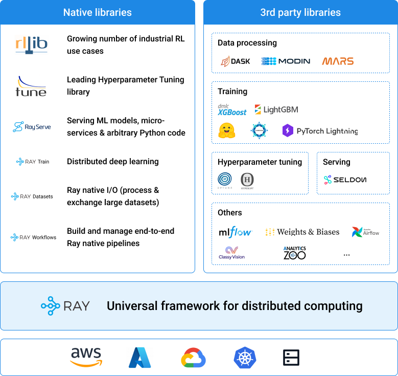

- Ray Core 为构建分布式应用程序提供了简单、通用的 API。

- Ray 的本地库和工具支持运行复杂的 ML 应用程序。

- 可以将这些应用程序部署在任何主要的云提供商上，包括 AWS、GCP 和 Azure，或者在自己的服务器上运行它们。

- Ray 还拥有不断增长的社区集成生态系统，包括 Dask、MARS、**Modin**、Horovod、Hugging Face、Scikit-learn、**lightgbm** 等。

## 一、实例导入

### 1、Hello World

```py
import ray
import time

# Start Ray.
ray.init()

@ray.remote
def f(x):
    time.sleep(1)
    return x

# Start 4 tasks in parallel.
result_ids = []
for i in range(4):
    result_ids.append(f.remote(i))
    
# Wait for the tasks to complete and retrieve the results.
# With at least 4 cores, this will take 1 second.
results = ray.get(result_ids)  # [0, 1, 2, 3]
print(results)

```

`ray.get()`的本质是从`ObjectStore`里获取对象。先看本地有没有，本地没有去其他节点的`ObjectStore`里找，其他节点有则pull到本地。在`ObjectStore`查到对象后，worker通过共享内存的方式将对象内存地址映射到自己的进程空间中，并反序列化为python对象。
建议多次使用/获取的变量通过`ray.put()`的方式写入，以减少作为函数参数时自动生成放入`ObjectStore`的数据量。

```py
# 对象x往ObjectStore拷贝里10次
[f.remote(x) for _ in range(10)]

# 对象x仅往ObjectStore拷贝1次
x_id = ray.put(x)
[f.remote(x_id) for _ in range(10)]
```

### 2、任务阻塞

```py
import numpy as np
import ray

@ray.remote
def create_matrix(size):
    return np.random.normal(size=size)

@ray.remote
def multiply_matrices(x, y):
    return np.dot(x, y)

x_id = create_matrix.remote([1000, 1000])
y_id = create_matrix.remote([1000, 1000])
z_id = multiply_matrices.remote(x_id, y_id)

# Get the results.
z = ray.get(z_id)   # 注意：它不会直接被执行，而是等待x, y执行后才执行

```

### 3、actor

actor是python类实例化的产物，可以做到多个任务之间共享状态甚至调用方法（分布式下一样如此）

```py
import ray

ray.init()

@ray.remote
class Counter(object):
    def __init__(self):
        self.n = 0

    def increment(self):
        self.n += 1

    def read(self):
        return self.n

counters = [Counter.remote() for i in range(4)]
[c.increment.remote() for c in counters]
refs = [c.read.remote() for c in counters]
print(ray.get(refs))

```

## 二、设计

### 1、Overview

#### A、API philosophy

- 提供简单、通用的API给用户
- 通过参数配置，给用户对系统更细粒度的控制，如`task placement`, `fault handling`, 和 `application lifetime`.

#### B、System scope

通用分布式应用开发组件，支持：

- coarse-grained elastic workloads（弹性工作负载）：Serverless Computing
- machine learning training：(例如, Ray Tune（超参数优化框架）, RLlib（可扩展的强化学习库）, RaySGD)
- online serving (例如, Ray Serve)
- data processing (例如, Modin, Dask-on-Ray, MARS-on-Ray)

#### C、System design goals

- **API simplicity and generality**
- **performance** (low overhead 低开销 and horizontal scalability 水平扩展)
    基于gRPC，却又可以实现原生grpc的效率；相比单独直接使用gRPC，ray基于分布式共享内存和分布式执行调用起来更简单
- **reliability**
    ray引入了**distributed reference counting protocol**来保证内存安全

#### D、Related systems

- Cluster Orchestrators：可以运行在Cluster Orchestrators（如k8s、slurm）之上，提供更轻量的基元即task和actor，而不是container和service。（备注：在slurm上运用ray并不直观，需要多个srun命令启动一个ray集群，包括选择一个头结点，再让worker通过主机名和ip地址（网络通信）连到头结点，之后才能执行使用ray的python脚本。每个任务需要在**单独的节点**上运行（tasks-per-node=1）。其中，需要重点注意端口绑定和ip绑定，用户需要避免冲突。）
- Parallelization Frameworks：相对`multiprocessing`或`celery`，更高效且支持内存共享
- Data Processing Frameworks：和`Spark`, `Flink`, `MARS`, or `Dask`相比，提供更底层灵活的API，同时没有限定数据结构
- Actor Frameworks：和`Erlang` and `Akka`相比，ray集成现有编程语言可以用原生语言库，可以显式进行无状态任务并行计算，且可以在actor间内存共享
- HPC Systems（高性能计算系统）：相对HPC系统以message接口通信，虽然更灵活，但用户使用成本更高。

### 2、Architecture Overview

#### A、Application concepts

- **task**：无状态的函数，或者有状态的方法，`@remote()`修饰，用`ray.remote()`调用，返回`ObjectRef`以获取返回值
- **Object**：不可变的对象，可以用`ObjectRef`获取
- **Actor**：有状态的类对象，传输时必须是一个实例
- **driver**：运行`ray.init()`的初始环境，提交任务
- **Job**：从一个driver中生成的tasks, objects, and actors的集合

#### B、Design


Global Control Store (GCS) ：管理 system metadata，为了保障性能，GCS只控制不常用但是会被所有其他节点都用到的信息，如`node membership`等。

##### a、Ownership

**ownership**是一个去中心化的概念，每个worker process作为owner管理自己提交的任务（向raylet申请资源、确保任务正常执行）和`objectRef`返回值的获取。

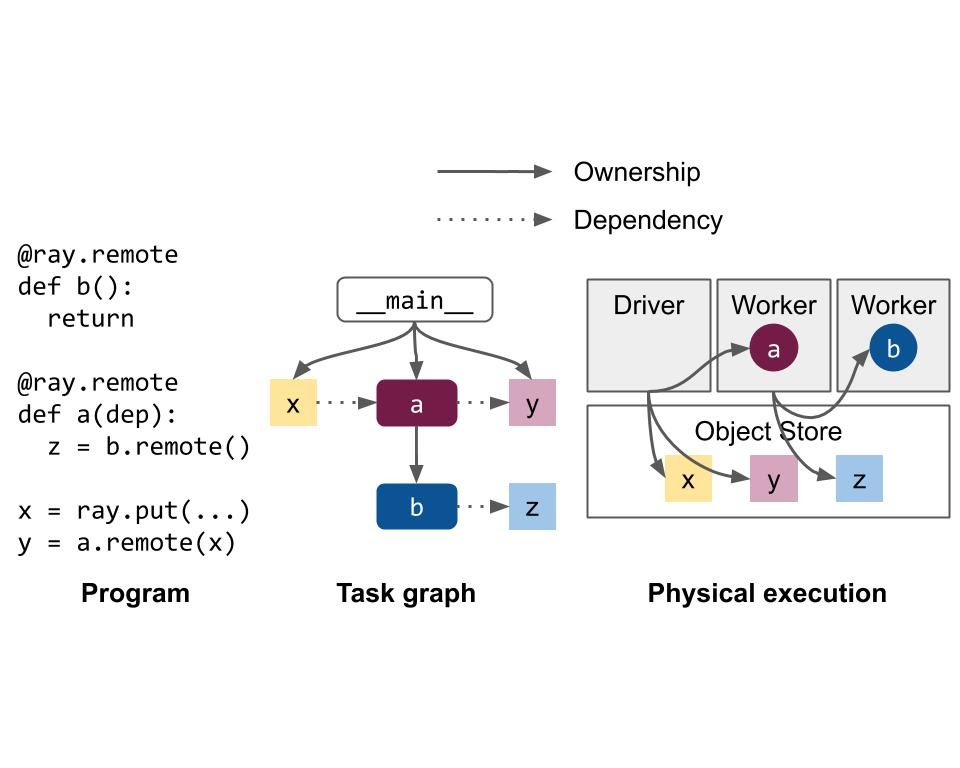

相比于Ray versions <0.8（GCS负责管理object相关的metadata，意味着GCS在大多数系统操作的关键路径上），有以下好处：

- **Low task latency** (~1 RTT（Round-Trip time, <200us)
- **High throughput**(~10k tasks/s per client; linear scaling to millions of tasks/s in a cluster)：在嵌套函数调用中，system metadata很自然地被分包
- **Simplified architecture**：owner拥有了相关的objects和system metadata
- **Improved reliability**：任务失败可以迅速定位到其owner

当然也有缺点：

- object的owner必须**reachable**，如果owner挂掉，object会**直接丢失**
- 目前ownership**不能**在worker间传递

##### b、Components

每个结点有：

- 一个或多个的worker processes，每个process有：
  - An ownership table：所有object的位置和计数等
  - An in-process store：存储**较小的**object
- raylet：对于所有process共享，它有：
  - A scheduler：处理资源、填充任务参数等
  - A shared-memory object store (**Plasma Object Store**)：用于存储和传输**较大的**object

头结点额外有：

- The Global Control Store (GCS)
- The driver process：执行top-level application的，如`__main__`，能够提交任务但不能直接执行。

##### c、Connecting to Ray

以下三种类型：

- 本地起集群（只有一个节点的ray实例）：`ray.init()`
- 本身就在一个ray集群中（在某个结点上），连到这个ray集群：`ray.init(address=<GCS addr>)`
- 连到一个远端的machine：`ray.util.connect()`，注意这个因为网络延迟可能比较慢。

##### d、Language Runtime

底层核心（包括`ownership table`、`in-process store`、`gRPC connection`）使用C++开发，支持python和java高级调用

Core worker 源码：[链接](https://github.com/ray-project/ray/blob/master/src/ray/core_worker/core_worker.h)

包括task和actor task的分配、进程内数据存储、内存管理

#### C、Lifetime of a task

一般地，由owner控制task的生命周期，包括申请资源、确保执行、获取返回值等

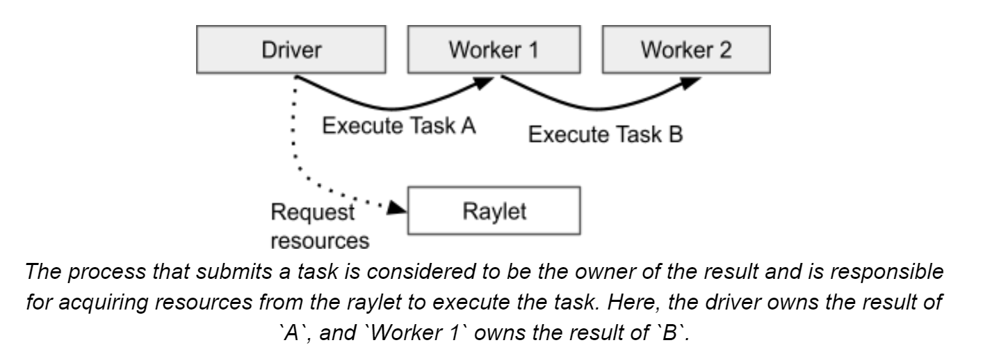

1. owner准备参数，一般地，参数会作为task的描述传递给worker。但如果有`objectref`作为参数，那么根据object大小（100KB）区分：

   a、小的话会直接从owner的in-process object store里面取出放入task描述

   b、大的话`scheduler`会将这个object进行节点间传递，让worker可以在新节点的内存共享区获得这个object。**放到一个worker node的内存共享区（plasma）后，所有当前节点worker process都能直接引用这个object**
2. owner发现object available后，向`distributed scheduler`申请资源，如果资源充足，`scheduler`会将合适worker的address发给owner
3. owner基于**grpc**发送task specification给worker，worker执行任务
4. **重点**：如果返回值序列化后的object较小，会直接返回给owner，owner将返回值放入in-process object store；如果返回object较大，那么worker会存储object在本地内存共享存储区并且告诉owner这些object的存储位置。

error的处理：

- 用户任务的error，那么错误会被catch并在返回值中返回
- 系统error如raylet错误，那么根据配置会进行一定次数的重试

#### D、Lifetime of an Object

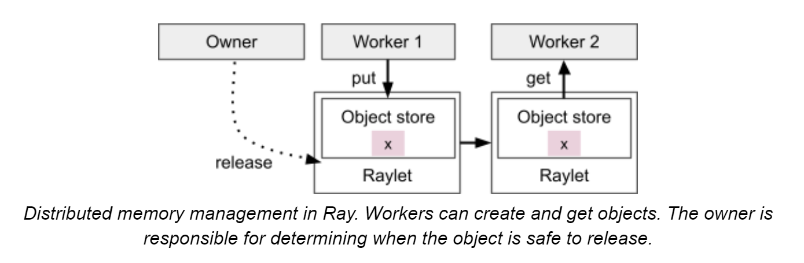

owner即创建`objectRef`的worker。

目前在ray中，**如果owner挂掉，那么所有由`objectRef`尝试获取这个`object`的请求都会报错，即使有多份这个object的copy**

每个worker对于object持有ref count，具体后文细说

如上文task生命周期所说，object根据大小会存储在owner的`in-process store`或者`distributed object store`（带有一个特殊的distributed protocol）

#### E、Lifetime of an Actor

不同于task的去中心化管理，`actor`的生命周期和metadata（IP、port等）全部由GCS管理，actor的client会存储这些metadata并通过**grpc**向actor发送请求。

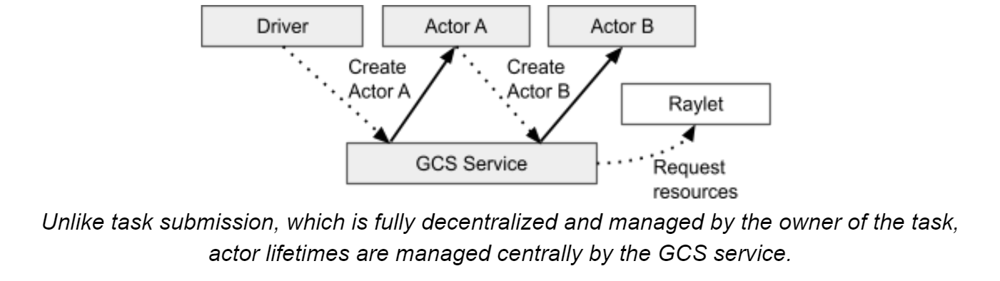

过程：

1. 当在python中创建actor时（`a = cls.remote()`），worker向GCS**同步**注册一个actor（防止worker创建actor失败，创建后worker就是异步了）
2. worker queue一个特殊的task（`actor creation task`，相当于普通task，但有一些额外资源），处理依赖后将此任务送至GCS调度，与此同时，python获取到了`actor handle`，即使actor这时候并没有完全创建完毕。
3. 之后在actor上的task执行如普通task一般，但有两点不同：

- 资源不再需要申请，因为actor创建时已经被保证了足够的资源
- 对于一个actor的任务的调用，顺序会与submit的一致（除非`async actor`），这是因为caller在submit task时带有一个`sequence number`（**如果多caller则无法保证顺序**）

actor的清理：

creator退出/task全部执行完毕且在集群中不存在handle的时候actor自动清理。（`detached actor`不同，设计用于长期保留的task，可以用name来call，需要显式清理）

#### F、Failure Model

##### a、System Model

- 一般而言，ray worker node都是同质化的，挂掉不影响全局，但管理GCS的head node挂掉就会导致全局挂掉。现在ray团队正在努力让任何结点都可以成为head结点，提高可用性

- 所有结点通过**heartbeats**机制保持通信

- `GCS`记录各个worker node id和状态，如果一个node挂掉，那么会分配一个新的id、重建raylet并继续使用那台机器上的物理资源。

- 对于一个结点上的worker process，由raylet控制。如果worker process挂了，raylet会告知GCS，GCS广播这个failure来处理task失败和**actor death**。此外，raylet还需要释放该worker process的资源，包括CPU、GPU等集群资源和该worker process持有的**object store memory**

##### b、Application model

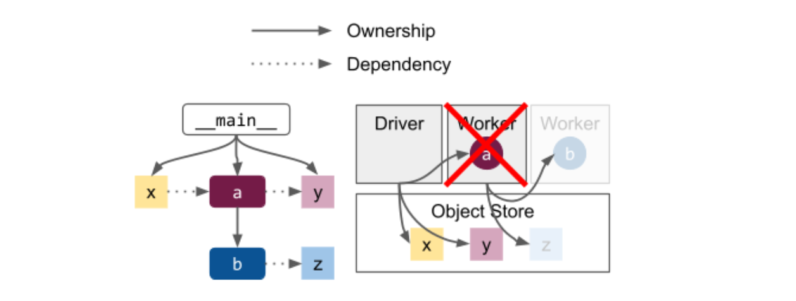

- ray的objects和task与其owner **fate-share（命运共享）**，如上图node worker a挂了，那么b和z都将丢失，所以获取b/z的行为会报错（不论b是task还是actor）。

- 为了减少上述问题，ray也提供了一些方法
  - **detached actor**，生命周期长于driver，必须显式删除
  - **object spilling**，让object生命周期长于owner
  - 一些自动恢复机制，如**task retries**，**actor restart**，**object reconstruction**等

## 三、Object management

核心：区分小object和大object

- 小object从`in-process store`中获取
- 大object从`plasma（object store）`中获取

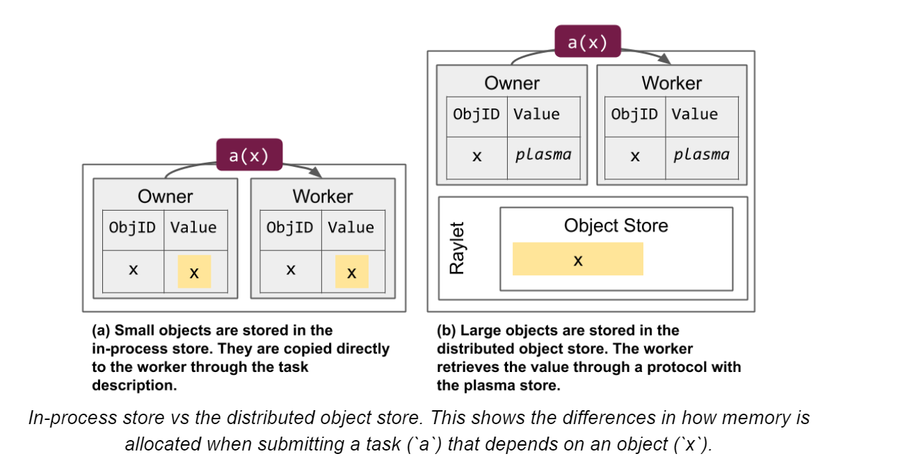

### 1、object resolution

- `objectRef`定义：20-byte的identifier（task的id和task已产出的object数量拼接而成）；owner的地址（包括worker process的id、IP、raylet的id等）

下图介绍了如何在节点间共享object

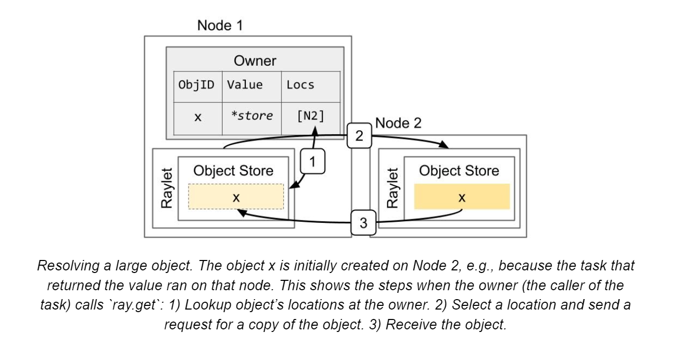

### 2、Memory management

**primary copy**：最初放在object store的数据，不可被驱逐（除非引用计数到了0）。其他copy在内存压力下可能会被删除

下图介绍了多个节点备份多个object，其中有一份是**primary copy**

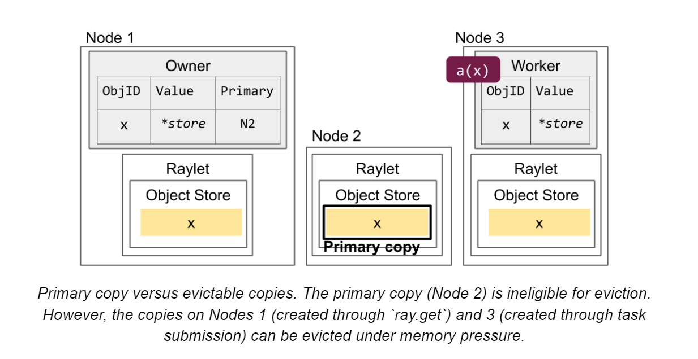

- 如果primary copy挂了，会在现有copy中指定一份新的
- 如果引用计数归0，那么所有object的copy都会被删除；`in-process store`的立刻删除，`object store`的异步删除

- object可能因为以下原因在一个node上存储
  - worker process调用`ray.get()` 或者 `ray.wait()`（请求一个objectref的列表，可以部分返回）
  - 作为那个结点上执行的task的返回值，或是那个结点上正在排队的task的参数
  - 那个结点上的worker process调用`ray.put()`
  - 早先在结点上被使用，还没有删除

#### a、Handling out-of-memory cases

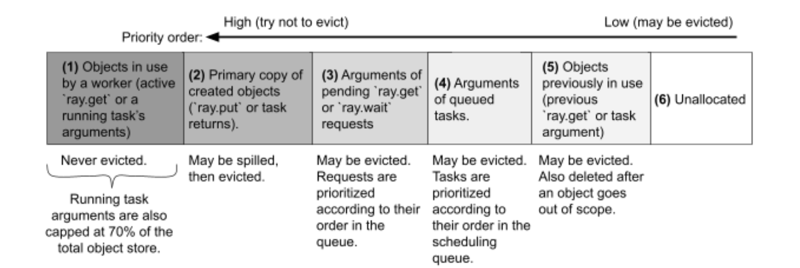

- 一般从5~3进行释放，如果还不够会启用**spilling**（ray1.2后）机制来支持2的释放
- 如过正在处理的1占用过多，超过默认cap 70%，那么会报错`ObjectStoreFullError`
- 正在处理的1中有一个特殊的概念，**borrower**，即虽然不是owner但正在使用的。

#### b、Object spilling and persistence

使用**external storage**来spill内存中无法存放的object，目前支持两种external storage：

- local storage（disk）
- distributed storage（S3）

overview of spilling process：

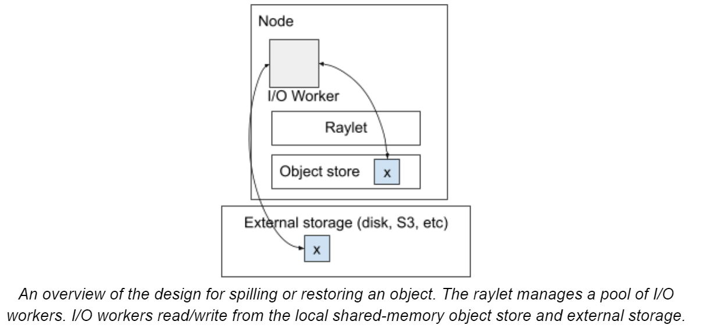

注意：可能存在object被存储在其他结点的disk上的情况，那么需要先让其他结点取到其他节点的raylet中，然后再raylet间传递过来。

值得指出的是，**ray在IO到磁盘的时候为了减少多文件开销，将多个object存放在一个文件里**，超过100MB才新建文件。

ray也可以支持多目录spilling，在有多个文件系统（如多个磁盘，不共享IO）的时候可能能提升效率。

已知的限制：

- 存储丢失则object丢失
- owner挂掉则object丢失（因为owner记录着位置）
- 正在使用的objects被`pinned`，不会被spill，如正在使用的numpy array，只有application释放它们的时候才可以被spilled

### 3、Reference Counting

一般地，owner的`local ref count`包括：1、python引用计数。2、使用该object的pending的task数量。前者随python的objectRef对象引用计数减少而减少，后者当task成功完成时递减（application-level的exception认为是成功完成）

新的概念：**borrower**

例子引入

```python

@ray.remote
def temp_borrow(obj_refs):
  x = ray.get(obj_refs[0])

@ray.remote
class Borrower:
  def borrow(self, obj_refs):
    self.x = obj_refs[0]

x_ref = foo.remote()
temp_borrow.remote([x_ref])  # 临时借
b = Borrower.remote()
b.borrow.remote([x_ref])  # 永久借

```

owner会持有一个list存储当前的所有的`borrowers`，当还有borrower在使用这个ref的时候，owner不会删除这个object。
当borrower用完该ref后，告知owner已经用完，owner将其从list中移除。（这一过程是通过**long-running async RPC**实现的）

#### a、Actor Handles

对于actor，使用一个`dummy object`来代表这个actor，这样可以复用object的引用计数协议
当`dummy object`的引用计数归0，owner将告知`GCS`可以安全地删除这个actor

#### b、Interaction with Python GC

因为python的`garbage collector`并不总会及时地清除无效的`objectRef`，这些`objectRef`持续保持着分布式存储区的object的生命周期，所以当存储区快满的时候，ray会自动调用`gc.collect()`

### 4、Object Loss

- object从`distributed memory`中丢失：

如果该object非`primary`，无妨；
如果为`primary`，将会指定一个新的object备份作为`primary`
如果全部丢失，则报错。注：**object reconstruction**如果启用的话，ray会尝试再次执行当初创建这个object的task以获得这个object

- owner of object丢失

无解，报错。

## 四、Resource Management and Scheduling

ray在startup的时候会自动侦测环境的CPU、GPU和memory

### 1、Task scheduling (owner-to-raylet protocol)

task调度过程：

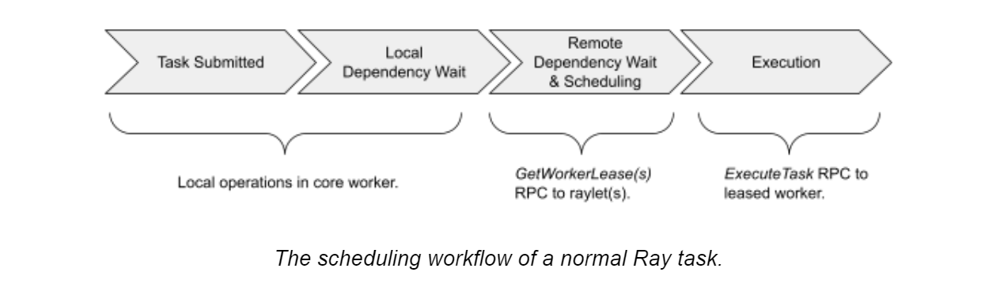

向raylet申请资源和调度到worker：

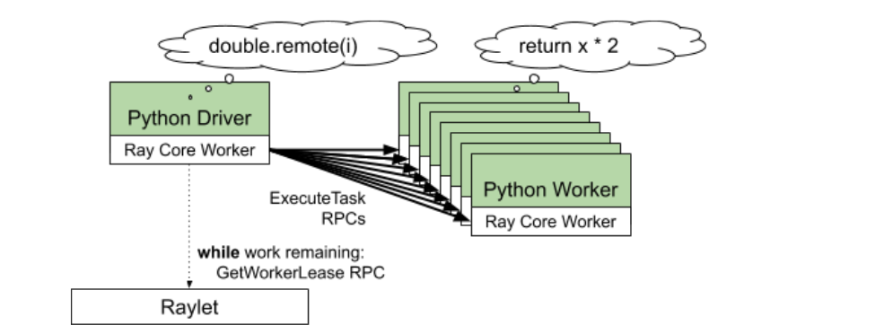

向raylet申请资源，优先分配本地worker（可并行）
如果没有足够的资源，会给driver其他节点的raylet地址，让driver请求新的raylet（即**spillback scheduling**）

### 2、Distributed scheduler (raylet-to-raylet protocol)

#### a、Resource accounting

- 每个`raylet`跟踪local的资源，分配后资源减少，收回后资源增加
- 与GCS心跳连接（100ms interval），每次心跳告知GCS当前资源情况。GCS广播资源情况告知其他`raylet`，保证`eventually consistent`

#### b、Scheduling policy

如果本地资源不足，会进行调度：

- 其他节点资源充足——`spillback scheduling`如上文所提
- 其他节点资源不足——queue这个task直到有地方有资源
- 其他节点总资源不满足（如100个GPU），warning给driver并queue这个task

今后，ray可能会支持优先spillback到一个有task argument的节点

### 3、Autoscaler

**Autoscaler**（也叫**Cluster Launcher**）负责添加节点以满足资源需求

控制流如下：

1. 计算所需的节点数（以满足pending的task、actor、placement group）
2. 启动新节点（新增总节点数/当前节点数不能超过`1 + upscaling_speed`这个阈值，`request_resources()`这个请求的除外）
3. 如果一个节点因timeout而idle超过5分钟，会将其剔除

ray支持多集群节点类型，包括物理实例（AWS p3.8xl GPU nodes vs m4.16xl CPU nodes等）和其他类型（IAM role, the machine image等），用户可通过`Custom resources`指定所需机器类型。

### 4、Custom Resources

创建节点时可声明节点的`Custom Resources`，如{"HasHardwareFeature": 1, "HasDatasetA": 1}.
之后task和actor便可需求这些资源，以保证确实地被调度到了这个节点上

### 5、Placement Groups

ray1.0后支持的功能，用于占位申请资源

### 6、Multi-tenancy

多租户相关

ray1.0版本后支持的功能，用于将单节点多worker设置不同的环境变量（PYTHONPATH, Java CLASSPATH等）以确保隔离，这些特殊设定的worker将不会被复用。

## 五、Global Control Store

ray版本<0.8时，GCS负责管理object相关的metadata，意味着GCS在大多数系统操作的关键路径上
ray版本>0.8后，GCS只负责存储关键的集群metadata如节点地址等，大幅提升效率且降低存储消耗

### 1、Storage

GCS目前用**redis**开发，目前正在试图删除redis依赖而使用mysql作为存储

- Actor Table：actor和状态的列表
- heartbeat table：clients、workers、nodes等和GCS相连的列表
- job table：正在集群running的job列表，如果job异常退出，ray会取消正在运行的关联task和actor以防止资源泄漏
- object table：维护大object（large share-memory object），ray1.3后已被移入ownership table
- profile（效能分析） table：存储Profiling events，可以理解为日志

### 2、persistence

ray目前使用redis作缓存而不支持持久化存储，因为redis有一个max size的限制，一些不重要的信息会被LRU eviction（Least Recently Used，最近最少使用，即未被访问时间最长的信息删除）

## 参考

- [官方文档](https://docs.ray.io/en/master/index.html)
- [官方设计文档](https://docs.google.com/document/d/1lAy0Owi-vPz2jEqBSaHNQcy2IBSDEHyXNOQZlGuj93c/preview)
- [扩展阅读](https://docs.google.com/document/d/1lAy0Owi-vPz2jEqBSaHNQcy2IBSDEHyXNOQZlGuj93c/preview#heading=h.na6spx4shhux)
