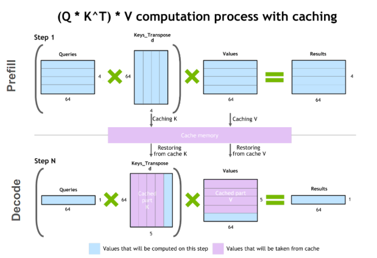

>The content in this page here is translated by claude 3.7 sonet.

## PyTorch

### Caching Allocator

Why do we need a Caching Allocator?

The key point is to reduce expensive calls to CUDA APIs: `cudaMalloc` and `cudaFree`.

- `cudaMalloc` blocks the CPU until allocation succeeds, returning a GPU memory pointer
- `cudaFree` blocks (synchronizes) until all operations that might use this memory across all streams are completed

What happens when there isn't enough cache during a `malloc` call?

First, it attempts to merge and free memory. If that's insufficient, it calls `cuda_malloc`. If device memory is still insufficient, it may report an error: `cudaErrorMemoryAllocation`

Note: malloc works as a best-match approach, avoiding returning blocks that are too large to prevent excessive splitting.

Similarly, when calling `free`, it doesn't immediately call `cudaFree`, but marks the block as free and adds it to the free list.

The `process_cross_stream_delayed_free` function handles previously recorded stream events. All operations on this block must be completed before it can be marked for freeing, preventing cross-stream issues.

When necessary, methods like `empty_cache()` will return memory to the system by calling `cudaFree` on the free list blocks.

## NLP

### Skip-Gram

The core idea of skip-gram: input a target word (center word `w`), then predict `window` words to the left and right within a specified `context` window.

The goal is to maximize the conditional probability of generating context words: `P(context | w)`

Process:

1. Preprocess corpus: tokenize, remove useless symbols, and vocabulary truncation (low-frequency words treated as unknown)
2. Generate training samples: e.g., for "I like eating apples" with "like" as the center word and window=2, create training pairs: ("like", "I"), ("like", "eating"), ("like", "apples")
3. Model structure and prediction

In the original word2vec, a simple two-layer neural network is used. The input is a one-hot vector (or index lookup) representing the center word, which passes through a hidden layer. Then it predicts the output layer's probability distribution (predicting context words). The objective is to maximize the dot product between the correct context words and the predicted context words.

How to calculate the probability distribution? `softmax`, but we know softmax compares probabilities across all words, which is inefficient for large vocabularies.

Therefore, we use **negative sampling** to sample only a dozen unrelated negative example words to compare with the positive example (treating the set as just these negative examples plus the current positive example). We want the positive example to score as high as possible and the negative examples to score as low as possible.

Note: Negative samples aren't real corpus words but randomly selected words forming meaningless word groups.

Why is this method effective? Because training is repeated iteratively, each center word will have a batch of negative examples, and with increasing iterations, most words will be seen.

Parameter count for skip-gram? Assuming vocabulary size V and embedding size d:

Total parameters are `V * d * 2` — Note: each word has a vector as a center word `V * d`, and another vector as a context word `V * d`. If output vocabulary size is denoted as `|C|`, the total parameter count can also be described as `V * d + C * d`.

### Flash Attention

Sequence Parallelism is essentially parallelizing by splitting the sequence.

Before flash attention, `O(N^2)` activation memory consumption was too large, so with sequence parallelism, each GPU only processed its portion of the sequence. But since self-attention depends on positional information, `all-gather` was needed to aggregate parts from other devices to calculate global attention scores. During backpropagation, `reduce-scatter` was needed for partial gradient reduction. Communication and computation overlap was typically designed to accelerate the process.

After flash attention emerged, self-attention computation became `O(N)`, but sequence parallelism still makes sense—other components like MLPs still consume significant memory. (In particular, the probability distribution of the final logits, which has `N*V` memory footprint. llama3 has `128K` vocab size and 8K sequence length! This can be reduced linearly if sequence parallel is turned on)

Flash attention implementation reference (doesn't provide speedup, just illustrates parallel thinking):

```py
import torch
import math

def attention(Q, K, V):
    d = Q.shape[1]
    scores = torch.matmul(Q, K.transpose(0, 1)) / math.sqrt(d)  # [seq_len, seq_len]
    weights = torch.softmax(scores, dim=1)  # Normalize scores for each query across all keys
    return torch.matmul(weights, V)  # [seq_len, dv]

def flash_attention(Q, K, V, block_size):
    seq_len, d = Q.shape
    dv = V.shape[1]
    output = torch.zeros(seq_len, dv)
    
    for i in range(0, seq_len, block_size):
        Qi = Q[i: i + block_size]  # [B, d]
        accumulator = torch.zeros(block_size, dv)      # Accumulates weighted results (numerator part)
        normalization = torch.zeros(block_size, 1)     # Denominator part
        running_max = -float('inf') * torch.ones(block_size, 1)
        
        for j in range(0, seq_len, block_size):
            Kj = K[j: j + block_size]  # [B_j, d], B_j same as B
            Vj = V[j: j + block_size]  # [B_j, dv]
            
            # Calculate scaled dot-product attention scores
            scores = torch.matmul(Qi, Kj.transpose(0, 1)) / math.sqrt(d)  # [B, B_j]
            # For example [[1, 2], [3,4]], where [1,2] represents scores of first query for all keys, so max dim=1 below finds max for current query
            local_max, _ = scores.max(dim=1, keepdim=True)  # [B, 1]
            new_max = torch.maximum(running_max, local_max)  # [B, 1]
            
            # log-exp-sum
            # We want `e^(s - running_max)` -> `e^(s - new_max)`
            # So e^(s - new_max) = e^(s - running_max) * e^(running_max - new_max)
            accumulator *= torch.exp(running_max - new_max)
            normalization *= torch.exp(running_max - new_max)
            running_max = new_max
            
            exp_scores = torch.exp(scores - new_max)    # max-shift
            accumulator += torch.matmul(exp_scores, Vj)
            normalization += exp_scores.sum(dim=1, keepdim=True)
        
        # output stores results of current block Q's computation with all K and V
        output[i: i + block_size] = accumulator / normalization
    return output


seq_len, d, dv, block_size = 4, 3, 3, 2
Q = torch.randn(seq_len, d)
K = torch.randn(seq_len, d)
V = torch.randn(seq_len, dv)

output_flash = flash_attention(Q, K, V, block_size)
assert torch.allclose(attention(Q, K, V), output_flash, atol=1e-4)
print("Flash attention:", output_flash.shape)
```

### RL

Standard RL: RLHF — Reinforcement Learning from Human Feedback

Chain-of-Thought RL: Guides the model to generate intermediate reasoning steps to improve performance.

1. Data: Dataset of problem, chain-of-thought, and answer triplets.
2. Training: Fine-tuning a pretrained LLM with this data
3. Inference: Prompts like "Let's think step by step" to encourage model to reason incrementally

Deepseek uses GRPO instead of PPO

Proximal Policy Optimization (PPO): A reinforcement learning policy gradient method

Simplified explanation: A student solves problems, a teacher grades them, and the student adjusts their solving method based on the grades. To prevent excessive adjustments, clipping is used to limit large changes.

Group Relative Policy Optimization (GRPO):

Simplified explanation: Multiple students provide multiple answers, which are compared together. Answers better than average are encouraged. This approach eliminates the need for additional teachers to evaluate, reducing computation while making updates more stable.

## Deep Learning

### Common Knowledge

Pruning alone (setting weights to zero) doesn't reduce model parameter count. To truly reduce model size and improve training speed, pruned weights are typically stored in sparse formats like CSR (Compressed Sparse Row), CSC (Compressed Sparse Column), or COO (Coordinate). Another approach is channel pruning, which reconstructs entire layers (like conv or linear) and requires corresponding adjustments to upstream and downstream shapes.

Dynamic batching: Combining multiple independent inference requests into a single batch for one GPU operation

1. Cache requests, storing them in a buffer for a brief time window
2. After the time window ends or enough requests accumulate, combine them into a batch
   For example: tensors of shape `[seq_len, embedding_dim]` are padded to make seq_len uniform (many derived techniques exist, like grouping similar seq_len together, then stacking into a tensor of shape [batch, seq_len, embedding_dim])
3. Launch GPU kernel computation on the combined tensor
4. Split output to ensure independent and correct responses for each request

Pin memory: Data is loaded into locked CPU pages that won't be swapped to disk by the OS, allowing the GPU to fetch data more quickly from this fixed memory.

Computation graph: Inplace operators cannot be used on leaf nodes (breaks computation graph, reporting error `a leaf Variable that requires grad is being used in an in-place operation.`), but can be used on intermediate variables. Additionally, if `+= tensor(requires grad)`, inplace operators can still properly compute gradients for this tensor.

`FLUX.1-schnell 12B`, a text-to-image model based on latent adversarial diffusion distillation, can generate images in just 1-4 steps, making it extremely fast. `FLUX.1-schnell` is part of the FLUX.1 model family, and compared to other variants like FLUX.1-dev and FLUX.1-pro, `FLUX.1-schnell` specifically emphasizes speed optimization.

Latent Adversarial Diffusion Distillation (LADD):

Simple understanding: A skilled teacher can generate realistic images in many steps; LADD teaches a student to generate realistic images in very few steps

- L: latent, working in latent space
- Distillation: distilling knowledge
- Adversarial: adding an adversarial loss (from a discriminator)

TRELLIS is a 3D asset generation model with 1-2B parameters, requiring 16GB VRAM. It's based on SLAT for unified 3D asset representation, capturing both geometric structure and appearance information for model generation.

`SLAT: Structured Latent Representation` is a unified structured latent representation (embedding input like images, text, etc., into a compact, high-dimensional vector that, unlike traditional embeddings, preserves spatial or hierarchical structural information, ensuring both local geometric details and global shape are represented in the encoding).

### Stack and Broadcasting Operations for Tensors

The stack method differs from cat in that it creates a new dimension.

For example:

- `a = torch.tensor([1, 2, 3])`
- `b = torch.tensor([4, 5, 6])`

```py
result0 = torch.stack([a, b], dim=0) # This becomes a [2,3] tensor (dim=0 means assembling all input tensors together)
tensor([[1, 2, 3],
        [4, 5, 6]])

result1 = torch.stack([a, b], dim=1) # This inserts a new dimension at the second dimension (dim=1, creates a new dimension between each element)
tensor([[1, 4],
        [2, 5],
        [3, 6]])
```

A larger example:

```py
import torch

# is_seg_intersect supports batch input, input shape [batch, 2, 2], returns [batch] boolean tensor
def is_seg_intersect(seg_1: torch.Tensor, seg_2: torch.Tensor) -> torch.Tensor:
    pass

def is_traj_intersect(traj_1: torch.Tensor, traj_2: torch.Tensor) -> bool:
    """
    traj_1, traj_2 are 2D trajectories with shape [N, 2]
    [[x0, y0], [x1, y1], ... [xn, yn]]
    """
    # traj_1[:-1] reads [[x0, y0], [x1, y1] ...  [x_n-1, y_n-1]] traj_1[1:]] reads [[x1, y1] ... [xn, yn]] 
    # After reading, both have shape [n-1, 2], then stacked on dim=1, forming
    # [[[x0,y0], [x1, y1]], [[x1,y1], [x2, y2]], ... , [[xn-1, yn-1], [xn,yn]]]
    # segs1 shape: [n1-1, 2, 2]
    segs1 = torch.stack([traj_1[:-1], traj_1[1:]], dim=1)
    # segs2 shape: [n2-1, 2, 2]
    segs2 = torch.stack([traj_2[:-1], traj_2[1:]], dim=1)
    
    # If either trajectory has fewer than two points, no segments can be formed, return False
    if segs1.shape[0] == 0 or segs2.shape[0] == 0:
        return False
    
    # Use broadcasting to create all possible segment combinations
    # broadcast segs1 to [n1-1, n2-1, 2, 2]
    segs1_expanded = segs1.unsqueeze(1).expand(-1, segs2.shape[0], -1, -1)
    # broadcast segs2 to [n1-1, n2-1, 2, 2]
    segs2_expanded = segs2.unsqueeze(0).expand(segs1.shape[0], -1, -1, -1)
    
    # Reshape both into batch input [batch, 2, 2], where batch = (n1-1)*(n2-1)
    segs1_batch = segs1_expanded.reshape(-1, 2, 2)
    segs2_batch = segs2_expanded.reshape(-1, 2, 2)
    
    # Batch call to is_seg_intersect, returning a boolean tensor of shape [batch]
    intersect_result = is_seg_intersect(segs1_batch, segs2_batch)
    
    # Trajectories intersect if any pair of segments intersect
    return intersect_result.any().item()
```

### Replacing Conv with BMM

Scenario: For example, when a conv operator is implemented with a for loop and runs slowly, we want to use a tiling approach to call efficient BMM operations instead of conv. (Sometimes also called **im2col**)

```py
import torch
import torch.nn.functional as F


def conv2d_bmm(input: torch.Tensor, weight: torch.Tensor) -> torch.Tensor:
    # input: (N, C_in, H, W) = (5, 1, 4, 4)
    # weight: (C_out, C_in, kH, kW) = (2, 1, 2, 2)
    N, C_in, H, W = input.shape
    C_out, C_in_2, kH, kW = weight.shape
    assert C_in_2 == C_in

    stride, padding = 1, 0
    H_out = (H + 2 * padding - kH) // stride + 1  # 3
    W_out = (W + 2 * padding - kW) // stride + 1  # 3

    # (N, C_in, H_out, W, kH) -> (5, 1, 3, 4, 2)
    tmp = input.unfold(2, kH, stride)
    # (N, C_in, H_out, W_out, kH, kW) -> (5, 1, 3, 3, 2, 2)
    input_unf = tmp.unfold(3, kW, stride)

    # permute to (N, C_in, kH, kW, H_out, W_out) # (5, 1, 2, 2, 3, 3)
    input_unf = input_unf.permute(0, 1, 4, 5, 2, 3).contiguous()
    # view to (N, C_in * kH * kW, H_out * W_out) (5, 4, 9)
    input_unf = input_unf.view(N, C_in * kH * kW, H_out * W_out)

    # view weight to (C_out, C_in * kH * kW)  # (2, 4)
    weight = weight.view(C_out, -1)
    # broadcast weight to (N, C_out, C_in * kH * kW)  # (5, 2, 4)
    weight_expanded = weight.unsqueeze(0).expand(N, -1, -1)
    # output: (N, C_out, H_out * W_out)  # (5, 2, 4) @ (5, 4, 9) -> (5, 2, 9)
    output = torch.bmm(weight_expanded, input_unf)

    # view output to (N, C_out, H_out, W_out)  # (5, 2, 3, 3)
    return output.view(N, C_out, H_out, W_out)


if __name__ == "__main__":
    N, C_in, H, W = 5, 1, 4, 4
    C_out, kH, kW = 2, 2, 2

    x = torch.randn(N, C_in, H, W)
    weight = torch.randn(C_out, C_in, kH, kW)

    output = conv2d_bmm(x, weight)
    output_conv = F.conv2d(x, weight, stride=1, padding=0)

    assert torch.allclose(output, output_conv)
```

## vLLM

vLLM: An open-source serving framework specifically designed to accelerate LLM inference

### KV Cache

Background: In traditional methods, each `generate` step requires recalculating Q, K, and V for all tokens, which is extremely inefficient for inference. Therefore, we use caching to store the K and V for each layer. When generating new tokens, we only need to calculate the K and V for the new token and concatenate with the cached content.

Autoregressive model stages:

1. Startup phase (prefill): Calculate K and V for all tokens based on the prompt at once, initializing the KV cache

2. Generation phase (decoding): For each new token generated, only calculate QKV for that token, then add the newly calculated KV to the cache. Then use the complete KV cache to calculate attention scores for the new token to get the result.

What are the optimization points of KV cache?

1. Avoiding repeated QKV calculations: Without KV cache, if t tokens have been generated, generating the t+1 token would require calculating QKV for all t+1 tokens. With KV cache, each time a token is generated, its K and V are added to the cache, avoiding repeated KV calculations for the previous t tokens.

2. Repeated attention calculations: Without KV cache, each step calculates an attention matrix of size `(t+1) * (t+1)`. With KV cache, we only need to calculate between the new token's Q and all cached KVs (including the new token's KV), which is a size of `(t+1) * 1`. Note: The output generated by old tokens in GPT language modeling inherently cannot see future words, so it doesn't depend on subsequent tokens. In other words, generating new tokens doesn't affect the output of old tokens.

Formula: `y = softmax(q_new * K.T / dk^0.5) @ V`, see the diagram for specific shapes



### PagedAttention

Traditional LLM inference frameworks allocate a fixed size **KV cache** for each request, which grows as tokens increase.

PagedAttention divides each request's KV cache into multiple fixed-size logical blocks (pages), then maps them to specific memory units through a page table. This allows on-demand memory allocation and enables memory sharing between requests.

During inference, which includes prefill (processing prompt) and decode phases (generating tokens step by step), dynamic memory allocation allows the token generation process to utilize caching.

### Dynamic Batching

Combining different requests' inputs into a single batch for processing.

Specific strategy: Continuous Batching, where each inference generates only one token, enabling immediate result return (streaming). Continuous Batching divides inference into iterations, and each iteration can process not only the current batch of requests but also allows new requests to join dynamically.

Using these two together supports streaming processing for multiple clients simultaneously.

### Architecture

LLMEngine: vLLM's core module, accepts requests, constructs SequenceGroups, and abstracts inference into steps.

Worker: Each worker corresponds to one GPU, incorporating CacheEngine.

Additionally, vLLM supports various hardware and mainstream LLMs.

Supplement: How are Q, K, V matrices obtained in attention? `Q=XWq, K=XWk, V=XWv`. Here, `X` is a tensor of shape `[seq_len, hidden_dim]`.

## Other Common Knowledge

Distributed storage HDFS (Hadoop Distributed File System): A core component of Hadoop that divides files into multiple blocks (e.g., 128MB) with default triple replication. It uses eventual consistency rather than strong consistency algorithms like Raft.

Apache Spark: A distributed data framework based on in-memory computation, capable of efficiently processing large-scale data

- Data cleaning and preprocessing: Reading logs from HDFS, S3, etc., and using DataFrames for cleaning, deduplication, and transformation
- Data aggregation and statistical analysis: Using Spark SQL for complex queries and aggregation operations, such as traffic volume, user behavior statistics, etc.
- Offline ML: Integrates with libraries like MLlib, data used for offline machine learning models

Canary deployments: Also known as gradual rollout, gradually pushes a new version to a small portion of users or servers in a production environment, gradually increasing the proportion until the new service is fully deployed.

ELK Stack (Elasticsearch + Logstash + Kibana)

EFK: Elasticsearch + Fluentd + Kibana. Logstash is more powerful, Fluentd is lighter weight.

Blue-green deployment: Similar to test vs. prod distinction, but blue-green environments emphasize having two complete production systems.

Cherry pick: Select one or a few commits to apply to the current branch.

Rebase: Move an entire branch's commit history to another branch, similar to automated cherry-picking of each commit.

For example:

```bash
         A(common ancestor) --- B --- C (feature)
        /
       D --- E --- F (master)
->
                                B' --- C' (feature)
                               /
   A --- D --- E --- F (master)
# Note: B and B' have the same content but different SHA. Cannot find historical records, so rebase is generally avoided
```

Standard deviation is better than variance: Same unit as original data. For example, if data is human height, variance units are square centimeters, while standard deviation remains in centimeters, which is more intuitive.

Standard deviation also has the 3-sigma rule for anomaly detection: `68-95-99.7` corresponding to three sigma levels.

`shared_ptr` uses reference counting; updating the reference count is thread-safe, but concurrent read/write to the same memory requires external synchronization. `unique_ptr` has exclusive ownership, no reference counting, and doesn't support copying or assignment.

## System Design

### Short Video Moderation Scenario

Background: Users upload videos to a short video platform. The system needs to review video content within seconds to determine if it contains violence, pornography, sensitive images, or other violations for subsequent manual review or direct blocking of violating videos.

We divide this into 3 parts:

1. Data

    At the data level, input is short videos. The first consideration should be text like titles and tags, converted to embeddings. Then process in stages—if the title already shows problematic tendencies, reject it first and enter detailed analysis (such as manual review). If not, we need to extract key frames using CLIP to extract embedding features, and create embeddings from audio for simple analysis.

    There may be many inputs (high concurrency), so Kafka message queues can be used for processing.

    Addition: Store in S3 or Ceph object storage.

2. Model

    After extracting embeddings, assuming we already have a neural network (if training, we would need an offline dataset to train a NN first, then distributed training to scale)

    We'd want to deploy the NN efficiently using strategies like quantization, pruning, and knowledge distillation to compress model size, then have the NN determine if there are issues based on the embedding information.

    Addition: Use batching to aggregate requests.

    Addition: How to implement RDMA?

    - Choose network cards supporting RDMA, deploy InfiniBand or RoCE (RDMA over Converged Ethernet) environments, then design network topology
    - Register RDMA buffers so the RDMA NIC can directly access this memory without CPU involvement (GPUs can also be registered in this buffer for high-speed interconnect)
    - Use RDMA one-sided operations (like RDMA Write and RDMA Read) to exchange data directly in the buffer, avoiding extensive TCP/IP data interactions

3. Deployment

Containerize the model as an image, then deploy it on Kubernetes with CI/CD for one-click deployment.

Provide three environments—dev, test, and prod—each environment is validated before releasing to the next to ensure model quality.

Continuously collect new data in production to enable data backflow for future training updates.

### Autonomous Driving Scenario

For an autonomous driving system, how to design a real-time data processing and model updating system to ensure the model can quickly adapt to new environments and situations?

Address this from three aspects:

1. Data
    Divided into offline and online data. Offline data can be preprocessed offline for model training and updates, while online data like road conditions needs to be pushed to users in real-time.

    To meet high concurrency and low latency requirements, we might use Kafka message queues, batch processing, etc.

    Addition: Data closed-loop mechanism — Data collection -> Data backflow -> Data labeling -> Model training -> Testing and validation

    Multimodal data fusion, considering multimodal data from different sensors (cameras, LiDAR, etc.)

2. Model
    Autonomous driving models generally don't need training from scratch but rather fine-tuning. We can use offline data to fine-tune the dev model.

    For online models, we avoid pushing updates directly to ensure safety.

    Addition: Federated Learning (FL) allows model training to be performed at the data source while protecting data privacy. Training is done locally, then parameters are sent to a central server for aggregation. This addresses data privacy and security issues.

3. Deployment

    Models can be divided into dev, test, and prod environments, pushing to the next level when conditions are met.

    Consider gradual rollout rather than full deployment at once.

    Use Prometheus and Grafana for real-time data monitoring, EFK system (ES, Fluentd, Kibana) for log management, etc.

Addition: Safety is crucial for autonomous driving systems, so redundancy mechanisms are essential (e.g., if the model fails, manual hard-coded rules can apply brakes), ensuring orderly operation during failures.

Note: Autonomous driving systems should fully utilize edge computing capabilities for local data processing and model inference.

Common knowledge addition: OTA (Over The Air) enables remote updating of device software and hardware through wireless communication technology.